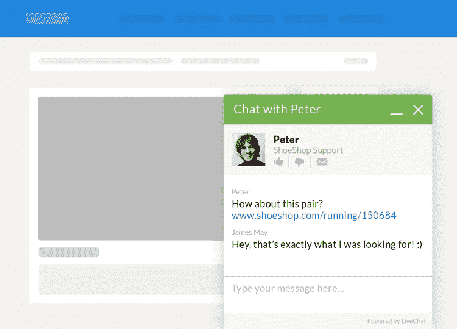
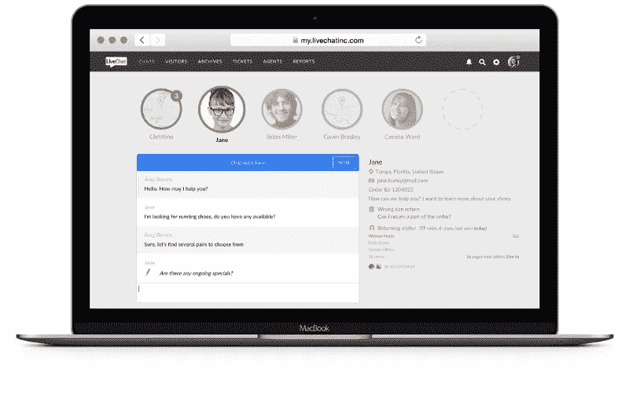
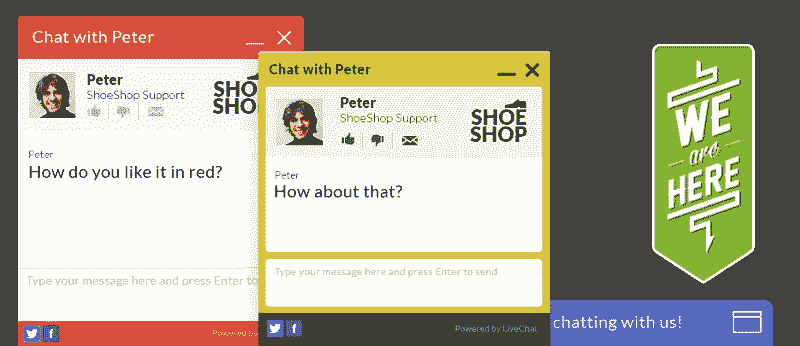
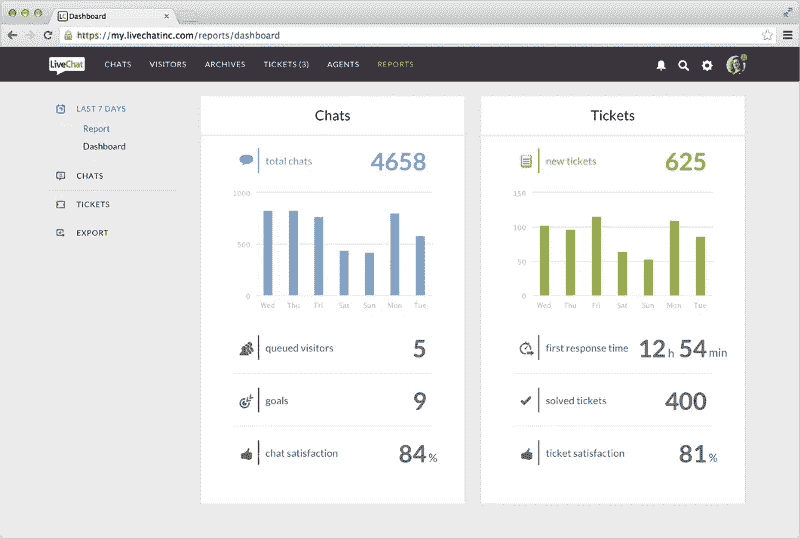

# 实时聊天应用如何彻底改变企业提供客户支持的方式

> 原文：<https://medium.com/swlh/how-live-chat-apps-have-revolutionized-the-way-businesses-do-customer-support-8c8b259388db>

让我们倒推 10 年前。你进入该公司的网站，可能信息过载(哦，是的，这些天企业喜欢放很多关于他们自己的信息)，然后搜索联系信息以联系该公司的代表。幸运的是，有人回应…

# 引入新的通信标准

现在，是 2018 年。你进入网站，你会立即看到一个弹出的聊天窗口。马克，一家公司的代表说他在那里提供帮助，并准备回答你的问题。一天后不会，几小时后也不会。当你正在浏览网站时，他就在那里帮助你，**只需通过实时聊天窗口**与你聊天。

*LiveChat — greeting your visitors*

在网络世界中，为顾客服务的方式发生了巨大的变化。[实时聊天](https://picksaas.com/live-chats?utm_source=Medium)彻底改变了客户和企业之间的沟通方式，无论你是经营电子商务商店、博客还是提供简单的咨询服务。现在，在数以百万计的网站上，实时聊天随处可见，问候着世界各地的访问者。

# 帮助全球企业更快发展

[实时聊天解决方案](https://picksaas.com/live-chats?utm_source=Medium)的目标很简单。

提高您的客户满意度->让您的销售线索更愿意购买您的产品->增加您的收入

LiveChat 的主要目标是通过更好的客户支持和即时交流来帮助人们发展业务。这种**推动了转换率**水平的提高，这意味着访问你的网站，决定最终购买你的产品的人的百分比。

> *“我们在 LiveChat 的主要目标是通过为在线客户支持、潜在客户开发和销售发展提供最佳工具，帮助全球在线企业发展壮大。”*

*LiveChat — quick and easy communication with your visitors*

同时，LiveChat 致力于提供尽可能好的质量，保持软件非常易于使用和[安装](https://picksaas.com/blog/install-live-chat)。该公司在这方面做得很好，根据我们在 [picksaas](http://www.picksaas.com/) 的经验，没有其他应用程序有如此简单明了的入职指南。

> “我们每天都在开发自己的产品，所以我们是自己作品的第一批批评者。对我们来说，将产品价值保持在最高水平非常重要。”

该公司向全球 23，000 家公司提供其软件。这其中，有很多成功的故事帮助 [LiveChat](https://picksaas.com/live-chats/livechat) 成功获得越来越多信任的客户。

> “我们从用户那里获得了很多关于客户满意度、销售额、客户保持率和更高转化率的消息。我们的客户中有像 Depositphotos 这样的公司，他们指出该软件丰富的功能是一个关键优势，所以我们总是很高兴看到使用我们应用程序的公司不断增长。”

# 在重要的实时聊天市场中引领利基市场

[LiveChat](https://picksaas.com/live-chats/livechat?utm_source=Medium) 并不是第一家为全球企业提供实时聊天解决方案的公司，然而，**创造一个以客户为中心的增长驱动型产品并不是要重新发明轮子**。与其他实时聊天相比，LiveChat 侧重于提供极其简单、用户友好的解决方案，可以与您公司的其他软件一起使用。

*LiveChat — live chat window customization*

在我们之前的[材料](https://picksaas.com/blog/live-chat-for-startups?utm_source=Medium)中，我们还对 200 家公司进行了广泛的研究，以了解哪些实时聊天解决方案在初创公司中最受欢迎。

> “我们在构建 LiveChat 的理念和方法上非常不同。保持产品的最高价值对我们来说非常重要，没有捷径可走。此外，团队合作在 LiveChat 是一个神圣的词。让公司的每个人都能相互依赖[这一点非常重要](https://www.livechatinc.com/blog/positive-company-culture/)，我们在与现有或潜在客户联系时总是传递这种方式。”

这使得客户支持的质量非常高。LiveChat 在与客户或潜在客户沟通时尽最大努力提供顶级的 24/7 支持。

> “我们被称为支援英雄；对我们来说，与客户保持密切联系是非常重要的。我们的支持团队技术娴熟，是一群非常好的人，他们确保我们的客户在需要时能够获得快速、专业的帮助。”

*LiveChat — detailed chats’ analytics*

LiveChat 集成了多种不同的产品，目前超过 90 个应用程序，包括最受欢迎的 WordPress、 [Shopify](https://picksaas.com/e-commerce-platforms/shopify) 或 [Pipedrive](https://picksaas.com/crm/pipedrive) 等，这个数字还在增长。它提供真正高级的分析，让您深入了解您的客户支持，并有一个内置的票务系统，允许设置更复杂的案例，以便以后解决。

# 云应用是 LiveChat 成功故事的一部分

随着今天云软件的流行，如果没有其他云应用的帮助，LiveChat 可能不会成功。有许多不同的工具帮助他们与客户沟通，并继续作为领先的实时聊天解决方案提供商之一的旅程。

> “当然，除了 [LiveChat](https://picksaas.com/live-chats/livechat?utm_source=Medium) ，我们倾向于使用大量其他解决方案。我们使用 Amplitude 进行分析，MailChimp 用于邮件自动化，Trello 用于项目管理，当然还有 Slack 用于团队交流。我们真的很喜欢使用云产品，因为它们可以帮助我们提高公司内部的生产力和透明度。”

*- >购买 LiveChat 享受 30%的特别折扣和 60 天延长试用期，您可以通过 picksaas.com 试用*[*LiveChat*](https://picksaas.com/live-chats/livechat)*。*

*在*[*picksaas.com*](http://www.picksaas.com/)*中，我们发现了帮助您发展电子商务、服务、网站、博客或其他业务的应用。我们找到并实施合适的销售、营销、分析甚至设计应用程序，以节省您的时间并增加销售额。*

*我们始终乐意帮助实施最佳应用来发展业务，您可以* [*与我们预约*](https://app.acuityscheduling.com/schedule.php?owner=14759847) *，我们将向您展示如何选择、配置、实施和使用最佳应用来满足您的特定业务需求。*

*要接收我们关于最佳应用程序的更新，以促进您的业务发展，您可以* [*订阅*](https://picksaas.us16.list-manage.com/subscribe/post?u=0a811ad254e7cd14718599e3a&id=bdf0cfd955) *我们的每周增长提示，或者关注我们的*[*Twitter*](https://twitter.com/picksaas)*。*

*希望你会喜欢其他的故事:*

[*我们用来提高营销效率的 5 款应用*](https://picksaas.com/blog/best-marketing-apps)

[*我们用来更好管理公司的 5 款应用*](https://picksaas.com/blog/5-best-business-apps)

[*发展咨询业务的 5 个应用*](https://picksaas.com/blog/5-best-business-apps-for-consulting)

[*云应用如何帮助这家公司在两年内拥有 1，000 名付费客户*](https://picksaas.com/blog/how-cloud-apps-help)

*原载于*[*picksaas.com*](https://picksaas.com/blog/livechat-customer-support)*。*

## 这个故事发表在 [The Startup](https://medium.com/swlh) 上，这是 Medium 最大的企业家出版物，拥有 292，582+人。

## 订阅接收[我们的头条](http://growthsupply.com/the-startup-newsletter/)。

