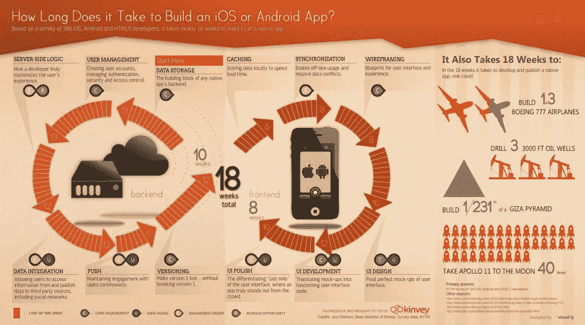
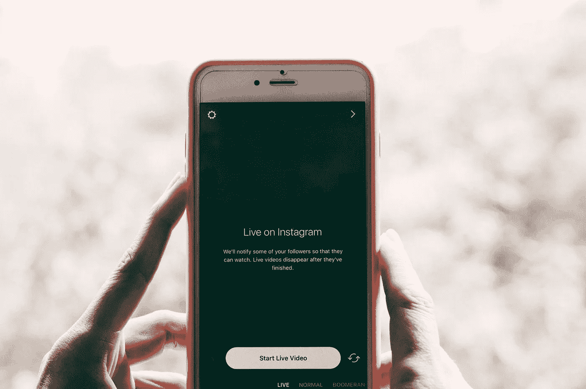

# 开发一个手机 App 需要多长时间？

> 原文：<https://medium.com/swlh/how-long-does-it-take-to-develop-a-mobile-app-77574df9d18d>

Originally published on [http://www.appsterhq.com](http://www.appsterhq.com/?utm_source=CP&utm_medium=Medium)/

到 2021 年，大约[3500 亿次移动应用下载](https://www.statista.com/statistics/271644/worldwide-free-and-paid-mobile-app-store-downloads/)将产生大约[2000 亿美元的收入](https://www.statista.com/statistics/269025/worldwide-mobile-app-revenue-forecast/)，难怪如今应用程序的开发、营销和销售正以指数级的速度增长。

事实上，目前谷歌的 Play Store 上有 280 万个[应用可供下载](https://www.statista.com/statistics/276623/number-of-apps-available-in-leading-app-stores/)，苹果的 App Store 上还有 220 万个，而且这些数字还在逐年增长。

到目前为止，手机对桌面的主导地位没有显示出放缓的迹象，特别是在商业和科技领域。

自然，在这些领域工作的初创公司创始人渴望知道:

> 手机 app 创作需要多少时间和精力？

在本文中，我将详细回答这个问题，并展示一些在 Appster 与我们的移动创业公司[合作的具体例子。](https://www.appsterhq.com/?utm_source=CP&utm_medium=Medium)

# 现有数据:应用程序开发需要 3-5 个月

虽然每年有 100 万个新的移动应用程序被添加到主要的应用程序下载商店中，但是似乎很少有具体的数据来描述开发一个新的应用程序需要多长时间。

相对容易找到许多网站鹦鹉学舌，声称创建一个移动应用程序大约需要 3-4 个月的时间(例如: [1](https://www.applicoinc.com/blog/long-take-build-ios-android-mobile-app/) 、 [2](http://www.app-scoop.com/app-scoop-knowledge-blog/mobile-application-development-how-long-does-it-take) 、 [3](https://www.techinasia.com/talk/complete-overview-mobile-app-development-process-infographic) )，但要找到证明这些信息的可靠数据就不那么容易了。

然而，至少有两项基于数据的研究值得一提。

首先，kin vey2013 年的一项调查要求 100 名移动应用程序设计师指出他们认为构建“版本 1”(即 MVP) Android 或 iOS 应用程序的主要组件需要多长时间。

通过对 100 个回复的数据进行平均，Kinvey 确定一个“MVP 质量的原生应用”将需要大约 **18 周**(即 4.5 个月)来构建。

这个数字被分解为大约 10 周的“后端”开发和 8 周的“前端”开发。

Kinvey 创建了一个关于应用程序开发时间表的信息图表，可以说是最常被分享/引用的信息图表:

(infographic by: Kinvey)

我将在下一节中描述后端和前端开发的本质，所以如果上面的图形目前有点混乱，请不要惊慌。

第二项值得一提的研究是 GoodFirms 的 [2017 年出版物，该研究“在应用领域进行了多次调查”，考察了与创建移动应用相关的时间和费用。](https://www.goodfirms.co/resources/mobile-app-development-cost)

与金维类似，GoodFirms 调查了几十家科技公司，要求参与者估计开发 Instagram、Tinder 和优步等应用程序需要多长时间，然后对得到的回答进行平均。

基于这一过程， [GoodFirms 报告说](https://www.goodfirms.co/resources/mobile-app-development-cost):

*   Instagram 和优步等“功能丰富、高度复杂的应用”需要 4.5 到 5.5 个月的时间来开发；
*   像 WhatsApp 或 QuizUp 这样的“中等复杂程度的引人注目的应用程序”需要大约 4.6 个月来创建；和
*   Tinder 和 Periscope 等“功能较少的用户友好型应用”大约需要 3.8 到 4.1 个月才能完成。

下面是 GoodFirms 相应信息图的一个略微修改的版本:

(infographic by: [GoodFirms](https://www.goodfirms.co/resources/mobile-app-development-cost))

总而言之，这两项研究表明**应用程序开发大约需要 3-5 个月的时间来完成**。

虽然变化总是存在的，但普遍的共识是这个时间长度既典型又准确(来源: [1](https://www.startupgrind.com/blog/how-long-does-it-take-to-build-an-app/) 、 [2](https://readwrite.com/2013/01/09/how-long-does-it-take-to-build-a-native-mobile-app-infographic/) 、 [3](https://www.mindsea.com/how-long-mobile-app/) 、 [4](https://crew.co/how-to-build-an-online-business/app-development-timeline/) )。

L 现在，让我们来看看构建一个应用程序所涉及的基本阶段，以探索影响完成开发过程所需时间的各种因素和决策。

# 移动应用开发的关键阶段

尽管我们可以将应用程序开发视为一个“迭代”过程，但将该过程概念化为包含许多定义阶段是有帮助的。

我将一次描述一个阶段，同时鼓励你记住没有一个阶段是完全独立的。

# 阶段 1:研究和规划

开发移动应用的第一阶段包括回答两个基本问题:

1.  **我为什么要创建这个应用程序？**为什么要存在？它将如何为世界贡献价值？人们真的想使用这个应用吗？哪些人？为什么？和；
2.  **这种 app 已经有了吗？如果是这样，那么为什么我相信我能战胜我的竞争对手？我的应用程序将如何不同于现有应用程序并比现有应用程序更好？**

本质上，回答这些问题，“我希望我的应用程序做什么？”、“我的 app 为什么要存在？”以及“我如何才能击败我的竞争对手？”要求你对你的目标市场和你的理想客户有一个坚实的了解。

你需要对市场需求和客户需求进行广泛的研究，确保 a)确定并证实[可货币化的客户痛点](http://www.appsterhq.com/blog/early-stage-entrepreneurs-launch-profitable-startup)(即一个紧迫的[客户问题](http://www.appsterhq.com/blog/early-stage-entrepreneurs-launch-profitable-startup))，b)计算你的[市场](http://www.appsterhq.com/blog/early-stage-entrepreneurs-launch-profitable-startup) [规模](http://www.appsterhq.com/blog/build-successful-mobile-app-startup)，以及 c) [验证你的产品创意](http://www.appsterhq.com/blog/test-product-idea-real-world-feedback)。

你还必须研究你的竞争对手，包括他们的应用、客户和商业策略。

很难准确指出你需要多长时间来收集和确认这些重要的信息，但是**你可能会看到几周的研究和想法验证**(来源: [1](https://www.startupgrind.com/blog/how-long-does-it-take-to-build-an-app/) 、 [2](http://www.app-scoop.com/app-scoop-knowledge-blog/mobile-application-development-how-long-does-it-take) 、 [3](https://aimconsulting.com/insights/blog/how-to-build-an-app-mobile-development/) )。

# 第二阶段:功能和特点

在收集了关于您的理想客户的需求和需要的足够数据，并确定您提出的解决方案确实有强大的市场需求后，您必须决定您的应用程序的确切功能和特性。

在这个阶段，一些和我们一起在 Appster 工作的创始人迷失了方向。

在这个阶段，你要准确地找出你希望你的应用程序如何运行:

*   你希望你的应用程序能够做什么？
*   它将执行哪些任务、功能和操作？(点对点聊天？与其他应用程序的集成？等等。)
*   它将如何处理数据？它会从用户那里收集原始数据还是挖掘现有的数据框架？

此时，您将创建一个" [storyboard](https://developer.apple.com/library/content/documentation/General/Conceptual/Devpedia-CocoaApp/Storyboard.html) "，即"应用程序用户界面的可视化表示，显示内容屏幕以及这些屏幕之间的连接":

(image by: [Apple Inc.](https://developer.apple.com/library/content/documentation/General/Conceptual/Devpedia-CocoaApp/Storyboard.html))

故事板有助于发现可用性问题，改善用户体验。

作为功能和特性阶段的一部分，你还将开发“[用例](https://www.ibm.com/support/knowledgecenter/en/SSWSR9_11.0.0/com.ibm.pim.dev.doc/pim_tsk_arc_definingusecases.html)，这些用例被设计为你的理想用户如何与你的应用程序交互的模板。

正如[团队](https://crew.co/how-to-build-an-online-business/app-development-timeline/)的人指出的，“你构建的功能越多，你的产品就越复杂，构建你的应用程序就需要越长的时间。”

在这个阶段，你必须做出的最重要的决定之一是，你的应用程序是支持多种操作系统和/或设备，还是仅限于一种操作系统和/或设备。

实际上，这通常意味着必须决定你的应用程序是否可以在 iOS、Android 和/或 Windows 上使用。

从时间线的角度来看，为什么这个选择很重要？

因为两个原因:

1.  为一个以上的操作系统和/或设备开发一个应用程序实际上总是比不开发要花更长的时间；和
2.  虽然随着时间的推移，这种差异越来越不明显，但开发一个 Android 应用程序通常比开发一个 iOS 应用程序需要更多的时间——最多长 20–30%(来源: [1](https://infinum.co/the-capsized-eight/android-development-is-30-percent-more-expensive-than-ios#disqus_thread) 、 [2](https://readwrite.com/2013/01/09/how-long-does-it-take-to-build-a-native-mobile-app-infographic/) )。

关于这一点，[valeria Timokhina](https://easternpeak.com/blog/how-long-does-it-take-to-create-an-app/)指出:

> *“iOS 通常是首先启动应用程序的首选平台，目标设备和操作系统版本较少。*
> 
> 确保你的应用程序在每一个操作系统上完美运行比一次处理多个操作系统要容易得多。
> 
> 此外，市面上有超过 12，000 款 Android 设备，几乎不可能对每一款都进行优化。因此，Android 应用程序的开发和测试往往需要更多的时间，除非你限制支持的设备和屏幕分辨率的数量。
> 
> *如果你想同时为 iOS 和 Android 开发应用，你的项目的持续时间和预算可能会翻倍。”*

关于你应该如何着手同时开发多个操作系统， [Cruxlab](https://cruxlab.com/blog/reactnative-vs-xamarin/) 的团队指出:

> *“传统上，Android 的应用是用 Java 开发的，iOS 的是用 Swift 和 Objective-C 编写的*
> 
> *尽管如此，仍有大量其他替代工具可供使用。Xamarin、React Native 和 Ionic 是这类工具的常见示例。”*

在不涉及技术细节的情况下，如果你致力于为 iOS 和 Android(也可能为 Windows)开发你的应用程序，那么你可以遵循两种途径之一:

*   **利用两种完全不同的编程语言**开发两个独立版本的应用程序；或者
*   **使用跨平台开发工具(React Native、Ionic 等。)**同时开发两个版本的应用程序，从而简化流程。

同样，虽然不可能准确预测持续时间，**你应该预计花大约 3-5 周的时间弄清楚你的应用程序的核心特性和功能**(来源: [1](https://crew.co/how-to-build-an-online-business/app-development-timeline/) 、 [2](http://www.app-scoop.com/app-scoop-knowledge-blog/mobile-application-development-how-long-does-it-take) 、 [3](https://www.mindsea.com/how-long-mobile-app/) 、 [4](https://cruxlab.com/blog/reactnative-vs-xamarin/) 、 [5](https://aimconsulting.com/insights/blog/how-to-build-an-app-mobile-development/) )。

# 阶段 3:技术可行性、设计和开发

在确定了你希望你的应用程序做什么以及你期望它如何运行之后，你必须明确地确认这些特性和功能实际上是可以分别存在和工作的。

做出这一决定的很大一部分涉及到让你的技术团队确认你希望*向你的用户呈现的东西*实际上可以通过幕后*进行的编程来实现。*

换句话说，你需要保证*前端*和*后端* 系统的兼容性。

(要做到这一点，你必须咨询你的技术人员，也就是编码人员，如果你一直没有这样做的话。)

[前端系统](https://www.techopedia.com/definition/29569/front-end-developer)包括“最终用户可直接查看和访问的软件、应用程序或网站的可视前端元素”。

相反，[后端系统](https://www.techopedia.com/definition/29568/back-end-developer)由“用户通过前端应用程序或系统间接访问的网站、软件或信息系统的核心计算逻辑”组成

[劳伦·斯图尔特](https://www.coursereport.com/blog/front-end-development-vs-back-end-development-where-to-start)对这两个相互关联的框架进行了有益的描述:

> *“前端开发主要集中在一些人可能会想到的客户端开发上。*
> 
> *前端开发人员将致力于分析代码、设计和调试应用程序，同时确保无缝的用户体验。*
> 
> 你管理人们首先在浏览器或应用中看到的内容。作为一个前端开发人员，你要对网站的外观、感觉和最终设计负责。
> 
> 后端开发指的是服务器端的开发，你主要关注的是网站如何工作。这种类型的 web 开发通常由三部分组成:服务器、应用程序和数据库。
> 
> 后端开发人员编写的代码将数据库信息传递给浏览器或应用程序。
> 
> 任何用肉眼看不到的东西，比如数据库和服务器，都是后端开发人员的工作。”

从技术上讲，前端流程包括缓存、同步、线框化、UI 设计、UI 开发和 UI 润色。

数据存储、用户管理、服务器端逻辑、数据集成、推送动作、版本控制都属于后端开发([来源](https://www.kinvey.com/how-long-to-build-an-app-infographic/))。

因为后端进程负责计算、业务逻辑、数据库交互和性能等操作，所以让应用程序工作所需的大部分代码都存在于后端( [source](https://www.upwork.com/hiring/for-clients/frontend-vs-backend-web-development/) )。

后端程序员和前端设计师之间保持持续的沟通是至关重要的；否则，你就有可能造成这样一种局面:前者根本无法创造后者想要的东西:

> *“如果你正在开发移动应用的前端和后端基础设施，重要的是你要优先考虑你构建的功能。*
> 
> *给你的后端工程师一个良好的开端，这样你的前端工程师就可以构建功能代码。*
> 
> *如果后端没有被很好地定义并且没有功能，它将使你的前端工程师的努力变得效率更低”(*[*source*](https://www.applicoinc.com/blog/long-take-build-ios-android-mobile-app/)*)。*

开发应用程序的一个关键部分需要成功访问应用程序运行的核心数据([来源](https://aimconsulting.com/insights/blog/how-to-build-an-app-mobile-development/))。

你会使用公共的 API 密匙吗？或者您将构建自己的抽象层吗？

API 代表“[应用程序编程接口](https://kb.mailchimp.com/integrations/api-integrations/about-api-keys)”，简单来说，它代表一段独特的代码，允许应用程序相互通信(或与开发人员通信)。

世界上最大的应用程序——从 [DropBox](https://www.dropbox.com/developers) 、[脸书](https://developers.facebook.com/)和 [Instagram](https://www.instagram.com/developer/) ，到 [Skype](https://dev.skype.com/) 、 [Twitter](https://dev.twitter.com/) 和[优步](https://developer.uber.com/)——都有公开可用的 API，开发者可以在构建自己的应用程序时使用。

例如，流行的基于刷卡的约会应用 Tinder 利用了脸书的 API: Tinder 用户通过他们在脸书的个人资料登录 Tinder，这使得 Tinder 无需从头开始建立自己的用户群。

确定前端和后端的兼容性(作为实际编码的前兆，或者作为与实际编码一起执行的任务)需要参与各种各样的 [UX(用户体验)和 UI(用户界面)](https://www.usertesting.com/blog/2016/04/27/ui-vs-ux/)设计过程，包括线框图。

(infographic by: [Papdan.com](https://www.papdan.com/))

作为 UX 设计的一部分，一个“[线框](https://www.usability.gov/how-to-and-tools/methods/wireframing.html)”是一个“页面或应用程序界面的二维图示，专门关注空间分配和内容优先级、可用功能和预期行为。”

线框在风格和颜色上通常是灰度级的，它们有助于:

*   将应用程序的信息架构与其视觉设计联系起来；
*   阐明在用户界面上显示信息的一致方式；
*   确定界面中的预期功能；和
*   通过确定给一个给定的项目分配多少空间以及在屏幕上的什么地方放置该项目来区分内容的优先级([来源](https://www.usability.gov/how-to-and-tools/methods/wireframing.html))。

脸书线框可能看起来像什么的例子:

(image by: [Lucidchart](https://www.lucidchart.com/pages/examples/wireframe/facebook-wireframe-template))

线框化可以在产品创建和细化周期的不同阶段进行([来源](https://www.uxpin.com/studio/ui-design/what-is-a-wireframe-designing-your-ux-backbone/))。

例如，有些人选择在功能和特性阶段早期开发线框，将线框视为与故事板和其他基本视觉表示的使用有明确的联系。

O 其他人认为线框更适合参与设计和开发阶段，因为它与前端和后端兼容性的调查有关。

正如 Sheila Olson 所说，“线框和故事板是支持你的应用程序所需的后端结构的指南——想想 API、数据图表、服务器、数据集成和推送通知服务。”

对于那些在设计和开发过程中创建线框的人来说，一个[常见序列](https://www.uxpin.com/studio/ui-design/what-is-a-wireframe-designing-your-ux-backbone/)看起来像这样:

线框→ Lo-fi 原型→ Hi-fi 实体模型→代码。

一旦线框完成，应用程序的图形用户界面(GUI)就可以创建了，这是创建/添加特定字体、颜色、主题和图标的地方。

正如 Aim 咨询公司的人所说的，一旦设计元素完成，“结果就是一个清晰的视觉方向和蓝图，告诉你的工程师设想的最终产品，以及交互在你的应用程序中应该如何感觉、移动和流动。”

实际开发(即编码)移动应用程序所涉及的技术细节超出了本文的重点。

然而，我想就这个问题发表一个简短而重要的意见。

利用专门为此设计的软件平台(即应用构建程序( [1](https://clutch.co/app-development) 、 [2](http://www.toptenreviews.com/software/multimedia/best-app-maker-software/) 、 [3](https://www.websitetooltester.com/en/blog/app-makers/) )，其中许多都依赖于拖放界面)，可以构建您的新应用。

然而，我们 Appster[建议与专业开发机构合作，这些机构在帮助企业家成功实现他们的想法方面经验丰富。](https://www.appsterhq.com/?utm_source=CP&utm_medium=Medium)

不可否认，开发(即编码)阶段是构建移动应用程序最复杂、最困难的阶段之一。

像 Appster(全球五大应用程序开发商)这样的开发机构配备了专业的程序员和设计师，他们可以帮助您构建一个健壮、稳定、迷人、高性能的应用程序，您的用户将会喜欢。

**总而言之，进行技术可行性评估、消除前端设计元素和编写后端结构可能需要 1-2 个月的时间来完成。**(来源: [1](https://www.startupgrind.com/blog/how-long-does-it-take-to-build-an-app/) 、 [2](https://www.applicoinc.com/blog/long-take-build-ios-android-mobile-app/) 、 [3](https://aimconsulting.com/insights/blog/how-to-build-an-app-mobile-development/) 、 [4](https://easternpeak.com/blog/how-long-does-it-take-to-create-an-app/) )。

# 阶段 4:测试和优化

构建应用程序的最后阶段(除了实际发布和相关的营销活动)是测试和优化阶段。

现在，从某种意义上来说，测试是开发阶段的一部分，因为你的程序员和 alpha 测试人员会在开发过程中不断尝试“破坏”你的应用程序，以便在发布之前发现并纠正代码中的错误。

这种测试在您的组织内部进行，因为在您的应用程序到达真正的最终用户手中之前，您的人员(无论是员工还是承包商)将执行标准化的诊断。

然而，在另一种意义上，测试可以被概念化为构成它自己的类别，一旦你的内部团队对你的应用进行了 alpha 测试，它就会被发布给有限的公众，以便它可以在“真实世界”中进行 beta 测试。

Beta 测试旨在“在实验室之外”对你的应用进行压力测试:也就是说，当真正的用户有机会以他们喜欢的*方式*使用你的应用，而不是你想要的*方式*时，会发生什么？

在这一点上，你不再关心当你试图以设计的方式使用它时，你的应用程序如何响应。

相反，beta 测试的目的是弄清楚当“普通人”把你的应用程序下载到他们的手机上，并且可以随心所欲地使用它时，你的应用程序还能坚持多久。

Alpha 测试应该揭示主要的错误和故障，而 beta 测试应该揭示以前没有想到的问题和失败，这些问题和失败可能“在野外”发生。

Alpha(开发阶段)和 beta(测试阶段)测试对于构建一个健壮、可靠的应用程序都是必不可少的。

一旦你和你自己的编码团队彻底完成了 alpha 测试，你就应该开始对公众进行 beta 测试。

你如何着手为你即将发布的应用寻找合格的测试人员呢？

有各种基于网络的服务和平台提供测试机会。

明确致力于 beta 测试的网站包括:

*   [**贝塔家族**](https://betafamily.com/)；
*   [**beta list**](https://betalist.com/)；
*   [**二里鸟**](https://erlibird.com/)；
*   [**pre apps**](http://www.preapps.com/)；和
*   [**TestElf**](https://www.testelf.com/) 。

间接提供测试机会和应用反馈的网站:

*   [**Reddit**](https://www.reddit.com/) :众多的子编辑为用户提供了为他们正在开发的应用招募测试人员的机会，包括[r/alpha 和 betausers](https://www.reddit.com/r/alphaandbetausers/) 、 [r/androidapps](https://www.reddit.com/r/androidapps/) 、 [r/beta](https://www.reddit.com/r/beta/) 和[r/beta tests](https://www.reddit.com/r/betatests/)；Reddit 还为游戏开发者提供机会，让他们在每周六获得免费的游戏截图反馈。和
*   [**用户测试**](https://www.usertesting.com/product/mobile-application-testing) :这个网站并不专门关注移动应用，但它确实提供了一个庞大的用户社区，这些用户愿意试用你的产品(包括应用)，记录他们与你的产品的互动，并提供反馈。

如果你已经进行了一轮(或几轮)的 alpha 测试，那么**你的 beta 测试阶段应该不会超过大约 3-4 周来完成**(来源: [1](https://www.startupgrind.com/blog/how-long-does-it-take-to-build-an-app/) 、 [2](https://aimconsulting.com/insights/blog/how-to-build-an-app-mobile-development/) 、 [3](http://www.app-scoop.com/app-scoop-knowledge-blog/mobile-application-development-how-long-does-it-take) )。

# 最后的话

将本文中讨论的四个主要阶段的估计时间加起来，**我们剩下大约 4-5 个月的时间来构建一个移动应用**。

我们可以看到，构建一个应用程序是一个相当漫长而复杂的过程，需要大量的准备、耐心和奉献才能正确执行。

下面是最后两条建议，可以帮助你构建应用程序:

1.  **做好延迟的准备，并保持时间表的灵活性** : *“不可预见的情况，如新的 iOS 版本或第三方集成变更，或者质量测试期间出现的意外问题，都可能会延长您的时间表。给自己一个缓冲时间，而不是一个确定的期限来完成你的应用程序。你最不希望的事情就是在应用商店发布一个坏掉的、有问题的或者更糟的产品。你只有一次机会留下第一印象，你也不想成为那种下载后立即丢弃的应用程序"* ( [莎拉·莱利](https://www.mindsea.com/how-long-mobile-app/))。
2.  **确保您可以在发布后访问您的移动开发团队** : *“如果您正在与外部供应商合作开发您的应用程序，请确保在应用程序发布后，您可以通过托管服务协议或类似的合作关系继续访问移动开发团队。移动应用程序不是“设置好就忘了”类型的项目。*

如果您在规划、研究、设计、开发、测试、发布和/或营销您的应用程序方面需要帮助，请[随时联系我们](https://www.appsterhq.com/?utm_source=CP&utm_medium=Medium)！

**//**

**如果你喜欢阅读这篇文章，那么一定要看看我们的专家白皮书，关于构建一个应用程序的成本******[**创建一个你的客户会喜欢的令人上瘾的应用程序**](http://lp.appsterhq.com/how-to-make-an-addictive-app-new) **和** [**防止你自己被粗略的开发者利用**](http://lp.appsterhq.com/how-to-not-get-ripped-off-by-software-developers) **！******

*****原载于*[*www.appsterhq.com*](https://www.appsterhq.com/blog/how-long-takes-to-build-a-mobile-app/)*。*****

****//****

## ****感谢阅读！****

# ****如果你喜欢这篇文章，请随意点击下面的按钮👏去帮助别人找到它！****

****************

# ****对应用程序有想法吗？[我们来聊聊](http://www.appsterhq.com/?utm_source=CP&utm_medium=Medium)。****

****在过去的几年里，我们已经帮助建立了超过 12 个数百万美元的创业公司。[查看我们如何帮助您](http://www.appsterhq.com/?utm_source=CP&utm_medium=Medium)。****

********