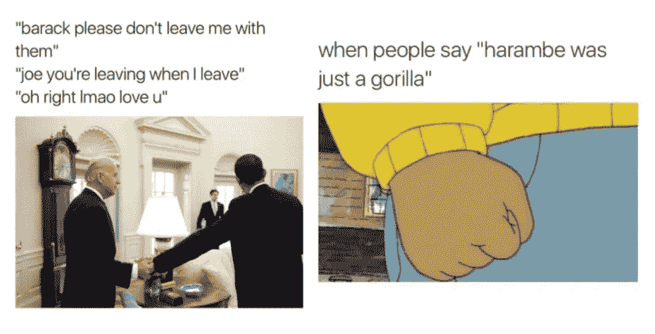
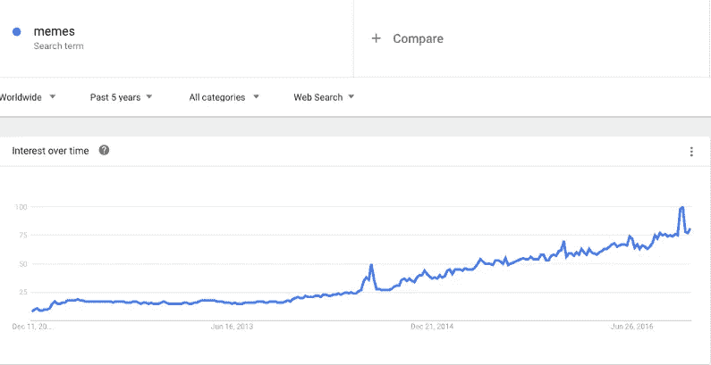
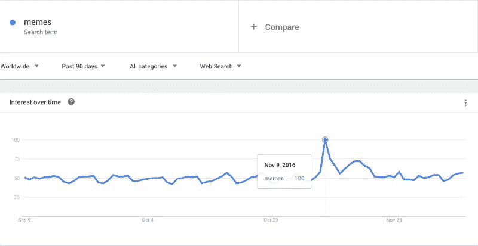

# 迷因如何征服我们的心灵和新闻

> 原文：<https://medium.com/swlh/how-memes-conquered-our-hearts-and-news-feeds-cd6578ae4e6d>

*Source: Imgur and Know Your Meme*

这是关于脸书迷因的两部分系列的第一部分。第二部分是 [*谁是病毒性脸书迷因的主要制造者？*](/@jajaliao/who-are-the-master-makers-of-viral-facebook-memes-7ea6c2c64c77#.xi70ujjxt)

当我早上醒来，我做的第一件事就是拿起我的手机(惊喜，惊喜)。多年来，我总是发现相同类型的通知，通常是我妈妈让我给她打电话的短信，老板的工作邮件，日历上的事件提醒，以及朋友们有趣的快照。但在过去的一年里，我收到了一种新的通知——“X 在一条评论中提到了你”——也称为模因上的评论标签，是一种带有(有趣)标题的(有趣)图片。

因为我住在加利福尼亚，我的大多数朋友住在东海岸，所以当我醒来的时候，他们已经在一些迷因中给我加了标签。在一天中，我可以期待更多的标签，当然，我也会给我的朋友加标签。我发现自己在喝咖啡休息时不经意地笑了，当我被邪恶的克米特迷因的巧妙迭代所标记时，或者当我在会议间隙找到一个新的拜登迷因时。

你可能也注意到了。脸书的新闻提要已经变得更像是一个迷因提要。人们发布的状态和照片越来越少，但给他们的朋友添加标签并分享越来越多的模因。我们的新闻订阅充满数百张度假相册或普通文本状态的日子已经一去不复返了，这些照片或状态既不诙谐、有争议，也没有表情符号。脸书已经进入了迷因时代。

Interest in the search term “meme” over past five years. Source: Google Trends

我们是怎么到这里的？迷因是如何接管脸书的？嗯，迷因征服我们的新闻源可能是不可避免的。毕竟，他们已经在 Twitter、Vine 和 Reddit 等小型社交媒体平台上正常化多年了。但是考虑到它巨大的面积，脸书过去和现在都是一场不同的比赛，一场需要更多时间的比赛。我们在其他行业也看到了这个常识性的规则。例如，如今藜麦随处可见，但藜麦首先在潮人农贸市场广泛流行，然后在乔氏和全食超市，直到沃尔玛最终选择了它。

脸书是社交媒体的沃尔玛。由于其规模，模因在脸书这个最主流的社交媒体上需要更长的时间才能正常化。但是，在达到用户的临界质量，并从新闻馈送的算法和放大受欢迎程度的标记功能中获得帮助后，迷因最终在主流脸书上到达了我们所有人。因为我们已经对他们有些熟悉了，我们欢迎这些新加入世界上最大和最主流的社交网络的正常化的、有趣的新成员。

从那以后，我们一直在脸书传播迷因，因为它们非常容易创造和分享。迷因生成器让任何人都可以简单地创建迷因，比如 [Imgur 的迷因生成器](https://imgur.com/memegen)、 [Mematic 应用](https://www.mematic.net/)，甚至还有 [Giphy Cam 应用](https://giphy.com/apps)。要分享一个已经存在的脸书迷因，你只需点击分享按钮，就大功告成了。你不需要像为自己的照片那样想一个有趣的标题。你不需要添加一些(看似)有见地的评论，就像你为一篇新闻文章所做的那样。你甚至不需要添加相关的表情符号。分享一个迷因实际上是脸书邮报最懒的一种，因为没有必要创造任何类型的原创内容。

为什么我们喜欢在 meme 帖子中把我们的朋友标记为评论？我认为这是我们被动和半公开的方式告诉我们的朋友我们在想他们或者我们想念他们。我们希望其他人看到我们与特定的朋友分享这些特定的感觉，而不引起专门帖子的注意。甚至当我们在一篇烘烤我们朋友的帖子上给他们贴标签时，这也是一种表达爱意的方式。

但最终，我相信脸书迷因的崛起不仅仅是算法和社交媒体趋势和倾向的综合结果。最流行、最成功的迷因都是针对人类固有的东西。压力大的大学生分享取笑期末考试准备不足的模因，或者为什么新妈妈们在模因中互相标记，这些模因集中体现了为人父母的意想不到的困难，这是有原因的。从选举日到第二天,“meme”在谷歌搜索上的数量激增(从 58 个增加到 100 个)是有原因的。当我们遇到困难时，我们求助于喜剧性的解脱，当我们和别人一起经历时，这种喜剧性的解脱甚至更好。

Interest in the search term “meme” spiked from 58 to 100 between Election Day (Nov. 8) and the following day (Nov. 9). Source: Google Trends

知道有成千上万的人和我们一样，认同某个愚蠢的形象并嘲笑它，我们会感到安慰。迷因并不完全是大萧条时期的一代人从持续的电影院观看中获得的逃避，也没有真正提供婴儿潮一代从摇滚乐文化中感受到的归属感，但我认为迷因将作为标志性的文化特质之一被人们记住，它在当前时代发挥了类似的安慰作用。

迷因让我们放心，一切都会好的，我们永远不会孤独，我们分享共同的奋斗和快乐，我们都是某个事物的一部分。不管你是消防员还是金融家，是佛罗里达人还是芬兰人，15 岁还是 50 岁，我们都可以嘲笑一只毛茸茸的柯基小狗从楼梯上滚下来的相同故事。这就是脸书迷因的美妙之处。在一个我们看起来如此分裂的时代，我们提醒自己，我们仍然以某种方式联系在一起，因为我们一起欢笑。

因为说到底，我们都是人，而人是用来一起欢笑的。所以我们想笑，我们爱笑，我们会一直笑到最后(脸书)。

*这篇文章的原始版本发表在*[*VentureBeat*](http://venturebeat.com/2016/12/17/how-memes-conquered-our-hearts-and-news-feeds/)*上。*