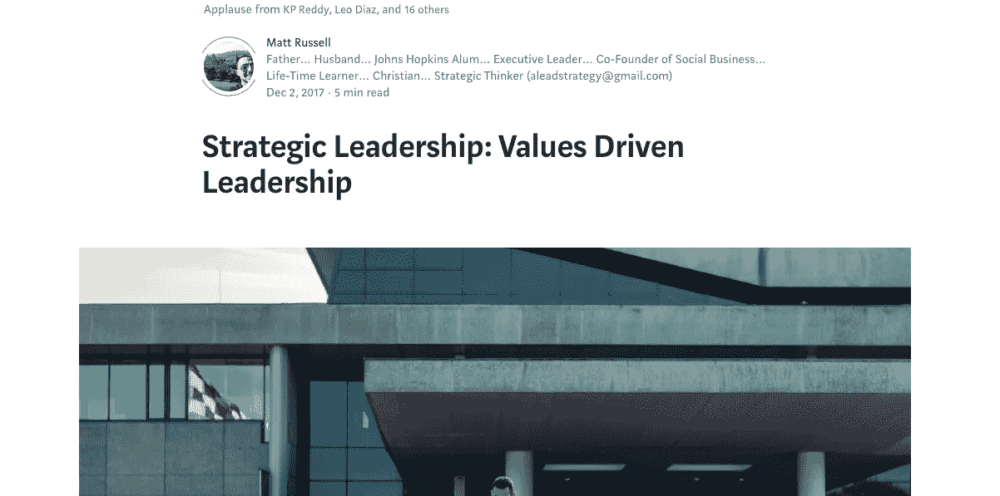
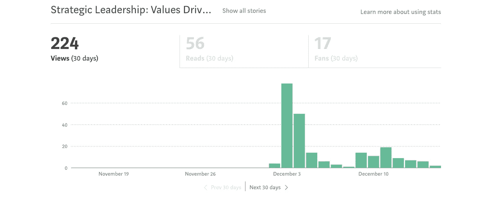
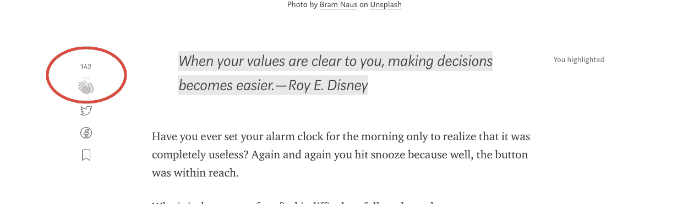
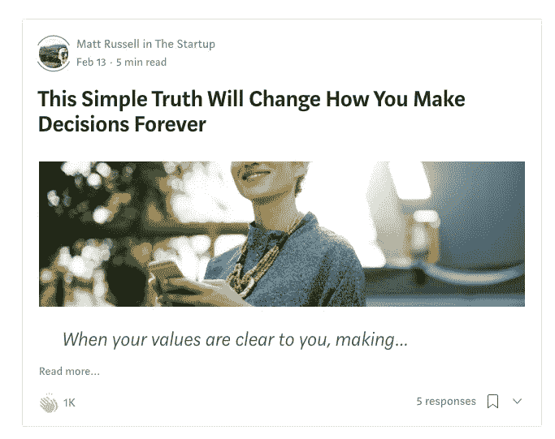
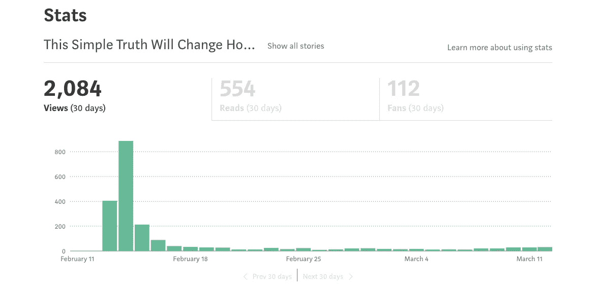
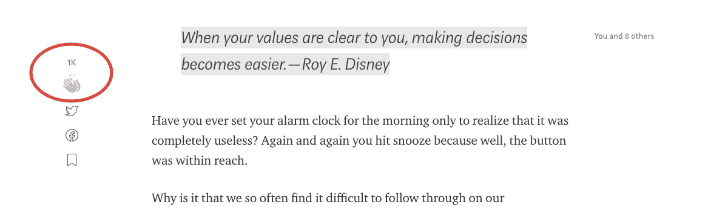

# 仅仅改变我文章的标题就让它飙升到 1000 次鼓掌

> 原文：<https://medium.com/swlh/how-merely-changing-my-articles-title-sent-it-soaring-to-1-000-claps-ae0b6cb91881>

[Bruce Mars](https://www.pexels.com/photo/man-in-white-dress-shirt-sitting-on-black-rolling-chair-while-facing-black-computer-set-and-smiling-840996/) on [Pexels](https://www.pexels.com/photo/man-in-white-dress-shirt-sitting-on-black-rolling-chair-while-facing-black-computer-set-and-smiling-840996/)

## 一个头衔真的有那么大的区别吗？…那还用说！

作为一项实验，我发表了两篇相同的文章，一篇标题我称之为“蹩脚”，另一篇标题我称之为“精彩”。猜猜哪个表现更好！

你猜对了！书名为《神奇》的那本。

它不仅表现得更好，而且表现得更好。大约好 1000 次鼓掌！

# 蹩脚的标题

我的文章有一个蹩脚的标题叫做:

**“战略领导力:价值观驱动的领导力”**

2017 年 12 月，我在一个主要的媒体出版物( [The Startup](https://medium.com/swlh) )上发表了这篇文章，写得不错，但不太好。一两周之后，它的浏览量达到了 224 次(142 次鼓掌)。

# 奇妙的标题

在删除了标题为“蹩脚”的文章后，我在 2018 年 2 月重新发布了这篇文章，并附上了不同的照片和新的“精彩”标题:

**“这个简单的道理将永远改变你做决定的方式”**

我在同样的刊物( [The Startup](https://medium.com/swlh) )上发表了同样的内容。一字不差。除了…那个奇妙的标题！新的标题让它飙升到 2000 多次浏览和 1000 次鼓掌。

一个头衔真的很重要！

# 构思一个精彩标题的秘密

那么，是什么让这个新书名如此精彩呢？

露丝被告知，我于 2012 年在约翰霍普金斯大学开始研究这个课题。作为一名研究生，我想知道是什么让我们的话有说服力，以及如何让更多的人知道。

从那时起，这个问题就成了我的一个爱好，我阅读了大量关于这个主题的学术文献。你可能已经看过我关于[的文章，一个简单的方法会让你成为一个非凡的作家。](https://writingcooperative.com/this-simple-approach-will-make-you-an-extraordinary-writer-6b1a8ef1d3f2)

Photo by [rawpixel.com](https://unsplash.com/photos/FmlzWQU1FNY?utm_source=unsplash&utm_medium=referral&utm_content=creditCopyText) on [Unsplash](https://unsplash.com/search/photos/writer-pen?utm_source=unsplash&utm_medium=referral&utm_content=creditCopyText)

嗯……你猜怎么着。写出精彩标题的秘密也很简单。你可以抛开所有的繁文缛节，专注于一个简单的规则。

> 规则:所有精彩的书名都以更少的成本为读者提供更多的价值。

现在的人不缺可以看的内容。事实上，它们被如此多的信息所包围，以至于越来越难用标题吸引读者的注意力。

当每个读者浏览他们可以得到的各种书籍时(不管他们是否意识到这一点)，他们在头脑中进行着成本效益分析。

他们试图决定哪种商品能以最少的成本提供最大的价值。

*   **值是主观的**。可能是新的见解，新的视角，新的娱乐，或者别的什么。但它永远是提供给读者的东西。
*   **成本也是主观的。**可能是文章的长度、陡峭的学习曲线、无聊的话题等。但这总是读者需要的东西。

让我们仔细看看我们的“蹩脚”标题:

**蹩脚标题:“战略领导力:价值观驱动的领导力”**

*   “战略领导”或“价值观驱动的领导”这两个词是模糊的。读者很难从标题中看出什么是低价值。
*   也没有提到实现该文章提供的任何内容需要什么。然而，大多数人将“战略”一词与复杂的活动联系在一起，将“价值观”一词与实质性的行为改变联系在一起，这两者都需要大量的工作— **高成本。**

## 结果:低价值高成本——蹩脚

现在让我们仔细看看我们的“神奇”标题:

**绝妙的标题:“这个简单的事实将永远改变你做决定的方式”**

*   短语“这个简单的事实”告诉读者，所提供的东西很容易实现— **低成本。**
*   “将永远改变你的决策方式”这一阶段告诉读者，所提供的内容将对他们的决策产生巨大影响— **高价值。**

## 结果:以更低的成本获得更多的价值——太棒了

# 营销人员很久以前就明白了这一点

想想当你走过一个购物中心时，每一个橱窗展示都很像一篇文章的“标题”。

橱窗展示吸引了你，让你领略了商店里的商品，就像标题让你领略了一篇文章的内容一样。

每个商店都做些什么来试图说服你进入他们的商店？是的，你猜对了。他们以更低的价格为你提供更多。一个价值数十亿美元的产业不会这样做，如果它不起作用的话。相反，他们这样做是因为他们知道市场竞争如此激烈，如果他们以低成本为你提供高价值，你更有可能进入他们的商店。

Photo by [Daniel von Appen](https://unsplash.com/photos/sD1VpeflHBY?utm_source=unsplash&utm_medium=referral&utm_content=creditCopyText) on [Unsplash](https://unsplash.com/search/photos/sale?utm_source=unsplash&utm_medium=referral&utm_content=creditCopyText)

和你在网上写的文章没有区别；互联网上充满了争夺读者时间的东西。为了让你的文章获得最大的读者群，从这个价值数十亿美元的行业中吸取教训，创造出能以更低的成本为你的读者提供更多价值的标题，你将会被这些结果所淹没。

相信我，我试过了，有效！

# 最后的想法

对一些人来说，滥用这种能力来创作精彩的标题是很有诱惑力的。他们通过在任何文章上加上一个耸人听闻的标题来做到这一点——比如承诺治愈普通感冒——而实际上并没有实现。

这篇文章之所以强调获得“掌声”而不是浏览量，正是因为这个原因。当读者为一篇文章“鼓掌”时，他们说他们得到了他们想要的东西。构思奇妙标题的目的是帮助读者确定*在一篇文章中的价值，而不是声称*不在*中。*

**看看我和我妻子创办的创业公司，它帮助利用商业作为打击人口贩卖的一种方式。我们通过一杯咖啡赋予女性改变世界的力量。公平贸易咖啡杯及制品—**[**allofusmatter.org**](http://allofusmatter.org)

## 这篇文章发表在 [The Startup](https://medium.com/swlh) 上，这是 Medium 最大的创业刊物，拥有 308，589+读者。

## 在此订阅接收[我们的头条新闻](http://growthsupply.com/the-startup-newsletter/)。

