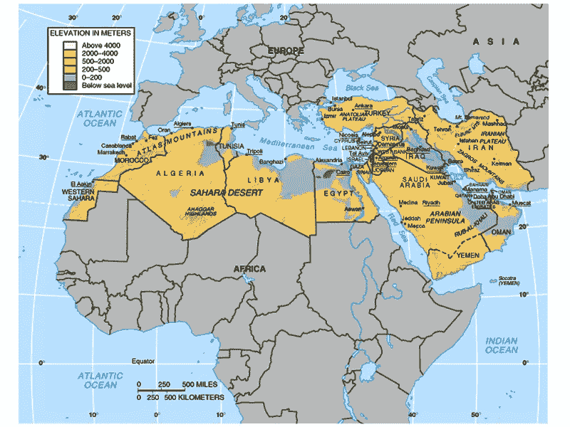

# 千禧一代如何为中东北非和新兴市场带来创新

> 原文：<https://medium.com/swlh/how-millennials-are-bringing-innovation-to-mena-and-emerging-markets-c4200012cb6d>

让我们从解释缩写 MENA 代表什么开始:

## 男:中间

## 东:东

## 北线

## 答:非洲

MENA, outlined. Source: Pinterest

根据 investopedia 对该地区的定义，该地区由 22 个国家组成，占…