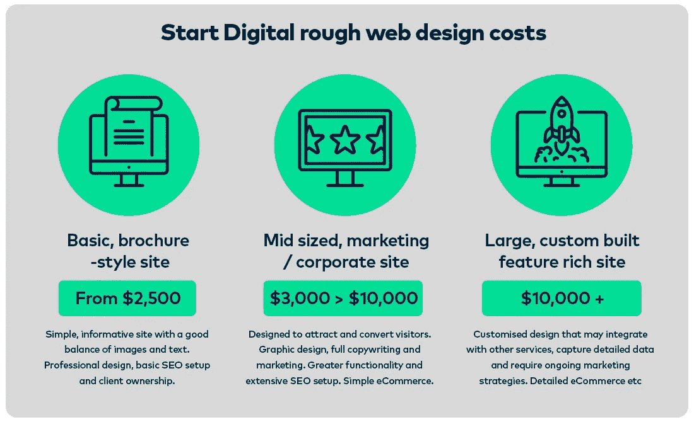

# 2017 年一个网站要多少钱？

> 原文：<https://medium.com/swlh/how-much-does-a-website-cost-in-2017-93408ab9faf7>

透明和信任对业务关系至关重要，因此让我们的客户了解他们支付的费用以及我们如何确定报价对我们来说非常重要。

我们最常被问到的一个问题是**2017 年一个网站的成本是多少**？请放松，因为我们将尝试回答这个问题。

每个企业都是不同的，每个企业都有不同的目标，所以回答一个网站的成本在很大程度上取决于企业想要什么，需要什么，期望从他们的网站。例如:

*   你的网站仅仅是现有客户发现信息的地方吗(**宣传册风格**
*   你想让你的网站推广你的服务/产品并赢得新客户吗
*   您的网站是否需要与其他服务整合、销售产品或管理和获取大量数据(**功能丰富、定制构建**)
*   你的网站需要推广和销售产品吗

# 一个网站能便宜有效吗？

不言而喻(但我们还是要说),网络空间竞争激烈，击败竞争对手获得新客户越来越困难。任何类型的网站要想在网上脱颖而出，都需要看起来不错并且有效。一个有效的商业网站需要很容易被发现，要么通过谷歌搜索，要么通过 [**社交媒体**](https://startdigital.com.au/our-services/social-media-perth/) ，它需要将访问者转化为参与的付费客户。

便宜的网站便宜是有原因的。它表明了一个项目投入了多少时间、精力和资源。网站越便宜，时间越少，你的网站效果就越差。同样的过程也适用于任何廉价的产品或服务。我们的经验告诉我们，越便宜的网站效果越差。

同样值得一提的是 DIY 选项。如果你是一家新企业，需要走捷径，那么 Wix 和 Squarespace 等网站建设者是潜在的选择。在你走这条路之前，我们建议你阅读我们的文章 [**为什么你不应该使用 DIY 网站建设者。**](https://startdigital.com.au/shouldnt-use-diy-website-builder/)

当你雇佣 [**Start Digital**](https://startdigital.com.au/) 时，你就是在雇佣我们来设计和开发一个有效的网站。您可能还希望我们帮助您在线推广和营销您的业务。我们对我们的时间和工具收费，我们使用这些工具来创建一个看起来不错、运行良好并能为您的投资带来回报的网站。我们的报价是基于我们计划在你的网络项目上花费的时间。我们考虑您业务需求的方方面面，从信息/号召到行动、图像和功能，再到持续营销、第三方集成和设计。

# 重要的事情先来

让我们掩盖一些基本情况:

*   **域名:**如果你还没有一个域名，那么一个. com.au 域名每年要花费 25 美元。请注意，要购买. com.au 域名，您需要有效的 ABN
*   托管:通过疯狂域名的基本托管将花费你大约**120 美元一年。一个高质量的本地主机一年大约要 300 美元。**如果您需要专用的托管环境，价格从 **$2000 到$5000 不等**
*   **内容管理系统(CMS):** 我们使用世界领先的内容管理系统 WordPress。要在我们的珀斯服务器上安装 [**WordPress**](https://startdigital.com.au/our-services/wordpress-websites-perth/) ，配置它，设置一个模板并添加我们的标准插件套件将花费大约 **$500**
*   站点维护:维护可能需要保持平台(WordPress)最新和无错误，更新插件，管理服务器性能和更新站点内容。预计每月要支付大约 100 到 300 美元的持续维护计划。
*   **持续的搜索引擎优化(SEO):** SEO 是让你的网站在谷歌和其他搜索引擎上“有机”排名的持续工作。你的网站排名越高，越有可能被未来的客户发现。成本为 [**搜索引擎优化开始**](https://startdigital.com.au/our-services/seo-perth/)**$ 500 每月**。
*   **谷歌广告:**同样，这在很大程度上取决于竞争空间，但对于一个竞争合理的行业来说，预计每月会消耗掉**500 美元，而且会很快增加**
*   **社交媒体:并不是每个社交网络都适合每个企业。我们与客户密切合作，以确定正确的战略，让他们站在核心人群的前面。每个报价取决于网络的数量和职位的数量，但预计这不会低于每月**350 美元****

# **网站内容**

**文本和图像形式的内容无疑是每个网站最重要的组成部分。冒着陈述显而易见的风险，没有内容就什么都没有。**

**网页设计中最容易被误解的领域之一就是内容所扮演的角色。创建引人入胜的内容需要了解如何为网络写作，并对商业服务和竞争领域有深入的了解。**

**我们认识到每个企业都是不同的，手头会有各种各样的内容。出于本文的目的，我们将需求归结为两个选项:**

*   ****客户端提供一切:**开始数字输入到 WordPress 提供的内容。这将涉及使用经批准的网页设计(见下文)作为内容格式化、调整和优化图像、安装所需字体、设置网站颜色以及跨各种浏览器和设备类型进行测试的指南。添加这些内容大约是每页 95 美元。**
*   ****开始数字化创造一切:**我们的文案和内容创作者团队管理一切。这是一个常见的要求，而且往往会产生最好的结果——**[**JOC**](http://joc.com.au/)[**Soundlab**](http://soundlab.net.au/)和我们的其他客户都可以证明这一点。合适的内容创造最好的结果。我们了解您的业务并研究竞争空间，以创建将您的业务定位为领导者的内容。一个 10 页的网站可能需要 3-5 天来建立正确的组合。预算在**1500 美元到 3000 美元之间******

# ****网站功能****

****内容。滴答。****

****现在让我们来考虑如何给你的网站增加设计和功能。****

*   ******网页设计:**包括布局，图形设计元素，配色方案，字体类型，项目位置。我们所有的 [**网页设计**](https://startdigital.com.au/our-services/web-design-perth/) 都是完全响应的，这意味着它们可以在移动设备、平板电脑、笔记本电脑和台式机上工作。一个**宣传册风格的设计大约是 750 美元**。更多功能最高可达 **$3500** ，视页数而定。****
*   ******自定义编码:**如果我们不能利用我们的 WordPress 模板，我们可能需要创建自定义代码。这是根据具体情况而定的，每小时收费 95 美元。****
*   ******滑动标题/幻灯片:**我们授权最好的 WordPress 插件来扩展你网站的功能。向滑块添加图像、文本和动画大约需要 350 美元****
*   ******图片库:**成本很大程度上取决于图片的数量和所需图片库的数量。我们将调整大小，优化和标记所有图像。预计支付 200 到 500 美元。****
*   ******社交媒体整合:**与 [**Instagram**](https://www.instagram.com/start_digital/) 、脸书和推特的整合效果最佳。成本将在 150 到 500 美元之间，取决于需要添加多少社交平台。****
*   ****SEO 设置:为了给你的网站带来长期成功的最佳机会，你需要考虑一个持续的 SEO 策略。初始搜索引擎优化设置 **$400+** 取决于需要优化的页面数量。****
*   ******电子商务:**我们提供两种 [**电子商务解决方案**](https://startdigital.com.au/our-services/ecommerce-web-design/) **。**一个使用 WooCommerce，另一个使用 Shopify。根据产品数量和所需功能的不同，解决方案的价格从**2000 美元到 10000 美元以上**不等。****
*   ******联系方式:**从联系方式到详细调查。**标准表单大约 100 美元，**更高**高级表单通常 300 美元+** 取决于功能级别。****
*   ******事件管理:**我们要么使用 WordPress 内的插件(**大约 500 美元**)，要么集成第三方事件管理平台，如 EventBrite。我们可以设置 EventBrite 和移交给客户(**大约 500 美元的设置和集成**)****

****好，好，开门见山！****

# ****2017 年一个网站要多少钱？****

****如上所述，建立一个运行良好的伟大网站并不像拼凑一个微软 Word 文档。一个有效的网站是一个复杂的庞然大物，有着移动的部件，所有这些部件都需要协同工作才能获得最佳的结果和可观的投资回报。****

****利用我们上面提到的一切以及我们与珀斯企业合作和推广的经验，下图显示了 2017 年网站成本的一些大概数字。****

********

# ****最后……****

****我们看到企业每年为办公室、实体店面和传统广告方式支付超过 50，000 美元，然后对投资专业网站的想法退缩了。不要低估你的商业网站和更广泛的数字档案的价值。它可以，也应该是你最努力工作的员工——全天候营销你的企业，教育现有客户，鼓励未来客户参与。****

****如果您正在寻找一家可以管理您企业数字档案各个方面的数字代理公司，从 [**珀斯网站设计**](https://startdigital.com.au/) 和社交媒体，到 [**珀斯聚焦 SEO**](https://startseo.com.au/) 和文案， [**联系 Start Digital**](https://startdigital.com.au/contact-start/) **。******

*****本文于 2017 年 9 月 5 日*由 Start Digital 原创并撰写****

**** [## 2017 年一个网站要多少钱|网页设计价格| Start Digital

### 透明和信任对业务关系至关重要，因此让我们的客户了解什么对我们来说很重要…

startdigital.com.au](https://startdigital.com.au/how-much-website-cost-2017/) 

## 这个故事发表在 [The Startup](https://medium.com/swlh) 上，Medium 的出版物有超过 256，410 人关注。

# 订阅[获取头条新闻](http://growthsupply.com/the-startup-newsletter/)。

****