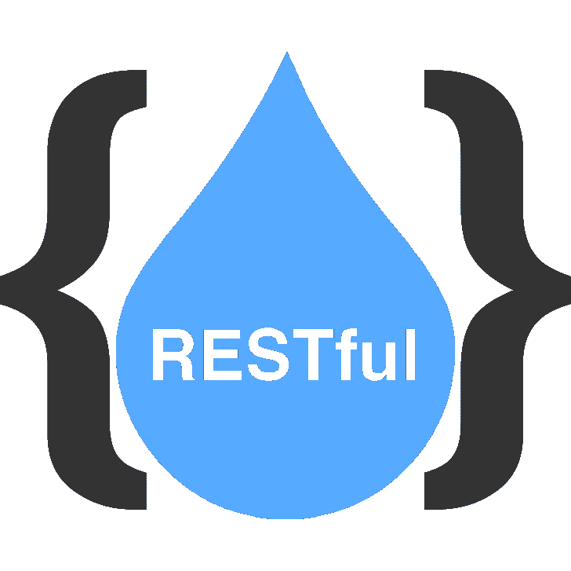

# 基于我的 Rails Web 应用构建一个移动应用要花多少钱？

> 原文：<https://medium.com/swlh/how-much-does-it-cost-to-build-a-mobile-app-based-on-my-rails-web-app-160b02505ccb>

How Much Does It Cost To Build A Mobile App Based On My Rails Web App?

许多因素会影响构建第一版移动应用程序的成本。包括你的应用程序的复杂性，你计划支持的外形，你雇佣的设计师，以及你需要满足的最后期限。如果没有正确的背景，你得到的大概数字可能会高估或低估 [**构建你的移动应用**](http://www.cognitiveclouds.com/custom-software-development-services/mobile-app-development-company) 所需的成本。

# 如何为你的第一版移动应用准备 Rails 后端？

首先构建一个健壮的 RESTful 接口，它允许后端 Ruby on Rails 应用程序与前端 web 和移动客户端通信。REST 是现代服务器应用程序与移动应用程序通信的标准方式，因为 REST APIs 易于调试和实现。它们与 HTTP 协议配合得很好，并且添加身份验证并不需要很多开发时间。您可以从 HTTP 基本身份验证开始，或者使用 SSL 上的 HTTPS 来提供安全身份验证。使用 Rails 的优势之一是将应用程序的服务器端和客户端分离开来。如果您知道如何处理 HTTP 请求并使用 JSON 进行回复，那么您就可以开始工作了。

> *Rails 旨在牢记编程的最佳实践，它几乎可以指导你为你的后端编写好的代码。Rails 不是市场上最快的* [***后端开发***](http://www.cognitiveclouds.com/custom-software-development-services/cloud-application-development-company) *框架，但它是健壮的。上手很快，可以快速构建应用。Rails 后端不会让您失望，如果您使用一个好的架构，您将达到您的性能要求。毕竟，即使是 GitHub 也有一部分是在 Rails 上运行的。*

# 要做的决定

从明确发展目标开始。你的手机 app 的目标是什么？有没有在移动设备上比在网络上更有意义的用例？如今，人们通过智能手机访问 Rails 应用时会使用哪些功能？你想从原型、最小可行产品(MVP)还是最终产品开始？它们都解决不同的问题。因为你已经有了一个工作的网络应用，你不需要构建一个原型来展示你的想法，因为你可能已经找到了你的产品/市场的契合点。你的产品的 MVP 只包含将你的移动应用推向市场的重要功能。它帮助你为进一步的开发提供资金，获得用户反馈，并纠正你的项目的前进方向。最终产品是根据你从 MPV 中获得的见解打造的。

在您的开发人员编写一行代码之前，与您的设计人员一起为您的最终用户将体验到的每个用户流创建用户界面原型。这一过程使您的开发人员专注于为您的第一个版本的移动应用程序构建具有正确功能的应用程序。你的设计师的费用将与他们在你的项目上花费的时间挂钩。

虽然您确实需要花费时间来编写和阐明需求以获得适当的估计，但是您可以通过花费一些时间来帮助您的设计和开发团队理解您的愿景，从而避免意外的开支。

# 参与模式:

*   固定出价:在这个模型中，你列出了你所有的功能和需求，这样构建你的移动应用的团队就可以创建一个合适的估价。影响成本的因素包括您计划支持的移动平台(iOS、Android 或两者都支持)、您的 web 应用程序的设计变化、您需要的功能、您的应用程序的复杂性、您雇佣的团队的位置以及您计划的发布日期。开发您的移动应用程序的时间表可以从 3 个月到 6 个月不等，这取决于您需要开发的功能数量以及您的开发过程的迭代程度。考虑到上述所有因素，这将花费你大约 25，000 到 200，000 美元。
*   时间和材料(T&M):这更像是一个抽象的模型，通常用于研发(R&D)项目或难以定义具体范围的项目。你带着一个想法或愿景而来，基于你带来的资源，以及你给我们的时间，我们来构建它。这方面的大概数字很难得出。定价基于使用你的应用的人数、他们每周在你的项目上花费的时间以及他们的小时计费率。项目模型按周或按月开具发票。你支付的费用取决于你是在美国使用本地团队还是在印度这样的国家使用离岸团队。一个好的开发团队会收取你每小时 30 到 250 美元的设计费，每小时 25 到 200 美元的开发费，每小时 15 到 100 美元的质量保证费。

在你接受这个价格范围并认为它是最终价格之前，回想一下你最近一次参与的家庭装修项目。超出预算了吗？出现了多少意想不到的问题。构建应用程序与此非常相似。然而，一个好的应用程序，如果构建正确，将来会为您节省时间和金钱。

# 如何降低构建自己第一个版本手机 app 的成本？

现在，您已经熟悉了影响移动应用成本的因素，您可以选择一个团队和范围来最大化您的投资回报(ROI)。不要忘记你为什么要开发这个应用。它要解决什么问题？专注于此，丢掉多余的东西。为了实现这个目标，尝试构建一个移动应用程序，该应用程序只包含一部分在移动设备上有意义的功能。例如，用户不希望在移动应用程序上键入大量文本，因此需要用户输入或编辑大块文本的功能可以在应用程序的未来版本中发布。去掉手机上一些不必要的功能。简化设计，注重可用性。此外，密切关注你的目标用户的位置。请记住，在美国开发你的应用比在印度或其他新兴市场成本更高。最重要的是，选择正确的开发商，我们。你没想到我会放弃这个机会，对吧？

*原载于* [***产品洞察博客***](https://www.cognitiveclouds.com/insights/) *来自 cognitive clouds:Top*[***Ruby on Rails 开发公司***](https://www.cognitiveclouds.com/custom-software-development-services/ruby-on-rails-development-company)

## 这个故事发表在 [The Startup](https://medium.com/swlh) 上，这是 Medium 最大的创业刊物，拥有 299，352+人关注。

## 在这里订阅接收[我们的头条新闻](http://growthsupply.com/the-startup-newsletter/)。

