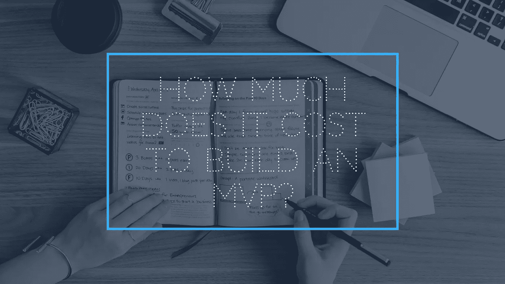

# 打造一个 MVP 要花多少钱？

> 原文：<https://medium.com/swlh/how-much-does-it-cost-to-build-an-mvp-2c88016da045>

How Much Does It Cost To Build An MVP?

如果你已经开始寻找合适的供应商或自由职业者来完成你的 MVP，你会发现他们报价的巨大差异。通常他们报价的差距是如此之大，以至于你开始怀疑是否所有这些价格都是为了制造同一个 MVP。在我们进入正确的定价和如何确定报价是否正确之前，作为初创公司创始人和产品负责人，你们应该深入了解。意思是，分解需求，分清轻重缓急。这将有助于你理解你想要构建的是真正的 MVP 还是原型。

我相信你已经对什么是 MVP 有了基本的了解。尽管如此，让我们快速浏览一遍，以确保我们的定义匹配。如果你正在构建一个产品的一半，称它为第一个版本。不是 MVP。现在，MVP 和原型都是为了测试一个假设。然而，有了原型，除了反馈，你什么都得不到。另一方面，一个 MVP 必须完成你为你的产品设想的主要功能，它应该能够从实际的[用户参与](https://www.datadab.com)中收集有价值的数据。MVP 是原型之后的东西。原型并不总是必要的，除非你在寻找机会获得反馈。当你真正期待 MVP 的时候，自由职业者更有可能给你原型。

# 为什么我需要一个 MVP？

如果你想做下一件大事，从 MVP 开始，找一个有能力的团队来帮助你。把你的 MVP 看做是最初的产品版本，比一口气构建一个完全成品更便宜也更明智。构建最小可行原型的主要优势是:

*   **消费更少的钱**
*   **降低经营风险**
*   **使进入市场变得容易**
*   **提供来自目标用户的真实反馈**
*   **投资少**

# 我首先要想到什么？

为了[构建一个 MVP 应用](https://www.cognitiveclouds.com/insights/mvp-development-best-practices/)，你需要一个合理的[营销策略](https://www.datadab.com)。你需要所有的细节、细节、工具、团队和 MVP 发展计划。你必须决定它将是什么类型的 MVP 和应用程序功能，这是非常重要的。重点不是推出全功能的产品。相反，采用迭代的方法进行产品开发，并及时添加额外的功能，用经过验证的数据武装起来。

首先问问自己，你对产品的最终愿景是什么。为了证明最终目标是可以实现的，你需要验证的基本假设是什么？这是你的 MVP 应该回答的中心问题。现在，根据您的预算和需求，决定您是否要购买一次性 MVP，当需要扩展或购买一个可以继续添加附加功能的平台时，MVP 将被丢弃。这些决策需要技术投入，通常还需要大量的研究。

# 我要花多少钱？

MVP 移动应用成本的棘手之处在于，它是不同的，取决于各种因素。一个自由职业者对一个应用原型的收费在 4000 到 15000 美元之间。如果你雇佣一家开发公司，他们会告诉你费用应该在 2 万到 3 万美元之间，取决于工作范围。这里不变的是，所有关于 MVP 价格的估计都是基于每小时的价格。所以他们谈论的是同一个 MVP 吗？号码

设计和功能是 MVP 开发不可或缺的两个方面。你必须看到用户界面最终会是什么样子。它能让用户参与进来吗？是否简单醒目？导航有声音吗？定制的手势、按钮和过渡会让你付出代价——漂亮一点也不便宜。

这里我们假设你要找的不是一个一次性的 MVP，而是一个可扩展的、基于 API 的平台，它可以支持后端和前端改进的多次迭代。在这种情况下，MVP 总成本将在 30，000 美元左右。

*原载于* [***产品洞察博客***](https://www.cognitiveclouds.com/insights/) *来自 cognitive clouds:Top*[*Web App 开发公司*](https://www.cognitiveclouds.com/custom-software-development-services/web-application-development-company)

## 这个故事发表在 [The Startup](https://medium.com/swlh) 上，这是 Medium 最大的企业家出版物，拥有 294，522+人。

## 在这里订阅接收[我们的头条新闻](http://growthsupply.com/the-startup-newsletter/)。

