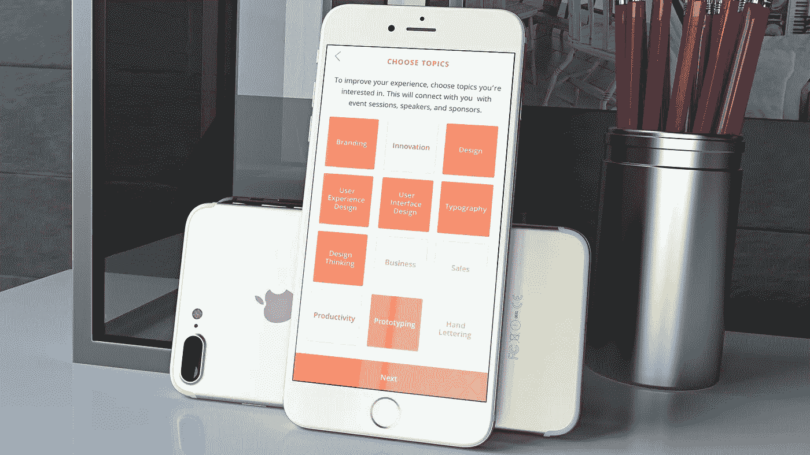
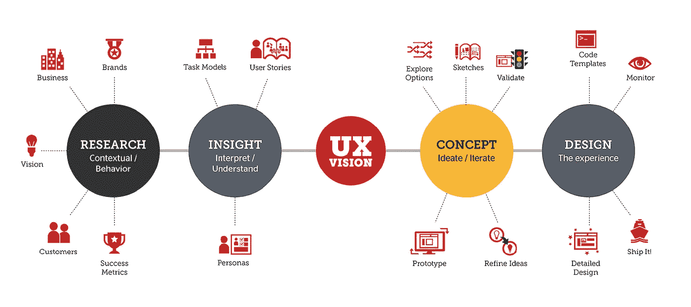
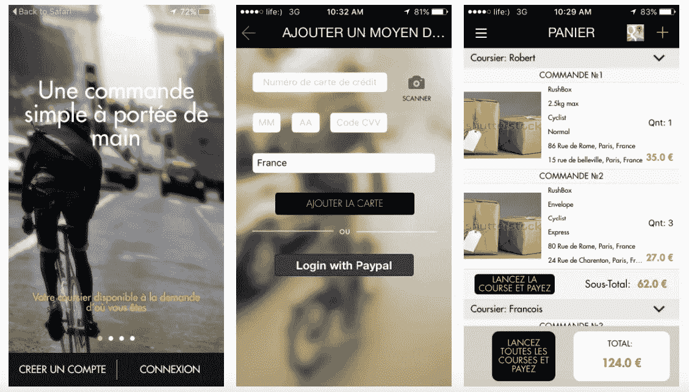
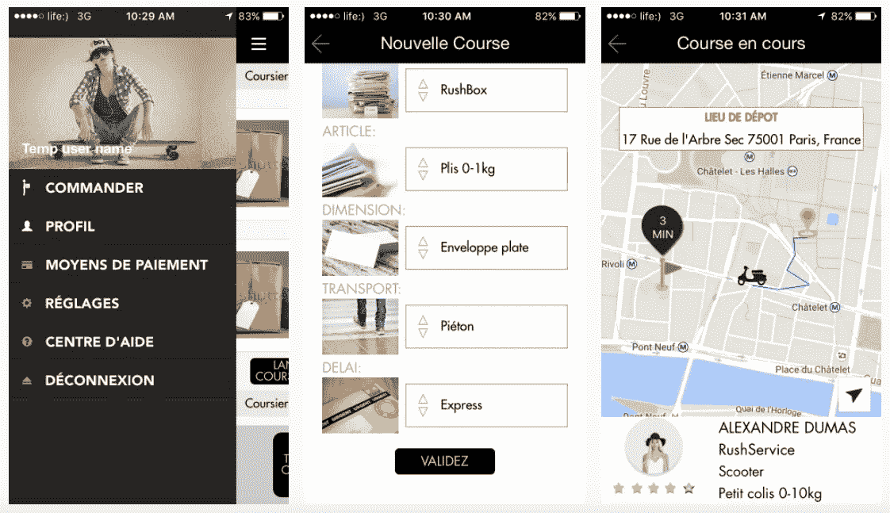

# 设计一个应用需要多少钱？应用程序设计综合指南

> 原文：<https://medium.com/swlh/how-much-does-it-cost-to-design-an-application-a-comprehensive-guide-to-app-design-7c03e579b38>

开发移动应用是一项巨大的投资，项目的基本阶段应该是提供一个坚实的“建筑材料”。设计是你的应用程序未来的基石之一，它是你的想法在现实世界中开始显现的一个点。你需要明白你要投资多少，需要多长时间才能收回投资。在这篇文章中，我们更深入地了解了设计过程和它的成本。

# 成本到底是怎么算出来的？

一开始你可能会觉得估算费用有些困难，但是当你了解事情是如何运作的时候，实际上就很容易了。基本上就是专家的小时工资乘以他们完成工作所花的时间。让我们把它分解成一些基本要素——一个小时的工作成本是多少，你实际上需要多少个小时来完成工作？

# 每小时的费用是多少？

以下是全球范围内的估计比率:

*   美国和欧洲的公司每小时收费 50-150 美元；
*   乌克兰工作室的平均收费为 20-30 美元，在某些情况下价格可能超过 50 美元大关；
*   印度的价格从 20 美元起，根据项目的复杂程度，可能会达到 50 美元或更高。

全球各地的个体自由职业者有时每小时收费 10 美元或更少，但他们的专业知识通常不足以开发出真正适合现代应用的高端解决方案。

IT 外包的好处是，你可以以很低的价格找到高质量的服务。其原因与税收、生活费用和各种其他因素有关。然而，基础设施和技术手段以及培训材料和进入全球市场的渠道几乎在全球任何地方都可以获得。乌克兰设计师因其专业知识而广为人知，这使得产品在竞争领域取得成功。

# 我们在谈论的工作量是多少？

移动应用程序开发的初始阶段包括收集应用程序应该做什么、潜在用户是谁以及他们应该如何与应用程序交互的信息。在这一阶段，产品负责人的专业知识发挥着至关重要的作用，可以全面了解最终用户是什么样的，应用程序实际上提供了什么样的价值，以及客户将以何种方式从您的解决方案中受益。

现在，您已经清楚地了解了工作流，是时候创建应用程序的原型了。根据任务的不同，可能需要大约 40 到 80 个小时。这一阶段需要为未来的工作建立一个确切的框架，一个坚实而有弹性的基础；打磨它需要大量的资源。

你可能期望一个简单的应用程序花费设计师大约 100 到 150 个小时的时间。它将运行标准的用户界面组件，并且只在一个平台上运行，但它会把事情做好。虽然这款应用可能并不是在所有方面都很出色，但你可以期待在短时间内构建并启动一个可行性最低的项目。

如果你把眼光放得更高，打算发布一个中等复杂程度的应用程序，准备好投入 **200** 到 **250** 小时进行设计。这将包括一系列不同功能的屏幕，复杂交互的 UX 图表和各种类型的内容。

复杂应用程序的设计可能需要超过 **300** 小时。实际上没有上限，这很大程度上取决于你想要完成什么。如果这是一个创新的解决方案，需要全新的算法来实现，它肯定需要时间来实现。

上面的数字可能看起来有点模糊，所以让我们看看这个过程包括什么。

# 我到底是为了什么付钱的？

设计师工作最常见的概念是让应用程序的外观看起来不错。这无疑是这个过程的一个重要部分，但不是唯一的部分。设计包括更广泛的概念，而不仅仅是信息的视觉描绘。15 到 20 年前，它可能仅限于这个领域，但在不断变化的数字环境中，你不能指望事情在如此长的时间内保持不变。确实如此，事情发生了很大变化。

假设设计师只在应用程序的外部工作在技术上是不正确的。**一般来说，专家设计用户与系统交互的方式，反之亦然。**

让我们概述一下设计过程的框架。现阶段包括哪些内容？为了让事情变得更简单，让我们来谈谈用户体验(通常被称为 UX)。

# 开发互动模式

移动应用的核心是交互。随着技术的进步，移动应用面临着新的挑战。

对于应用程序来说至关重要的是**用户可以直观地理解**，为**提供简单的交互方式**、**最大值**和**最小可能输入**。人们总是匆匆忙忙，他们不愿意投入大量时间来掌握界面——即使应用程序提供了坚实的价值。竞争非常激烈，胜利的果实落入了那些真正倾听观众心声的开发者手中。

理解你视为目标受众的人需要时间和努力。你还需要具体的知识——通过大量的努力获得的知识。除非你真的愿意花几年时间来精通这个领域，否则花钱请专家来完成这项工作是非常值得的。你是一个企业家，一个有远见的人，一个希望通过对人们有用的应用程序改变现状并盈利的人。让专家为您完成技术部分。

一个专业的设计师知道如何制作一个功能强大、反应灵敏的界面，但是他仍然需要输入。这意味着必须研究受众，需要编写用户案例，还需要收集和处理大量其他研究材料。

# 让事物从第一眼看上去就很漂亮，很有吸引力

视觉感知是你的应用程序给人的第一印象，最终重要的是要吸引眼球。有这么多竞争对手争夺用户的注意力，你不能失去这个机会。

人们首先会关注的是界面。当他们决定是否要下载应用程序并试一试时，清单上的第一件事将是一个漂亮的界面，它确切地显示了您所处的阶段以及此时您可以做什么。它必须立即引起人们的兴趣。

为了让应用程序成功，一个好的设计需要具备一些条件。

*   符合现代趋势。在应用程序设计的世界里，有些东西是“时髦的”，这就像是给用户的一面旗帜，上面写着“这个应用程序是最新的”。但是，这有些棘手；你希望你的申请以一种好的方式脱颖而出。所以，遵循指导方针是必要的，而模仿在任何情况下都是不可接受的；
*   保持完整性。应用程序是一个更大的生态系统的一部分，它应该看起来和感觉起来像一个生态系统。为移动应用程序、网站、商品等开发和使用特定的设计模式是必不可少的(以及在应用程序的屏幕之间进行无缝转换)。

[Rushiz by Octodev](https://octodev.net/rushiz-case/) 。按需交付服务

除此之外，你还需要有创造力。没有人想要一个流行应用程序的另一个副本。它必须看起来新鲜和新的。这听起来有点显而易见，但这个因素的重要性怎么强调都不为过——有时创业者似乎会忘记它，或者把它放在次要位置。

# 我们开始吧！

此时，你知道什么是应用程序设计，它的目的和阶段是什么，以及你将以什么方式参与到这个过程中。不要浪费你宝贵的时间等待事情自己发生！你有一个应用程序的想法吗？你的竞争对手可能正在努力，你可能会失去争取观众的机会！使用 OctoDev 立即将它变为现实。[今天就联系我们](https://octodev.net/contact-us/)了解详情，如果你想计算[你的手机应用](https://octodev.net/?utm_source=medium&utm_campaign=what%27sApp)的费用，就可以得到免费的估价！

*本文原载于* [*Octodev 博客*](https://octodev.net/how-much-cost-design-application-comprehensive-guide-app-design/) *。*

如果你喜欢这篇文章，请点击下面的拍手图标，让我知道！

## 这个故事发表在 [The Startup](https://medium.com/swlh) 上，这是 Medium 最大的企业家出版物，拥有 273，103+人。

## 在这里订阅接收[我们的头条新闻](http://growthsupply.com/the-startup-newsletter/)。

