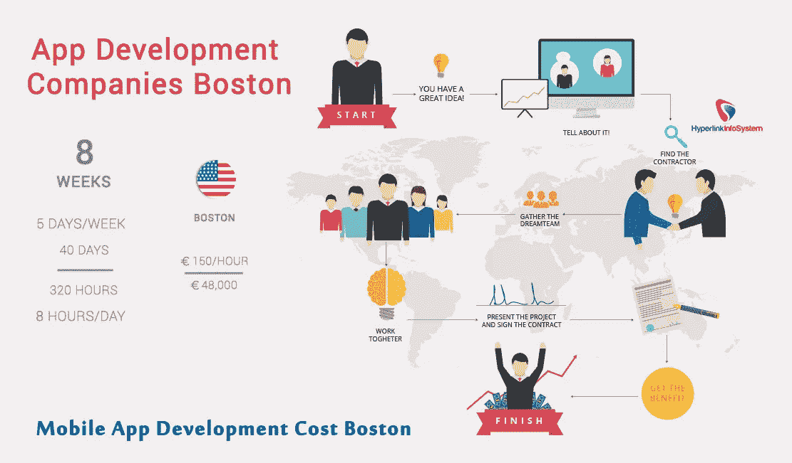
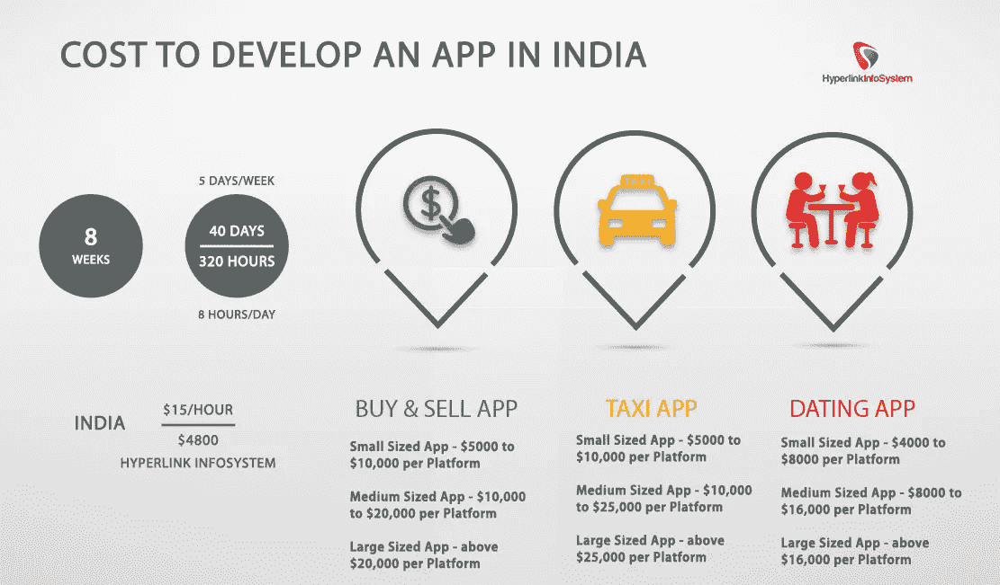

# 做一个 app 要多少钱？

> 原文：<https://medium.com/swlh/how-much-does-it-cost-to-make-an-app-cd0568a92944>

做一个 iPhone，iPad，或者 Android 的应用要多少钱？想象一下与 http://howmuchtomakeanapp.com 的粗略比较成本

我想象中的应用售价 93，900 美元，但采用了最基本的设计——64，100 美元。

好吧，通常伟大的概念即使在糟糕的设计中也能发挥作用

[**肯雅莫什**](https://medium.com/u/f924d74486b7?source=post_page-----cd0568a92944--------------------------------) 来自[精明的应用](https://medium.com/u/e23c2c9e9ade?source=post_page-----cd0568a92944--------------------------------) [告诉](http://savvyapps.com/blog/how-much-does-app-cost-massive-review-pricing-budget-considerations)说:

> 由最大的应用程序公司，即“大男孩”开发的应用程序，价格可能在 50 万到 100 万美元之间。
> 
> 由像 savvy apps **这样的机构开发的应用程序价格在 15 万到 45 万美元之间。**
> 
> 由小商店开发的应用程序，可能只有 2-3 个人，**可能花费在 5 万到 10 万美元之间。**

关于 Quora 的开发者建议，准备好花 3 个月时间开发第一版，然后花 1 个月时间进行新的更新。在旧金山，一个包括 2 名 iOS 开发人员、2 名后端开发人员和 2 名 UI/UX 设计人员的团队可能每月花费 6-10 万美元。

根据 T21 的超级链接信息系统，在波斯顿雇佣一个小时，你可以支付 150 美元/小时。

但你永远拥有印度。

