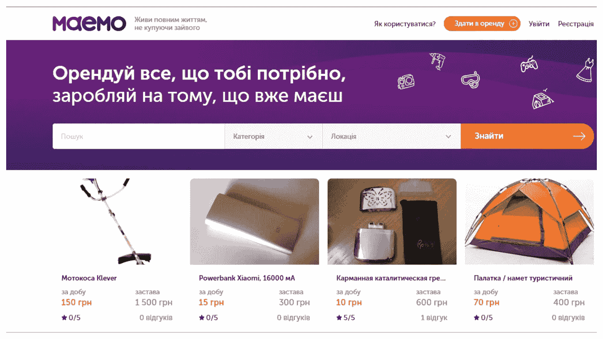

# 建立一个在线市场要花多少钱

> 原文：<https://medium.com/swlh/how-much-it-costs-to-build-an-online-marketplace-ddccbc72c550>

随着越来越多的客户在网上寻找商品和服务，网上市场越来越受欢迎，成为买卖任何你喜欢的东西的理想场所。有销售和交换商品、租赁、预订、运输服务、招标、拍卖、食品配送、物流、教育、求职和许多其他市场。每隔一天就会有新的类型出现。嗯，为什么不呢，考虑到在线市场业务的盈利能力。

到 2018 年底，数字买家的数量将达到[17.9 亿大关](https://www.statista.com/statistics/251666/number-of-digital-buyers-worldwide/)，全球零售额将达到每年近 30 亿美元。对于一些成熟的商业巨头，在线市场提供了超过 40 %的销售产品，对于一些相对较新的公司，它们代表了 100%的销售额，有时[超过 10 亿美元大关](https://www.mirakl.com/data/uploads/White-paper-Marketplace.pdf)。这种受欢迎程度很大程度上归功于在线市场为所有相关方提供的众多优势:买方、卖方、运营商和物流公司等第三方供应商。

# 在线市场的商业优势

在线市场聚集了大量的买家和卖家。他们充当不同群体之间的调解者，提供便利条件和必要保障。透明的采购流程吸引了客户，他们可以清楚地看到并比较相关价格和库存，无需离开单一平台即可从大量选项中进行选择。没有必要检查几十个网站或去商场，所有的购物只需点击几次。

另一方面，卖家可以接触到更广泛的受众。对建立自己的电子商务网站犹豫不决的小商店或供应商加入在线市场，以降低风险并确保在市场中的地位。对于市场经营者来说，这是一个从交易中赚钱的好机会，而不用保留仓库，处理物流和其他类似的问题。

考虑到上述所有因素，你可能已经开始考虑开设自己的在线市场了。那你应该也想知道发行的价格。虽然有很多事情你需要考虑，但首要的事情是网站开发。看看可能要花多少钱，需要注意什么。

# 需要考虑的事项

当建立一个在线市场时，你可以从两个选项中选择:使用一个现成的平台或者从头开始建立你的定制市场。根据您的业务目标，这两种方法各有优势。

一方面，我们需要面对它:在许多情况下使用一个已经存在的平台可能真的会变得更便宜和更快。同时，使用普通的和传统的工具，你应该准备好你得到的产品不会与数百个已经存在的选项有太大的不同。这不是一个让你从竞争者中脱颖而出的好机会。或者推销一种非常新颖和特殊的产品或服务。在这种情况下，定制开发是值得的。

你希望在市场上看到的功能也会影响开发的成本:网站架构越复杂，开发和维护如此复杂和精密的功能就越昂贵。但是有一个好消息:几乎所有的现代装饰巨头都是从功能最少的简单服务开始的。例如，Etsy 仅用了三个月就建成并发布了，网站的功能逐渐改变，在发布 13 年后仍在扩展。

我们还建议您从一个 [MVP](https://stfalcon.com/en/blog/post/why-your-startup-needs-mvp) (最低可行产品)开始，检查事情进展如何——然后根据您的业务的真正新兴需求进一步开发您的市场。顺便说一下，这是支持定制开发的又一个理由:你总是可以根据你的业务调整你的站点，而不是相反。你的产品的这个最简单的版本应该包括什么很大程度上取决于[想法验证](https://stfalcon.com/en/blog/post/startup-idea-validation)的结果。如果你想创造一个你的潜在客户可能感兴趣的产品，后者是一个必要的步骤。不过，有一些最常见的功能，任何在线市场都应该包括在内。让我们考虑它们并定义它们的实现成本。

# 强制功能集

无论你要建立什么样的在线市场，你都需要两个必备的要素:管理面板和用户平台。

管理面板旨在控制产品库存、客户、订单、支付和所有必要的市场设置。管理员注册新用户，为卖家设置佣金，批准产品，分配类别，并管理评级和评论。作为标准，它完全属于服务的后端，对客户端不可见。

根据您的业务模型，用户平台甚至可以包含不同用户角色(例如，买方和卖方)的不同仪表板。它必须具备的特征是:

*   登记表，
*   帐户页面，
*   授权和安全，
*   客户支持系统，
*   项目列表，
*   搜索引擎，
*   购物车，
*   评论和证明，
*   集成支付功能，
*   运输功能。

如果没有这些功能，就很难为市场用户提供必要的便利性和安全性，也很难保持网站的吸引力和竞争力。如果你认为这个功能对你的市场来说已经足够了，你可以选择一个整体的解决方案，这肯定会让你的花费最便宜，但是在这种情况下，你应该意识到这样的网站是不可扩展的。也就是说，将来您将无法向您的市场添加新功能。更复杂的可扩展解决方案包括后端和前端开发以及 demand REST API，它支持服务不同部分之间的平滑交互。

根据您的业务特点，您的在线市场中的主要选项可能会略有不同。让我们看看 Stfalcon.com 开发的在线租赁市场 Maemo 的例子。

# 实施示例:Maemo

Maemo 是一个租赁服务，其任务是匹配想要租赁或出租不同物品的用户。由于这个网站有一个简单的目的，它是通过 [PHP 框架 Symfony](https://stfalcon.com/en/services/web-development) 开发成一个单一的网页。在我们[之前的一篇文章](/swlh/7-advantages-of-php-for-business-it-solutions-b388d01e7891)创业中，我们解释了为什么它最适合这类项目。由于该网站是不可扩展的，该团队必须非常彻底地考虑功能。我们使用了大部分的强制功能，并增加了一些额外的功能，使网站更方便，对用户更有吸引力。

该服务由标准管理面板和用户平台组成。由于用户可能既想租东西又想出租东西，他们可以从一个帐户轻松地在这些角色之间切换。用户可以管理他们的个人资料，他们租用的物品，浏览历史，留下评论，进行交易，并在实时聊天的帮助下相互交流。

冗长而复杂的注册过程常常分散了用户对网上购物的注意力。为了尽可能快速简单地注册，我们通过脸书个人资料整合了注册。所有支付和支出都是通过整合的 Fondy 支付系统进行的，该系统在乌克兰市场广受好评。这项服务的具体特点是一个带有投放点的综合地图，用户可以在地图上看到租赁者的地址以及从他们的住处到租赁物品所在地的距离。

因此，我们拥有的是一个非常简单但功能强大的产品，它能出色地完成任务。如果客户决定支持可扩展的开发，网站的功能可能会进一步扩展。

# 更多版本和附加功能

更复杂的在线市场解决方案可能包括以下功能:集成分析、智能通知系统、过滤器和订阅源、商品视频、订单跟踪、多种支付选项和群发、退货政策、推荐计划以及聊天、点赞或社交媒体共享等社交元素。你甚至可以实现虚拟和增强现实或人工智能等最新技术。

我们强烈建议为用户开发一个(甚至几个)移动应用程序。如今，人们越来越频繁地使用手机购物。据统计，在过去的 6 年里，全球使用手机购物的人数增长了 133%。举例来说，易贝的应用程序已经被全球 190 个国家的 5000 多万人下载。

应用程序提供了该网站任何版本都无法提供的优势，如推送通知、地理围栏、离线模式等。这就是为什么今天许多在线企业将越来越多的活动委托给移动应用程序。

# 时间和金钱估算

如您所知，根据您选择的功能集，市场成本可能会有很大差异。在线市场的开发需要不同专家的协同努力，包括项目管理、UX 和用户界面设计、后端和前端开发、布局和质量保证。

开发一个具有基本功能集(如上所述)的网站需要 800-1000 小时，开发时间大约为 3 个月。开发一个基本功能集的大致成本是 8 万美元。

如果您决定创建一个更复杂的解决方案或向现有网站添加一些新功能，您将需要预算额外的费用，例如，开发通知功能需要 20-30 个工作小时，浏览内容功能需要 80-90 个小时。一个功能丰富的复杂市场的成本可能高达 18 万美元。

为一个平台(Android 或 iOS)开发一个移动应用程序将需要大约 400 个小时，大约花费 6 万美元。根据应用程序的复杂程度，这些数字也会有所不同。

当然，您需要记住的是，提到的数字是近似值，并且会根据开发所在的国家、团队的专业技能和经验、条款以及所包含的功能而有很大的不同。联系该公司的销售代表将为您提供更精确的估计。我们希望这篇文章已经让你清楚地了解了应该注意什么。

*最初发表于*[T5【stfalcon.com】](https://stfalcon.com/en/blog/post/online-marketplace-development-cost)*。*

## 这篇文章发表在 [The Startup](https://medium.com/swlh) 上，这是 Medium 最大的创业刊物，有+ 373，685 人关注。

## 在此订阅接收[我们的头条新闻](http://growthsupply.com/the-startup-newsletter/)。

