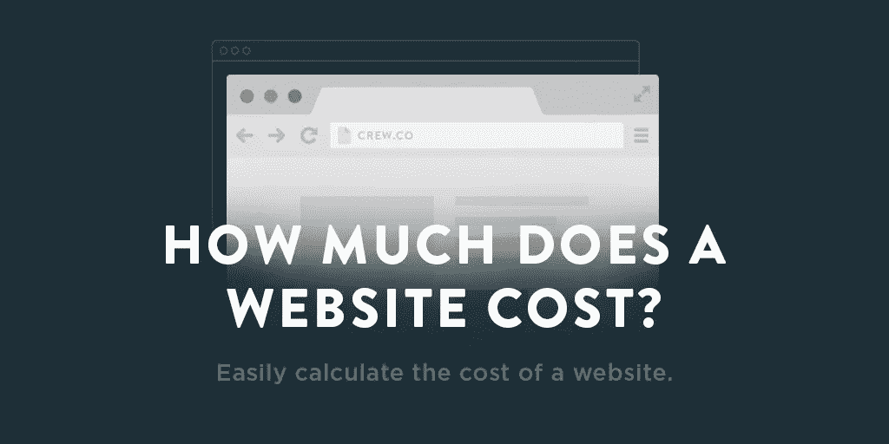

# “那要花多少钱？”

> 原文：<https://medium.com/swlh/how-much-should-that-cost-26b1fed171c6>

## 每个自由职业者最喜欢的问题…

问任何一个自由设计师或开发人员什么问题让他们感到恐惧，你可能会听到一些不同的回答:

> "那么，你每小时的工资是多少？"

一旦谈话离开了求爱阶段，你准备投入一些严肃的事情，突然之间，你们所有的共同点都变得不重要了。

突然间，唯一重要的是价值。

但作为自由职业者和独立创意者，通常很难将我们所做的所有工作总结成一个漂亮、整洁的小时工资率。尤其是我们的客户会无异议同意的。

除此之外，你越有经验，你的技术越快，你的价值就越不依赖于时间。没有理由因为及时出色地完成工作而受到惩罚。

那么，还有什么选择呢？

正如自由职业大师保罗·贾维斯解释的那样:

> “劳动者按小时计价；领导按价值定价。”

# 摆脱小时工资

让我们快速看两个场景:

1.  你给客户报价 1000 美元设计一个标志
2.  你给一个客户报价 1000 美元，让他设计一个你要花一个小时才能完成的标志

在这两种情况下，工作都是以可接受的价格完成的，但你接触过的客户中，有多少人不会拒绝支付 1000 美元/小时的费用(如果你确实认识这样的人，请，*请，*把他们介绍给我！)

但是如果你的技能和专业知识允许你在一个小时内完成那个项目，你为什么要为此受到惩罚呢？

客户机在两种场景中获得相同的好处，但是第一种场景将价格与结果的价值联系起来，而第二种场景将价格与构建所花费的时间联系起来。

**把成本和时间挂钩会把你变成一种商品。**

# 如何开始按价值收费

回到我的朋友保罗·贾维斯，这是他对[如何实现这些想法](http://blog.crew.co/value-based-pricing/)并开始按价值收费的分析:

# 1.将每项任务分解成一个单独的行项目，每个行项目都有单独的可交付成果(例如，客户将收到的内容，如时事通讯设计)

对于我的项目(设计网站并将其编码为自定义主题)，我将定价分为:战略、品牌、界面设计和编程。

我还总是包括一些其他客户通常想要的可选部分，如简讯设计和模板创建、社交媒体简介设计、简讯自动化和入职策略，和/或营销/销售内容创建。这些成为谈判的要点，因为我不打折，但是如果客户负担不起整个工作，我可以去掉可选的部分。

# 2.为每个交付物创建一个价格(时事通讯设计，500 美元)

虽然客户只能看到每个可交付产品的价格，但我知道每个产品需要多长时间才能完成(平均来说，基于以前的项目)。我根据一个为我工作了 10 多年的公式来定价。如果我提前三个月以上预订，连续三个月以上，过去六个月没有涨价，我会涨价 15-20%。

自从我在 90 年代开始根据上面的公式为客户制作网站以来，我已经将费率提高了 700%(但话说回来，我当时收取的*太低了*)。

# 3.因为所有的项目都需要时间表，所以给每个可交付成果附加一个时间表

不要说明项目需要多长时间完成，而是要说明你什么时候能把它交付给客户(时事通讯设计，500 美元，2 周)。

我把我的时间表建立在以前项目的平均值的基础上，至少是它的三倍。所以，如果我知道一份时事通讯的设计需要我 3 天的努力，我会报 9 天。我这样做是因为*总是有一些事情*出现来耽误工作。无论是从生活中还是从其他项目中，我都痛苦地认识到，除非你为可交付成果安排日程，否则你将永远迟到(对于一个自由职业者来说，如果他们想让客户开心，这是可能发生的最糟糕的事情)。

如果我很早就完成了工作，而不是马上发送，我会把它搁置起来，这样我就可以从事其他项目了。当我说我会交付的时候，客户就明白了，有时会稍微早一点——因为[交付过多而承诺不足。](https://blog.crew.co/why-you-should-always-under-promise-and-over-deliver/)

定价不是一项简单的任务。

你不仅仅是被雇佣来完成可交付成果的计费时间，你还被赋予了解决问题的任务。

你的价格还考虑了你花在学习手艺上的时间(无论是在学校还是通过工作),以及你花在与以前的客户合作和通过这些项目学习上的时间。

记住: ***你的报酬不仅仅是手头的任务，而是你带来的一切。***

为了最小化风险，提高你的专家地位，确保你总是传达你工作的价值。展示最终结果将如何使你的客户受益。将成本和时间分开，关注每个交付物的最终价格。

你的客户想要结果和最终产品，所以把你建议为他们创造的东西和它联系起来。

# 想知道你的下一个网站的成本吗？

我们开发了一个快速简单的工具，可以在一分钟内估算出你下一个网络项目的成本。 [*点击这里试一试*](http://howmuchdoesawebsiteco.st/) *让我们知道你的想法。*