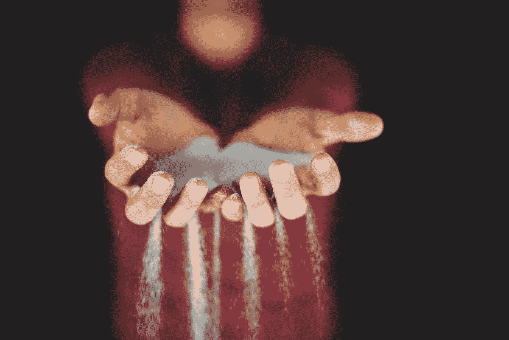

# 你在无用的活动上浪费了多少时间？

> 原文：<https://medium.com/swlh/how-much-time-do-you-waste-on-useless-activities-28534aeb90d6>

每个人都曾在某个时候说过这样的话，“我就是没有足够的时间。”

你知道吗？

你永远不会有足够的时间。

你将*永远不会*实现你一生中想要的一切。

真的没有足够的时间做所有的事情。