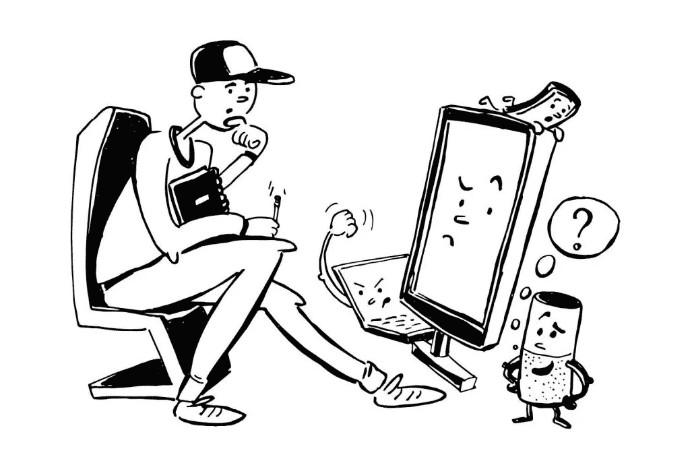

# 我们真正需要多少 UI？

> 原文：<https://medium.com/swlh/how-much-ui-do-we-really-need-23b1ae1b7084>

人类和机器之间的互动目前正处于顶峰，我们甚至不知道我们前面是什么。尽管如此，即使 UI 发展如此之快，我们也应该花点时间思考一下它的影响。更准确地说，我们的手机、汽车和电脑需要多少用户界面？

## 对话式界面呢？

在 2018 年，人们希望快速响应、高效并完成任务。从这个角度来看，我们与设备互动的方式至关重要。我们为什么/如何从基本的用户友好转向对话式界面的确切原因。

这样的用户界面与真人互动，排除了点击图标的折磨(有些人可能会这么想)。相反，你只是告诉你的设备为你做什么。

这种设备/应用程序的最好例子是亚马逊 Alexa、Google Now、Siri 和 Cortana 甚至你在不同网站上看到的聊天机器人。所有这些都是为了帮助您获得高效、愉快、用户友好的体验。用最小的输出，你得到想要的结果，当你看大图时，这确实是一个不太耗时的选择。

例如，让我们来谈谈电话。语音控制基本上可以用于任何事情:打电话、安排任务、设置闹钟、搜索网页、输入文本或任何其他内容。Siri、Cortana、Google Now 和 Bixby 涵盖了它们可以执行的相当广泛的任务。

除此之外，亚马逊 Alexa 覆盖的范围甚至更广；想象一下，在你的后院和朋友一起放松，告诉 Alexa，比如说，演奏一些流畅的爵士乐。几秒钟内完成检查。

但是让我们跳到汽车；如今，你几乎有一台内置的电脑和用户界面，试图更好地改善你的驾驶条件，使之更愉快。

## 它们对在你车里度过的时间有什么好处？

作为文化杂志《ramp》的出版商 ramp.space 的数字运营主管，我有独特的机会详细了解最新的汽车模型。

每次我坐进一辆跑车，加速度、Alcantara 皮革的感觉和(有时伪造得很好的)马达声音都比信息娱乐系统的用户界面更让我困惑——信息娱乐系统在每个类别中都是一团糟。从最新的高尔夫 GTI 到保时捷 911 或奥迪 R8。

以新高尔夫 GTI 为例。你将在中间获得一个 16 英寸的多点触控平板电脑，没有触觉按钮或反馈，以及一个交互式转速表，其中充满了各种各样或多或少有用的用户界面元素。

这就是对话界面介入并部分解决问题的地方。你的语音助手在 2018 年可以做的一些事情:

## 个性化语音对话系统

你坐上车，简单地用个性化的唤醒词问候你的语音助手。

## 个性化目的地和路线建议

例如，如果路上出现交通堵塞、车祸，或者只是道路施工，你会立即知道，这要归功于你的设备。你会得到替代路线、延误信息和预计到达时间。

## 数据的离线同步

想象一下，你需要安排一个会议，但是你正在通过一个隧道，失去了所有的网络覆盖；仍然不是问题。您的语音助手可以离线工作，并在您获得服务后立即备份数据。

随着公司不断试图弄清楚他们的客户的愿望，并试图让他们感到惊讶，你认为我们会走多远？

UI 需要覆盖我们生活的哪些方面，或者说我们已经走得太远了？

*最初发表于* [*亚历山大·巴萨拉*](https://aleksbasara.co/2018/01/21/how-much-ui-do-we-really-need/) *。*

## 这个故事发表在 [The Startup](https://medium.com/swlh) 上，这是 Medium 最大的企业家出版物，拥有 287，184+人。

## 在这里订阅接收[我们的头条新闻](http://growthsupply.com/the-startup-newsletter/)。

