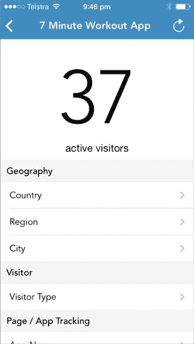
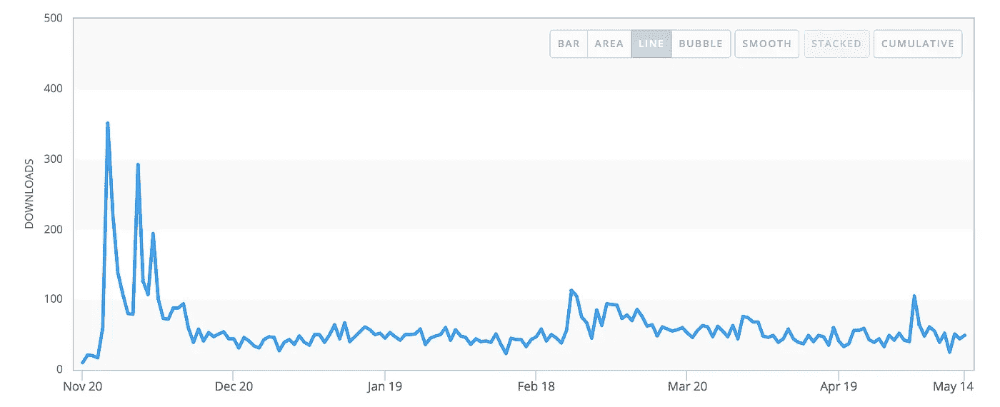
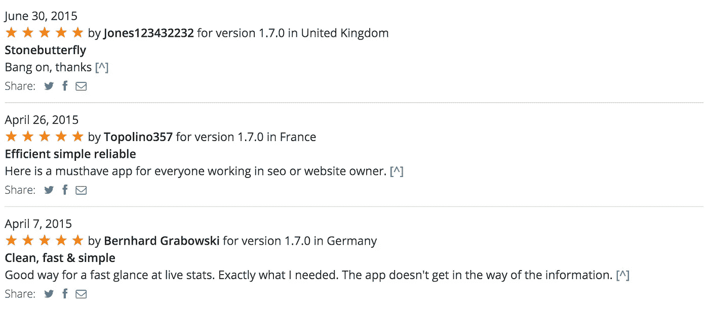
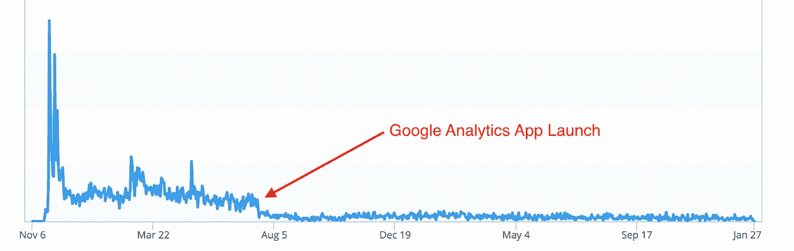

# 我的应用程序如何一夜之间变得无关紧要

> 原文：<https://medium.com/swlh/how-my-app-became-irrelevant-overnight-7d29a950c05>

在之前的帖子中，我已经分享了一个成功的故事，还有 T2 的市场对应用的发展有多重要。

在这篇文章中，我想分享一些不同的东西，选择错误的市场意味着你的应用程序会在一夜之间变得无关紧要。

当我建立 [Realtime](https://geo.itunes.apple.com/au/app/realtime-for-google-analytics/id740557474?mt=8&at=11l4LZ) 的时候，那真的只是为了满足我当时的一个个人需求。我想知道一天中任何时候有多少人在使用 Appbot 和我的其他应用程序。它给了我一个非常好的脉冲，让我知道每个人是如何旅行的，以及何时部署更新。

谷歌分析当时没有 iOS 应用程序，我发现其他第三方应用程序专注于历史分析。

这款应用非常简单，有两个主要目标:

*   显示活跃的访问者
*   能够深入了解一些关键指标。

它并没有引起轰动，但确实取得了稳定的下载量。

喜欢它的人，真的喜欢它。

2014 年 5 月，这一天终于到来了。

> “谷歌分析应用终于登陆 iPhone”

我的应用程序的结果是:

隔夜需求消失的实时。

虽然我知道我的应用程序总有一天会有这一天，但对于其他应用程序和开发者来说，这一天并不总是那么明显。小心选择一个不依赖于一个平台的市场，这个平台的主人可以让你一夜之间变得无关紧要。

Stuart 是 Appbot 的创始人兼首席执行官，他负责管理应用商店评论。他开发了多个应用程序，拥有数百万用户[，其中一个是他在 6 小时内开发的](/@stuartkhall/how-i-got-2-3m-app-downloads-without-spending-a-cent-on-marketing-f4823b6bc779)。