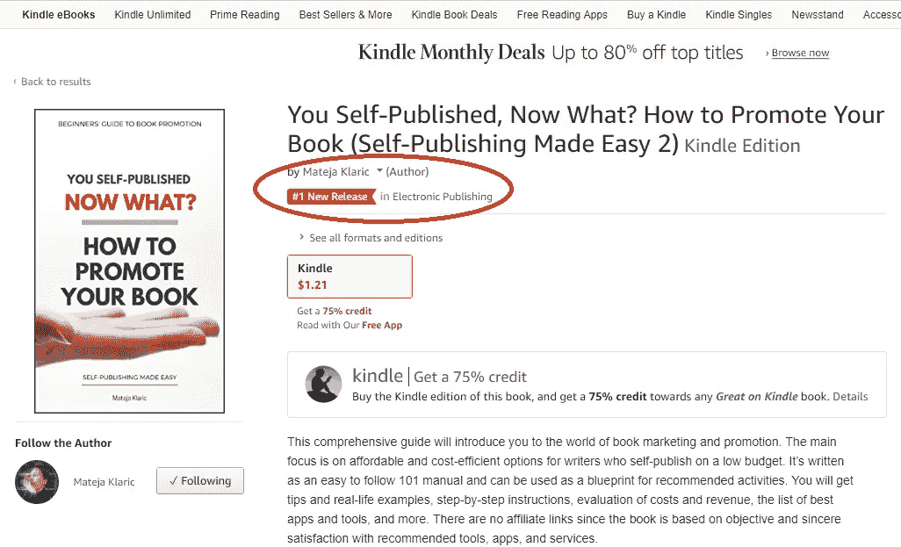

# 我的书如何成为亚马逊上的第一新书

> 原文：<https://medium.com/swlh/how-my-book-became-1-new-release-on-amazon-aa60a22e8314>

## 那么我是如何做到的呢？

我的新书在亚马逊上一发布就成为三个类别的第一新书。我特别高兴看到它成为“电子出版”的第一名，因为这是我的目标类别。让你的书在新版本中排名第一是一项成就，尤其是对于一个还算不上明星的自出版作家来说。