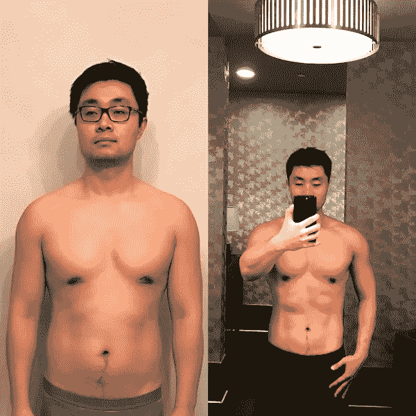
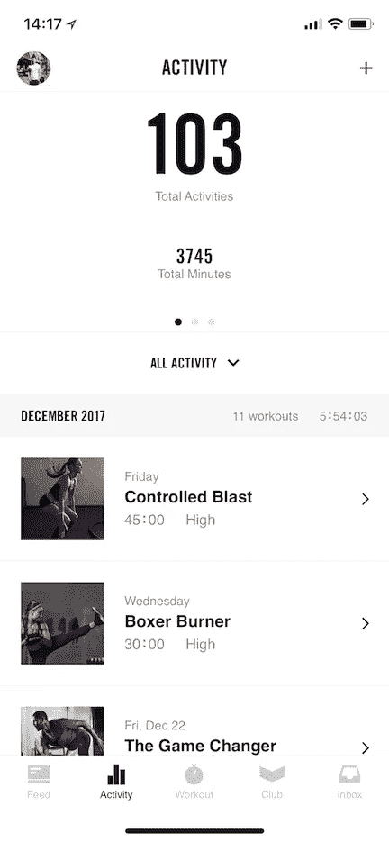
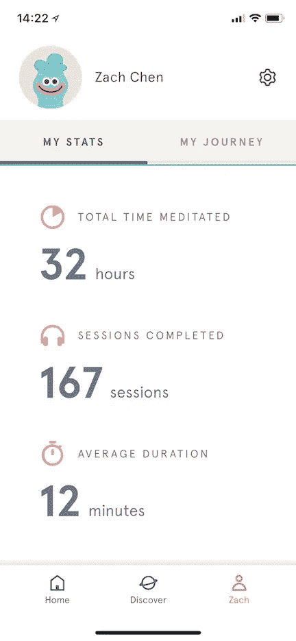
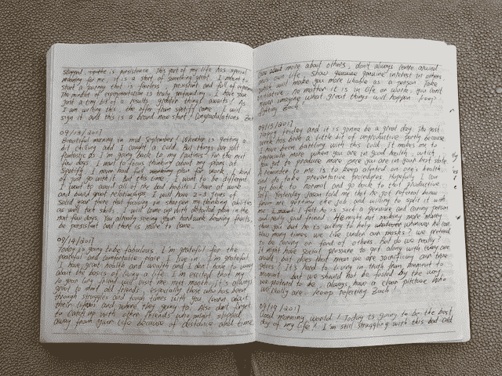

# 从 2017 年听了一年播客开始，我的生活发生了怎样的变化

> 原文：<https://medium.com/swlh/how-my-life-has-changed-from-a-year-of-podcast-listening-in-2017-7a571100d6f9>

Source: [http://corechurchtampa.com/](http://corechurchtampa.com/)

2017 年对我来说是特别的一年。我从没想过我能在生活的这么多方面取得这么多成就。我把我的大部分成就归功于一年来积累的一系列习惯。我从我听的各种播客中学到的东西是我灵感的来源。我迫不及待地想和大家分享，让你们的 2018 年有一个好的开始！

# 2017 年听的我最喜欢的播客列表:

## [1。蒂姆·费里斯秀](https://tim.blog/podcast/)

 [## 蒂姆·费里斯秀

### 蒂姆·费里斯是一位自我实验者和畅销书作家，最著名的作品是《每周 4 小时工作制》

open.spotify.com](https://open.spotify.com/show/5qSUyCrk9KR69lEiXbjwXM) 

*关于节目:*

天啊，我该从何说起呢！[蒂姆·费里斯](https://medium.com/u/56d3bc91794f?source=post_page-----7a571100d6f9--------------------------------)被描述为畅销书作家、企业家、投资者、采访者和自我实验者。但对我来说，他更像是一位导师和老师。他的节目通常是对某个在他/她的行业中是世界级表演者的人的长时间采访，并发现他们的习惯和惯例，这样任何人都可以在他们的生活中选择和应用。有关于饮食、训练、心理健康、生产力、投资、关系等广泛的话题。

*它如何改变了我的生活:*

对我生活影响最大的是实施慢碳水化合物饮食。我第一次从这个节目中了解到这个想法，并买了[四小时身体](https://www.amazon.com/Hour-Body-Uncommon-Incredible-Superhuman/dp/030746363X/ref=sr_1_1?ie=UTF8&qid=1514746614&sr=8-1&keywords=four+hour+body)来制定一个完整的饮食计划。我的体重从 1 月的 90 公斤下降到 9 月的 81 公斤，12 月的 84 公斤(因为假期放纵)。体脂从 21%上升到 17.5%。

Body transformation from January to May

良好的饮食会让你达到 70%的目标。剩下的需要你的汗水。我在节目中发现并且也是 Ryan Flaherty 推荐的是 **NTC(耐克训练俱乐部)应用**。锻炼主要是体重或轻重量训练混合 HIIT。该应用程序有一个非常光滑的设计，很容易在家里或健身房使用。我通常早上空腹做第一件事来最大化效果。

My 2017 NTC workout Summary

除了改善我的体质，日常冥想对我的工作效率和情绪稳定性也有很大的帮助。我从节目中被介绍到 **Headspace** ，并使用他们的免费 Take-10 包建立了习惯。(养成习惯的一个很好的教训是，如果你在一天的同一时间连续重复这个动作至少 5 次，你就更有可能养成这个习惯。)

My 2017 Headspace meditation summary

我已经养成的另一个习惯是每天早上写日记。这是节目中多位嘉宾日常讨论的一部分。一开始我是持怀疑态度的，但是当我开始工作几天后，它变得不可阻挡。我的日记大部分是关于生活中值得欣赏的事情，对自己的反思以及积极和激励性的自我对话。它给了我一个独特的视角来看待我生活中的起起落落，以及我如何更好地应对这些情绪。

Much of my journal is just some scribble

*从节目中学到的其他好东西:*

如何获得更好的睡眠

如何对抗抑郁症

如何拒绝

斯多葛哲学ˌ斯多葛学派

加密货币投资

还有很多很多…

## [2。音阶大师](https://mastersofscale.com/)

 [## 苹果播客上的 WaitWhat 与雷德·霍夫曼的音阶大师

### 免费下载 WaitWhat 制作的《与雷德·霍夫曼共舞的音阶大师》往期剧集或订阅未来剧集。

itunes.apple.com](https://itunes.apple.com/us/podcast/masters-of-scale-with-reid-hoffman/id1227971746?mt=2) 

*关于节目:*

雷德·霍夫曼是一个不需要任何介绍的人。他在山谷中的记录不言自明。在这个节目中，里德采访了山谷中最优秀的企业家，如马克·扎克伯格、布莱恩·切斯基、彼得·泰尔、斯图尔特·巴特菲尔德等，讲述了他们在将好产品发展成好企业的过程中所学到的一些重要经验。

*它如何改变了我的生活:*

节目中的故事和教训对我追求自己的创业冒险是一个巨大的鼓舞。尽管我们已经计划了一段时间，我最终还是鼓起勇气和我的妻子推出了我们的在线绿色美容业务[有机蜜蜂美容](https://organicbee-beauty.com/) (IG: @organicbeebeauty)。这些公司早期的许多经验对我们发展客户和产品非常有帮助。

## [3。螺距](https://gimletmedia.com/thepitch/)

 [## 球场

### 真正的企业家向真正的投资者推销——为了真正的钱。在每一集里，我们将带你走进封闭的…

open.spotify.com](https://open.spotify.com/show/0L04op9D76TOfmzm7yOf9T) 

*关于节目:*

Gimlet media 的一个很棒的节目，它与**鲨鱼池**的格式非常相似。它被描述为“一场真正的企业家向真正的投资者推销的表演——为了真正的钱。在每一集里，我们都会带你走进一个关键时刻，在这个时刻，有抱负的企业家会孤注一掷。

*它如何改变了我的生活:*

我很享受金钱岌岌可危时的紧张气氛。我不禁想象如果我向一些大牌投资者推销会是什么样子。如果我继续我的创业追求，那么不可避免的是有一天我会在这个房间里。现在，更多的是观察、学习和建立心理韧性。

## [4。修正主义历史](http://revisionisthistory.com/)

 [## 修正历史

### 修正主义历史是马尔科姆·格拉德威尔穿越被忽视和被误解的旅程。每一集都重新…

open.spotify.com](https://open.spotify.com/show/2LOJaYKijiwNefCvzczyib) 

*关于节目:*

[马尔科姆·格拉德威尔](https://en.wikipedia.org/wiki/Malcolm_Gladwell)是我最喜欢的作家之一。他的书[《引爆点](https://www.amazon.com/Tipping-Point-Little-Things-Difference-ebook/dp/B000OT8GD0)和[离群值](https://www.amazon.com/Outliers-Story-Success-Malcolm-Gladwell-ebook/dp/B001ANYDAO/ref=pd_sim_351_2?_encoding=UTF8&psc=1&refRID=GRWQDPWM72Y7DN015TCP)在我 20 出头的时候产生了深远的影响。在这个节目中，他讲述了一些历史上被忽视或误解的轶事。每一集都重新审视过去的一些事情——一个事件，一个人，一个想法，甚至一首歌——并问我们第一次是否做对了。他对记者时代与生俱来的好奇心使得这个节目听起来很有趣。

*它如何改变了我的生活:*

对于一个在中国长大、20 多岁来到美国读研究生并一直在科技行业工作的人来说，我经常发现自己不参与工作之外的谈话。一部分原因是这个国家在许多历史和社会问题上存在分歧。这个节目对我来说是一个有趣的历史速成班。

## [5。每日](https://www.nytimes.com/podcasts/the-daily)

 [## 日报

### 这个时刻需要一个解释。这部剧的使命就是找到它。只有你想知道的，没有你想知道的…

open.spotify.com](https://open.spotify.com/show/3IM0lmZxpFAY7CwMuv9H4g) 

*关于节目:*

每天 20 分钟，每周 5 天，由迈克尔·巴巴罗主持的 NYT 新闻节目。

*它如何改变了我的生活:*

当我越来越忙于我的日常工作时，我发现自己根本没有时间看新闻！这个来自 NYT 的播客是我通勤时了解时事的好方法。每天 20 分钟的新闻正好是我需要的量。

## 这就是 2017 年我最喜欢的播客。让我知道你最喜欢什么！祝大家 2018 年健康而富有成效。快乐聆听！

## 这篇文章发表在 [The Startup](https://medium.com/swlh) 上，这是 Medium 最大的创业刊物，拥有 277，994+读者。

## 在这里订阅接收[我们的头条新闻](http://growthsupply.com/the-startup-newsletter/)。

