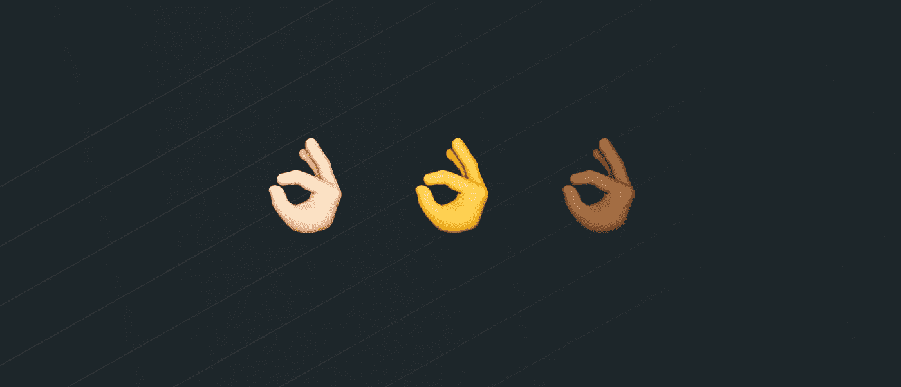
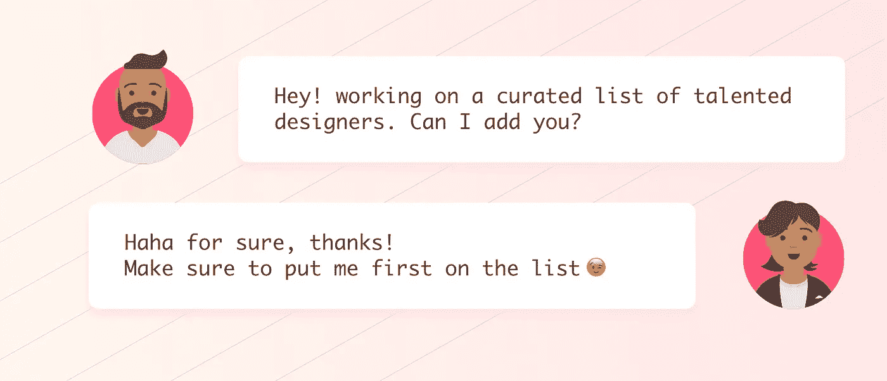

# 我的兼职项目是如何帮助我的朋友获得出色的设计工作的

> 原文：<https://medium.com/swlh/how-my-side-project-helped-my-friends-score-awesome-design-jobs-57347d888820>

## 算法公平性案例研究

两个月前，我看到我的国家以色列对产品设计师的需求上升。在过去的 5 年多时间里，对设计人才的需求非常高，但最近我开始收到比平时更多的邀请，并且发现即使在 1 或 2 个月后，接近我的公司仍然没有找到适合这个角色的合适人选。

这对我应该很好，因为它可以帮助我获得更多的项目，但通常——在接近我的 10 个客户中，只有 1 个是合适的。那我该怎么处理剩下的提议呢？我把他们介绍给同样是自由职业者的两三个朋友，尽管我知道他们有时间做这件事的可能性很小。

我决定让更多的人参考。这样，我可以给我选择不合作的公司带来价值。我想我的朋友们也希望有更多的人可以参考，所以我选择让它成为一个公共项目。

这就是[真正优秀的产品设计师](http://reallygoodproductdesigners.com)的想法是如何诞生的。这是一个来自以色列的产品设计师的策划列表，有基本的相关信息，如他们的工作状态，经验，投资组合链接和联系信息。

我开始在那里添加我的大多数设计师朋友。我有大约 10 名设计师可以毫无疑问地愉快地推荐给客户，所以我先联系了他们。问题是他们中的大多数人都被雇佣了，只有 3 个人是自由职业者。我知道我至少需要 10 英镑来启动它。所以我在几个 facebook 群中发布了这个被列入这个“天才设计师独家名单”的机会。

虽然我得到了认识我的人的一些支持，但其他人也有抱怨。主要的信息是“如果我是好是坏，你能选择谁？”“所以你要根据一个人的乏味的个人资料来决定他是否足够优秀？”等等。

我不在乎那些评论。这是一个个人项目，我觉得如果我做了一些人们不喜欢的东西，他们可以选择不使用它。我看不出做这种类型的监管有什么坏处。

我在乎的是我邀请我的朋友加入。

这让我停下来思考了一下。T2，实际上，我该如何进行排序呢？我不要人气比拼，我不要给任何人打分，我不要用这么激烈的方式把最近加的推广超过别人。一切都要公平。没人会升职。

我的解决方案非常简单:**随机选择！**

它用了 2/3 行代码，使所有事情对每个人都公平。在列表顶端的人，在不同的会话中可能在底部。

有些人因为在查看网站时被放在最底部而生气，我告诉他们刷新，这让他们脸上露出了笑容。总的来说，每个人都非常支持我，非常开心，没有人真的对我说任何不好的话。有些人非常自豪能够成为特色，他们在他们的社交媒体页面上分享了我的项目，双重利益。

解决这个问题后，我遇到了另一个问题:我选择了👌表情符号来支持这个项目的品牌。它出现在网站图标、标题和元图像中。但是后来我又开始考虑偏心了。我不想让任何肤色偏向别人。所以我做了我在上一课中学到的事情——让肤色在每一节课中随机决定。

## 结果:

总的来说，人们喜欢我的产品。我的许多朋友都从通过网站找到他们的公司那里得到了至少 5 份相关的工作机会，其中一些人甚至与非常棒的公司签了合同(哇，我改变了人们的生活！).我的个人网站的流量增加了很多，我想现在业内有更多的人熟悉我的名字和我的作品。当有人在 facebook 上发布一个设计师的职位时，或者当他们收到一个他们不感兴趣的邀请时，人们会参考这个网站。人们对它的所有怀疑，还有我对自己的怀疑，都被清除了。

## 这个故事发表在 [The Startup](https://medium.com/swlh) 上，260，100+人聚集在一起阅读 Medium 关于创业的主要故事。

## 订阅接收[我们的头条新闻](http://growthsupply.com/the-startup-newsletter/)。

