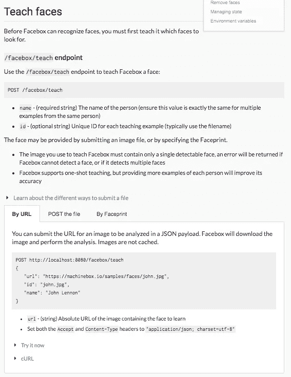

# 我的创业公司如何以开发者至上的策略成功退出

> 原文：<https://medium.com/swlh/how-my-startup-got-to-a-successful-exit-with-a-developer-first-strategy-be6c28769894>

Photo by [Ian Schneider](https://unsplash.com/photos/TamMbr4okv4?utm_source=unsplash&utm_medium=referral&utm_content=creditCopyText) on [Unsplash](https://unsplash.com/search/photos/developer?utm_source=unsplash&utm_medium=referral&utm_content=creditCopyText)

2018 年 1 月，我和另外两个人一起帮助创立了机器学习初创公司。9 个月后[我以 500 万美元卖掉了它](https://www.businesswire.com/news/home/20180910005237/en/Veritone-Acquires-Machine-Box-Extending-Capabilities-New)。我们的秘密是什么？我们把开发者放在第一位。在这篇文章中，我打算和你分享把开发者放在第一位是如何帮助你的科技项目/初创公司/公司/企业真正腾飞的。

我们使用 Machine Box 的目标是尽可能简单地构建、部署和扩展机器学习。我们把许多神奇的机器学习的东西塞进 Docker 容器，并把它们包装在一个如此简单的 API 中，以至于即使是团队中最初级的开发人员也能够构建一些令人惊叹的东西。然后，[我们让它**免费**](https://machinebox.io/account?utm_source=Medium&utm_medium=Post&utm_campaign=How%20we%20succeeded%20with%20a%20developer-first%20strategy) 给任何人试用。

# 我们专注于开发者

我们让他们优先考虑我们的产品，并确保他们在掏出信用卡之前能够评估这项技术。我们真的很努力地不让他们淹没在报价和“只是检查”电子邮件中，而不给他们一些有用的东西作为回报。

相反，我们专注于构建一些有用的东西。

我们的 API 旨在讲述一个关于产品的故事，这样我们的用户就可以从解决问题的角度来思考，而不是在无尽的文档中寻找正确的 POST 请求语法。我们努力让它们保持简单，除非用户完全认可，否则从不添加新功能。

而且成功了。

我认为开发人员喜欢下载容器，旋转它们，访问一些有趣的 API 文档。我们开源了像`[imgclass](https://github.com/machinebox/toys/tree/master/imgclass)`和 [Go SDK](https://github.com/machinebox/sdk-go) 这样的东西，以使我们的盒子更容易使用，我们[写博客文章](https://blog.machinebox.io)详细介绍如何将模型部署到不同的框架中，我们还教授如何实现机器学习的研讨会。成千上万的人注册了，非凡的反馈蜂拥而至，公司要求报价。其他人[开始发布关于集成 Machine Box 的视频教程](https://blog.machinebox.io/some-great-video-tutorials-on-machine-box-d2eb8a0a8f58)，撰写关于他们所完成的内容的博客文章，以及针对其他语言的开源 SDK[。](https://github.com/search?utf8=%E2%9C%93&q=machinebox&type=)

更重要的是，用例得到了解决，产品得到了发布。我们的客户告诉我们，我们为他们节省了时间和金钱，为市场提供了生产就绪的解决方案。因为软件无处不在，开发者也是如此。我想不出有哪个市场没有某种软件来驱动至少一部分生产力。

# 开发者在现实生活中胜出

这里有一些开发人员如何在 Machine Box 中获胜的例子，希望能展示您如何通过关注开发人员来获胜。

Borgo 先生(我不擅长使用匿名)在一家大型企业的 IT 部门工作。他的任务是重新构建产品工作流程中的数据生成步骤，以减少错误和对人工的依赖。在一次 ML 会议上，一名开发者告诉他关于分类框的事情，于是他注册了免费账户，下载了分类框，构建并测试了他的问题的解决方案，并给我写了一封电子邮件，要求获得企业许可证。Borgo 先生不是机器学习工程师，也不是数据科学家。他是一名出色的全栈开发人员，负责解决一个复杂的问题。他选择了机器盒子，因为它让他的生活轻松了许多。

LearnerVerified 背后的团队负责为他们在全国的测试中心提供新产品。用例相对简单；阻止人们付钱给他们的朋友来替他们考试。然而，解决方案可能相当复杂。他们需要用驾照上的一张照片来训练人脸识别技术，然后不断检查应试者，以确保仍然是他们。你在谈论使用完全不同的机器学习和计算机视觉技术来构建多个解决方案来解决这个用例。相反，该团队通过社区发现了 Facebox。它立即解决了他们的问题，不需要成为机器学习专家。

在多个场合，我们听到为构建资产管理应用程序的公司工作的开发人员正在构建新的机器学习驱动的工作流，这些工作流自动标记资产，使它们更易于搜索(等等)。找到我们的开发人员这样做是因为他们在整合现有的机器学习即服务(MLaaS)提供商(如谷歌、亚马逊和其他公司)时遇到了几个障碍之一。他们告诉我们，他们是通过在互联网上搜索“内部机器学习”和/或其他类似术语找到我们的。他们告诉我们，他们喜欢的是，他们可以免费下载我们的盒子，在本地运行它们，并开始构建集成，所有这些都无需联系某种销售部门。当我们收到他们的消息时，他们已经决定使用机器盒子。[根据 CEB](https://news.cebglobal.com/B2B-marketing-stats) 的调查，在首次联系销售代表之前，买家通常已经完成了 57%的决策过程。*

这就是赋能开发者的力量！

# 那我们为什么要卖呢？

因为开发者体验是尖端，我们看到了一个探索用 [Veritone](http://www.veritone.com) 交付更完整解决方案的大好机会。我们有一个真正的机会将开发者第一的思想与一个健壮的平台结合起来，这个平台迎合了我们最初只能梦想支持的东西；企业级，有 SaaS 选项，协调我们的模型与其他模型，通常向最需要的人提供交钥匙解决方案。

> 我们仍然可以把机器盒子作为 Docker 容器直接交付给开发者，但是我们现在也可以选择把它和更多的东西结合起来。

我从这次经历中学到的是，我们正处于开发者的时代，在很多方面，他们掌握着未来的钥匙。他们的支持和鼓励让我受宠若惊。

我也想[鼓励你们](https://www.veritone.com/developers/)加入我们正在建造的这个人工智能平台的底层。对于开发人员在 aiWARE 基础上构建伟大的东西所能解决的大量问题，我们实际上只是触及了皮毛，我们很乐意听取您的想法和反馈。

# 接下来是什么？

对于我简陋的创业公司，我们已经找到了继续思考开发人员和他们的经验的完美地方。亲爱的读者，我留给你这个离别的想法；[全球大约有 1820 万](https://www.computerworld.com/article/2483690/it-careers/india-to-overtake-u-s--on-number-of-developers-by-2017.html)软件开发人员，这一数字预计到 2019 年将上升至 2640 万，增长 45%。这是地球上增长最快的劳动力。明智的做法是~~崇拜我们未来的霸主~ ~承认他们的重要性。

附言——[介质不支持删除线。](https://help.medium.com/hc/en-us/articles/226935767-Can-I-use-strike-through-)

## 这篇文章发表在 [The Startup](https://medium.com/swlh) 上，这是 Medium 最大的创业刊物，有+ 378，907 人关注。

## 订阅接收[我们的头条新闻](http://growthsupply.com/the-startup-newsletter/)。

