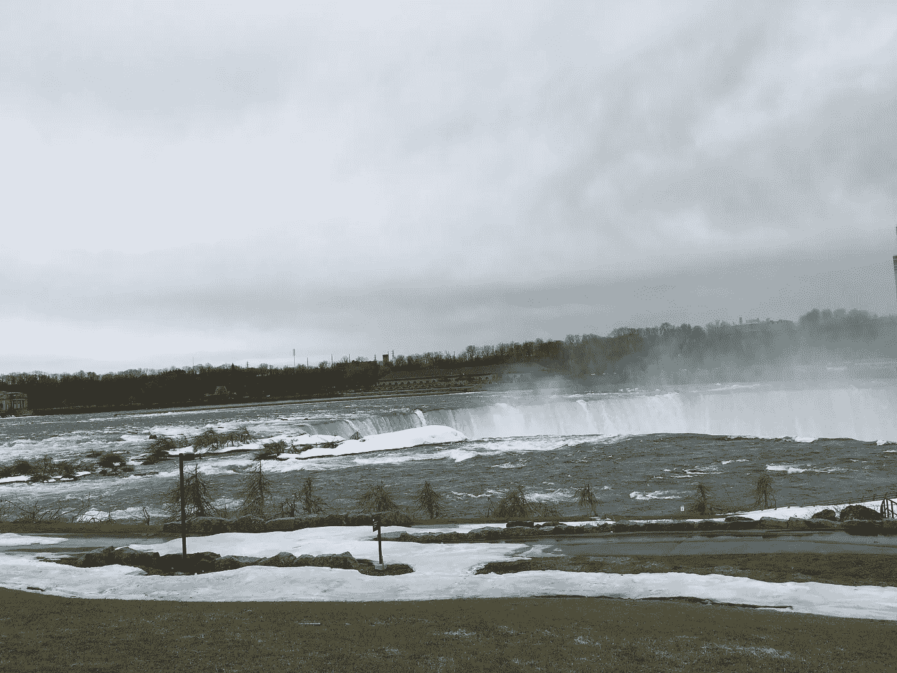

# 大自然是如何提醒我身份的

> 原文：<https://medium.com/swlh/how-nature-reminded-me-about-identity-917922299fda>

上周末的静修中，与大自然在一起让我想起了力量和美丽，那来自于意识到自己的身份并忠实于它。

首先，我所说的撤退是什么意思？对我来说，今年的静修是每个月花几天时间远离尘嚣。花时间和我自己，我的想法和现在在一起。没有责任，没有计划，没有结构。一个从外部断开连接到内部重新连接的机会。

我带了一个密友去静修。我们计划顺其自然。是的，讽刺是显而易见的，但是计划无计划的时间的需要已经成为我们两个现代生活方式的现实。拥有无组织的时间，哪怕只有几天(T1)，与我日常生活方式完全相反，在日常生活中，一切都是有计划、有目的或有成效的。正是因为这个原因，我发现走向另一个极端是有用的(至少偶尔！).

周五早上，我们在多伦多上了一辆车，不知道要去哪里，要做什么，要呆在哪里，或者会发生什么。我们开车向南，没有真正讨论或决定，也许不自觉地希望天气变得暖和一些。在穿越加拿大-美国边境时，我们了解到我们打算做的事情是多么具有革命性。*“你不知道你要去哪里，要呆在哪里是什么意思？你可以看到这看起来有问题，对不对？”*，边境官员问道。我们被叫去做进一步的询问，在对警官完全坦诚之后，我们不禁自嘲。

我们探索了我们从来没有注意过的城镇，尽管它们就在我们的后院。我们很快发现去哪里并不重要。花时间与我们自己和我们的思想在一起是如此丰富和充实的经历，以至于外界的环境或活动变得不那么重要了。我们能够从我们观察到的许多人、地方和道路中获得灵感，仅仅是因为好奇。

尼亚加拉瀑布就是这样一个地方。特别是瀑布的“美国一侧”。你看，我们在加拿大长大，以前曾无数次去过瀑布的加拿大一侧，但从来没有好奇过，直到现在，去看看我们觉得很熟悉的东西的另一面。当我沿着瀑布散步时，我发现自己很自然地将美国和加拿大进行比较。

然后我闭上了眼睛。陷入了某种冥想状态，只用我的耳朵体验着坠落。站在瀑布附近，我只听到一声雷鸣和吼声。强烈而持续，似乎没有尽头。

然后一个想法出现了。我站在瀑布的哪一边并不重要。瀑布只关心存在本身。如此专注于自身，它不受任何其他事物的阻碍。不管我可能在做什么，我可能站在哪里，我可能在想什么，它总是大声而自豪地做着自己的事情。它一点也不担心。可能是晴天也可能是雨天。游客可能很多，也可能很少。它只是继续流动。它也不试图取悦任何人或为任何人改变自己。它在闲暇时以自己的方式改变。

在更深的层面上，对我来说，这是一次美丽的经历，因为我观察到瀑布是以它自己的身份为基础的。这就是大自然真正的美所在。每当我与大自然在一起时，无论是在海洋中还是在山里，我都会想起忠于自我意味着什么。

当我们了解自己，并且能够无所畏惧地做真实的自己时，我们所有的美都会闪耀出来。这激励着我们周围的人也要忠于自己。就像那样，我们都走来走去，立足于我们自己的身份，真实地做我们自己，欣赏他人身上真正的美。

— -

 [## 冰山教会了我什么是谦逊

### 最近，我发现自己在冰岛呆了几天，在去欧洲的途中进行了一次自发的最后一刻的冒险…

medium.com](/find-focus/what-an-iceberg-taught-me-about-humility-cc7ee2c7505)  [## 看着蝴蝶的眼睛

### 上周末，我和一个朋友在城市北部徒步旅行，虽然我沉浸在大自然中，这是…

medium.com](/find-focus/look-into-the-eyes-of-a-butterfly-8a80225b6bd8)  [## 学会无所畏惧:一步一个脚印

### 我花了一个漫长的周末去哈德逊谷做了一次随机的、最后一刻的旅行。这是绝对美丽的，它是…

medium.com](/find-focus/learning-to-be-fearless-one-step-at-a-time-f44a1b0b26b1)  [## 摆脱债务

### 最近，在澳大利亚出差的时候，我进行了几天的自我静修，学习如何摆脱债务…

medium.com](/swlh/climbing-out-of-debt-e76dad248357) 

— -

Kunal Gupta 是 [Polar](http://www.polar.me) 的创始人&首席执行官，Polar 是一家技术平台提供商，其使命是实现优质内容的商业模式。Polar 的合作伙伴包括全球主要媒体出版商，该公司在多伦多、纽约、伦敦和悉尼设有办事处。

Kunal 热衷于在现代寻找平静和专注。库纳尔是加拿大领先的精神健康医院和研究机构 [CAMH](http://www.camh.ca) 的董事会成员。他定期在他的博客 findfocus.today 上写关于领导力、正念和技术文化的话题。

你可以在 [LinkedIn](https://ca.linkedin.com/in/kunalfrompolar) 上和他联系。

## 这篇文章发表在 [The Startup](https://medium.com/swlh) 上，这是 Medium 最大的创业刊物，有 314，551+人关注。

## 在这里订阅接收[我们的头条新闻](http://growthsupply.com/the-startup-newsletter/)。

