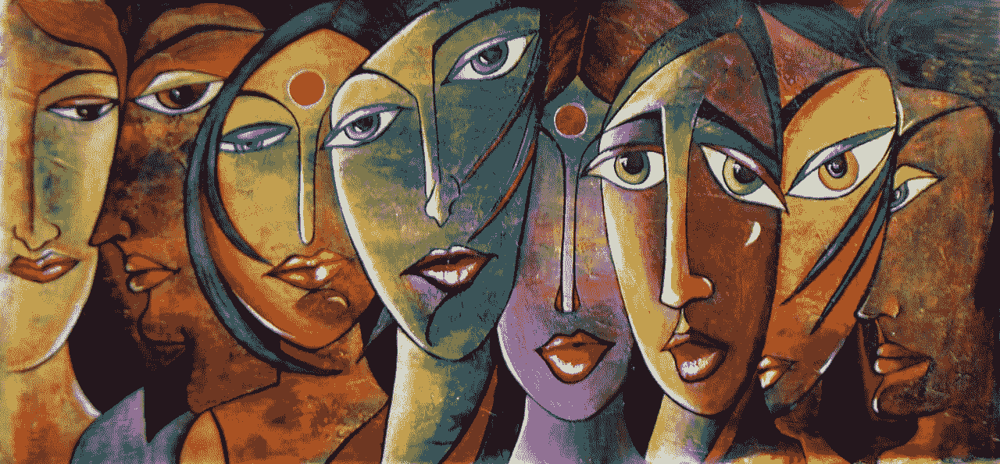

# 负面情绪如何帮助你成为不可阻挡的力量

> 原文：<https://medium.com/swlh/how-negative-emotions-can-help-you-become-an-unstoppable-force-98b12250aaac>

Photo Credit: www.fizdi.com

人类非常复杂。你的动机可能对我没用，反之亦然。鼓舞人心的视频很好，但它们就像激励的可卡因——这意味着在你发现自己需要更多之前，它们的高潮会持续大约五分钟。

真正的动力需要来自更深层的地方，而不是加里·维纳查克的嘴里。那不是一次机会…