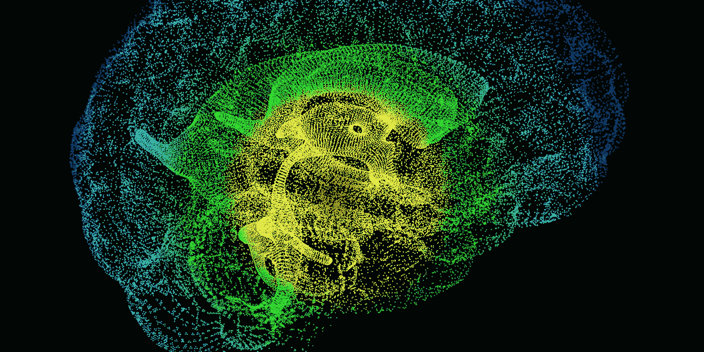
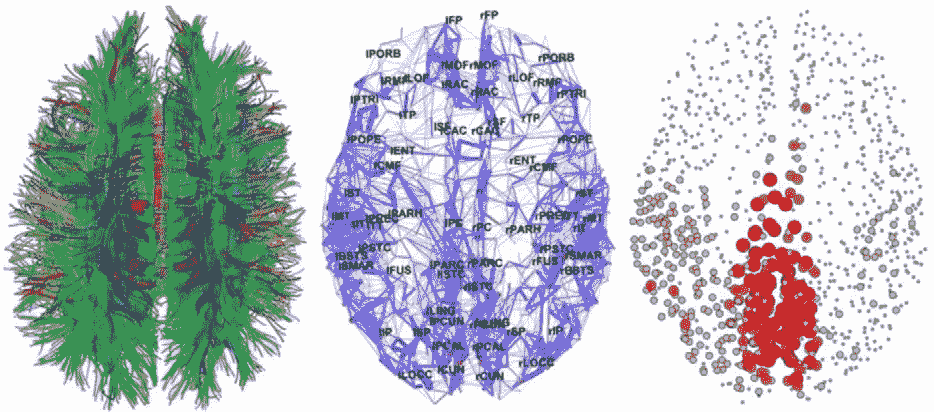
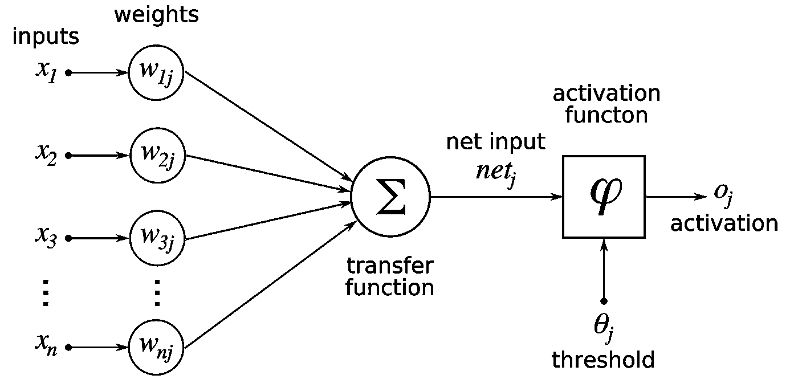
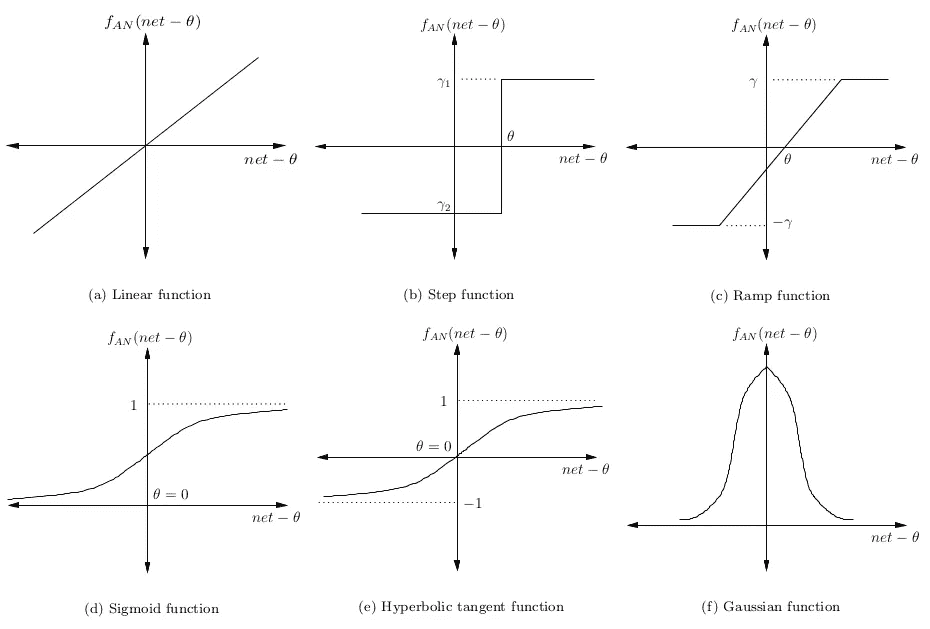

# 神经科学如何实现更好的人工智能设计

> 原文：<https://medium.com/swlh/how-neuroscience-enables-better-artificial-intelligence-design-5d254098470b>

人工智能(AI)正在以光速发展。

人工系统能够在许多层面超越人类专家:处理数据、分析法律文件、解决魔方，以及赢得古代和现代的游戏。

他们可以写出与人类无异的文字，进行研究，创作流行歌曲，在多种语言之间翻译，甚至创作和评论艺术。

人工智能驱动的任务，如物体检测、语音识别和机器翻译，每天都变得越来越复杂。

这些进步可以归功于许多发展，从统计方法的改进到计算机处理能力的提高。但是一个经常被忽视的因素是科学和工程的结合:理论和实验神经科学的使用。

神经科学对人工智能的发展做出了几个关键贡献。这两项研究有着漫长而复杂的历史，因为它们有许多相似之处。

> *“认知神经科学家和计算机科学家试图回答的基本问题是相似的，”*麻省理工学院的奥德·奥利瓦说。他们有一个由组件组成的复杂系统，其中一个叫做神经元，另一个叫做单元

要建造超智能机器，我们必须对人脑有更深入的了解。同样，探索人工智能可以帮助我们更好地了解我们自己的大脑在想什么。

确定两个领域之间的共同语言将创造一个“*良性循环，通过共享的理论见解和共同的经验进步来加速研究，”谷歌 [DeepMind](https://deepmind.com/) 的创始人[戴密斯·哈萨比斯](http://demishassabis.com/)写道*

原因如下:

# 早期

## 神经科学简史

**什么是神经科学？**

神经科学是基于对人脑的解剖和生理研究的一个生物学分支，包括**结构**、**神经元**和**分子**。

它研究大脑如何在机械、功能和系统方面工作，以创造可识别的行为。

今天深度学习(人工智能的一个子集)的成功主要归功于它的架构，而不是它与人脑的相似性；然而，建立一个反映人脑模拟的系统是人工神经网络(ann)的起点。

事实上，人工神经网络的主要发展很大程度上依赖于心理学和神经生理学部门的突破和成就。

**什么是人工神经网络？**

人脑是生命中最大的谜团之一。尽管研究了几个世纪，但直到今天，科学家们还没有就其工作原理达成明确的共识。

两个主要理论如下:

[祖母细胞理论](http://en.wikipedia.org/wiki/Grandmother_cell)，提出单个神经元能够保留密集信息并代表复杂概念。

相比之下，第二种理论认为单个神经元相当简单，处理复杂概念所需的信息分布在多个神经元中。

人工神经网络大致遵循第二种理论。

人工神经网络是生物大脑的一个简化的计算模型，而不是一个修补玩具建筑可能是一个真实的[吊桥](http://(https://www.knexusergroup.org.uk/en/image_k56539model6.html))的模型。

基本上，人工神经网络是一种检测模式的方法。举一个非常简单的例子，想象一台机器只能做一件事，即判断一个数字是否是 3。

所以，它只有两个输出:真和假。

机器的输入是从 0 到 9 的任何数字，如果它工作正常，当输入是 3 时，它给出真的输出，当输入任何其他数字时，它给出假的输出。稍微复杂一点的机器可以有十种不同的输出，每种输出代表一个数字。

但是，你可能会问，我们如何让数字进出人工神经网络？实际上，这很简单。还记得电子表和计算器上那些笨重的旧显示器吗？

他们只用了七个单元，可能开也可能关。因此，只要我们在数据段的表示顺序上达成一致，每个数字都可以被捕获为一系列的 7 个 0 和 1。

它们可以用来模拟大脑行为，以便认知神经科学家可以测试他们的理论模型是否产生与生物神经网络给出的响应一致的输出。

人工神经网络由许多相互连接的单元或人工神经元组成。每个人工神经元都与其他几个神经元相连，并可以沿着这些连接传输信号。

权重与每个连接相关联，并影响神经元之间传输的信号强度。这些权重将在学习过程中增加或减少，类似于生物大脑中“可塑性”的突触强度的变化。

网络中的单元通常分为三类:**输入单元**(这些接收待处理的信息)**输出单元**(这是发现处理结果的地方)和**隐藏单元**，它们位于前两类之间。

这些被排列成层，在最简单的情况下，在输入和输出层之间只有一层隐藏单元。来自一层的信号将作为输入传播到下一层，或者通过输出单元离开系统。

人工神经网络模仿生物大脑，通过学习获取知识，并通过调整网络中的权重来存储这些知识。

然而，一些专家认为，相似之处更多的是松散的灵感，因为生物神经元远比人工神经元复杂。

人工神经网络的历史包括来自不同学科的科学家的贡献，包括认知心理学、生物神经科学和数学。

在心理学中，联想主义是一个重要的前身，其遗产可以追溯到亚里士多德。

一个关键的起点是神经生理学家沃伦·麦卡洛克和数学家沃尔特·皮茨在 1943 年写的一篇论文，通过使用电路模拟初级神经网络，描述了大脑中的神经元可能如何工作。

1949 年，心理学家唐纳德·赫布借鉴了联想主义的观点，发展了一种学习理论，表明大脑中的生物运作如何解释更高层次的认知行为。

根据 Hebb 的说法，如果一个神经元重复刺激第二个神经元，那么它们之间的联系将会加强——这就是用人工神经网络中的权重表示的突触强度的概念。

# 插曲

因此，人工神经网络遭受了不切实际的炒作，也遭受了在人工智能中实际有用的不够强大的计算资源。

与此同时，人工智能中的机器学习工作提供了替代的学习模型，这些模型似乎很有价值，比如隐马尔可夫模型。

然而，与此同时，训练具有不止一个隐含层的人工神经网络的任务也取得了一系列进展。这种多层导致深度学习变得越来越可行(即，在训练时间方面)和准确。

这得益于在 Nvidia GPUs 上训练深度神经网络(2009)。

在一个相对独立的研究领域，认知心理学家正在探索可以用联想结构来解释的想法联想。

认知科学和神经科学都经历了多年的发展，最近它们开始重叠。

**认知科学**

认知科学是人类心理学的一个分支，实际上是对认知或思维的研究。它包括语言、解决问题、决策和感知，尤其是有意识的理解。

认知科学从那些可观察或可测试的高级行为特征开始，并询问头脑或大脑内部发生了什么使之成为可能。

这里面有联想主义。联想主义是最古老和最广泛持有的思想理论之一。

**联想主义**

> *“因此，当我们完成一个回忆的行为时，我们通过一系列特定的先驱运动，直到我们到达一个运动，在这个运动上我们所追求的是习惯性的结果。因此，我们也是在思维列车中搜寻，从现在或其他事物中，从相似或相反或相邻的事物中进行构思。通过这个过程，回忆发生了。因为在这些情况下，这些运动有时是同时的，有时是同一个整体的一部分，所以随后的运动已经完成了一大半。”*

哲学家亚里士多德的这段话被视为联想主义的起点。

联想主义认为，我们的大脑是一组由联想组成的概念元素。

亚里士多德研究了记忆的过程，并回顾发展了四条联想定律:

**邻近性**:在空间或时间上接近的事物或事件往往会在头脑中产生联想。

**频率**:两个事件发生的次数与这两个事件之间的关联强度成正比。

相似性:想到一件事往往会引发对类似事件的思考。

**对比**:对一个事件的思考往往会引发对一个相反事件的思考。

亚里士多德认为这些定律等同于常识:也就是说，草莓的综合感觉、气味和味道等同于草莓。

这些 2000 多年前提出的定律仍然是今天机器学习方法的基础。

**关联结构**

关联学习是一系列相关的观点，其中一个人学习将一件事与另一件事联系起来，这是由于以前的经验。例如，我们把大海和沙子联系在一起。

因此，关联结构定义了连接这两个概念的纽带。

有一种可靠的心理关系将它们联系在一起，引用一个会自动激活另一个(反之亦然)，而不需要引用任何其他东西。

**连接主义**

连接主义是认知科学中的一个运动，它通过使用人工神经网络来解释智力。

联结主义是有趣的，因为它提供了一个广泛持有的理论的替代品，该理论认为大脑类似于处理符号语言的数字计算机。

# 我们现在在哪里

2012 年，使用 GPU 和深度学习进行图像识别的工作迎来了“深度学习革命”，为我们带来了无人驾驶汽车、人工智能助手 Siri 和 Alexa、谷歌翻译等创新。

今天，人工神经网络被用于多种应用，基于一个基本的(但有时是不正确的)假设，即如果它在自然界有效，它在计算机中也会有效。

然而，人工神经网络的未来取决于硬件的发展，这些硬件被指定用于最终用途，就像深蓝的情况一样。

人工神经网络发展研究相当缓慢。由于处理器的限制，今天的神经网络可能需要数周才能学会。这让我们想到了认知神经科学最近对人工智能的影响。

# 人工智能的局限性

机器学习算法是用狭窄的数学结构建立起来的。通过数百万个例子，人工神经网络学会完善它们的连接强度，直到它们能够高精度地完成任务。

因为每种算法都是为手头的任务量身定制的，所以重新学习一项新任务通常会抹去已建立的连接。这导致了[灾难性的遗忘](https://singularityhub.com/2016/06/19/how-to-build-a-mind-this-learning-theory-may-hold-the-answer/):当人工智能学习新任务时，它会覆盖之前的任务。

持续学习的困境只是一个挑战。其他的更不明确，但可以说对培养灵活的、有创造力的头脑更重要。

具身认知是一个大问题:通过感官和运动体验与世界互动来构建知识的能力，并由此创造抽象思维。

这是人类拥有的一种常识，一种难以描述的对世界的直觉，但对我们面临的日常问题极其有用。

更难编程的是像想象力这样的特征。这就是局限于一个特定任务的人工智能真正失败的地方。想象力和创新依赖于我们已经建立的关于我们世界的模型，并从中推断出新的情景。

# 神经科学如何有所帮助

首先，神经科学可以帮助验证现有的人工智能技术:如果我们发现一种算法模仿大脑中的现有功能，这不一定意味着它是计算系统的正确方法——但它确实表明我们发现了一些重要的东西。

神经科学还可以为创造人工大脑时采用的新算法和架构提供各种复杂的灵感来源。

也可能是来自认知心理学的更世俗的观察，例如人类会忘记对他们不重要的事情。

但是，尽管基于逻辑的方法和理论数学模型主导了人工智能的传统方法，但神经科学可以通过识别对认知功能至关重要的生物计算类别来补充这些方法。

人工智能研究的另一个关键挑战是迁移学习。为了能够处理独特的情况，人工智能代理需要能够参考现有的知识来做出明智的决定。

尖端研究正在进行，以了解这如何可能在人工系统中实现。例如，一种被称为“渐进网络”的新型网络架构可以利用来自一个视频游戏的知识来确定另一个。这表明人工智能研究有巨大的潜力向神经科学学习。

另一方面，神经科学也可以从人工智能研究中受益，就像强化学习一样。尽管现代神经科学拥有强大的成像工具和光遗传学，但它才刚刚开始揭示神经网络如何支持更高的智能。

[哈萨比斯写道,](http://www.cell.com/neuron/fulltext/S0896-6273(17)30509-3?_returnURL=http%3A%2F%2Flinkinghub.elsevier.com%2Fretrieve%2Fpii%2FS0896627317305093%3Fshowall%3Dtrue#references)将智能提取到算法中，并将其与人脑进行比较,“可能会产生对一些最深刻和最持久的心灵奥秘的见解。”。

这种相互投资对这两个领域的进展至关重要。研究人员可以探索神经科学，以寻求开发人工智能和推动科学发现。

将人工智能与神经科学相关联进行研究，可以帮助我们探索生命中一些最大的奥秘，如创造力、想象力、梦想和意识。

最好的还在后头。