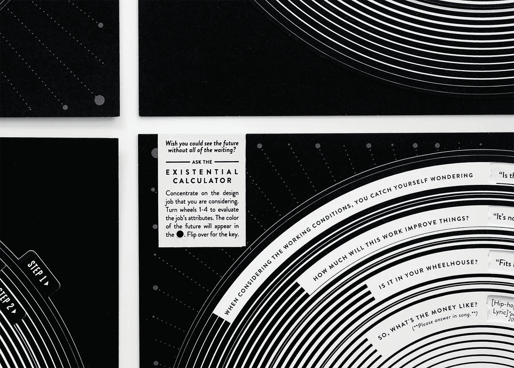
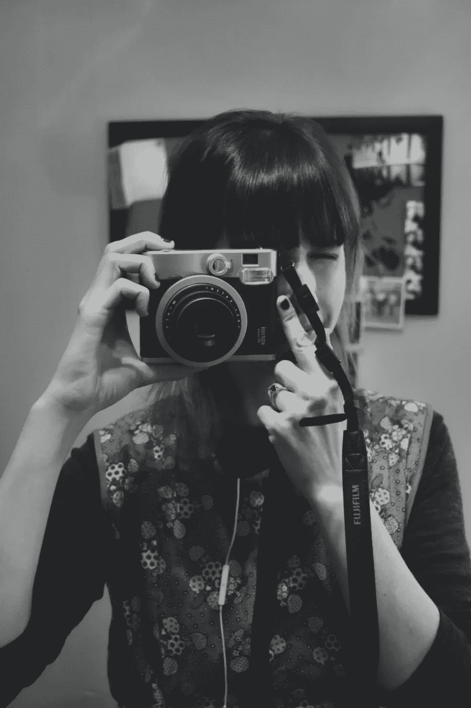
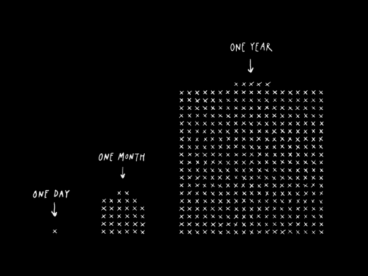

# 如何不做重大决定

> 原文：<https://medium.com/swlh/how-not-to-make-a-big-decision-de86c8eabf1>

Photo by [Nicholas Kampouris](https://unsplash.com/photos/ZIW_wcbjKLw?utm_source=unsplash&utm_medium=referral&utm_content=creditCopyText) on [Unsplash](https://unsplash.com/search/photos/decision?utm_source=unsplash&utm_medium=referral&utm_content=creditCopyText)

当我面临一个重大决定时，我倾向于尽我所能去解决问题。我希望将决策树形象化，写下一个完整的赞成/反对列表，并与任何愿意倾听的人就所有的可能性以及这些可能性之外的可能性进行长时间的讨论。我想问宇宙、塔罗牌或凯利·安德森的职业选择者我应该做什么。

*Kelli Anderson’s* [*Existential Calculator*](https://kellianderson.com/blog/2013/10/14/the-existential-calculator/)

我现在正盯着一个相当大的决定(我还不能详细说明，也不要把工作选择当成一个暗示)。我其实已经下定决心了。但是，我现在并不满足于这个决定，而是试图说服自己不要这么做。因为…大脑。所以我展望未来——比如五年后的未来，试着想象为什么我今天做的事在 1825 天后可能是不好的。

当我在思考我潜在的未来和潜在的失败时，我在听设计师马蒂亚斯·科里亚的播客。他谈到了他最近的南美摩托车之旅，说道:

> “最大的认识是没有大的认识。在我们生活的每一个领域——都是一天一天的慢慢来。我们总是试图预测未来，我们总是试图提前计划，认为我们知道如何和在哪里结束。在现实中，我发现如果我提前一两天计划，我可以管理我的期望，而且，这也更现实。不能推。”

同样的建议我已经听过上百次了——活在当下，关注当下。它以前从未卡住过。但是马蒂亚斯的故事让我意识到，我完全不知道五年后会发生什么事情。我几乎不知道五天后会发生什么。关注遥远未来的结果是如此的不可靠，以至于毫无意义。这不应该成为决定的因素。

因为，真的，当我回想起来，我生命中发生的所有好事都是命运的偶然。就像当我在巴黎接受美国国务院的实习时，我以为我开始了公共服务的生活。但是当政府弄丢了我的文件并取消了我的旅行时，我匆忙找到了一份新的文案实习，这导致了我六年后仍然拥有的职业生涯。我通过即兴表演认识了我的未婚妻，我开始这样做是因为我想在大学毕业后交新朋友。走另一条路会导致不同的结果，可能是同样好的结果，如果不同的话。

这让我想起了[丹尼尔·门德尔松](https://www.nytimes.com/2018/01/04/books/review/daniel-mendelsohn-by-the-book.html)在他的《NYT》一书中所说的话:

> “信件和日记显示的是，当我们生活在其中时，我们的大部分生活基本上是一团乱麻，因为我们大部分时间都被日复一日的事情缠住了；一旦一切结束，传记作者们就可以看到轮廓了。”

在我们的日常生活中，我们没有——也不可能——有所有的答案。但令人欣慰的是，我们不需要这么做。相反，我们只需要专注于前进，寻找挑战自我的新方法。

我很喜欢奥斯汀·克莱恩前几天在他的博客上写的话:

> “创作之旅并不是最终你在某个神秘、快乐的异国他乡醒来。创意之旅是你每天醒来都有更多工作要做的旅程。”

*via* [*Austin Kleon*](https://austinkleon.com/show-your-work/)

因此，这个决定不是关于哪条路会导致“更好”的结果。相反，决定在于知道无论哪种方式，都将有更多的工作要做。有鉴于此，问题就变成了——我更愿意做哪项工作？

每周一，我都会发表一篇新文章，帮助你获得灵感，掌握有限的时间，建立可持续的创作习惯。 [**报名获取灵感**](http://immakingallthisup.com) 。

## 这篇文章发表在 [The Startup](https://medium.com/swlh) 上，这是 Medium 最大的创业刊物，有 306，372+人关注。

## 订阅接收[我们的头条新闻](http://growthsupply.com/the-startup-newsletter/)。

