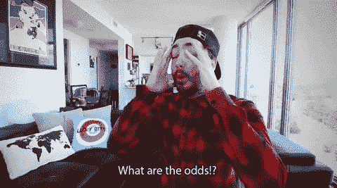

# 一个牛逼的 Reddit 帖子如何在不到 3 小时内产生 170 个新客户

> 原文：<https://medium.com/swlh/how-one-badass-reddit-post-produced-170-new-customers-in-under-3-hours-216abbb5e56c>

这是关于推广你的全新业务或服务的事情—

我们都需要确认，人们不仅想要我们的服务，而且愿意为此付费。

因此，获得最初的几个客户对于树立你走在正确道路上的信心至关重要。

但是，让我们诚实地解释为什么我们实际上在推销自己。

一切都是为了钱和控制，对吗？

你获得的客户越多，你潜在的利润就越多。

见鬼，除了有额外的收入，通过创造客户组合和成功的案例研究，你可以过渡到做这种全职工作，按照自己的方式生活。

## 但是初创公司和自由职业者在起步阶段有两个大问题需要解决

## **# 1——我从哪里开始？
# 2——我在哪里可以找到客户？**

我们已经报道了 30 名企业家如何找到他们的第一个 100 名顾客。

但是现在，让我们来看看一个人使用的大胆方法，这个方法在不到三个小时的时间里导致了超过 170 个对他的服务的请求。！！).

这种“大胆的做法”发生在哪里？
Reddit。

*啊嘣……*

这个勇敢的 Redditor 的名字？亚历克斯·克拉克。

Alex Clark’s Glamour Shot

在本文中，我们将分解:

*   亚历克斯为了让自己脱颖而出必须克服的精神障碍
*   他在 Reddit 帖子中使用的文案策略
*   他如何战略性地利用免费工作为自己谋利(是的，你也可以)
*   亚历克斯离职后的机遇

# **你会失去什么？**

让我们给你一些关于亚历克斯·克拉克的背景信息。他曾是一名经理和教师，先是在韩国，后来到台湾，现在仍住在那里。

他开发了一款 MVP 应用，开发成本接近五位数。然而，在完成这个应用程序后，他对这个项目失去了所有的兴趣。

它发生了。

所以他把重点放在了学习文案上。但他需要得到关于文案是否是一个可行的职业选择的真实反馈。

因此，他向专业文案撰写人 Sean Ogle 和 Derek Johanson 寻求职业建议。

Sean Ogle from [LocationRebel.com](https://www.locationrebel.com/)

你猜怎么着？
他们回答得很快。

他们给了亚历克斯令人惊叹的支持性的电子邮件回复(他把这些打印出来并裱在墙上)。

之后，他全力以赴学习说服性文案的艺术。

他为此工作了三个月。他全神贯注。他练习过。他研究过。

但是他需要积累一些经验。

于是他做了一个决定。

该是谈正事的时候了，为了真正做成一些生意。

他必须测试自己的技能，以确保企业主确实需要他的服务。

所以他去了成千上万的企业家每天都去的地方:Reddit。

***呜哇。稍等片刻—*T3**

我们都知道 Reddit 可能是一个残酷的地方。
Reddit 拥有活跃的受众，他们愿意参与任何对话。

但如果你试图在平台上自我推销，它也会让你陷入火海。

Life of a Marketer on Reddit. From personal experience, this is pretty damn accurate.

这就是为什么企业主和营销人员避免在 Reddit 上推广，就像你避免和你的祖父母谈论政治一样。

正如 Reddit 推广专家 Si Quan Ong 在最近的一篇文章中所解释的:

> Reddit 是一个以摧毁自私自利的营销人员而闻名的网站。是的，[推销你自己或你的服务]是很可怕的。是的，他们可能相当恶毒。但是不要让他们阻止你升职。
> 
> 如果你真的有很棒的内容，并且你所渴望的是帮助社区和增加价值，不要让一些反对者把你打倒。"

换句话说，如果你对社区有所贡献，不要害怕把自己放在那里。

这正是亚历克斯所做的。

用亚历克斯自己的话说:

> *“作为一名销售人员，我关心人们的想法，但不想被人发现。但后来我意识到，如果你有一套很好的技能……你不一定要成为最好的……而人们正在努力掌握这些技能(你已经学习并磨砺过了)——这有助于你说“去他妈的”，并反驳让你“不要成为那个人”的声音”*

现在，除了不得不做出艰难的心理转变，想象一下，由于你创建的应用程序债务越来越多，而你不想再继续下去，你已经走投无路了。

这就是亚历克斯的现实。

在这种压力下，他不会让一些反对票和恶意评论阻止他至少尝试使用他自信的技能来改变他的处境。

Bring it, Reddit.

因此，让我们来看看 Reddit 上的帖子，该帖子在不到三个小时的时间里就产生了超过 170 个对 Alex 文案服务的请求。

# 崩溃

There you have it in all its glory: the [Reddit](https://www.reddit.com/r/EntrepreneurRideAlong/comments/6ygjtx/heres_a_stupidly_simple_way_to_write_a_landing/) post that produced 170 leads in a few hours.

# 用标题吸引他们:

正如 HubSpot 所说，“标题是销售内容的工具。虽然标题不是一篇博文的唯一重要元素，但它通常是潜在读者对你的内容的第一印象。”

第一印象可能是:
**“嗯……也许我会点击链接继续阅读。”** **或“不！”**

为了吸引他的观众，Alex 介绍了一项具有明显优势的服务:**节省时间和精力。**

# 第一行:

他正在提供他知道这个论坛上的观众渴望得到的服务。

亚历克斯也知道这个特殊的群体喜欢自举。所以“不花一分钱”这句话对他的观众来说听起来很吸引人。

# 第 2–10 行:

现在他列出了雇佣他的所有好处:

他喜欢有说服力的文案。
他喜欢将“轮胎踢球者”转化为付费顾客的词汇。他研究并练习他的手艺。他愿意免费做这件事。

如果他很烂，你(客户)就损失了一点时间和金钱，你会知道和这个家伙“再也不会”了。

如果他很棒，你已经免费“雇佣”了一个人来填补你的底线。

# 第 11 行:

你听说过布莱恩·迪恩的[“斗旅”](https://backlinko.com/seo-copywriting)吗？【Copyblogger 的[“内部悬念”](https://www.copyblogger.com/internal-cliffhangers/)怎么样？
那[“油滑复印”](http://websitecopywritingservices.com/blog/bucket-brigade-copywriting/)呢？

它们都是描述 Alex 用这条线做什么的不同术语。

正如布莱恩·迪恩所解释的那样，“这对你来说意味着什么？” 是让人们继续阅读——并让他们在你的页面上停留更长时间的短语之一。这方面的一些其他例子:

**看。想象一下。**
**我们都去过。**
**你说得对。**
**然后它击中了我。**

这样的例子不胜枚举。这些都是吸引人们停留在你的页面上并阅读整个广告、帖子或文章的强大术语。

这有什么关系呢？

你页面的阅读时间越高，谷歌就会认为你的文章越有价值。

这相当于提升你网站的排名。不客气，SEO 爱好者们。

# 第 12–19 行:

关于这一部分有几点:

亚历克斯用粗体突出显示了“免费”一词。

这个词对所有企业主来说都是一种诱惑，尤其是资金紧张的初创公司。

然后，他清楚地定义了自己的能力和目标:

> ***“更好的转换，而不是‘创意写作’”***

同样，这句话适用于任何希望发展业务、增加利润的企业家。

他将目标受众定义为刚刚起步的“小人物”。

如果一个 CMO 人要找他，他肯定会接受。

但在他所面对的特定受众中，他知道自己会发现更多的创业公司，而不是首席营销官。

# 第 20 行:

又是那种油滑的文案/内部悬念。

# 第 21–34 行:

首先，我们喜欢这种“敢于”忽略他的信息的暗示。很难忽视这一点。

第二，他列出了你能期待的一切。

怎么会？

通过重申你没有给他**任何报酬**来创造一个能:

*   让你赚钱或者
*   建立您的电子邮件列表或
*   创造更多销售机会

换句话说，这笔交易对你(T4)来说是有利的。

# 第 35 行:

最后，他捅了捅熊，带着小 FOMO 开回了 CTA。

干得好。

# **战略性地做免费工作的好处**

我们可以看到你看完这个标题后翻白眼。新手，把你的自负放在一边，听我们说完。

像亚历克斯那样免费宣传你的服务有什么意义呢？

## **1。它给你认可。**

也就是说，确认人们想要你的服务。

Alex 的帖子上线三个小时内就有 170 人联系他，我们可以说他获得了进一步发展业务的绿灯。

## **2。它产生了一些客户，你可以用它们作为案例研究和/或社会证明，证明你的服务帮助了他们:**

*   获得新的销售线索
*   增加销售额
*   将“轮胎踢球者”转化为客户
*   更多

潜在顾客/客户喜欢证据。
给他们看看。

## **3。** **专注于自己想专注的事情。**

当你刚开始的时候，你可以广泛地做电子邮件文案、长篇销售页文案、脸书广告文案等。

试水之后，你可能会发现长篇销售页文案是你的强项。

这是你最喜欢的。

Lock it in and focus.

通过细分到这个框架中，你可以开始营销和定价你的专业服务。

## **4。深入了解你的客户甚至不知道他们缺少的需求和服务。**

如果你是这个领域的新手，做免费工作对你来说是了解客户运作幕后的绝佳机会。

你将会发现:

*   他们的业务目标是什么
*   你还能提供哪些服务让他们的生活更轻松，换句话说，就是追加销售的可能性。

侦察人员。

这么想吧-

当你从里到外了解客户的挫折和目标时，你就可以轻松地撰写销售文案，联系并解决他们的具体问题。

当你的理想客户读到它时，他们会对自己说，“你好像在读我的想法！”

当他们需要你的服务时，你会是他们最关心的人。

## **5。创造追加销售的机会**

让我们来充实一个例子。

一个客户让你为他们在脸书的广告写一份有说服力的文案。

好吧，酷。

但是你也有经营脸书广告活动以锁定他们的理想客户的经验。

你好，促销。

因此，你认为是 250 美元的一次性服务变成了每月 750 美元+咨询工作的销售佣金。

还需要更多证明吗？

在获得这种体验之前，看看你可以写的冷冰冰的外联邮件:

现在看看你在有了**一个**免费客户后可以写的，你已经侦察过了:

哪一个是容易的 ***“地狱耶！”*** 为客户端？
正是。

# 亚历克斯后来怎么样了？

在我们离开他的地方，刚刚在 Reddit 上发帖，他还没有过上球员的生活…还没有。

他回复了所有 170 个向他求助的人。有些是“驴子线索”有些是好的。

他写了些东西，做了些咨询。
而且不仅仅是免费。他从中获得了两个付费客户。

***呜呜！***

但是他的故事并没有就此结束。

> “运气就是当准备遇到机遇时发生的事情”——塞内卡

一家公司的猎头突然在网上找到了他的资料。

他们最初表示，他们正在寻找一名社交媒体经理。

但实际上，他们在寻找一位作家来为他们的客户创作推销邮件。

好吧，好吧，好吧…

碰巧的是，亚历克斯在过去的三个月里一直在疯狂地学习并注销他的资产。

为公司做他喜欢做的事情，而不是 100%自己出去的一些额外津贴:

*   这让他有时间提升自己的技能，同时还能获得报酬。
*   他可以看到一家大公司如何执行他们的促销活动——更不用说他的同事如何撰写他们的文案，公司如何为他们的客户做研究，等等。这些都是他未来从事任何自由职业都可以用到的技能。
*   公司可以资助他作为文案的个人发展。这包括参加在线课程、参加会议等等。
*   最后，经过一段时间后，他可以暗示远程工作！

# 轮到你了

亚历克斯的至理名言:

> “试试屎出来了。真正尝试找出你喜欢什么和不喜欢什么，比上次走得更远。放弃和放弃有很多种，最糟糕的是你对整件事都置之不理。如果它与你想做的事情不一致，就放弃垫脚石，而不是在[完善自我]的整个过程中放弃。

你有机会开始一些事情。

会被拒绝吗？有可能。

你会学习一项新技能来帮助你到达你想去的地方吗？或许吧。

简而言之，你对尝试新事物的执着和为获得结果所做的一切，将使你与众不同。

这就是你如何在自己的个人发展中实现飞跃，而其他人却在以微小的增量移动刻度盘。

这是你掌控全局的方式。

*原载于【blog.strikingly.com】**。***

**

## *这篇文章发表在 [The Startup](https://medium.com/swlh) 上，这是 Medium 最大的创业刊物，有 277，994+人关注。*

## *订阅接收[我们的头条](http://growthsupply.com/the-startup-newsletter/)。*

**