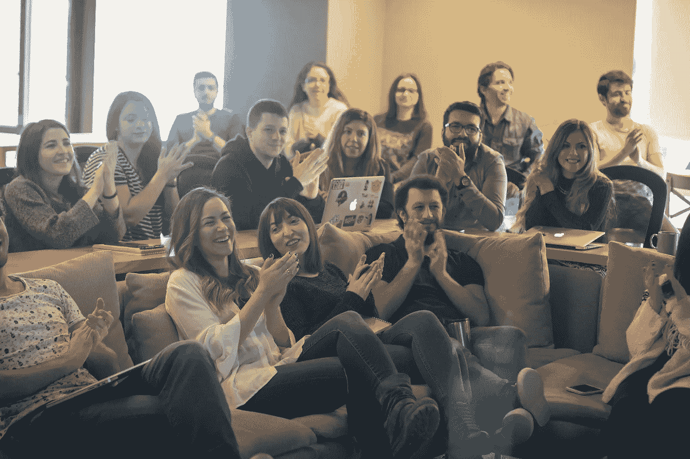

# 我们的 110 名员工如何保持高效、积极和快乐

> 原文：<https://medium.com/swlh/how-our-110-employees-stay-productive-motivated-and-happy-e4242c58c8e8>

Originally published on [**JOTFORM.COM**](http://jotform.com)

那是在 1992 年夏季奥运会前的一个月。

美国组建了该国历史上最伟大的男子篮球队，被恰当地称为“梦之队”

名单中包括像迈克尔·乔丹、拉里·伯德、魔术师约翰逊、查尔斯·巴克利、帕特里克·尤因和卡尔·马龙这样的超级巨星。