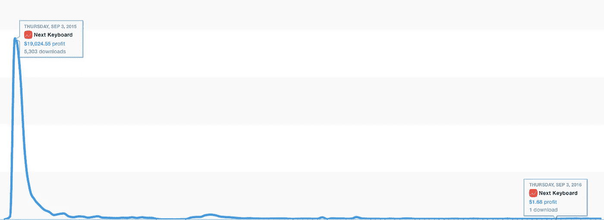
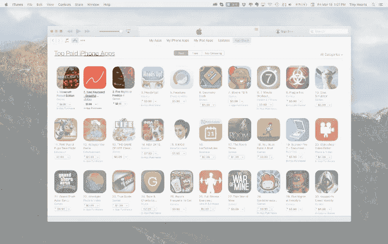
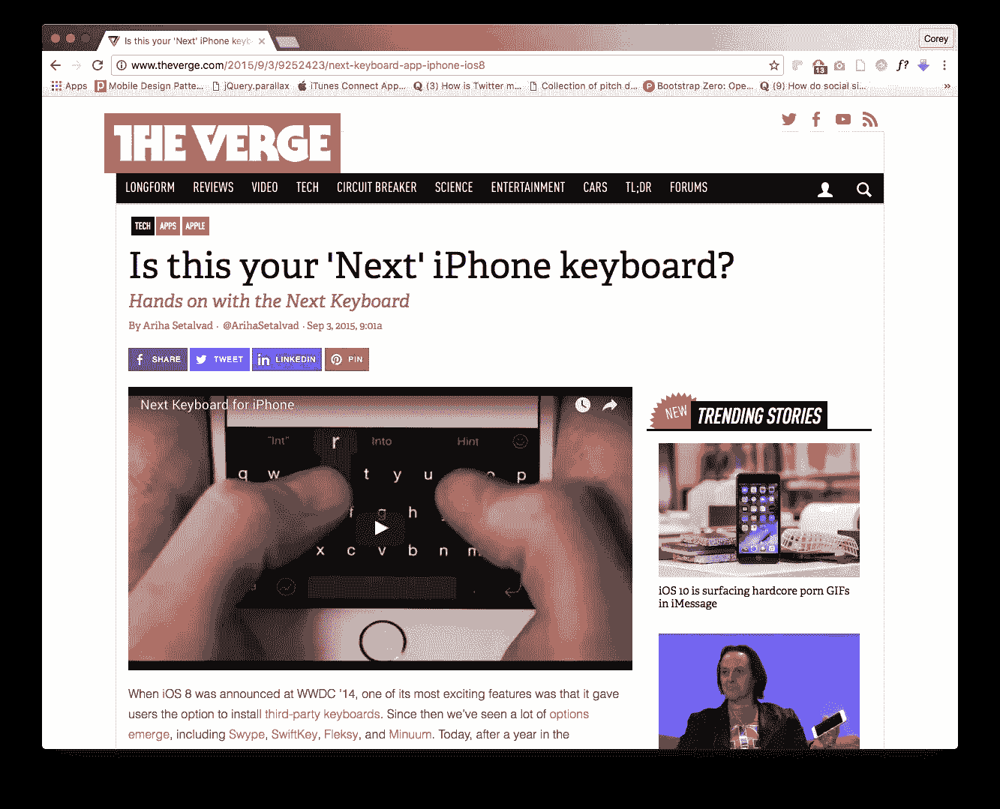
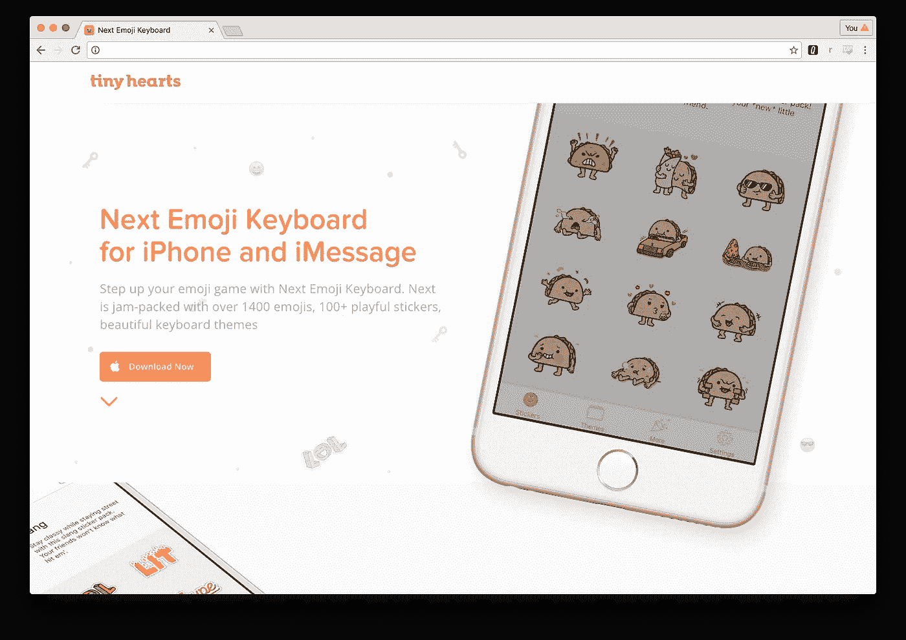

# 我们的应用如何从每天 20，000 美元增加到每天 2 美元

> 原文：<https://medium.com/swlh/how-our-app-went-from-20-000-day-to-2-day-in-revenue-d6892a2801bf>

Next Keyboard sales chart aka App Store rollercoaster

## ***超越 App Store 魅力的真实面貌***

—

*这是我们宣布关闭 Next Keyboard 的帖子的后续。我的目标是分享我们一路走来学到的一些艰难的教训，并展示 App Store 通常不被谈论的一面。*

 [## 我们正在扼杀下一个键盘。原因如下

### 这是我们不得不做出的最艰难的声明之一…

medium.com](/@robjama/were-killing-next-keyboard-here-s-why-40867568ad5c) 

—

几年前开始的。App Store 正在经历 21 世纪版本的淘金热。开发者变成了勘探者，在注意力经济中寻找他们的利益。媒体通过追踪辞职并在应用商店“一炮而红”的开发人员，延续了这一激动人心的神话。

有一句话人们通常认为是作家马克·吐温说的，“历史不会重演，但它会押韵。”淘金变得极其昂贵，商人比实际的淘金者赚了更多的钱。

我知道这种感觉，因为[我辞掉了自己的工作](/tiny-hearts-studio/how-i-quit-my-job-and-built-my-first-app-d2a2e1086f41#.sbws473jt)去建立一个独立的数码产品工作室[小心脏](http://tinyhearts.com/)。我们已经取得了一些巨大的成功，为我们自己和我们的客户创造了产品，但 Next Keyboard 的故事不在其中。相反，这更能说明 App Store 的残酷本质。现实是这样的——多年来一直如此: ***在 App Store 上真的很难做。*** 我从 2010 年开始做这件事，并没有变得更容易。如果你只是为了钱，有更简单的方法来实现这个目标。

> "事实是:在应用商店里真的很难生存."

Next Keyboard reaching #2 top paid on the App Store

我和我的团队开发了 Next Keyboard，它在 App Store 上排名第二。甚至在发布之前，它已经获得了一些不错的势头。我们已经[在 Kickstarter](https://www.kickstarter.com/projects/robjama/next-keyboard-the-perfect-keyboard-for-iphone) 上筹集了 65000 美元，在一些网站上获得了报道(包括 Mashable 和美国消费者新闻与商业频道)，并建立了一个强大的支持者社区:

 [## Twitter 上 NextKeyboard 对@NextKeyboard 的喜爱

### 下一个键盘的最新版本(@nextkeyboard)。我们的使命是让你爱上你的键盘。苹果手机

twitter.com](https://twitter.com/nextkeyboard/timelines/562427481157033984) 

然后一切都崩溃了。

> ***当我们第一次推出 Next Keyboard 时，我们每天的销售额是 20，000 美元。很快就降到了每天 2 美元。***

App Store 始终是一个充满风险的地方，收入下降是意料之中的，但这次下降比我们预期的要严重得多。明智而有意识地下注很重要，知道自己在任何事情上的胜算也很重要。正如许多高风险的努力一样，多样化是一个值得遵循的好原则。(就我的工作室而言，除了我们自己的内部产品工作之外，我们还产生服务收入。)

旅途让我反思了很多。事后看来，我并没有意识到建造一个键盘会有多大的风险。我当然不知道它有多复杂。天真有时是好的，因为你不会陷入过度思考的陷阱，但这次它咬了我们的屁股。然而，我仍然相信，每个企业家都必须有某种程度的天真，才会认为自己能够实现难以置信的宏伟目标。这种天真甚至对最优秀的人也造成了影响——例如，在 Twitch TV 创始人建立 Twitch TV 之前，[他们建立了一个名为 Kiko](http://www.recode.net/2014/7/5/11628568/how-twitchs-founders-turned-an-aimless-reality-show-into-a-video) 的日历应用。一个月后，谷歌日历出现了。

但从根本上说，我们也贪多嚼不烂。键盘可能听起来很简单，但它们是非常复杂的产品。在引擎盖下，构建键盘需要结合自然语言处理(NLP)、机器学习和数据科学。我们是一个相对较小的独立产品工作室，即使我们在 Kickstarter 上筹集的合理金额的现金也只能支付一名数据科学家工资的一半。

# 你总是下注，明智地放置它们

当我们开发 Next Keyboard 时，我们是最早尝试苹果定制键盘功能的公司之一。不幸的是，由于苹果的 API，所有第三方 iOS 键盘——包括 Next Keyboard——从未真正稳定过。使用第三方键盘(比如设置新键盘)的用户体验差得惊人。即使是谷歌的键盘，Gboard，在第三方键盘发布整整两年后的今天仍然有问题。

> “尽管开发者表现出了创造力，但自第三方键盘在 iOS 8 中首次亮相以来，它们并没有得到苹果的太多喜爱。”费德里科·维蒂奇从他的 [iOS 10 回顾](https://www.macstories.net/stories/ios-10-the-macstories-review/26/)

我们赌手机。我们押注苹果，这一点不会改变。我们仍然对 iOS 非常有信心，我们将继续专注于此。我们在键盘上冒了一次险，但没有成功。

这些赌博听起来很有趣，也很轻松，但是我们从第一手资料中了解到，赌博对现实世界有着严重的影响。我们让自己失望，也让用户失望。我们无法做出世界上最好的键盘(这是我们的使命，也是我们制造产品的目标。例如， [Wake](http://www.tinyhearts.com/wake/) 可以被认为是 iPhone 上的[最佳闹钟。我们能够让](http://lifehacker.com/5860145/the-best-alarm-clock-app-for-iphone)[成为最好的第三方键盘](/swlh/product-hunt-101-426511f03501)之一，但不是最好的。而谷歌、苹果、微软最后都打败了我们。

我们没有做我们计划要做的事情，所以在这些方面我们失败了，但是在很多其他方面我们成功了。我们能够做出一些非常惊人的东西(它上升到了 Kickstarter 应用程序的第二名，获得了最多的资金，我们围绕这一产品和愿景建立了一个社区，它使我们成为消息传递领域的专家，使我们成为一个更强大的团队，并提高了我们在社区中的知名度)。我们仍然对消息和 iOS 10 感到非常兴奋。我们已经在键盘和机器人上取得了成功，我们计划在信息传递上更进一步。

Next Emoji Keyboard

作为 App Store 上的 og，过去几年我们一直在思考应用之外的事情。我们已经探索了扩展、键盘以及最近的机器人和 iMessage 应用程序！(事实上，我们将很快推出我们的第一个名为 GeniusBot 的机器人！)我们开始了一次成功的[机器人聚会](/tiny-hearts-studio/starting-a-bot-community-ac6fe966f958#.o5pnfc8yb)。我们还为自己和客户制作了一些其他有趣的键盘——Kimunji 和 KappaKey 。其实[下一个 Emoji 键盘](https://itunes.apple.com/ca/app/next-emoji-keyboard-stickers/id1066393790?mt=8)会活下来，延续下一个键盘遗产。贴纸包也将继续存在——它们作为 [iMessage 包](/tiny-hearts-studio/tiny-hearts-stickers-packs-for-imessage-64061671c2a#.3uzu4278j)提供。

最重要的是，虽然我们不会支持 Next Keyboard，但我们已经看到了它最重要的元素——[光标控制](https://www.youtube.com/watch?v=Dcr-0AOQHts)和[表情符号预测](https://www.youtube.com/watch?v=vgQ3_OPPvJM)——在苹果和谷歌的键盘以及其他应用程序中都很活跃。

> 很多人都在谈论旋转，但对我们来说，我们相信有时候人们简单地退出很重要——然后继续前进。

很多人都在谈论旋转，但对我们来说，我们相信有时候人们简单地退出很重要——然后继续前进。即使你为了赢而比赛，也没有人能赢下所有的赌注。有时候，旋转是不够的。

# 如果你不玩，你永远不会赢

不管听起来像什么，如果我们可以再做一次，我们完全会。很容易说，如果我更明智，我会在执行项目前做更多的尽职调查。作为一家公司，我们学到了很多，但 Next Keyboard 是一堂非常昂贵的课。随着收入、拨款和服务工作的到来，我们没有陷入不合理的困境。在某种程度上，你可以说我们对冲了我们的赌注。

我们处于更有利的位置，因为我们没有一个依赖于风险投资的计划。如果我们这样做了，我们将会是另一个死亡的创业公司。我们经历了惨痛的教训，所以我们的合作者[可以从这些见解中受益。](/tiny-hearts-studio/it-s-official-we-re-open-for-business-5db9bffdfa88)

尽管这是一个昂贵的教训，事情解决了。有些事情我们希望会有不同的结果。我们让我们的用户失望了，我们对此并不满意。但是我们变得更加强大和聪明，我们已经学到了难以置信的东西，我们仍然会在 iOS、消息和对话界面上下赌注。如果你不玩，你永远不会赢。这对我们来说很难接受，但我们付出了最重要的一课:用应用赚钱是有风险的。

> 想赚钱？不要只做一个 app。建立一个企业。

我和我的团队正在写一本电子书，讲述我们为 App Store 和 Philips、Wealthsimple 和 Plantronics 等公司创业和开发数字产品的经验。如果您想第一个阅读我们的电子书，了解我们团队的更新和我们对产品开发的想法，请注册。

## Robleh Jama 是获奖产品工作室 [Tiny Hearts](http://www.tinyhearts.com/) 的创始人。他们生产自己的产品，如 [Next Keyboard](http://www.nextkeyboard.co) 、 [Wake Alarm](http://www.tinyhearts.com/wake) 和[Quick Fit](http://www.tinyhearts.com/quickfit)——也为 Wealthsimple 和飞利浦等客户生产产品。

**如果你喜欢这篇文章，请推荐，帮助别人找到！**

