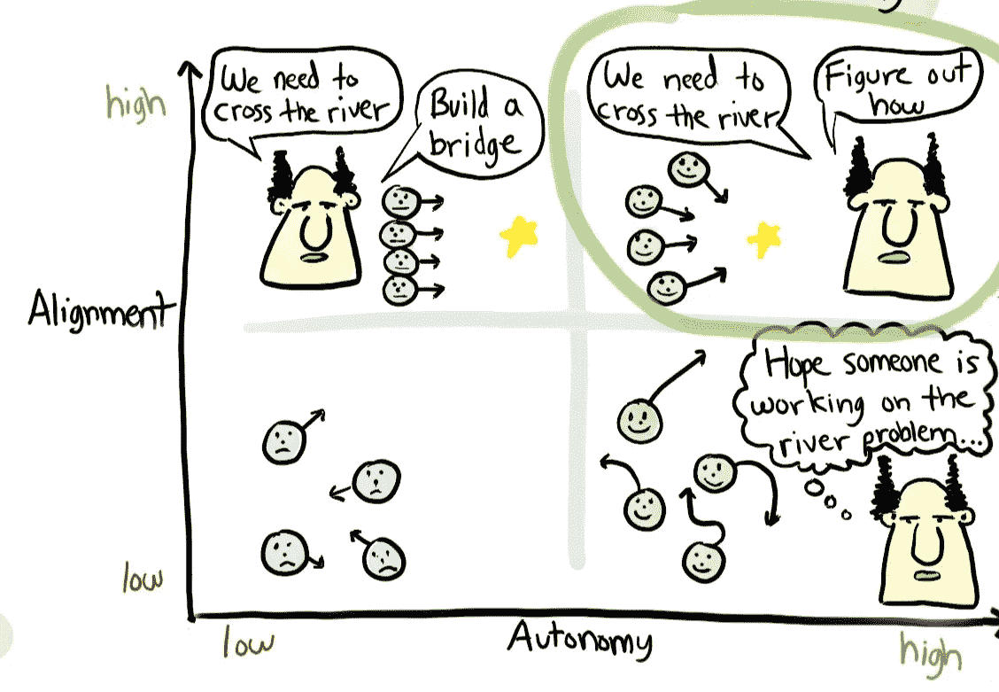
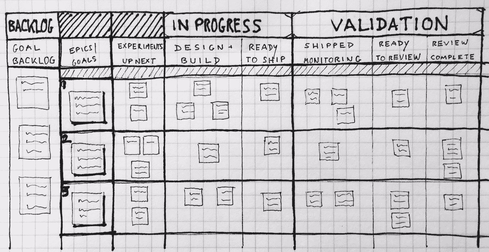

# 产品专家如何创造一致的价值

> 原文：<https://medium.com/swlh/how-product-experts-create-consistent-value-781a6bdfd463>

## 拆分决策会议的产品专家带我们去学校

在旧金山联合广场附近的 JW 万豪酒店，一个布置优雅的会议室里，一些产品界最伟大的疯狂科学家聚集在一起，讨论如何始终如一地打造令人敬畏的产品。

由斯普利特赞助的[决策会议](https://www.decisionsconf.com/)。在来自*壮志凌云*配乐的稳定音乐中，拥有产品管理、数据科学和组织领导力专业知识的演讲者分享了建立组织的最佳实践，这些组织能够快速、持续地生产出用户喜爱的有意义的产品。

当天的讨论最终围绕一个关键挑战展开，正如介绍性主题演讲人**Adil Aijaz**——Split Software 首席执行官所言:

> “重要的不是交付版本的速度，而是交付价值的速度”

我们需要超越快速发布和频繁发布，并且理解为这些发布赋予价值的重要性。这要求我们知道什么度量是重要的，理解如何跟踪那些度量，并且有只发布积极影响那些度量的纪律。

这些关键点与会议的轨迹一致，许多关键点被一个接一个的发言者重复和强调。

# 他们寻求产出，而不是结果

为了向我们的客户和用户交付价值，我们必须理解我们所构建的产品和这些产品所实现的结果之间的差异。

**输出**为*内置*。它们是团队为了让客户满意而努力打造的东西。

**成果**是*达到*。它们是已经发货的产品、没有发货的产品以及我们的用户如何使用这些产品的结果。

如果我们的**产出**没有产生高质量的**结果**，那么我们所做的就是制造一个无用的产品。我们通过对我们的功能如何被使用的真实分析来衡量产出。

想象一下你读过的最伟大的书。它给你带来了价值，但带来这种价值的是书本身吗？如果这本书是用你看不懂的语言印刷的，它仍然是同一本书，传达着同样的信息，但是它突然变得对你这个用户没什么价值了。

这里的区别很重要，因为你永远无法确定任何输出的影响是什么，直到你看到。真空中没有任何东西是有价值的。价值取决于给定输出的上下文使用，它如何改变习惯和影响生活，这决定了一个特性是否有价值。

# 他们尝试减少他们的“特征债务”

为了实现我们想要的结果，我们需要了解如何赋予我们推出的功能价值。

谈论实现结果很容易，而理解大规模实际测量结果所需的投资是另一个步骤。

根据微软实验和分析副总裁 Ronny Kohavi 的说法，伟大的组织意识到大多数产品改进不会对他们的预期指标产生积极的影响。Kohavi 领导 Bing 的实验团队，在那里他看到了具有正面、中性和负面结果的功能的平均分布，只有第一种功能被发布。

这就是你如何避免**特征债务**

鉴于**技术债务**指的是降低你的代码库整体质量的实现变通办法，**特性债务**指的是那些你实现的东西，不管质量如何，都有不被理解的影响。

每当我们发布我们“知道”对用户有价值的功能，而没有衡量用户的反应时，我们就增加了功能债务。类似地，当我们为一个用户构建一些东西，而这个用户的老板的老板，河马，坚持认为这些东西是有价值的，而没有确认这些价值，这也是特性债务。

> 旁注:我很兴奋地听说“**Hi**ghest**P**aid**P**person in**O**office”或 **HiPPO** design 的现象实际上是由科哈维创造的。多传奇啊！

如果我们的用户没有从我们的产品中获得价值，那么我们作为产品团队就没有成功。因此，任何我们无法证明为我们的用户提供价值的产品都会增加我们的**功能债务**。

最终，我们认为我们运送的产品有多天才并不重要。我们的用户决定我们的产品有多好，他们通过自己的行动表示支持。

通过确保您只发布那些已经被证明有积极影响的特性，您可以确保保持一个精简的代码库，只支持那些已经被证明有明确价值的工作流。

# 只有当他们理解一个特性的影响时，他们才会称之为“完成”

没有人打算开始一个功能工厂。在 Spotify 著名的[工程文化展示](https://labs.spotify.com/2014/03/27/spotify-engineering-culture-part-1/)中，你可以看到一个很好的例子，展示了科技公司通常对他们的团队如何为更大的成功愿景做出贡献的愿景。

尽管有这样的愿景，许多公司发现自己陷入了低联盟或低自主性的境地，或者两者兼而有之。

自主性低的团队通常有一组领导人，他们同意他们认为重要的目标，但决定在没有任何给定想法可行的证据的情况下，关于应该(和不应该)构建什么的想法应该最终通过领导层过滤。

低一致性的团队很难理解什么结果会产生好的业务结果，这通常是因为他们不能度量它们。每个人都对他们正在做的各种事情感到兴奋，但是没有人知道哪些结果是好结果。

所以，如果每个人都在试图弄清楚如何让他们的团队朝着一个统一的成功愿景发展，那么为什么这么多人没有找到这种结盟和自治的天堂呢？

简而言之，他们没有流程、控制和纪律来只运送那些他们**知道**有价值的产品。

为了解决这个问题，**John Cutler**——Amplitude 的产品评估专家提出，只有当一个特性对业务度量的影响已经被清楚地理解、记录并以其他方式交流时，团队才需要将该特性定义为“完成”。

一个特性“完成”的典型定义通常介于“准备发布”和“已发布”之间，监控是产品团队更全面的工作，而不是特定于某个特性的工作。

当我们发布不被监控的特性时，我们积累了**特性债务**，当我们推出一个特性而没有测试它来弄清楚它是对上一版本的改进还是损害时，我们再次积累了特性债务。

最终，产品专家认识到**被测量的东西会被管理**，未经证实的特性对任何产品团队来说都是一种负担。致力于将结果归因于他们的产出的团队有最好的机会推出**简单、优雅的产品**，为他们的用户提供一致的价值。

*感谢阅读！我是* [*杰克·摩尔*](https://medium.com/u/266c1c6aac8?source=post_page-----781a6bdfd463--------------------------------) *，我喜欢写关于产品管理的文章。*

*如果你喜欢这个，你可能也会喜欢这些:*

 [## 无聊的产品经理不会做这些事情

### 为什么他们说伟大的产品管理是一周 60 小时的工作

productcoalition.com](https://productcoalition.com/bored-product-managers-arent-doing-these-things-1a542079042d)  [## 伟大的产品经理就是这样面试工程师的

### 问工程候选人的 3 类问题

productcoalition.com](https://productcoalition.com/this-is-how-great-product-managers-interview-engineers-29ff2f82b6e8) 

## 这篇文章发表在 [The Startup](https://medium.com/swlh) 上，这是 Medium 最大的创业刊物，拥有+ 377，008 读者。

## 在这里订阅接收[我们的头条新闻](http://growthsupply.com/the-startup-newsletter/)。

