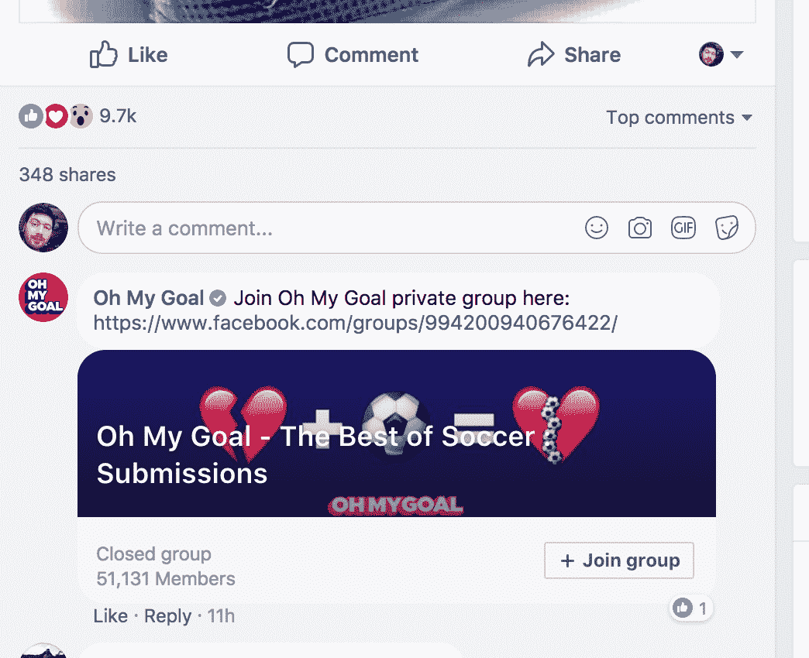

# 出版商必须如何改变才能在脸书的媒体战中生存

> 原文：<https://medium.com/swlh/how-publishers-must-change-to-survive-facebooks-war-on-media-cdb882c0aa08>

# 社区管理变得至关重要

正如脸书的 Adam Mosseri 在最新公告中写道，公共内容在脸书团体中有很多参与，可能会被优先考虑。这是有意义的，因为群组是由人(个人用户账户)而不是发布者驱动的。因此，投资于群体来推动“对话和有意义的互动”可能是一条出路。

脸书只是在最近才允许页面创建授权组，所以这里没有多少可以作为最佳实践的例子，而且没有一个是大规模的。被引用最多的例子是 Quartz in Work 为经理们建立的一个团队(T0)，这个团队甚至出现在脸书的[案例研究(T3)中(脸书也是这个垂直行业的最大赞助商)。许多群组是围绕播客或节目创建的，如](https://media.fb.com/2017/12/04/why-quartz-launched-its-new-edition-with-a-facebook-group-a-qa-with-editor-khe-hy/) [NYT 播客俱乐部](https://www.facebook.com/groups/nytpodcastclub/)和 [The Weeds](https://www.facebook.com/groups/TheWeeds) (其特色是围绕 Vox.com 的同名播客的对话)。Buzzfeed 未解系列的官方群组[有 2 万名成员，每天发布 100 多个帖子。](https://www.facebook.com/groups/297755087311802/)

A typical user post in the Weeds group

发展团队是一项艰巨的挑战，目前脸书广告经理内部没有付费选项来帮助这种增长。另一方面，以这种方式建立参与和忠诚的社区在流量甚至用户生成的内容方面会更有回报。

**如何做到:**非侵入性弹出窗口和/或横幅，以便加入网站上的群组；通过在 facebook 上增加帖子进行推广，通过在评论区打电话加入群组进行推广；通过其他流量渠道(时事通讯、推送提醒等)进行推广。).

A typical call to join the group in the comments by [Oh My Goal](https://www.facebook.com/OhMyGoal.KeliNetwork/)

# 通过间接呼吁行动来激发对话

这听起来可能有点生硬，但有时你可以通过简单的询问来引发某些行为。尽管直接点赞、分享、点击或评论[现在违反了](https://newsroom.fb.com/news/2017/12/news-feed-fyi-fighting-engagement-bait-on-facebook/)脸书法律，但你仍然可以通过问一个与文章主题相关的问题来间接地做到这一点。以下是 Quartz 的 Khemaridh Hy 在他们的脸书团队中是如何做到这一点的(但也完全适用于页面帖子):

如何做:在脸书发展一种深思熟虑的行动号召文化。

# 将编辑人员变成有影响力的人

如果你阅读官方公告，你会注意到这些可能的降级大多是关于页面的，而不是个人账户。它甚至说“许多在脸书上发布视频的创作者会在他们的追随者中引发讨论，名人的帖子也是如此”。由此我们可以推断，个人影响者帐户不太可能落入新算法的雷达之下，我们可以将此作为分配策略的一部分。

Joshua Topolsky of The Outline has 34k followers on Facebook and actively promotes content there

编辑和社交媒体工作人员可以成为很有影响力的人，但前提是这是媒体公司方面协调努力的一部分。Buzzfeed 是这种方法的先驱之一。如果你从 Buzzfeed 的员工那里随机挑选一篇文章，并尝试在脸书上搜索这个人，你会注意到几乎所有参与内容的人都至少有几千名粉丝。他们都分享他们制作的内容。当然，这在 Buzzfeed 的规模上并不算多，但对于较小的项目来说，这可能会显著影响数字。

**怎么做:**在作者和编辑的署名附近或网站上的其他地方创建可见的横幅来关注他们；张贴呼吁关注作者和编辑作为固定评论。

# 关注平台原生内容

虽然转向视频现在被更加谨慎地对待，但视频内容仍然比链接更有可能获得参与。这可能是由于平台上本地内容消费的性质——用户停留在脸书上，内容本身(照片或视频)和评论/喜欢/分享部分之间没有摩擦。另一方面，对于链接，你通常首先点击帖子，阅读它，然后如果你有什么要说的，你会回到你在 feed 中看到它的地方，并删除那些有意义的评论——这需要很多操作。还有一个问题。发布更多的视频和图片会带来更多的有机曝光…吸引人的视频和图片，而不是全部，这意味着你的链接会停留在原来的位置。

对于一些像 Buzzfeed 这样的出版商来说，AJ+或 Attn 在其平台属性内保持参与度是不错的，但不是每个人都负担得起。像 NowThis、[科力网](http://www.kelinetwork.com/)或[超级豪华](https://www.superdeluxe.com/)这样的平台第一媒体已经有整整一代人学会了利用这种方式赚钱。然而，对于更传统的人来说，这将是一个更艰难的选择——要么重塑你的业务，要么改变你的分销策略。

# 注意你的度量标准

无论您选择哪种方法，跟踪哪些方法对您的出版物有效，哪些无效仍然非常重要。在这方面，仅靠谷歌分析是没有用的。编辑分析解决方案，如 IO Technologies 提供的[将帮助您确定如何以及在哪里最好地消费您的内容，并做出更明智的战略决策。这项服务可以根据您组织的需求进行深度调整。](http://bit.ly/2DwPw7V)

## 这篇文章发表在[《创业](https://medium.com/swlh)》上，这是 Medium 最大的创业刊物，有 290，182+人关注。

## 订阅接收[我们的头条新闻](http://growthsupply.com/the-startup-newsletter/)。

