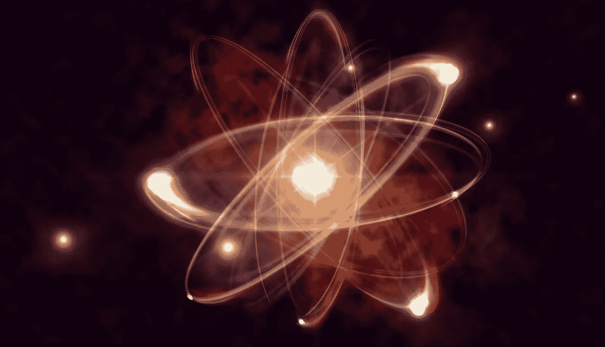

# 量子计算机如何能够同时处理所有的华尔街金融模型

> 原文：<https://medium.com/swlh/how-quantum-computers-would-be-able-to-process-all-of-wall-street-financial-models-at-once-a7d536469d16>

> **先设定前提。2010 年 5 月 6 日下午，纽约证券交易所目睹了类似于超自然现象的事情。**

一万亿美元的市值在几秒钟内从股票中消失，就像被一个巨大的网络黑洞吞噬一样。

交易员们站在华尔街的场地上，手心冒汗，喘着气，盯着显示下跌点的大屏幕，就像我们在电影中看到的那样。他们目睹了金融史上最快的股票市场崩溃，因此将其命名为“*2010*闪电崩盘”。

根本原因无非是一系列计算机算法失控。对这次溃败的解释被广泛猜测，从肥手指交易到网络攻击。

## 事情败露了，无数的新闻报道和随后的逮捕。

交易员不知道的是，在某个地方，隐藏在数十亿美元交易基础设施的库存中，一种算法已经开始行动，出售虚张声势的期货合约，在会计语言中专门称为 e-mini，这是一种高价值押注的形式，可以统称为欺骗。这些虚张声势的发布导致了多米诺骨牌效应，这种效应在交易网络中慢慢蔓延，在买家和卖家之间造成了混乱，他们迅速跟随通常在红色代码情况下出现的内在人类回流。

恐慌。

整个事情变成了一个疯人院，前所未有的买卖开始涌入，这是由与恐惧感觉紧密相关的人类心理法则定义的。紧随其后，另一套算法开始运作。这些都是租给高频交易者(HFT)的令人瞩目的彻头彻尾的乏味算法。高频交易是一个聪明想法的产物。如果股票价格每分钟都在上涨和下跌，由于每秒钟有数百万笔交易，显然有人在赔钱，有人在赚钱。

在纽约的每一分钟，都有数百万人在卖出，数百万人在买入。这是一个贪婪的战场。如果某种程度上，当证券和股票的价格相差很小时，可以设计出某种算法来买卖它们，这将改变人们从这些股票市场中榨取利润的方式。

当数学和物理学博士突然涌入金融领域时，HFT 的过程被计算机化了。书呆子们建立了复杂的交易策略，然后将它们构建成算法，让软件在华尔街的心脏上自由运行。

关键是速度。这件事必须做得非常非常快，当有成千上万的人和你一样敲同一扇门时，这是一场激烈的竞争。如果你的算法在执行速度上节省了哪怕一微秒，你就赚了更多的钱。它实际上是没有麻烦的。你甚至不必每天坐在显示器或美国消费者新闻与商业频道前，做出可怕的猜测，而这些猜测大多会导致充满愤怒的扔遥控器事件。股市一片混乱。就像《华尔街之狼》中马修·麦康纳的角色和我们有抱负的利奥聊天一样，*“没有人知道一只股票会上涨、下跌、横盘还是在他妈的圈子里”*。

咒语是租一个 HFT 的自由职业者，去星巴克，开始梦想像 80 年代那样的生活，然后鲍勃就是你的叔叔了。

欢迎来到一个全新的世界，如果你有更多的计算资源，你就有更好的赚钱前景。

> **但问题是，每一个计算机系统都受到物理和热力学定律所设定的上限的控制。你可以做你想做的白日梦，但是在某个时间点，警报将会响起(象征性的)，物理将会阻止你。**

我们要么离那一点很近，要么已经越过了那一点。堆积越来越多的核心只是不再削减它。

在这一点上，有人必须考虑获得更多的资源。一些可以扭转局面，把游戏带到一个全新水平的东西。堆积越来越多的 CPU 和 GPU 核心并将它们链接在一起不再可行。梦想的贪婪远远超出了这一点。

## 进入物理学和量子计算。

这一切都始于一位名叫*理查德·费曼*的有抱负的物理学家开始梦想一个超越数字计算机的世界。他是一个对亚原子水平的事物着迷的人，他为发明一种能够利用自然量子法则进行处理的机器奠定了基础。

迄今为止，来自整个世界的数据可以编码成二进制表示，以便进一步处理和存储。无论我们走过了多少未来主义的技术路线图，我们总是被卡在那个二元监狱里。尽管我们能力有限，但我们已经取得了很大成就。我们已经把人类送上了月球，我们的无人太空探测器，旅行者一号，在 39 年前发射，仍然在向地球发回信号。我们已经看到了过去 130 亿光年，我们已经探测到几十亿年前两个黑洞相撞时爆发的引力波。对于一台只处理 1 和 0 的计算机来说，这太多了。

## 现在我们已经越过了那个障碍。

一台反映自然对数据操作方式的计算机，速度远远超过二进制逻辑。这就是量子计算机的含义。我会详细说明，但我不会深入到根级别的细节。这是另一个博客的故事。

在二进制处理环境中，能力取决于晶体管的数量。随着超大规模集成技术和极紫外光刻技术的发展，现在的技术可以在每平方毫米的硅片上集成超过 1 亿个晶体管。

我们的问题仍然存在。QC 与经典的二进制计算机有什么不同？

要点很简单。

量子机器利用了并行性。正是这种能力使量子计算机能够处理数十亿种可能性，而传统的二进制计算机一次只能处理一种。

对于范伟来说，嗯，没那么简单。但是任何超出这个解释的东西都会增加复杂性，从而破坏这个博客的目的。让我们在下一个帖子里讨论那些乱七八糟的东西。

那么量子计算机是如何一次性处理整个华尔街金融模型的呢？

如今，金融数据和股票投资都遵循现代投资组合理论的原则。它提供了关于如何构建投资资产组合的见解，在不同的时间点，以最大化针对风险因素的预期回报(或利润)的方式进行选择。在基本层面上，这是一个优化过程，唉，量子计算机擅长这种 ***优化问题。***

## 根据该理论，有可能找到一个投资组合的有效边界，在一定的风险水平下最大化可能的预期回报。

普通计算机可以永远处理投资组合问题，循环处理产生无限结果的数据集，但它们无法提供可行的模型。直到现在，我们的数字计算机所能做的是抄近路，依靠近似值。

然而，如果我们能从基于近似的解决方案转移到精确的解决方案会怎么样呢？目前存在的绝热量子计算机，如谷歌的 D-Wave 能够在有限的时间内解决投资组合问题。

尽管量子计算机还处于起步阶段，但它已经开始在这方面努力了。这是一个即将到来的范式转变。

## 这篇文章发表在 [The Startup](https://medium.com/swlh) 上，这是 Medium 最大的创业刊物，有 307，871+人关注。

## 在这里订阅接收[我们的头条新闻](http://growthsupply.com/the-startup-newsletter/)。

