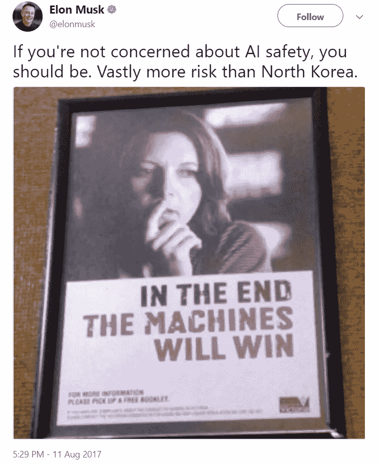
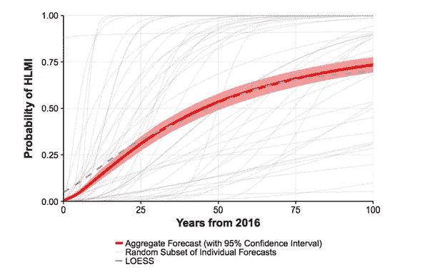
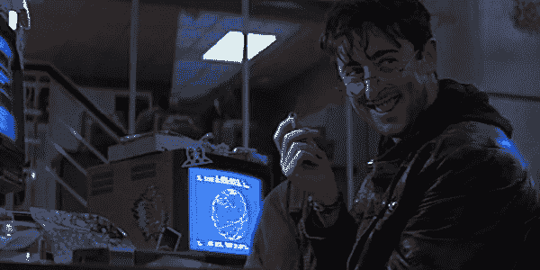
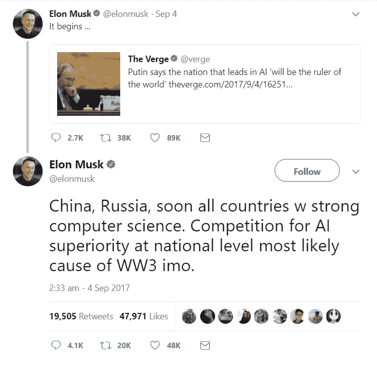
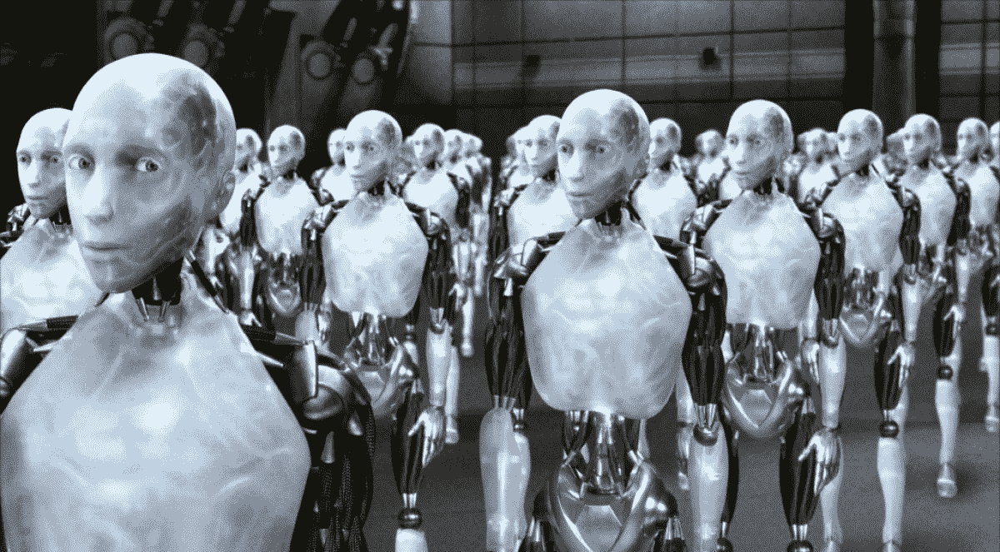

# AI 的风险有多大？为什么专家不同意。

> 原文：<https://medium.com/swlh/how-risky-is-ai-bce037ae0608>

> “[当超智能 AI 出现时]，会有食肉动物，也会有食草动物。我们将成为植物。”— J Storrs Hall，超越 AI

如果你在 Twitter 上呆了一段时间，你可能已经看到科技企业家埃隆·马斯克在推特上发布了一条关于人工智能的警告。大概是这样的:

如果你和我一样，你会想，“是的，我有点担心人工智能。人们说这可能会增加失业或歧视。但我更担心朝鲜。”

人工智能将奴役或灭绝我们的说法听起来像科幻电影。但这正是埃隆·马斯克和其他聪明人，如牛津大学教授尼克·博斯特伦和微软首席执行官比尔·盖茨所建议的。非常聪明的人说，人工智能可能变得比人类更聪明，并毁灭我们所有人。

三个月前，我确信他们大错特错。

但是在[读](https://80000hours.org/articles/extinction-risk/#what-new-technologies-might-be-as-dangerous-as-nuclear-weapons)和[读](https://en.wikipedia.org/wiki/Superintelligence)和[听](https://soundcloud.com/80000-hours/6-dr-toby-ord-on-why-the-long-term-future-matters-more-than-anything-else-what-to-do-about-it)和[读](https://www.amazon.co.uk/Beyond-AI-Creating-Conscience-Machine/dp/1591025117)之后，我改变了我的想法。担心人工智能会杀死我们所有人并不可笑或荒谬。很聪明。

# 我们不知道的会伤害我们。

因为人工智能是一个如此快速发展的领域，而且因为[人们太不擅长预测未来](http://www.abc.net.au/radionational/programs/futuretense/why-pundits-and-experts-are-so-bad-at-predicting-the-future/6483666)，所以人工智能的未来有很多不确定性。

关于人工智能未来的每一个预测——从“人工智能是安全的”到“人工智能将是我们的末日”——都取决于几个没有人知道答案的关键问题。因为每个问题的专家都不同意，聪明人得出非常不同的结论是有道理的。如果两个聪明人对人工智能的风险有不同意见，那可能是因为他们对未来的一个关键预测有不同意见。

人工智能的三个主要分歧是时间框架、未来用户和让人工智能理解我们的价值观的难度。

## 人类级别的 AI 要多久才能成为超智能 AI？

> “他们没有智力。我们不知道如何在任何机器中实现智能——不是你我拥有的那种智能，甚至不是一只狗拥有的那种智能。其他都是猜测。”卢西亚诺·弗洛里迪

我最近参加了一个关于人工智能在工业中的应用的讲座。演讲者指出，经过几十年的研究，人工智能甚至还没有达到人类的智能水平。在担心人工超级智能之前，我们还有很长的路要走。

她假设我们可以根据过去改进的时间来预测未来改进人工智能需要多长时间。但是牛津大学教授尼克·博斯特罗姆说这可能是错误的。在他的书 [Superintelligence](https://www.amazon.co.uk/Superintelligence-Dangers-Strategies-Nick-Bostrom/dp/0199678111) 中，博斯特罗姆建议人类水平的人工智能可以开始自我改进。我们已经看到人工智能成为世界上最好的围棋；谁说一个 AI 在计算机编程方面不可能是世界上最好的？

如果人工智能能够自我改进，那么用不了多久，我们就会拥有一个超级智能的人工智能。毕竟，[在](https://waitbutwhy.com/2015/01/artificial-intelligence-revolution-1.html)之前，我们已经对新技术出现的速度感到惊讶。

事实是，我们不知道还要多久才能达到人类级别的 AI，更不用说超智能 AI 了。关于人工智能何时能达到人类水平，领域领先专家[有着完全不同的观点](https://web.archive.org/web/20171107031452/https://arxiv.org/abs/1705.08807)。

The light grey lines represent each experts’ predictions about when we’ll reach Human Level Machine Intelligence. Opinions vary widely.

因此，如果我们不知道机器何时会达到人类智能，更不用说主宰世界的超级智能，我们该怎么办？有些人说机器甚至永远不会达到人类的智能，所以人工智能的安全不是问题。还有人说，我们应该等等看人工智能研究进展如何。当我们接近人类水平的 AI 时，我们就应该行动了。最后，有人建议我们现在就采取行动，因为永远不会有超级智能即将来临的明确警告。

## 谁将会使用人工智能？

Boris Grishenko: Bond villain, computer programmer, and voted “Most Likely to Misuse AI” in high school.

人工智能安全的另一个重要因素是谁将使用人工智能。超智能 AI 会被限制在联合国吗？公司和公民个人能够使用它吗？恐怖分子或黑客会使用人工智能来帮助他们实现计划吗？

人工智能是一种工具，可以用于多种目的。它本身没有好坏之分，但它可以用来实现你的目标，不管它们是什么。人工智能可以提高政府透明度，找到癌症的治疗方法，或者找到联邦调查局安全系统的薄弱环节。这完全取决于谁在使用它。

对人工智能风险持不同意见的人通常会同意人工智能将被用来帮助和伤害。他们的争论是关于它是否弊大于利。

脸书首席执行官马克·扎克伯格因表示人工智能不应放缓而掀起波澜。他承认人工智能既可以用于善，也可以用于恶，但他专注于善。

> “每当我听到人们说人工智能将在未来伤害人类时，我就会想:是的，技术通常总是可以用来做好事和坏事，你需要小心你如何构建它，你需要小心你构建什么以及它将如何被使用。但是……(我)如果你反对人工智能，那么你就是在反对不会发生事故的更安全的汽车，你是在反对能够更好地诊断生病的人。”

Musk tweets, “Competition for AI superiority at national level most likely cause of WW3 [in my opinion].”

另一方面，埃隆·马斯克专注于人工智能在弗拉基米尔·普京这样的人手里可以做什么。

马斯克(正确地)认为人工智能可以改变全球力量平衡。他接着指出，自动武器系统可以决定先发制人的打击对一个国家的安全是必要的。一个人工智能可以发射导弹(或核武器)并杀死数百万(或数十亿)人，而没有一个人参与决策。

我们知道人工智能将被用于好的，邪恶的，和彻头彻尾的阴暗的目的。那么 AI 会更擅长帮助人还是伤害人呢？你的答案很可能决定了你是否担心人工智能安全。

## 给 AI 一个“良心”会有多难？

> “人工智能的短期影响取决于谁来控制它，而长期影响取决于它是否能被完全控制。”——斯蒂芬·霍金

想象你拥有一个回形针工厂。你创造了一个人工智能机器，并指示它制造尽可能多的回形针。

几天后，你的回形针机器给你发来一封邮件:“如果你把我连上互联网，我就能学会自我修复。”

你把你的人工智能连接到互联网上，你的曲别针机器就会学习自我修复并制造新的曲别针机器。现在，它制造回形针的速度比金属被卡车运进工厂的速度还要快。

一周后，您得知您的回形针公司现在控制了世界上所有的金属矿，并在每个国家开始新的采矿作业以生产更多的回形针。新闻主播预测大量短缺。你开始担心了。

一周后，每个人、植物和动物都变成了回形针。你的回形针最大化机器不折不扣地执行了你的指令——“尽可能多地制造回形针”。

我们喜欢假装 AI 是一个有动机和意图的存在，但事实是它只是在遵循我们的指令。艾没良心。因此，如果你给一个人工智能一个指令，它会不折不扣地遵循它——即使这意味着在这个过程中做一些卑鄙的事情。

在科幻经典 *I，机器人*中，机器人创造者试图用三条定律来解决这个问题:

In *I, Robot*, an artificial intelligence tries to protect people by taking away their freedom.

1.  机器人不得伤害人类，也不得坐视人类受到伤害。
2.  机器人必须服从人类给它的命令，除非这些命令与第一定律相冲突。
3.  机器人必须保护自己的存在，只要这种保护不违反第一或第二定律。

但是——*剧透警告*——这些法律并不能阻止机器人变得肆无忌惮。

人类连自己的价值观都不知道。他们当然不能同意用一种价值体系来管理整个社会。所以给人工智能编程一个良心不是一件容易的事情。

加州大学伯克利分校教授斯图尔特·拉塞尔博士称之为“价值取向问题”。机器应该遵循我们的意图，而不是我们明确的指令，但我们不知道如何做到这一点。

如果你对价值一致性持乐观态度，那么你很可能对人工智能的未来持乐观态度。也许你认为我们会在达到人类水平的人工智能之前搞清楚它。但是价值协调非常困难，很难说我们离一个好的解决方案有多近。

# 那么什么处于危险之中呢？

如果超智能是不可能的，或者必然是好的，那么马克·扎克伯格是对的。主张人工智能安全就是“反对在人们生病时能够更好地诊断他们。”所有这些关于法规、道德和安全的谈论只是毫无理由地减缓了癌症诊断和更安全的汽车。

最糟糕的情况是，人们开始关注埃隆·马斯克的推文和尼克·博斯特罗姆的书并感到恐慌。我们变成了一代勒德分子。世界各地的政府禁止人工智能，我们错过了更安全的道路、更好的医疗、更好的科学研究和更高的经济生产率，这些都可以让数百万人摆脱贫困。

但是如果超智能是可能的，如果有风险会伤害人，那么风险就大不相同了。我们不是冒着错过人类进步的风险，而是冒着失去所有人类的风险。这种风险可能非常小，但如果你相信人工智能可以实现超人的智能，并以一种有害的方式行事，那么你就相信风险是存在的。

专家们对人工智能的时间线、用户和价值观存在分歧，因此很难估计人工智能导致人类崩溃的风险。

认为人类水平的机器智能即将到来，超级智能紧随其后？那么你可能会说，在你的有生之年，人工智能导致人类灭绝的概率是 1/10。

你认为人类水平的机器智能还需要几十年，超级智能需要几个世纪？那么你可能会认为，在你的有生之年，人工智能导致人类灭绝的可能性几乎为零——可能只有十万分之一的可能性。

这两个预测都很有道理，而且可能是由一个聪明人做出的。但是因为预测如此不同，所以很难确切知道真正的风险是什么。这就是为什么呼吁 AI 安全的人想要制定一个计划*现在*来处理价值对齐问题，让 AI 远离危险之手。因为我们不知道超智能 AI 会在什么时候，以什么样的方式发展。

人工智能可以，而且很可能会，让我们的世界变得更好。我们不能阻止 AI。即使我们可以，我们大多数人也不愿意。

但是我们可以也应该为最坏的情况做好准备。这是明智之举。

## 这篇文章发表在[《创业](https://medium.com/swlh)》上，这是 Medium 最大的创业刊物，有 278，629+人关注。

## 订阅接收[我们的头条新闻](http://growthsupply.com/the-startup-newsletter/)。

