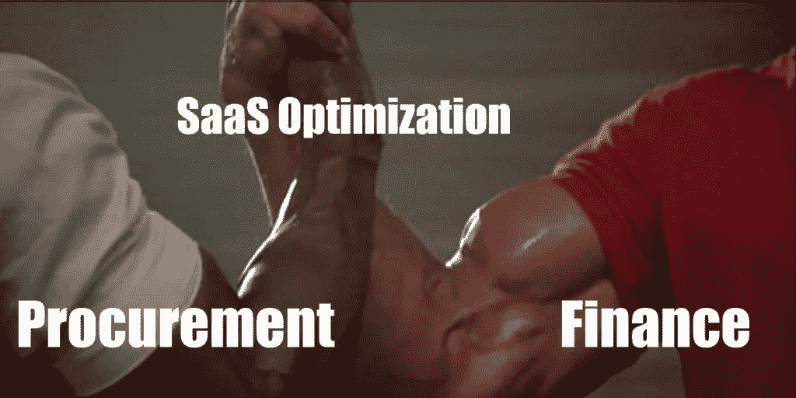
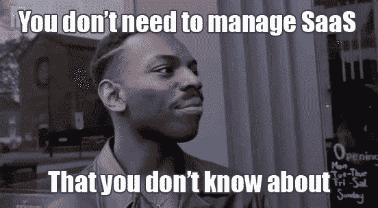

# SaaS 优化如何将财务和采购结合在一起

> 原文：<https://medium.com/swlh/how-saas-optimization-brings-finance-and-procurement-together-42f71bcf7fcb>

团队合作感觉很好。处理大项目需要团队合作。应对[影子 IT 问题](https://alpin.io/blog/shadow-it-problems/)和[螺旋上升的云软件成本](https://alpin.io/blog/cloud-software-spend-cost-savings/)对许多组织来说是一个关键挑战。

在 SaaS 优化领域，这两个重要的功能发现他们的利益密切相关。Alpin 是财务和采购主管用来自动管理云应用程序的工具。如果你想知道如何恢复你的一天，摆脱世俗的任务，请继续读下去！

# 对 SaaS 采取行动并跟踪它只是更多的工作吗？

如果你有这种感觉，那么你并不孤单。然而，公司发现云应用程序*正在被管理，只是很差。随意处理它们的借口越来越少。管理和优化 SaaS 的新战略和工具已经出现。*

此外，优化 SaaS 有助于采购和财务部门实现其核心目标。

# 为采购和财务优化 SaaS 的好处

*通过分析员工费用账户改进报告和设置优先级*

处理大量的费用数据可能很麻烦。不幸的是，员工花费了软件成本的很大一部分。

**财务**可以使用详细的 SaaS 费用数据来更好地对费用进行分类和归属，包括获得所有软件费用的一个视图。如果您以正确的方式查看正确的数据，那么降低成本、整合或达成更好交易的领域可能会变得非常明显。

**采购**可以看到正在使用什么类型的软件，什么越来越受欢迎，或者什么急需一个节约成本的企业协议。一个构造良好的类别树意味着你不仅可以单独查看费用，还可以按 SaaS 类别查看。这可以帮助采购部门对项目进行优先排序，从而真正推动价值，而不仅仅是节约成本。

*通过深入了解用户和许可证来削减成本并做出数据驱动的决策*

**财务**能快速发现并大规模削减成本。详见我们关于[削减 SaaS 成本](https://alpin.io/blog/alpin-financial-management-cut-costs/)的帖子。我们讨论节省高达 30%的 SaaS 成本，因为发现许多未使用或未充分利用的许可证是很常见的。在 Alpin，我们最近看到了一个案例，一个已经离开很久的前实习生仍然每月支付软件费用。

**采购**可以查看复杂的细节，谁使用什么软件。通过使用聪明的发现方法，他们可以看到免费或免费增值应用程序越来越受欢迎，可能很快就会成为大项目。利用这些数据以及各种应用程序的员工情绪得分，采购主管可以证明他们的优先级。

*通过在日历中整合续约和合同信息来改进预测和合同管理*

**财务部**可能会很高兴能够在一个地方看到他们预计会发生的 SaaS 总费用。更好、更快的预测和规划——谁能抱怨呢？

采购再也不会错过更新日期。相反:一份综合的 SaaS 复兴日程表不仅能防止意外，还能推动及时的谈判。在采购谈判的同时，他们还将拥有用户数据，可以作为与任何 SaaS 供应商谈判的筹码。

**有兴趣亲自体验这些好处吗？我们很乐意为您和采购或财务部门的同行做一个演示。通过邮件**[**info @ alpin . io**](mailto:info@alpin.io)**开始使用。**

## 这篇文章发表在 [The Startup](https://medium.com/swlh) 上，这是 Medium 最大的创业刊物，拥有+ 371，147 名读者。

## 在这里订阅接收[我们的头条新闻](http://growthsupply.com/the-startup-newsletter/)。

