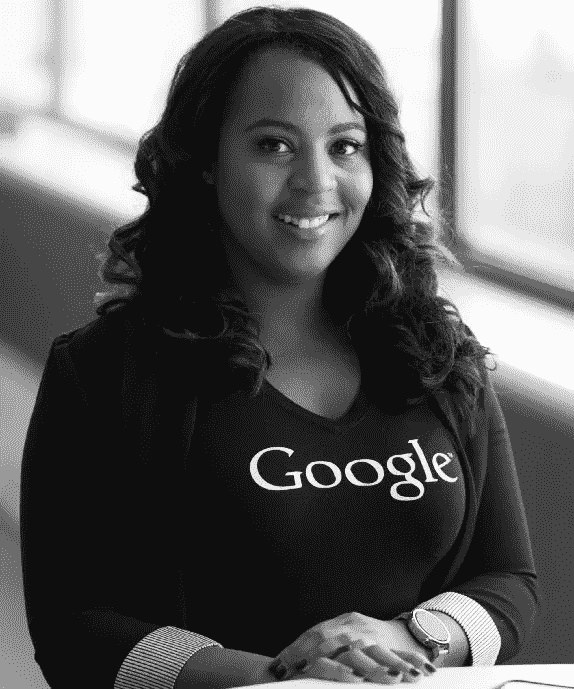

# 设定正确的目标如何让梦想成真

> 原文：<https://medium.com/swlh/how-setting-the-right-goals-can-make-dreams-come-true-a18aba42d4db>

## 原来你能做的不仅仅是希望和祈祷。

Photo by [Sam Schooler](https://unsplash.com/@sam?utm_source=medium&utm_medium=referral) on [Unsplash](https://unsplash.com?utm_source=medium&utm_medium=referral)

这就是为什么设定目标经常被誉为成功的“第一步”的原因。它组织任务，给你方向感。但是，我们很多人都设定了错误的目标。我们正在设定**物质目标**。

毕竟，我们可以*说*，“我想要十亿美元”，但对我们大多数人来说，这是不可能的。类似这样的事情完全不受我们的控制。但是，我们*能够*控制的是**我们自己**通过设定性格、个性和习惯性特征的目标。换句话说，我们都应该设定**个人目标。**

> 如果你不成功，唯物主义的目标会击垮你，即使你成功了，也会让你失望。无论结果如何，个人目标都会帮助你成长。

# 我从惨痛的教训中吸取了教训

This was a piece of pride, but now it’s merely a piece of metal.

在我高中一年级开始的时候，我向自己承诺，我会尽可能地赢得更多的全国性奖项。我想，“去年我看到自己做到了，为什么今年不呢？”

但是，我的动力减弱了，在我意识到之前，我已经浪费了四分之一的高中生活。我为自己感到羞愧。

直到我意识到这不是我的职业道德的问题。这是我的目标。这不是不现实的，但绝对是太物质化了。

> 随着闪亮奖牌的光泽逐渐消失，我的动力也随之减弱。就这样，我放松了。

那是因为物质目标是间接的。与此同时，他们依赖于你，个人目标只是基于你。只要你想成为一个更好的人，他们就会一直在你身边。

起初，我觉得自己很失败……直到我意识到我已经实现了我的一些目标。尽管他们没有给我颁发任何奖牌，但他们奖励了我一些更好的东西。

> “自我提升是游戏的名称，你的首要目标是增强自己，而不是摧毁对手。”
> 
> ~Maxwell Maltz，心理控制论的作者

我记得在一个漆黑的夜晚，在我第一天的乐队露营后，我走回家。我谁都不认识，一直感到很尴尬。所以那天晚上，我发誓我会努力走出自己的外壳，变得更有魅力。

不久之后，我交了一个重要的朋友。他是我见过的最外向的人之一。我们变得很亲密，最终，他的习惯感染了我，提升了我的魅力和自信。我们的友谊甚至让我的价值观更倾向于自发性和活力。

事实证明，我的朋友也有一个不言而喻的个人目标。我注意到他似乎对自己的魅力态度感到羞愧。他觉得自己无法建立信任，因为他太不成熟——这和我的问题完全相反。

你看，这些是个人目标。起初我们看不到它们，但目标下意识地将我们拉在一起，就像磁力一样。这只是巧合吗？还是没有？

> 对我来说，这不仅仅是运气。

毕竟，乔布斯和沃兹尼亚克成为硅谷最伟大的二人组是“偶然的吗？”当然不是。看一看:

## “…[沃兹尼亚克:]‘我们有很多共同点。通常，我很难向人们解释我在做什么，但是史蒂夫马上就明白了。我喜欢他。他瘦瘦的，结实的，充满活力。

## 乔布斯也印象深刻。“沃兹是我遇到的第一个比我更懂电子产品的人，”他曾说，并延伸了自己的专业知识。我马上就喜欢上他了。我比我的年龄成熟一点，他比我的年龄不成熟一点，这样就扯平了。沃兹非常聪明，但在情感上他和我同龄。”([艾萨克森](https://www.amazon.com/Steve-Jobs-Walter-Isaacson/dp/1451648537/ref=sr_1_1?ie=UTF8&qid=1530206239&sr=8-1&keywords=steve+jobs) 25)。

Photo by [Medhat Dawoud](https://unsplash.com/@medhatdawoud?utm_source=medium&utm_medium=referral) on [Unsplash](https://unsplash.com?utm_source=medium&utm_medium=referral)

结果是什么？

*   近代史上最成功的公司之一，
*   硅谷创业二人组的现代标志，
*   创业文化的阴阳两极。

有些人甚至会说，**精力充沛的乔布斯**是**电力**到**明亮的沃兹尼亚克的灯泡**。甚至他们的心理年龄也“持平了！”

正如你所看到的，我们总是在成长，但是我们成长的方面却不太清楚。我们许多人认为我们不能控制这些方面，但是有了个人目标，我们就能控制我们的成长。

> 换句话说，照顾和提高自己是你的责任。现在，有了个人目标，**你**可以选择你的**成长在哪里。**

那么你是怎么做到的呢？

说你想变得更有效率。你的目标可以是“增加‘动力时间’的长度，限制分心。”

这些目标之所以有效，是因为它们将较大的最终目标分解成了你今天就能完成的较小部分**。然后，你可以给每个目标分配简单的任务。例如，“更加专注”可以简单地意味着在你的手机上安装一个生产力应用或者在你的电脑上屏蔽 YouTube。**

****

**这些类型的目标也更多地集中在你生活的某个特定方面。**

**“我想在谷歌找份工作”和“我想成为谷歌愿意雇佣的人”看起来是相似的目标，但它们引发了完全不同的反应。**

**第一个会促使有希望的求职者改进她的简历和/或关系网。这些都是表面工作，不会帮助她赢得面试。**

**与此同时，第二个版本将敦促这位目光明亮的谷歌人提高自己的技能，研究谷歌的文化，甚至完善自己的个性。**

**现在，你是愿意雇佣一份令人眼花缭乱的简历还是一个刚刚成为更好的人的女孩加入你的公司？我知道我会选哪一个。**

> **个人目标迫使你想象你想成为什么样的人**—**而不是**你想拥有什么样的**简历**或**学位**。****

****坚定的目标是实现成功人生、避免精疲力尽和实现梦想的关键。但是要意识到他们只会帮你为他们做计划。请记住:****

> ****“你不能把名声建立在你将要做的事情上。”****
> 
> *****~亨利·福特*****

******嘿！**感谢阅读。我不打算在这里要求太多，只要你给我一个[跟着](/@slu.true)！这真的会促使我写更多的东西！:)****

********

## ****这篇文章发表在 [The Startup](https://medium.com/swlh) 上，这是 Medium 最大的创业刊物，拥有 340，876 多名读者。****

## ****在这里订阅接收[我们的头条新闻](http://growthsupply.com/the-startup-newsletter/)。****

********