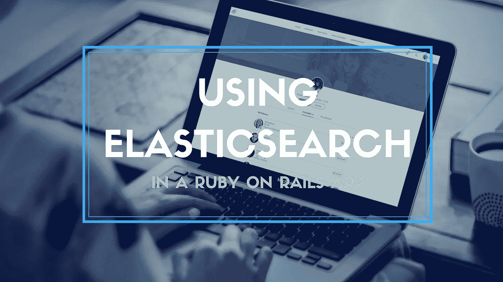

# 在 Ruby On Rails App 中应该如何使用 Elasticsearch？

> 原文：<https://medium.com/swlh/how-should-you-use-elasticsearch-in-ruby-on-rails-app-3d8d6997cc75>

lasticsearch 是一个强大而灵活的开源、分布式、实时搜索和分析引擎。这是搜索技术的黄金标准。它构建在 Apache Lucene 库之上，为查询和索引大量结构化数据提供了一个健壮的 RESTful HTTP 接口。开箱即用，它提供了一个高效，可扩展和强大的搜索。Elasticsearch 的一个主要特点是，它分布在它的核心，这意味着为了冗余或性能，你可以很容易地横向扩展它。

Elasticsearch 也可以用作数据存储引擎，但它有一些**缺点**:

*   在 Elasticsearch 中，数据是“近乎实时”可用的。也就是说，当你对一篇文章提交评论并刷新页面时，它可能不会显示出来，因为索引仍在更新。
*   Elasticsearch 没有给出任何门禁系统或者内部安全。您将需要一个防火墙来保护 ES 免受外部访问。
*   对数据库端高级计算的支持也是有限的。
*   尽管 ES 是分布式的且相对稳定，但备份并不像其他数据存储解决方案那样优先考虑。如果 Elasticsearch 是您的主要数据存储，您可能需要重新考虑一下。

# 关于 Elasticsearch 你需要知道的:

Elasticsearch 是面向文档的。它使用文档来存储它的整个对象。这些文件被编入索引以便于检索。这里，文档属于一个类型，而类型属于一个索引。每一个 ES 索引都可以被分割成许多称为碎片的部分。当您需要的存储卷超出单个节点或服务器的能力时，这就完成了。它还可以通过跨分片并行化操作来提高 ES 集群的性能。

一旦创建了索引，主碎片的数量就固定了。这基本上定义了索引中存储的最大数据量，因为每个节点都受到 CPU、RAM 和 I/o 数量的限制，至少可以容纳一个碎片。您只能在创建索引后更改副本碎片的数量，尽管这只会影响集群的吞吐量，而不会影响实际的数据存储能力。

# 你真的需要 Elasticsearch 吗？

通常，您试图解决的问题可以通过一些高级的 SQL 查询和一些新的索引更容易地解决。通常在两种情况下使用 Elasticsearch 是有意义的。

全文搜索是 Elasticsearch 的初衷，也是为了对复杂数据进行反规范化。通常情况下，我们会尝试将我们的数据标准化，以匹配我们的模型。但是当查询规范化的表时，我们可能会遇到一些性能问题。使用像 Elasticsearch 这样的搜索技术，可以更快地对数据进行反规范化和检索。

如果您确实需要 Elasticsearch，下面的说明应该可以帮助您开始:

*   遵循 Elasticsearch 提供的安装说明。
*   如果这恰好是您添加到项目中的第一个 Elasticsearch 索引，那么您必须安装 elasticsearch-rails 和 elasticsearch-model gems。
*   要配置 gem，您需要一个初始化文件来设置模型使用的 Elasticsearch 客户端。
*   一旦[轨道项目](https://www.cognitiveclouds.com/custom-software-development-services/ruby-on-rails-development-company)准备就绪，就在模型上建立索引。
*   建立索引的第一步显然是在您想要搜索的模型上配置索引。然而，推荐的方法是将索引逻辑封装到一个 ActiveSupport:: Concern 中，它可以包含在您的模型中。请记住，这里您只需要对需要搜索索引的字段/关系进行索引。索引的字段越多，Elasticsearch 中的索引就越大。这意味着你需要更强大的硬件，而且索引越大，搜索查询的时间就越长。接下来，决定有多少碎片将保存数据。如果预计数据量不大，建议使用一个主碎片。
*   一旦定义了索引，就该开始查询了。记住，在开始查询之前，您需要索引一些数据。elasticsearch-model gem 为 RESTful Elasticsearch API 提供了一个强大的搜索接口。您可以使用 Elasticsearch 文档中提到的任何 API 端点进行查询。
*   只要包含 elastic search::Model::Callbacks，就可以设置自动回调。自定义回调很容易定义，并且您可以控制何时真正希望更新索引。
*   最后，花时间写一个更快的导入。内置导入效率不是很高。

> *这并不是在你的项目中使用 elasticsearch-rails gem 的唯一方法，但是这种方法对我们来说非常有效。*

# 耐嚼宝石

弹性搜索模型宝石的替代品是耐嚼宝石。它增加了 Elasticsearch-Ruby 客户端，使其更强大，并使我们与 [*Rails*](https://www.zibtek.com/Ruby-on-Rails-Development-Company) *更紧密地集成。比较好用，你肯定会喜欢 API 这样的 ActiveRecord。我们选择了 elasticsearch-model gem，因为它让我们可以直接访问 elasticsearch 的“低级”普通查询，因此我们可以轻松地定制我们的查询。*

*原载于*[***cognitive clouds 博客***](https://www.cognitiveclouds.com/insights/how-should-you-use-elasticsearch-in-ruby-on-rails-app/)***:*****[*ruby on rails 开发公司*](https://www.cognitiveclouds.com/custom-software-development-services/ruby-on-rails-development-company)**

****

## **这篇文章发表在 [The Startup](https://medium.com/swlh) 上，这是 Medium 最大的创业刊物，有 300，118+人关注。**

## **在这里订阅接收[我们的头条新闻](http://growthsupply.com/the-startup-newsletter/)。**

****