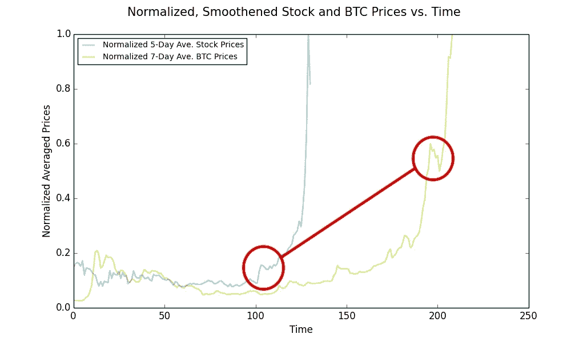

# 加密泡沫与网络泡沫有多相似？

> 原文：<https://medium.com/swlh/how-similar-is-the-crypto-bubble-to-the-dot-com-bubble-bd6f30992e60>

# 两波非理性繁荣的分析比较。

在比特币和区块链的时代，互联网泡沫后期的跟风者认为他们被赋予了第二次致富的机会。结果，加密货币受到了艾伦·格林斯潘(Alan Greenspan)所描述的困扰互联网时代的各种猖獗的“非理性繁荣”的影响。在过去的一年里，加密货币赋予了这种投机行为新的生命，以臭名昭著的阿尔法货币比特币为首。

结果，社会分裂成两种性格:一种是迷恋比特币和去中心化未来的人，另一种是厌倦听到比特币的人。这个话题变得两极分化。对于每一个支持这项技术的有影响力的人来说，都有一个同样有声望的声音在喊废话。每天，推销自己为“加密专家”和“全职加密货币交易员”的人都在增加。一个特别令人不安的趋势是秘密投资建议专栏的涌入。少数几个好的建议是，你要负责任地投资，理解你所买入的企业，并在方法上自律。坏的听起来像点击诱饵(例如，“如何预测下一个涟漪，以太坊和比特币”，“你现在需要投资的加密货币”，等等。).

虽然该行业正在动员，但最接近该技术的人很难预测其发展轨迹。我看到的大部分预测都不是植根于数据或者深度分析，而是感觉和氛围。我不是说我有正确的答案，但我相信有更好的方法来预测比特币和其他密码的轨迹。这甚至可能有助于验证这项技术是否有前途。一个潜在的方法是从互联网泡沫中寻找先例。从这里开始的任何分析都会引发几个问题:

*   这两个泡沫实际上相似吗？
*   如果是的话，我们能大胆猜测比特币泡沫的终结吗？
*   我们能预测爆炸后尘埃需要多长时间才能稳定下来吗？

这些是我希望用严格的分析技术来回答的问题。为了适应本文可能收到的各种级别的承诺，我包括了一个 TL；博士版本，以及更长的分析。

# 简短版:

所有伟大的分析都始于一个假设，所以我的假设是:如果互联网泡沫和加密泡沫相似，那么我们可以用互联网泡沫来预测加密泡沫的未来。本文主要关注这句话的前半部分:证明泡沫是相似的。

我应用了一种在模式识别中被称为动态时间扭曲(DTW)的流行技术，来验证加密泡沫与 20 世纪 90 年代末/21 世纪初的网络泡沫有相似之处的说法。对于数据，我利用了两个时间序列，我认为这两个时间序列代表了两个市场的长期增长和趋势:1)互联网泡沫期间 600 多家互联网公司的股价总和；2)从 2013 年开始的比特币价格。在几次数据收集、清理、缩放练习之后，我使用 DTW 来战略性地绘制数据点，从而最小化系列之间的距离。最终，我将这条路径与最佳情况下的完美直线路径进行了对比。结果表明气泡之间的关系是显著的！我使用了三个有价值的统计数据来评估回归模型的拟合度:R、总体 f 检验和回归的标准误差。所述路径相对于回归的 R 值为 0.92，而回归的标准误差约为 16.8(或约 10%的差异)。所以数据非常符合理想情况。最后，我运行了 f 检验，并能够得出结论，回归的拟合是显著的(F 统计= 3，720.68；p = 0.0000)。也就是说，互联网泡沫和加密泡沫之间的相似之处得到了验证。

既然我已经证实了泡沫是相似的，在接下来的文章中，我将使用一种叫做格兰杰因果关系的计量经济学技术，来看看互联网泡沫数据是否可以用来预测加密泡沫的增长，以及它可能的终结。

# 长版本:

在开始之前，重要的是要认识到气泡的大小是非常不同的。在巅峰时期，互联网泡沫期间纳斯达克的市值约为 6.7 万亿美元，而加密货币泡沫目前约为 8000 亿美元，约为其规模的八分之一。**因此，我并不试图了解它们在数量上是否具有可比性，而是想了解它们在增长上如何进行比较。**为了实现这一点，我专门隔离了这段时间互联网公司的增长，并将它们的趋势与比特币的崛起相比较。

首先，我所有的源代码都在 Github 上，可以在这里找到。你可以在本文底部的同名部分找到我所做的假设的解释；然而，这个分析的基础是以我的核心假设为中心的，即公司的股价与加密货币的价格相当。这两个数量都是以投机的方式买卖的，倾向于相似的波动，大小也相似。股票的未来也可以用加密货币进行分配和交易，这进一步巩固了这种类比。

这种分析和许多其他分析一样:收集数据。我整理了一份 1980 年至 2017 年间最大的 600 家上市互联网公司的名单。这个列表可以在链接的 Github 页面上找到。然后，我使用 Pandas Datareader 从雅虎财经中挖掘了从那时到现在所有这些公司的每日股价数据。我能够得出每家公司的每日最高价、最低价、开盘价和收盘价。为了便于分析，我使用了每日收盘价，因为这是交易者在评估中常用的价格。后来，我截断了从 1997 年 8 月 5 日到 2000 年 3 月 10 日的数据。

对于每一天，我取了我上面提到的 600 家公司的平均股价(当然，并不是所有的 600 家公司都在或一直在经营)。需要注意的是，我删除了股票市场不交易的日期(即周末和公共假日)。

这个数据收集阶段的加密部分更加简单。由于比特币拥有最大的市场份额，我相信它的价值足以有力地表明整个市场。要进一步了解这一决定的理由，请查看假设部分。我用北海巨妖交易所的 API 按天编制了比特币从 2013 年 9 月 9 日到 2017 年 9 月 9 日的历史价格。

这里是我停顿的地方。这两个数据集都有一些固有的挑战，我执行了一些不同的数据操作来解决它们:

*   **大量噪音:**股价数据包含大量噪音，极易波动。比特币价格也不例外。为了应对股票价格的快速波动，我采用了五天(每周)平均值。我对比特币价格做了同样的研究，但取了 7 天的平均值，因为 BTC 可以全天候交易。
*   **不同尺度:**此外，两个信号在幅度上不具有可比性。简单地说，互联网泡沫比比特币泡沫大得多(就目前而言)。比较市值可能比股票/硬币价格更好，但随着时间的推移，很容易确定网络泡沫的市值有点棘手。为了解决缩放的问题，我对每个数据集进行了规范化，这样所有的值都是相对的，范围从 0 到 1。
*   **时间线不均匀:**最后一个问题是时间序列不均匀。查看“假设”选项卡，了解我选择开始/结束日期的原因。通常，不均匀时间序列的解决方案是使用插值来填充空隙，但我们的数据集以相同的速率均匀采样。我最终选择使用动态时间扭曲是因为需要解决这个挑战。我将在本文后面解释原因。
*   **其他观察:**两个数据集都是非季节性的。我不确定是否值得提及异常值，因为我们正在调查投机泡沫，而不合理的结果正是我们试图理解的。

在这次清理之后，我绘制了标准化的平滑价格与时间的关系图，如下所示。乍一看，结果很有希望:

既然这些数据是关于我们需要它的地方，让我们进入有趣的部分:比较数据系列。动态时间弯曲(DTW)是一种流行的分析时间序列的技术，特别是对于那些节奏和长度不同的时间序列。

从本质上说，DTW 是一种技术，用于战略性地绘制时间序列中的点，并找到它们之间的**最小集合**欧几里德距离。它通过创建一个由时间序列中所有点之间的距离或“成本”组成的矩阵来做到这一点。然后，我们遍历矩阵，从两个序列开头的矩阵单元开始，选择彼此之间距离最小的点。这就是 DTW 将时间序列值配对以最小化“成本”或点之间距离的方式。下图演示了这一具体过程:

我可以花更多的时间来解释这种方法，但是这是一种被广泛认可的模式识别技术。要真正理解这项技术，您可以查看以下资源:

*   [Youtube](https://www.youtube.com/watch?v=v_WLX0fu_UE) :声音有点烦人，但包含了很好的高水平解释，并通过一个例子
*   [金融中的 DTW:](http://citeseerx.ist.psu.edu/viewdoc/download?doi=10.1.1.1019.1590&rep=rep1&type=pdf)这是一篇有趣的论文，介绍了 DTW 在金融中的几种有效使用方式(我在本分析中使用了类似的方法)。

出于这个分析的目的，我使用了一个“快速 DTW”Python 包。小题外话:对于现成的算法，运行一个 [DTW 有 O(n)的时间和内存复杂度](http://www.cs.unm.edu/~mueen/DTW.pdf)，这不是很好。有一些算法技巧可以将空间和摊销时间复杂度降低到 O(n)。我使用的库利用了这些技巧，这就是为什么它被称为“快速 DTW”

对标准化的平滑时间序列运行 DTW，我能够获得时间序列和最低成本路径之间的距离。

现在我们有了路径和欧几里德距离的轮廓，我们该怎么做呢？我们如何利用这些结果对数据得出结论？我的第一反应是使用计算出的距离。由于数据是第一次规范化，我们的目标是将时间序列之间的距离联系起来。如果距离非常小，我可以轻松地说系列是相似的(这里我可以使用更严格的统计语言，但我仍然希望让大多数人相对容易理解)。如果没有，我可以放弃这个任务。但是我们如何设定评估这个数量的阈值呢？先例？我没有发现太多使用相同方法的类似分析。定性？在消化了关于这两个泡沫的大量信息后，我无法确定任何历史或背景指标，我可以在这里使用来设置一个合适的阈值。

这留下了算法的第二个输出:path。我花了一段时间才找到方法，但我想我已经找到了一个合理的方法。为了理解它，考虑一下这个分析中的边缘案例。如果两个时间序列相同，路径将是一条精确的线性直线，具有 1–1 个映射。如果这两个系列非常不同，这条路看起来会很不和谐。考虑到这一点，我在路径的起点和终点坐标之间画了一条直线(斜率= 1.60)。这条线代表了理想的结果和时间序列之间的完美协调。然后，我通过计算 R 值、f 检验和回归的标准误差来比较 DTW 路径和趋势线。下图总结了这种比较。

上面看到的结果表明，两个气泡之间的相似性是显著的！所述路径相对于回归的 R 值是 0.92，而回归的标准误差落在 16.8 左右(或大约 10%的差异)。所以数据非常符合理想情况。最后，我运行了 f 检验，并能够得出结论，回归的拟合是显著的(F 统计= 3，720.68；p = 0.0000)。也就是说，互联网泡沫和加密泡沫之间的相似之处得到了验证。我现在可以用这个假设作为两个泡沫之间任何后续比较分析的基础。

# 接下来:预测

既然我们已经确定两个泡沫有相似的趋势，我们可以用一个来预测另一个吗？看下面的图，我的直觉告诉我，我们也许可以。在下一篇文章中，我将探索一种叫做格兰杰因果关系的计量经济学测试的使用，看看我能否利用互联网泡沫数据对加密泡沫做出合理的预测。*提醒，以下情节均正常化。因为度量是不等价的，规范化它们允许我们制造更多的等价。*

# 假设:

*   最初，我想通过分析来确定网络泡沫的开始和崩溃前的日期。虽然后一个日期可以很容易地确定，但定义互联网公司投机性投资的开始可能需要相当广泛的定量分析。事实上，首先探究一下为什么会出现投机性投资也同样有意义。幸运的是，这种方法让我们的生活变得更加轻松。虽然许多人提到了新的计算机/IT 导向型公司、风险资本以及计算机和互联网消费的快速增长，但论文[资本利得税和股票回报波动性:来自 1997 年纳税人救济法案的证据](http://w4.stern.nyu.edu/emplibrary/CapitalGainsTaxes.pdf)提供了一个更明确的时间表。研究人员认为，1997 年的纳税人救济法案降低了资本利得税率，造成了更高的资产回报风险，并增加了股票回报的波动性。他们证明，减税之后，互联网公司中贪婪驱动的投机行为迅速猖獗。这篇论文的论点在定性和定量上都是站得住脚和令人信服的。因此，为了这个分析的目的，我假设网络泡沫的开始日期与 1997 年 8 月 5 日颁布的纳税人救济法案一致。确定结束日期要简单得多。纳斯达克综合指数在 2000 年 3 月 10 日达到 5132.52 点的峰值，在接下来的 2.5 年里下跌了 78%。出于显而易见的原因，我将互联网泡沫的终结定在了这个日期。
*   截至 2018 年 1 月 6 日，比特币的市值约为 2540 亿美元，而整个加密货币行业的价值为 7930 亿美元。因此，比特币代表了整个加密市场的近三分之一。虽然这很有说服力，但市值份额不足以证明比特币的表现代表了整个市场。这里也有无形的因素在起作用。我认为比特币的恶名本身就说明了它对市场的影响。比特币是用于 1)存储价值和 2)购买其他加密货币的基础加密货币。它的性能和价值有效地引导了与市场其他部分互动的能力。这类似于以太是建立在以太坊平台和网络之上的所有技术和货币的看门人。
*   这一分析的基础围绕着我的核心假设，即公司的股价与加密货币的价格相当。这两个数量都是以投机的方式买卖的，倾向于相似的波动，大小也相似。股票的未来也可以用加密货币进行分配和交易，这进一步巩固了这种类比。最后，我感兴趣的不是容量或数量，而是行业的增长和轨迹。我认为这两个数量是两个市场的高峰和低谷的标志。

## 我想过使用的方法，但没有…

*   **2 样本 T 检验:**该检验旨在了解每个系列的平均值之间是否存在统计差异。我不确定这在我们的案例中是否有价值，因为平均值的比较不会给我们一个系列之间相似性的指示。
*   **频谱分析:**这里的方法是对时间序列数据进行傅立叶变换，找到不规则时间序列数据的频谱，可以用来获得相应的功率谱密度。应用相应功率谱密度的逆傅立叶变换将产生具有均匀采样率的完整数据集。通常，这种方法只适用于以不规则间隔采样的周期性数据，并且不太可能包含异常值。由于我们的分析侧重于比较两个异常值，并且我们使用的是基本一致的非周期性数据集，因此这可能不是正确的方法。我也不确定这种方法是否可以用来将一个时间序列的结束扩展到另一个时间序列的大小。
*   **ARIMA** :我强烈考虑使用 ARIMA 模型来分析这些数据。以至于我甚至采取了切实的步骤来验证这种方法。我采取的第一步是确定我们想要选择哪种 ARIMA 模式。我从自回归(AR)模型开始。此模型是一个线性模型，它使用时间上的前一个值来预测时间序列的现值。为了确定 AR 模型是否合适，我绘制了股票价格(x[t])与其单一滞后值(x[t-1])的关系，并对比特币价格进行了同样的处理。这些图可以在下面找到:

*   股票价格值与 lag1 系列之间有很强的相关性(R = 0.92)。类似地，比特币价格值与 lag1 系列(未绘制)之间也有很强的相关性(R = 0.94)。这表明 AR 模型可能是一种很好的方法，因为它表明我们可以使用以前的值来预测当前的任何值。但我在这里停顿了一下。如果我们对两个系列都使用 ARIMA 模型，我们将如何比较它们？比较结果模型参数？对此有公认的统计方法吗？我不太确定。最终，这种相互验证的交流将我的注意力从 ARIMA 身上转移开了

## 随着时间的推移，我会改变的事情(排名不分先后)…

*   导出了一种更具分析性的方法来查找两个时间序列的开始和结束日期。
*   深入研究规模的差异
*   扩展到包括比比特币更多的加密货币

# 方法学

如前所述，我已经将我所有的源代码发布到 Github [这里](https://github.com/ritviknv/CryptoBubbleAnalysis)。除了贯穿全文的超链接之外，我还想指出以下用于支持此分析的数据源、工具和资源:

## **数据来源:**

*   [雅虎财经](https://developer.yahoo.com/yql/)
*   [北海巨妖](https://www.kraken.com/)
*   [CoinMarketCap](https://coinmarketcap.com/)

## **工具和资源:**

*   [熊猫-Datareader](https://pandas-datareader.readthedocs.io/en/latest/#)
*   [宾州州立大学 Stats 510 课程](https://onlinecourses.science.psu.edu/stat510/)
*   [关于不规则时间序列分析的论文](http://www-bcf.usc.edu/~liu32/paper/sdm2012_irr.pdf)
*   [快速 DTW](https://pypi.python.org/pypi/fastdtw)
*   [DTW 解释](http://www.phon.ox.ac.uk/jcoleman/old_SLP/Lecture_5/DTW_explanation.html)
*   [分析 20 世纪 90 年代的网络泡沫](https://papers.ssrn.com/sol3/papers.cfm?abstract_id=1152412)

## 这个故事发表在 [The Startup](https://medium.com/swlh) 上，这是 Medium 最大的创业刊物，拥有 290，182+人关注。

## 在这里订阅接收[我们的头条新闻](http://growthsupply.com/the-startup-newsletter/)。

