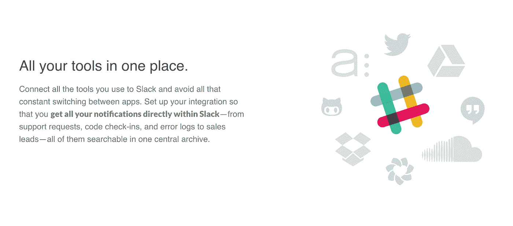

# Slack 的内容战略是如何从单一页面扩展到媒体公司的

> 原文：<https://medium.com/swlh/how-slacks-content-strategy-expanded-from-a-single-page-to-a-media-company-afe2e7fd9dbc>

*对 Slack 网站、社交媒体和内容策略的调查显示:*

*   Slack 是如何不断重复的，为什么
*   Slack 如何像媒体公司一样运营其营销部门
*   Slack 内容营销的定量和定性投资回报率

*在我们深入研究之前，我查看了 Slack 网站的几个版本，做出了这些观察。我把它们分别叫做，*[*【V1】*](http://web.archive.org/web/20131203140148/https://slack.com/)*[*【V2】*](http://web.archive.org/web/20141020014409/https://slack.com/)*[*V3*](http://web.archive.org/web/20150723215138/https://slack.com/)*[*v 3.5*](http://web.archive.org/web/20150918145153/https://slack.com/)*，以及* [*V4*](http://web.archive.org/web/20170115124439/https://slack.com/) *。****

**“如果一棵树倒在森林里，周围没有人听到，它会发出声音吗？”这个类比也适用于我们辛辛苦苦收集起来的想法。如果没有人能接触到传达思想的词语，它会产生影响吗？**

**例如，内容战略家 Gerry McGovern 为微软做了一些挖掘工作，发现其网站上 1000 万页中有高达 30%的内容完全未被阅读。像这样错过的机会是 Slack 这样的竞争对手必须识别和利用的，以便竞争和获胜。**

**以下是每位首席执行官、产品营销人员和文字设计师在制定企业内容策略时需要考虑的三个想法:**

# **1.如果足够重要，就不止一次地说**

**人们通过略读阅读[。在你的网站上把最重要的事情说一遍是不够的。重复不再令人厌倦。它是*必不可少的*、*、*，因为如果摆放得不显眼，大多数读者可能会错过它。](https://www.nngroup.com/articles/how-users-read-on-the-web/)**

**更细心的读者会注意到这种重复，但没有特征描述、证明或任何其他短语是完全相同的。相反，每一个都增加了一个要点…**

**一条*主线*将传达这些要点的句子串联起来。例如，在 Slack 主页的第三个版本(V3)中，有一个带有三个面板的滑块，突出显示了 Slack 最重要的功能——“频道”、“集成”和“搜索”——在折叠上方。**

**这些特性中的每一个都有自己的主线，但是“集成”对于潜在用户来说尤其重要，因为它方便、组织和整合。让我们深入了解 Slack 是如何构建“集成”的:**

****

**[Full version (July 23, 2015)](http://web.archive.org/web/20150723215138/https://slack.com/)**

> ****集成**
> 将你已经使用的工具插入 Slack，在一个地方获得你所有的通知**

**“集成”在折叠上方滑块的第二个面板上。假设有人在滑块改变之前不小心滚动过去。他们的目光直接跳到了产品功能部分的网格上:**

****

> ****超过 80 个集成**
> 它不是你必须使用的“又一个应用程序”。Slack 适用于您已经使用的所有工具；将它们设置为在单个工作空间中直接向 Slack 发布通知。"**

**Slack 以数量“80 个集成”开始它是视觉化的，让读者知道 Slack 并不全是空话。第一句话预料到了读者的反对，用不同的话重新解释了“集成”，“通知…在一个单一的工作空间。”现在，假设他们即使错过了，因为它和其他五个点一起被埋没了…**

****

> ****喜欢你团队的集体大脑。**Slack 集成了超过 **80 种外部服务**来帮助你从外部工具中获取及时、相关且可搜索的信息。不再需要在应用程序之间切换。**将所有内容集中在一个简单的地方**。**

**假设读者一直滚动，他们不可能错过这个。它本身就是一个特色简介，用一个明喻来捕捉想象力，“就像你团队的集体大脑。”我怀疑这是 Slack 的第一个主页(V1) 上的一个[残留的想法，在推荐之前的一个标题，描述 Slack，“它就像是你整个团队的一个无限大脑。”](http://web.archive.org/web/20131203140148/https://slack.com/)**

**请注意生产要素网格中重复出现的数量，对“及时、相关且始终可搜索”的强调，以及以“全部集中在一个简单的地方”结尾。**

**对 Slack 来说，“整合”点对于一般读者漫不经心的阅读习惯来说显然太重要了。因此，他们在主页上重复了三次 T21 的一些变体。在[他们的旅游页面](http://web.archive.org/web/20150717111804/https://slack.com/is)，他们深入到通知的类型，为读者描绘了一幅非常具体的画面:**

****

> **你所有的工具都放在一个地方。
> 把你用来偷懒的所有工具都连接起来，避免所有那些不停切换的应用。设置您的集成，这样您**就可以在 Slack** 中直接获得所有通知——从支持请求、代码检入、错误日志到销售线索——所有这些都可以在一个中央归档中进行搜索。**

**正如您可能从之前的观察中所猜测的那样，出现了“全部在一个地方”、“通知”和“一个中央归档”这样的想法。最有趣的是，在旅游页面的最后一点(“所有的工具都在一个地方”)，这一点也与“搜索”联系在一起。**

**重复确保粗心的读者留下你想告诉他们的事情的印象。它还向更细心的读者强调了这些重要的观点。强大的内容策略将不同页面和属性的读者的主线联系在一起，相互加强。**

# **2.作为媒体公司的 Slack**

**Slack 最有趣的一个方面被大多数其他创业公司忽略了——他们的*品牌*。Slack 不仅在产品和网站的美学上投入巨资，还在传达更大理念的内容上投入巨资，将故事与他们的品牌捆绑在一起。俗话说，“每家公司都是媒体公司。”**

**一些公司，如 Peloton 和 Tonal，将这一点铭记于心，将媒体与他们产品的灵魂结合起来。Slack [最终推销的是“组织转型”，](/@stewart/we-dont-sell-saddles-here-4c59524d650d)所以它在媒体上投入了大量资金来支持心态的改变。除了 Slack 的播客之外，以下是我写作时的每一个播客(请注意它们的每个媒体频道都有自己的名称和域名):**

*   **博客:[几个人正在输入](https://slackhq.com/)，根据 [Similarweb](https://www.similarweb.com/website/slackhq.com) 的数据，在 2018 年 7 月之前，该博客平均每月获得 150，000 次浏览量。在 2018 年 7 月 [Slack 团队迁移到 WordPress.com](https://slackhq.com/)之前，它是在 Medium 托管的[，因为他们想要](https://medium.com/several-people-are-typing)[更多的定制工具和工作流](https://twitter.com/SlackHQ/status/1022286788369543168)(以及更精细的报告)。Medium 作为 Slack 的可靠主机服务了两年，以吸引读者，并在几乎没有设计和开发资源的情况下运营。**
*   **工程博客:[几个人正在编写代码](https://slack.engineering/)仍然在 Medium 托管，根据 Similarweb 的数据，[的浏览量波动很大，在 45，000 到 120，000 之间。](https://www.similarweb.com/website/slack.engineering)**
*   **设计博客: [#slack-design](https://slack.design/) 在 Medium 主持。它的访问量还没有它的主博客或工程博客多。**
*   **工作论坛: [Slack at Work](https://slackatwork.com/) 是一个工作论坛，也在 WordPress 上，Slack 的客户可以在这里发布他们的工作。**
*   **商店: [Slack Shop](https://www.similarweb.com/website/slack.shop) 是一家 Shopify 商店，出售 Slack merch，比如品牌袜子和贴纸。这也是一个品牌和企业责任的游戏，每月将商店的收益捐赠给一个新的慈善机构。**
*   **Twitter: [@slackhq](https://twitter.com/@slackhq) 是他们大部分支持和[品牌互动发生的地方](/several-people-are-typing/finding-our-twitter-voice-2684669345ab)。人们在 Twitter 上与 Slack 聊天。这是他们的双向渠道，而前面提到的类似广播。**
*   **播客#1: [Slack 综艺包](http://web.archive.org/web/20150818234527/https://slack.com/varietypack)，通过 Soundcloud 和 iTunes 发布。**
*   **播客#2:最终，Slack 弃用了 slack Variety Pack，[制作了第二个播客](http://web.archive.org/web/20170126113624/https://slack.com/podcast)，命名为“工作进行中”，并在 SiriusXM 和 iTunes 上发布。**

**每个创业公司通过品牌建立信任并最终推动销售的方式都略有不同。例如，Buffer 的假设是透明度比所有其他方法更快地建立信任，因此他们建立了一个[透明度仪表板](https://buffer.com/transparency)。漂移的假设更进一步，说真实性更快地建立信任，所以他们建立自己的电视真人秀。**

**我相信 Slack 的更少深思熟虑，更有机的假设是人类比其他所有方法更快地建立信任。这是他们声音的核心部分([清晰、简洁、人性化](https://slackhq.com/one-voice-many-hands))。这也是微软和许多其他公司的声音和品牌的对立面。即使有这些品质，Slack 的魅力也在于他们如何表现它…**

**人类的经验非常广泛。Slack 选择与他们的读者分享*情感*(例如[爱之墙](https://twitter.com/slacklovetweets))，并通过投入巨资进行内容创作，通过*优质作品*来传达这种情感。原则上，这和艺术没什么不同。**

**例如，他们的播客都探索工作的本质(例如，一个[公司退休人员重新进入劳动力市场](https://slack.com/podcast/episode-31)，因为人们花越来越多的时间做这件事(有时[通过它找到意义](https://www.1843magazine.com/features/why-do-we-work-so-hard))。他们的博客也是如此。他们的工作板块也是如此——因为人们的工作地点会极大地影响他们的个人生活(异地恋、旅行机会、通勤等等)。).**

**Slack 雇佣了像 Pacific Content 这样的专家来创建他们的播客。他们还雇佣插图画家为每篇博文创作独特的艺术作品。他们联系公司外的人进行采访，并在博客上发表，就像杂志会做的那样。**

**在不忽略他们的核心通信产品的情况下，所有这些内容都加速了人们对 Slack 的信任，并建立了 Slack 的可信度和受欢迎程度。在不同程度上，他们的每一处房产现在都是他们可以控制和拥有的防御营销资产，尤其是在他们开始托管自己的博客(可以从 WordPress 导出)之后。他们在网上也有大量的房地产，其中很多分布在平台上(例如，Twitter，他们在 Medium 的设计和工程博客)。**

**还要考虑每个项目的开始——只有工作现场的空闲时间需要开发资源(将 WordPress 设置为工作板)。他们的博客[从 Tumblr](http://web.archive.org/web/20141218094833/http://slackhq.com/) 开始，然后转移到 Medium。他们的支持和品牌互动因 Twitter 的平台影响力而扩大。他们通过链接到他们在 V2 的爱情列表墙，将他们的 Twitter 互动带回他们的网站，并将来自这个账户的[推文嵌入 V3](http://web.archive.org/web/20161108003640/https://twitter.com/slacklovetweets) ( [存档不能很好地加载](http://web.archive.org/web/20150723215138/https://slack.com/))。**

****

**[Full version (October 20, 2014)](http://web.archive.org/web/20141020014409/https://slack.com/)**

**对于任何其他组织，我建议他们建立一个邮件列表。这通常是所有拥有的内容属性的锚，因为可以下载和存储电子邮件列表。然而，由于这是 Slack，他们的全部目标是*消灭电子邮件*，他们最好建立一个 Slack 用户的大型社区(例如，friends.slack.com)。**

**总而言之，Slack 的内容有着令人难以置信的完整性和品味。我喜欢它。如果你告诉我有一本 Slack 杂志，对我来说，它看起来就像是 Airbnb 的菠萝(而不是他们可怕的新杂志)。融入信任，这些感觉可能足以让你放弃电子邮件。**

**信任是无价的资产，但直接投资回报率的问题不可避免地出现了。他们在 Medium 上的博客(slack.com)似乎没有让很多人回到他们的主网站(slack.com)。在撰写本文时，Similarweb 报告称，他们网站总流量的 0.57%来自推荐。**

****

**然而，Openview 的一张[旧截图强调了一年前类似的 web 统计数据，报告称 slackhq.com 贡献了 2%的推荐流量:](https://labs.openviewpartners.com/slack-saas-growth-strategy/#4)**

****

**我的猜测是 Slack 不太关心他们的内容的搜索引擎优化，或传统意义上的“内容营销”成功指标。他们只是想要教育人们和建立信任的内容。事实上，在我写这篇文章的时候，他们似乎正在为它招聘人才。他们的口碑营销、通过整合的搜索引擎优化和应用生态系统，都比内容更好地促进了用户的获取和转化…**

**但是他们的内容使 Slack 比他们目前的竞争对手(微软、IBM 等)更受 T2 的青睐和 T4 的信任。).并且，他们的内容引领了一种全新的工作思维方式，留住了忠诚的品牌用户，为他们公司的未来奠定了基础。**

# **最后的想法**

**Slack 的内容战略与他们的业务一起成长，从他们网站(V1)第一版的[一个页面](http://web.archive.org/web/20131203140148/https://slack.com/)，到第四版的【V4】一个[媒体公司。然而，原则保持不变。他们不害怕重复重要的事情，他们讲述人类的故事，他们投入巨资通过他们的“媒体公司”分支分发他们的内容。但是如果你看了他们的网站，你会意识到我可以涵盖更多的内容。](http://web.archive.org/web/20170115124439/https://slack.com/)**

**说到底，Slack 关注的是人类。他们说话坦率、礼貌、有礼貌。不管有意识还是无意识，它们与我们过去消费内容的方式一致。他们将综艺节目的形式应用到他们的播客中，像杂志一样，他们将漂亮的插图和深入的采访结合到他们的博客中。他们不仅投资于他们的技术平台，还通过教育宣传他们产品的价值。如果不了解它的可能性或如何实际使用它，即使是世界上最强大的工具也是无用的。**

**隐喻在内容策略中泛滥成灾，部分是因为工作人员的创造性，部分是因为这是一门新学科，没人理解它。除了属性、CMS 和信息架构之外，事情非常简单:**

*****创造值得谈论的想法，想好如何谈论，在哪里谈论。*****

***特别感谢*[*Joey Loi*](https://www.linkedin.com/in/joeyloi/)*对这个早期版本的想法。***

***感谢阅读！我是赫伯特，* [*神奇穿梭*](http://wondershuttle.com/work/) *的创意总监。我们是一家营销工作室，在网站和内容方面与 Shopify、Wattpad 和 Twilio 等客户合作。我们的* [*内容画布*](http://bit.ly/contentcanvas) *是一个框架，营销人员和战略家使用它来创建有用的、有感染力的内容。***

***如果你喜欢这件作品，请查看:***

** [## 懈怠文案:他们对每月 960 万的浏览量说了什么

### 对 Slack 主页五次更新的调查显示:

medium.com](/swlh/slack-copywriting-what-they-say-to-9-6-million-pageviews-every-month-4351888f1c2c)** ****

## **这个故事发表在 [The Startup](https://medium.com/swlh) 上，这是 Medium 最大的创业刊物，拥有 362，117+人关注。**

## **在这里订阅接收[我们的头条新闻](http://growthsupply.com/the-startup-newsletter/)。**

****