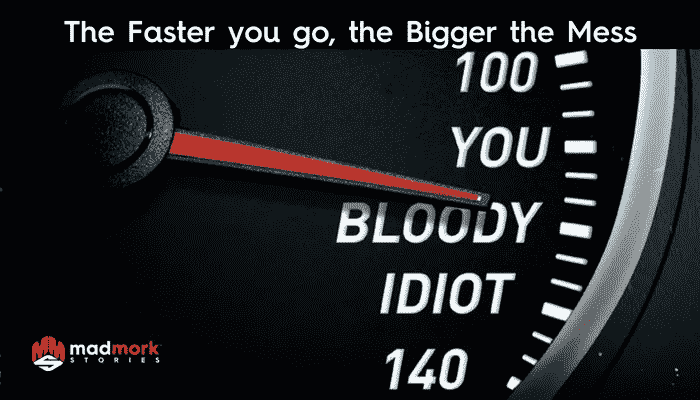
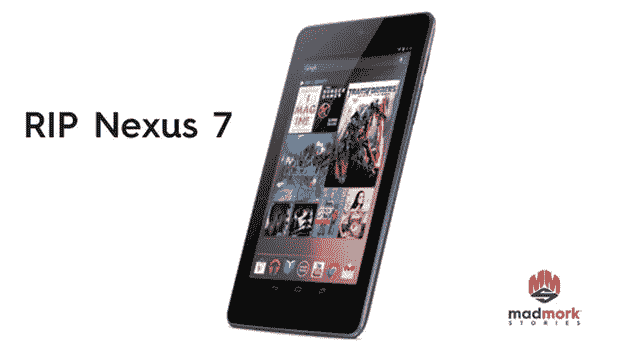

# 速度如何扼杀产品和创业

> 原文：<https://medium.com/swlh/how-speed-kills-products-and-startups-307d513c1fe7>

在硅谷，我们被这种快速前进的强烈欲望所包围。速度就是一切。更快的处理器、更快的机器、更快的算法、更快的加载时间、更快的安装。快，快，快。

节奏是狂热的，环境是激烈的，速度往往意味着成功与失败的区别，或者是第一个上市或第二个上市的区别。

但有趣的是:快或第一并不总是意味着赢。这并不总是意味着你成功了，也不总是明智的。

事实上，速度可以杀人。不仅仅是创始人在以 140 英里/小时的速度行驶的汽车里，而是创始人的创业公司。在追求领先和快速发展的过程中，我们让自己和周围的人筋疲力尽，抄近路，犯错误。

在商业中，我们对此有一个术语:先行者对快速跟随者。

看看智能手表市场就知道了。根据 IDC 的数据，苹果在智能手表市场的份额估计在 21%左右。苹果实际上落后很多，在 Android Wear 已经推出之后才推出。但是第一个上市的公司，也是有史以来从融资到产品上市最快的公司之一？那是卵石。

Pebble 今天在哪里？尽管该公司在 2015 年在 Kickstarter 上筹集了 2030 万美元时是众筹界的宠儿，但在 2016 年以 2300 万美元的价格卖给了 Fitbit，当时该公司发现由于缺乏现金和一系列战略失误(其中之一是营销投资严重不足)，自己无法继续运营。

同样，当我在谷歌时，我们决定推出 Nexus 7，这是 Android 首次进军平板电脑市场，整个 Android 团队的重点是速度和上市时间。Android 的创始人和多变的领导者安迪·鲁宾(Andy Rubin)如此专注于将设备推向市场，以至于我们在不到 6 个月的时间里从概念到发布——这在硬件行业是闻所未闻的。然而，尽管我们首先向市场推出了极具竞争力的产品，但 Nexus 平板电脑如今在哪里呢？

不见了。

我们推出得太快了，完全低估了需求。我们推出得如此之快，以至于我们没有建立客户支持来应对人们的投诉量，他们无法获得他们支付的设备。我们甚至有客户亲自出现在山景城园区，因为他们对我们这么晚才给他们发送设备感到非常不满。

很大一部分问题是:速度。速度太快了。

不要误解我的意思:我不反对速度，我明白为什么速度是帮助创业公司成功的重要因素之一。但是我看到并犯了很多错误，其中很大一部分的罪魁祸首是速度。

为什么走得太快会对我们造成如此严重的伤害？

**沟通不畅**

当我们走得太快时，我们不会告诉人们他们需要知道的一切。当人们没有足够的背景时，他们可能不会理解我们为什么要做这些事情背后的紧迫性。当他们没有足够的信息时，他们也可能不知道谁在做什么，什么时候到期，或者他们的角色是什么。他们对形势的预期可能与我们不同(见下文)。

**缺乏所有权**

当我们没有花足够的时间与他人沟通和登记时，我们不会将他们作为解决方案的一部分。我们告诉他们做一些事情，但并没有真正花时间去了解他们的愿望、动机或需求。当人们没有加入时，他们不会致力于项目的个人成功。他们的想法没有被倾听或考虑。他们感觉不到项目的所有权，当事情变得困难时，他们更有可能觉得一开始就不是“他们的”。

**命案动机**

当人们感觉不到他们拥有所有权或对结果不感兴趣时，他们的积极性就会降低。他们还没有真正接受。我们只是给他们堆积更多的工作，或者让他们周末或晚上工作。因为他们觉得被强加了，他们就没有动力了。重要的是，当他们的动力受挫时，很快就会影响到他们周围的人，他们要么觉得自己没有尽力，要么自己也失去了动力。

**穷解**

当人们没有动力时，他们不会提供解决问题的最佳方案。他们不会伸展自己或多走一步。他们不能跳出框框思考，想出可以节省时间、金钱和精力的创新解决方案。糟糕的解决方案会导致不彻底的措施或修补，这些措施或修补必须在以后进行。这可能会使问题进一步复杂化。

错误百出

2010 年我在 GetJar 的时候，我们不得不从头开始重建平台的很大一部分。我们发展得太快，在可伸缩性方面犯了很多明显的错误。我们至少浪费了整整 12 个月的时间来重建我们的系统，而我们本应该专注于市场上正在发生的其他变化。

除了其他错误，这个错误最终导致了公司的毁灭(连同我们在风险投资中筹集的 4000 万美元)。

**进入指责游戏！**

当错误比比皆是，我们开始错过最后期限时，压力和挫败感就来了，责备游戏开始了。人们开始找别人来责怪，你就有可能陷入一个有害的环境。

正如我在关于 [**跳槽的帖子中所讨论的:是时候退出的 7 个信号**](https://www.madmork.com/single-post/2017/08/25/Jumping-Ship-7-Signs-its-time-to-quit) 一旦你有了一个有害的环境，事情会变得更加缓慢，人们开始问自己为什么还在坚持。

**人不干了**

人们可能不会立即离开你的组织或公司，但他们可能会在心理上接受检查。这些人从来没有被正确地告知为什么你需要这么快行动，他们从来没有同意那些你疯狂的最后期限，他们看到了他们说会发生的错误。所以当错误发生时，他们会绝望地放弃。当这种情况经常发生时，他们开始寻找出口。

**领导的信誉坦克**

每当领导层搞砸了，尤其是当事情本可以通过让更多人参与进来而避免的时候，可信度就会受到侵蚀。它被侵蚀得越深，信任就越危险。一旦失去信任，就几乎不可能让人们支持你的事业。就像那个“喊狼来了的男孩”。人们只是失去了信仰。游戏结束。

## **如何快速行动而不杀死你的公司**

**确定所有关键利益相关方**

在你确定了一个问题或机会之后，第一步就是要弄清楚你的团队中谁需要参与进来，为什么。让某些人参与可能是一件麻烦的事情，而且他们总是倾向于让更少的人参与进来并加快行动速度，但是让合适的人参与进来不仅可以确保问题得到正确的识别，还可以带来最广泛的解决方案。

**将人员登记到您的项目中**

我的一个客户抱怨说，某个团队从来不尽自己的职责，在参与一个项目时似乎总是犹豫不决。当我问她，她最后一次与该团队的团队领导坐下来了解他们的局限性和顾虑，并了解他们可能有哪些资源限制时，答案是“真的从来没有”

她随后邀请这个人喝咖啡，问他们事情进展如何，她可以在哪里帮忙。令她惊讶的是，团队领导承认他非常缺乏资源，尽管他对她正在进行的新项目感到兴奋，但他对自己没有足够的资源来支持她感到沮丧。

一旦她意识到他的困境，她同意尝试并帮助他获得额外的资源，他的举止明显改变。他们现在有一个共同的目标，这样他们都可以承担更多的项目来帮助公司取得成功。

**经常使用正确的渠道沟通**

一旦你确定了正确的利益相关者，关键是要确保他们在同一时间使用正确的渠道获得相同的信息。对有些人来说，一封电子邮件或一条短信就足够了，而对其他人来说，尤其是老前辈，你可能需要吃顿午饭或喝杯咖啡。

然而，确保当你需要某人同意做某事时，他们明确地书面或当面同意你的请求。不要指望仅仅因为你给他们发了 5 封邮件，他们就同意了(见下文)。一个简单的经验法则是:使用多种渠道进行沟通。

**了解人们的动机**

人们的动机有很多:恐惧、野心、贪婪、配偶、晋升、金钱等等。你越能理解一个人的动机，就越容易帮助他们帮助你。

这里的诀窍是，你可能必须超越你的舒适区，才能发现他们的动机。在另一种情况下，我的一个不同的客户与另一个团队的负责人发生了争执。他认为这个人根本不想帮助他。当我们谈论事情的时候，他意识到他从来没有真正花时间去了解另一个团队的领导，而且有一次他拒绝了这个人邀请他去他们团队附近的一个“热办公桌”。

最终，他邀请这个人在周五下班后去喝一杯，能够更好地了解他，并开始理解他的动机。一夜之间，情况开始发生变化。

**关注协议，而不是期望**

作为一名营销教练，我最常收到的客户抱怨之一是“我希望他在周五之前完成这项工作，但他没有兑现。难以置信。”我接下来的问题总是:“好吧，但是那个人口头上或以其他方式同意在周五之前完成任务了吗？”商业中最大的问题之一，尤其是当你未能招募他人或进行适当的沟通时，是人们在事情上没有明确的一致意见。

下次开会时，确保你明确同意你所依赖的人的意见。如果他们无法达成一致，请他们提出一个还价，并真正尝试理解他们的动机(你甚至可以让他们离开办公室去做这件事)。向前迈进的关键是协议，而不是期望。

我从我自己的教练那里学到的最重要的事情很简单:有时候，为了加快速度，你必须放慢速度。虽然这适用于任何公司，但在初创公司中更是如此，因为时间、人力和金钱是你最宝贵的资源。

我希望这篇文章对你有所帮助，如果你是一名高级营销主管，在管理这些或其他类型的职业相关问题时需要建议或支持，请随时预约时间在这里与我交谈 [**。**](http://www.calendly.com/madmork)

别忘了收听我的 [**播客**](http://www.anchor.fm/madmork-stories) ，这样你就可以在上班的路上用手机收听我最新的营销/ CMO 访谈，并且一定要关注我的 [**【脸书】**](http://www.facebook.com/madmorkstories) 直播活动和关于营销、技术和营销职业的网络研讨会。

疯狂默克

首席说书人

## 这篇文章发表在 [The Startup](https://medium.com/swlh) 上，这是 Medium 最大的创业刊物，有 324，834+人关注。

## 在这里订阅接收[我们的头条新闻](http://growthsupply.com/the-startup-newsletter/)。

