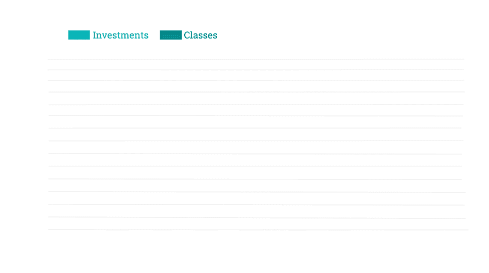
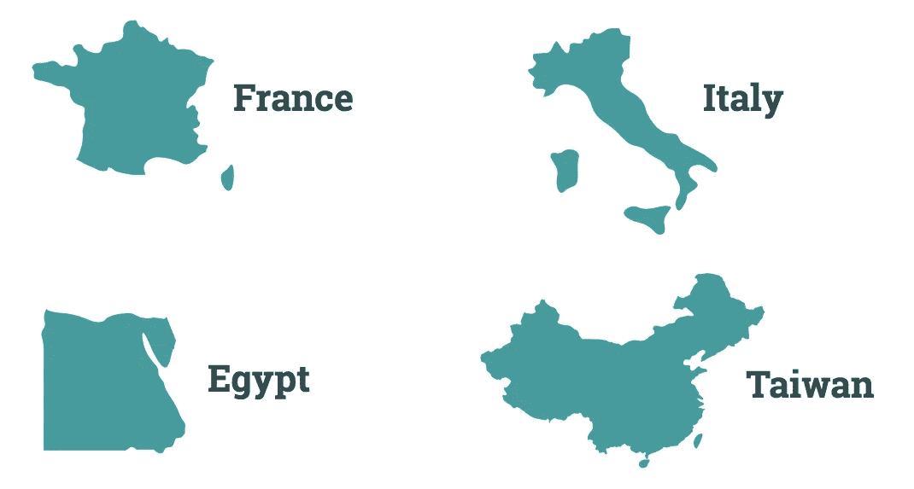
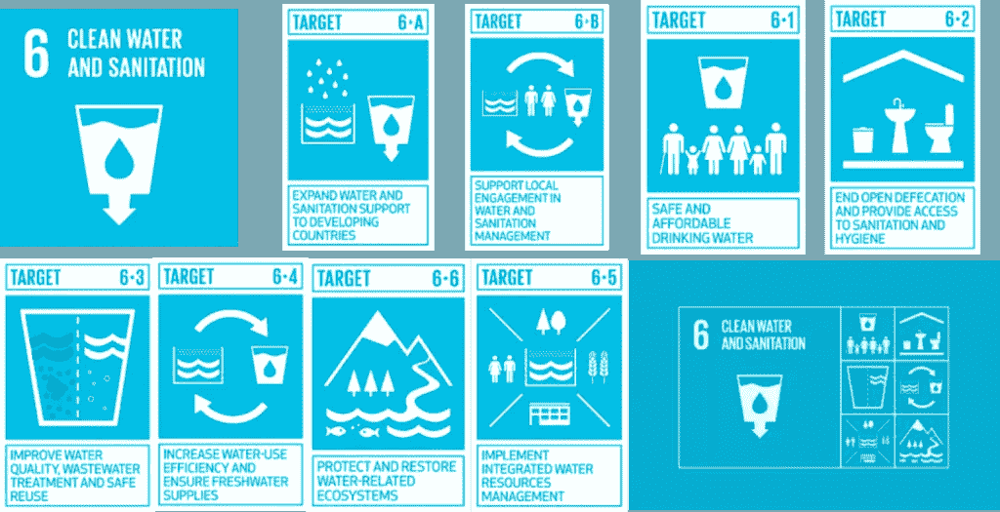

# Startupbootcamp 如何成长为世界上最大的创新项目网络[+信息图表]

> 原文：<https://medium.com/swlh/how-startupbootcamp-grew-to-become-the-worlds-largest-network-of-innovation-programs-3e446f0311b5>

2010 年，Startupbootcamp 成立时有一个简单的目标——在世界上最优秀的创新者成长的各个阶段为他们提供支持。我们花了数年时间对我们的方法进行微调，为 700 多家公司和 200 多家企业合作伙伴提供支持，测试新模式以使所有人都能获得创新，并成立了近 30 个办事处。随着创新真正走向全球，我们对创新领域有了无与伦比的了解，并有幸坐在前排。

Startupbootcamp Invested in 150+ businesses in 2018

 [## 点击分享:Startupbootcamp 如何在 2010 年从两个加速器成长为世界上最大的网络之一…](https://ctt.ac/0Gwdl) 

2017 年，我们迭代了“典型”加速器模型，并推出了[**startup boot camp Scale**](https://www.startupbootcamp.org/scale/)**，**这是一个面向寻求国际扩张、筹集资金和增加收入的成长期公司的新计划。我们不仅在[墨西哥城](https://relayto.com/startupbootcamp/startupbootcamp-fintech-mexico-city-trend-report-2018-8gmpvelecw2om/slides)成功执行了第一个计划，还扩展到了三个新市场，并建立了一个增长框架，得到了许多增值合作伙伴的支持。

今年，我们推出了八个新项目，进入了三个新市场——旧金山、 [**、埃及**](https://readymag.com/startupbootcamp/fintechcairo/) **、**和卡塔尔，并且我们首次将 [SportsTech](https://qatarsportstech.com/) 作为一个新的垂直市场加入到我们的产品组合中。

通过将公司合作伙伴的技术兴趣领域、棘手问题和业务目标与我们认为他们有兴趣尝试、投资甚至收购的特定初创公司相匹配，我们促成了创纪录的超过 300 场私人初创公司会议。

根据 27 次成功 IPO 的退出数量，我们位列**十大加速器**(阅读《福布斯》的[文章](https://www.forbes.com/sites/alejandrocremades/2018/08/07/top-10-startup-accelerators-based-on-successful-exits/))并且我们是女性领导的企业的三大种子期投资者之一(阅读 Crunchbase 的[报告](https://news.crunchbase.com/news/q1-2018-global-diversity-investment-report-investing-trends-female-founders/))——我们 30%的初创公司至少有**一名女性创始人！**

 [## 基于成功退出的 10 个启动加速器

### 全球加速器正以支持性的生态系统和大量的新资金推动企业家和初创公司…

www.forbes.com](https://www.forbes.com/sites/alejandrocremades/2018/08/07/top-10-startup-accelerators-based-on-successful-exits/) 

# 介绍 SBC 影响力报告— 2018 年亮点

该报告独家介绍了 Startupbootcamp 的发展，包括该组织新发布的 2018 年影响力数据，以及通过数千个创业应用和公司成功案例收集的信息。它展示了我们如何成长为世界上最大的创新项目网络，在六大洲拥有 30 多个办事处。

# 展望未来

*   **将我们的全球影响力扩展到新市场**

    在 2018 年及以后，Startupbootcamp 将从一个坚实的 EMEA 核心扩展到具有重要战略意义的中心，使我们所有的项目和创业公司受益。我们正在为我们的全球足迹增加新的地点，从最西边的巴黎和米兰到最东边的开罗、台北和上海。这种巨大的影响力带来了所有项目都可以利用的改变游戏规则的机会。

*   **2018 年是 IPO 和 ICO 创纪录的一年** 
    2018 年是 IPO 和 ICO 活动最活跃的一年，有六家成功退出，三家 ICO——***WePower、SafeGuard 和 PolicyPal。*** 我们预计在未来三年内会有更多的退出，我们将投资于为我们投资组合中的最佳公司提供实际价值，因为它们正在全球范围内扩张。
*   **提升我们的多元化目标**

    我们的目标之一一直是在团队成长的任何阶段支持性别和种族多元化的团队，从构思到启动，再到成长和扩展。2018 年，**参加过我们项目的团队中有 30%由女性创始人领导，比 2017 年增加了 7%。归根结底，我们希望投资于人，而不仅仅是他们的企业。在接下来的几年里，我们将致力于支持更多想要在社区中有所作为的创业者。
    与 [**OneTech**](https://weareonetech.org/) **、**资本企业和摩根大通基金会发起的新项目一起，我们已经开始审查和改进针对不同群体的流程，以增加我们合作公司的多样性。**

 [## OneTech 的使命是帮助 200 家女性和 BAME 领导的初创企业成长

### 伦敦创业计划资本企业(Capital Enterprise)和摩根大通基金会(JP Morgan Chase Foundation)的一个新项目，旨在改善…

www.standard.co.uk](https://www.standard.co.uk/tech/capital-enterprise-onetech-mission-diversity-tech-a3975191.html) 

*   **拥抱“科技为善”** 
    我们相信，使用数字技术来解决一些世界上最棘手的社会和环境挑战从未像现在这样简单。虽然有些人仍在考虑挑战和障碍，但新的创业公司正在思考惠及数百万人的“解决方案”。

    今年，我们首次与 **SAP** 合作，以解决联合国可持续发展目标之一— [**清洁水和卫生设施**](https://www.startupbootcamp.org/blog/2018/08/startupbootcamp-afritech-sap-next-gen-announce-water-challenge-linked-sdg-6/) 。我们在瑞士达沃斯举行的世界经济论坛年会上展示了这一合作的成果，以此进入新的一年。

我们还激动地宣布，2019 年，我们将在埃及开罗启动首个专注于金融普惠的创新计划。67%的埃及人口没有银行账户，而家人和朋友仍然是借款的主要来源，只有 9%的人口依靠金融机构。

随着[startup boot camp fin tech Cairo](https://readymag.com/startupbootcamp/fintechcairo/)我们的目标是让所有个人和企业都能以可承受的成本获得金融服务，并促进该地区的生态系统。

# 来自我们校友网络的礼物和灵感

随着假期的临近，我们认为我们可以让您更容易地为列表中的每个人找到一份独特的礼物。从升级的时尚产品到室内农业设备和以用户为中心的设计研讨会，我们将为您提供全方位的服务。最精彩的部分？所有这些产品都来自于 **Startupbootcamp 校友网络！购物愉快！**

*原载于 2018 年 12 月 13 日 www.startupbootcamp.org**T21*[。](https://www.startupbootcamp.org/blog/2018/12/startupbootcamps-impact-2018/)

## 这篇文章发表在 [The Startup](https://medium.com/swlh) 上，这是 Medium 最大的创业刊物，拥有+399，714 名读者。

## 在这里订阅接收[我们的头条新闻](http://growthsupply.com/the-startup-newsletter/)。

