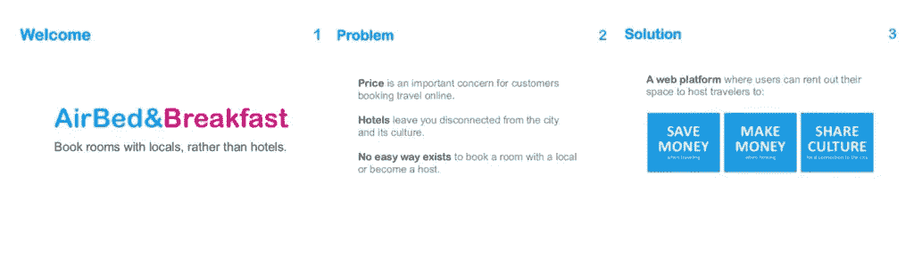
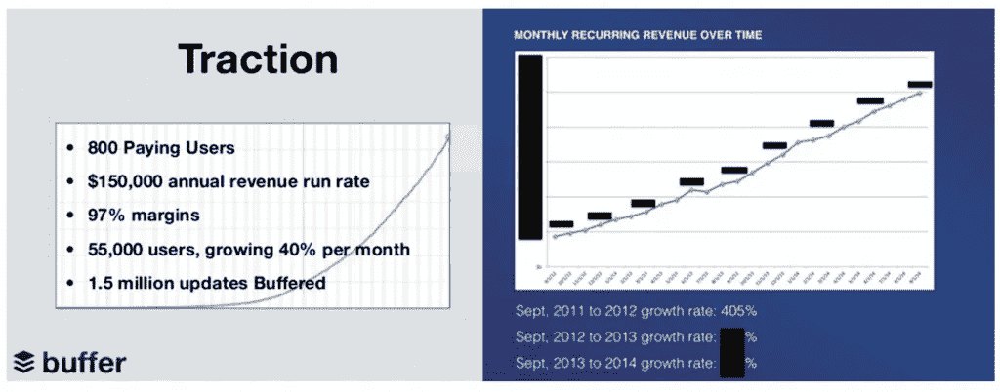

# 创业公司如何创造 10 倍令人难忘的宣传资料

> 原文：<https://medium.com/swlh/how-startups-can-create-pitch-decks-that-are-10-times-more-memorable-bd6ae0a32a56>

什么是一个伟大的球场甲板？

这是许多创始人在为他们的创业公司筹集资金时会问的问题。多年来，许多风投和成功的创始人都在讨论为一家初创公司创建一个令人信服的推介平台的最佳方法，当然也有很多观点，从你应该在演示中包括什么到哪张幻灯片放在哪里。

在这里，我们将重点介绍一些行之有效的方法，让你的创业计划令人难忘。

成功公司使用的这些策略和想法可以帮助你创造一个让投资者渴望成为你企业一部分的机会。让我们开始吧…

*奖励:我们推出了* [*移动点金术:全球顶级移动投资者名单。*](http://content.mindsea.com/mobile-midas-touch) *立即免费下载，查看移动市场的名人录。*

# 为投资者定制你的推销

就像一套漂亮的西装一样，最好的创业推介都是量身定制的。

为了确保你的推销恰到好处，花时间研究你的受众。这样做，你会更好地洞察潜在投资者的动机和他们正在寻找的企业类型。LinkedIn 的联合创始人雷德·霍夫曼曾在一篇博客文章中给寻求融资的创始人提出过这样的建议，他在这篇文章中打破了 LinkedIn B 轮融资时使用的套路:

“彻底调查潜在投资者。他们在寻找什么样的业务？他们用什么模型/标准/触发器来判断一个项目是否会成功？”

有些投资人更看重技术，而不是团队；一些投资者只是在寻找明确的迹象，表明你的想法将会奏效。幸运的是，在今天的环境下，根据投资者的推文、LinkedIn 个人资料、网站和博客来判断他们想要什么比以往任何时候都容易。

# 强势开始

你演讲的开始可以成就你，也可以毁掉你。在最初的几分钟内，甚至几秒钟内，潜在投资者就开始判断你是否是他们想要投资或长期合作的对象。

在你开发一个令人难忘的音高之前，你需要了解大脑最古老和最底层的部分:边缘皮层，或者许多专业人士所说的"[蜥蜴脑](http://sethgodin.typepad.com/seths_blog/2010/01/quieting-the-lizard-brain.html)、" "[鳄鱼脑](http://pitchanything.com/croc-brain/)或"[恐龙脑](http://www.slideshare.net/rosssimmonds/how-to-deliver-presentations-that-actually-drive-sales-44154772/7-BREAK_THROUGHTHE_DINO_BRAIN11)"它是大脑的一部分，帮助我们立即确定某件事情是否危险或相关，以及我们应该如何对新事物做出反应。这是我们的第一道防线，控制着我们的战斗或逃跑反应。

鳄鱼的大脑关注两件事:它危险吗，它新奇吗？

任何危险的事情——一个感觉高风险、与投资者想法相反、绝望或紧张的想法——鳄鱼的大脑都会拒绝。如果你的想法不新颖，鳄鱼大脑会向大脑的其他部分发出信号，表示它知道这个信息，可以忽略它。

如果你的推销无法通过投资者的大脑，那么演示可能会失败。那么你是如何穿过鳄鱼的大脑的呢？

# 展示问题和解决方案

看看第一张 [Airbnb 幻灯片](http://www.businessinsider.com/airbnb-a-13-billion-dollar-startups-first-ever-pitch-deck-2011-9)中的这三张幻灯片:

第一张幻灯片通过分享一个新颖的想法突破了恐龙的大脑:

向当地人预订房间，而不是酒店。

y combinator[创始人保罗·格拉厄姆曾写道](http://paulgraham.com/investors.html):

在他们(投资者)判断你是否建立了一个好的 x 之前，他们必须了解你建立了一个什么样的 x。如果你不告诉他们你是做什么的，而是让他们耐心听完某种开场白，他们会非常沮丧。

这就是为什么你要在第一张幻灯片中说明你要做什么。

当 Airbnb 在 2008 年推出时，共享经济的概念还是非常新的。他们的想法很冒险，但通过引人注目的故事和清晰的价值主张，他们在几张简短的幻灯片内就抓住了投资者的注意力。

在推介时，Airbnb 团队立即解决了投资者对其商业模式的一些担忧。第二张幻灯片解释了为什么有人会向 Airbnb 而不是他们最大的竞争对手(酒店业)预订，并揭示了市场的差距。第三张幻灯片介绍了他们产品背后的故事，并用简单的语言强调了交易双方的利益。

从问题到解决方案的过渡是启动阶段的主要内容。它允许您快速突出您正在为客户解决的棘手问题，并解决潜在投资者的顾虑。但问题解决方案也是投资者反复看到的一种形式，所以以一种能迅速让你的观众参与进来的方式讲述你的故事很重要。

# 分享证明吸引力的事实和图表

上面的幻灯片来自于 [Buffer](http://www.slideshare.net/Bufferapp/buffer-seedrounddeck) 和 [MixPanel](http://www.slideshare.net/metrics1/mixpanel-our-pitch-deck-that-we-used-to-raise-65m?next_slideshow=1) 的推介平台，这两家营销软件公司已经筹集了数百万美元，并成为行业偶像。

这两张幻灯片显示了强调进步的重要性。投资者想知道你能执行计划，并且你正朝着正确的方向前进。理想情况下，他们希望看到你的关键指标呈指数级增长。对于一些初创公司来说，这可能是客户在应用上花费的时间；对其他人来说，是付费用户的数量。确定你认为对你的业务最重要的指标，并向你的投资者展示你是如何推动的。

# 描绘一幅清晰而充满希望的未来图景

LinkedIn 的雷德·霍夫曼[曾经描述过](http://reidhoffman.org/linkedin-pitch-to-greylock/)向投资者展示未来的重要性:

为了相信 LinkedIn 是一项好的投资，我们的投资者需要相信从目录到网络(1.0 到 2.0)的大趋势，网络可能变得非常有价值，并且 LinkedIn 在网络上的人员搜索应用程序将是一项有价值的资产。

你的工作是描绘一幅比你今天拥有的更大的图画。向投资者展示未来会是什么样子，因为他们的投资。预测未来最有效的方式是交流对现有趋势的见解或统计数据。突出行业报告中的非常识性信息，或者展示您在构建产品时学到的见解。

卖出未来——毕竟，投资者真正买入的是未来。

# 结论

筹集资金并不像持续不断的 TechCrunch 头条新闻听起来那么容易。这需要大量的熬夜、修改广告词、电子邮件跟进和拒绝。

以上建议将极大地提高你的推销技巧，但创建优质产品的最佳方式是确保你拥有优质产品。做一些人们想要的东西，记住演示不仅仅是幻灯片。我们已经帮助了许多希望推出 MVP 的初创公司，为他们提供了展示创意所需的原型和资源。

如果您有兴趣了解更多关于我们如何提供帮助的信息，[今天就联系我们](http://content.mindsea.com/schedule-your-free-meeting-with-a-senior-app-strategist)——我们希望收到您的来信。