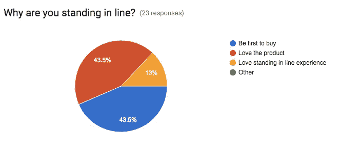
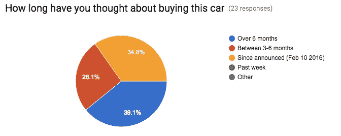
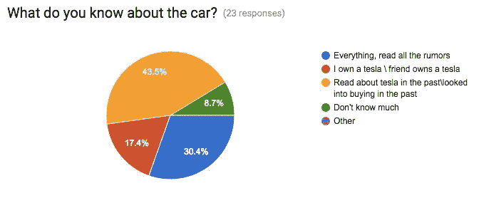
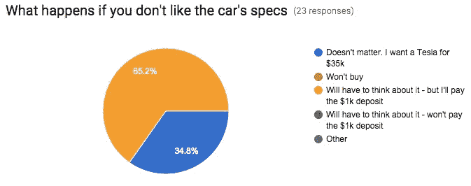
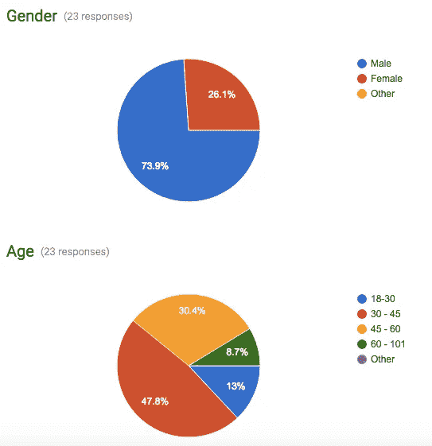

# 特斯拉品牌有多强，我们能从中学到什么？

> 原文：<https://medium.com/swlh/how-strong-is-the-tesla-brand-and-what-can-we-learn-from-it-93c60f9d0dd0>

**在** [#TeslaModel3](https://twitter.com/hashtag/TeslaModel3?src=hash) 上市当天，通过与排队等候的人们交谈，我们可以了解到特斯拉品牌的哪些信息

像今天早上在帕洛阿尔托的其他人一样，当我开车经过特斯拉商店时，我惊讶于外面排队等待订购 model 3 的人。

也许正如[我问的第一个问题是困扰我的主要问题——“你为什么排队？”—出于什么目的。](https://medium.com/u/d25ddb9e984b#1 and #2 in line. Tesla even got them some coffee while they were waiting all night</figcaption></figure>
</figure>
</figure>
</figure>
</figure>
</figure>
</figure>
</figure>
</figure>
</figure>
</figure>
</figure>
</figure>
</figure>
</figure>
</figure>
</figure>
</figure>
</figure><p id=) [@jgotz14](https://twitter.com/JGotz14) 帮助我消化这些结果。

仅供参考，如果你感兴趣的话:

