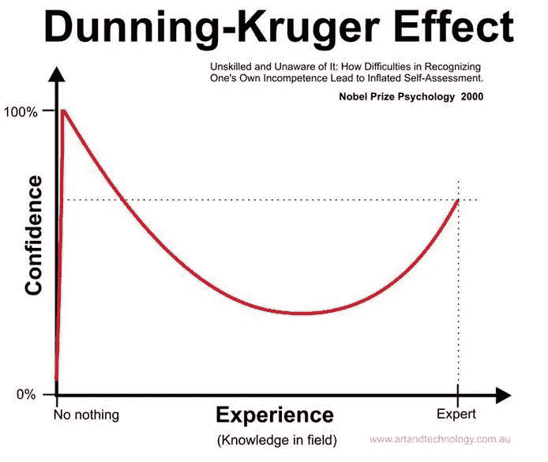
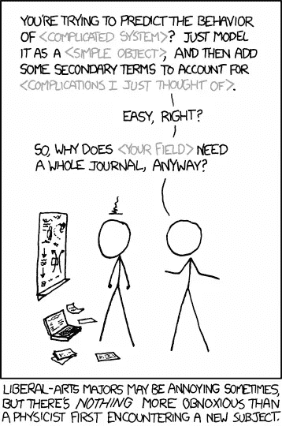

# 强大的技术人员如何摧毁创业公司，以及如何避免这种情况

> 原文：<https://medium.com/swlh/how-strong-techies-destroy-startups-and-how-it-can-be-avoided-b633c6a721d9>

在技术领域工作最困难的事情之一，也是创业公司的最大杀手之一，是美国技术人员通常拥有和捍卫的有限的世界观。在这篇文章中，我们将研究这个创业杀手，看看它是如何表现自己的一些例子，并讨论如何避免这些。

*(请随意跳到下面的型号列表。)*

我在任何地方都看到这种情况，无论我和谁交谈，我都发现这对他们来说也是一个痛苦的话题。因此，这个职位。我专门写关于技术人员的文章，但是记住——这可能发生在我们所有人身上。我定期接受研发方面的培训。

> 在初创公司的整个生命周期中，有许多这样的“技术失败”，但在这篇文章中，我们将讨论一个非常具体的脱节:技术以外的经验成熟度低，或者简单地说——不成熟。

技术极客，尤其是天才，不成熟的一个标志*是我们的**将我们理解之外的世界简化为“简单的 b/s”。绒毛。直到我们去尝试，也就是说，然后大部分人都无法处理关于我们如何看待自己和我们到底是怎样的偏见。

> *不成熟:白痴的委婉说法，有时是 a-holes。
> 
> **我们的/我们:很久以前在我转向利益之前的我，以及我的大多数朋友。

## **背景:工匠的谬误**

*(你可以选择跳过背景)*

承认吧，技术人是聪明的。下面详述的我的经验来自于多年来与极客(程序员、逆向工程师和黑客)的合作，以及多年前我自己作为一个十足的技术人员的经历。但对于任何技术领域都是如此。

“Physicists”. Source: XKCD, [https://xkcd.com/793/](https://xkcd.com/793/).

据说，我们中的许多人都遭受了[催款——克鲁格效应](https://en.wikipedia.org/wiki/Dunning%E2%80%93Kruger_effect),在这种情况下，我们错误地认为自己是其他领域的专家。毕竟，和我们每天做的事情相比，这有多难呢？尤其是当我们事实上经常是正确的时候？

这并不是一个新现象，苏格拉底将其最好地解释为“工匠的谬误”，当时他与一位智者交谈，这位智者认为自己是其他领域的专家。

> "在这一点上，我似乎比他更聪明，我不认为我知道我不知道的事情"。
> 
> ——柏拉图的道歉，21d，(Tredennick)。

撇开护教学不谈，试图与一个拒绝承认你所做的是艰苦的工作，或者做得很好，或者它甚至很重要的技术人员一起工作，可能会令人恼火。但是你们确实有共同点——挫折是相互的。对于一个技术人员来说，和一个我们认为不合逻辑的人一起工作非常困难。

现在让我向你保证，虽然也有例外(老实说，我们中的许多人都在这个范围内)，但技术人员实际上(通常)不是故意这么笨的。

我们遵循理性的思考过程，我们只是缺少数据。当你遇到拒绝承认外部世界的技术人员时——不要假设他们是难相处的人——他们可能是，但他们通常也愿意被说服，这取决于他们作为专业人士的成熟程度。

例如，我在 Cymmetria 公司的首席技术官，正如一个优秀的技术人员所期望的那样，在开发一个月后带着我们的产品去见客户时，一开始并不感到舒服，但他理解我关于客户反馈价值的观点，于是我们安装了。我很幸运找到他做我的首席技术官。在客户现场的这一体验极大地改变了我们处理解决方案的方式。

## 与不成熟的技术人员一起工作的症状

不成熟技术人员的问题不在于邓宁-克鲁格效应。这是关于我们对待专业领域之外的艰苦工作的态度。

> "我能在两秒钟内做你做的事."
> 
> “你做的事情有价值吗？”

我们来分解一下。

**不成熟技术人员的行为模式:**

1.  **X 是愚蠢的。**营销很蠢:谁都可以去写。销售是愚蠢的:如果你有好的产品，人们会购买。销售是愚蠢的:整天去和人交谈是容易的。尤其是在会议上一天 16 个小时接近和推销“愚蠢的人”。
2.  我完全支持打造一个 MVP…只是还没准备好。在客户处安装？但是我的产品还不够好。我们受不起教育。什么叫 MVP？可行意味着稳定，而不是早期测试。
3.  把他关在地下室，让他工作！交流？我只需要这个人能够编码。我不需要他们告诉我他们在做什么或者为什么。我相信它会很好地合并，我们将能够找出他们为什么在 MOO 中编码并做出这些决定，所以我们可以在一年后在客户的网站上调试。文化 schmulture，如果他让其他人感觉不好，我又有什么好在意的呢？处理好它！
4.  你说这就是会议的目的是什么意思？什么暗示？什么肢体语言？什么测试？什么信号？我和你一样在那里，我不傻，我有耳朵，我听到了不同的声音。
5.  X 很简单，我睡觉都能做。上述#1 的变体(“X 是愚蠢的”)。写作很容易，我们不需要付费。UX？作为一个喜欢按钮的极客，用这种方式放置按钮有什么问题？

## 交流，寻找中间立场，把人踢出去

就像许多首席执行官一样，我从深奥的技术世界转向了“无聊”的人的世界。我努力工作了很多年来获得我的专业知识。但是，当它不可测量的时候，我如何让别人相信我有这方面的专业知识，而且这一点也不“无聊”呢？

你如何让那些确信自己是对的人相信你的经历？

## 对于这个难题，我只找到了五种解决方案:

第一:沟通并决定角色和职责。让它成为一个循环的过程。

1.  传达你是专家，更重要的是传达你所不知道的。
2.  承认你不知道的，倾听那些知道的。
3.  虽然在你的职责范围内，应该有一个你可以做出大多数决定的过程，但是要愿意被要求为你的一些决定辩护。鼓励它。
4.  当你为一个决定辩护时，要有所准备。为你为什么选择做你所做的事情构建清晰的论据，或者老实说你没有。
5.  一开始就避免这种情况。考虑什么会影响整个公司，什么是关键决定，什么是你可以回头的较小的决定。考虑利益相关者以及什么影响谁，并在做出任何重大决策之前向他们通报最新情况。记住:做决定往往比决定是什么更重要。
6.  虽然这是你的决定，但你必须小心不要把其他人排除在决策过程之外，而且你必须注意给他们时间。不这样做是一种不良的文化行为，当别人的决定影响到你时，这可能会成为一种普遍的做法。我不断努力在这方面做得更好。
7.  保持一致。

**二:让他们穿着你的鞋子走一英里**

创建一个好的演示文稿，或者筹集资金，或者推销并不容易。让他们参与和帮助。这不应该是他们的常规工作，但他们应该涉猎一下，至少了解这些技能有多难。

**三:从他们接受的源头教育他们**

这个来源将是来自科技巨头和创业明星的文章。也可以是共同的朋友，也可以是经验丰富的反方。让其他人与他们分享他们的直接经验。

第四:接受现实。

接受吧。与优秀的技术人员一起工作是有成本的。他们永远不会欣赏你。成熟点吧，像个成年人一样管理局面。

**五:开除他们。现在。**

如果他们不仅仅是怀疑论者，而是破坏性的，甚至是有毒的。或者，你发现你在他们身上花了很多宝贵的时间，而不是在你的工作上——不要。阅读关于与糟糕的创始人分离，或解雇有毒员工的文章。你会一直问自己“为什么我没有早点这么做？”

## 概括起来

我们需要理解并接受技术人员会以自我为中心。技术人员需要承认他们经常缺乏数据，因此通过有限的一组镜头来看世界，他们可以选择扩大这些镜头。他们不会总是对所有事情都有广阔的视野——他们有自己的工作要操心。

这是你做生意的成本。这将是一个重复的循环。冒着热气，在厨房里做些晚餐。

在 [Cymmetria](https://www.cymmetria.com/) 我们过去常常告诉对方，如果我们超出了我们的理解范围，我们就与某个话题“无关”。这是一个糟糕的用词选择，我们后来改变了，但这是一个关键术语，我们理解它的意思是其他人认为我们在某个话题上是离开水的鱼。

但是要意识到这是一个成熟的问题。你可以学习如何与技术人员交流，同时他们也可以了解到自己是如何缺乏数据和变得愚蠢的。

虽然这篇文章是关于技术人员的，但我每天都在学习 R&D 和其他主题。有时候，我很难相处。记住，这不仅仅是关于技术人员。我们都有自我..一个朋友和我分享了一个故事，一位首席执行官告诉他的销售团队，他制造的产品必须易于销售，因为它如此闪亮和完美，这激怒了他们。

我将感谢您的反馈和想法。祝你好运！

加迪·埃夫隆。
(推特: [@gadievron](http://twitter.com/gadievron) ，脸书: [@gadioncyber](https://www.facebook.com/gadioncyber/) )

#沟通#技术#不成熟