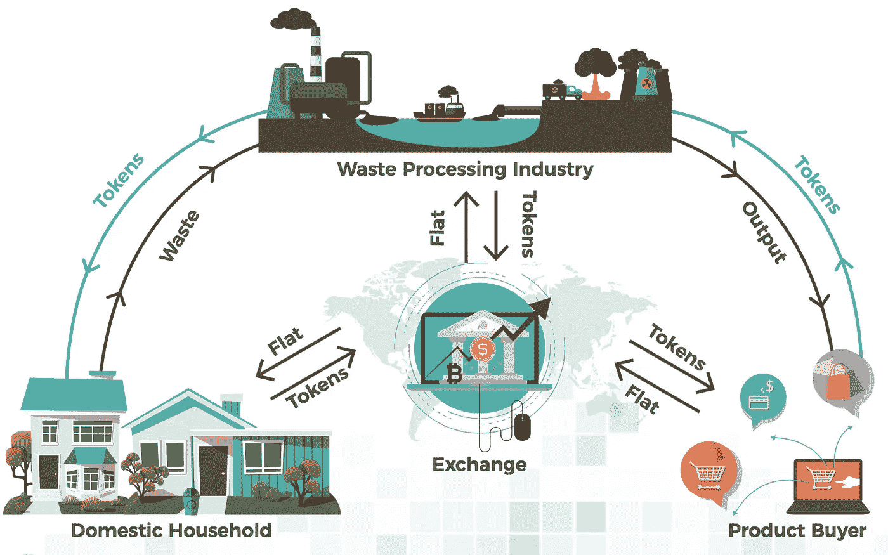
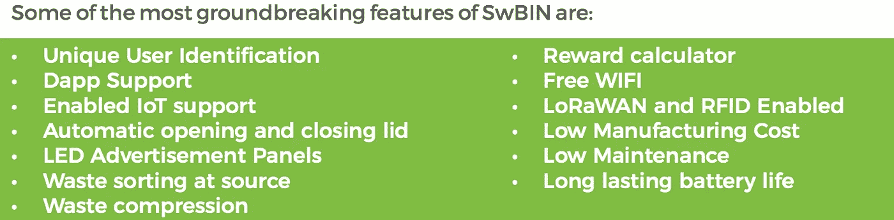

# SwBin 是一个经过改革的分散式广告解决方案，它如何让瑞士法郎的代币收入受益

> 原文：<https://medium.com/swlh/how-swbin-a-reformed-solution-for-decentralized-advertisement-is-benefiting-swachh-token-revenue-88bb4c6acd5d>

> 21 世纪见证了数字营销的巨大繁荣。据保守估计，数字营销的市值即使没有万亿，也在数千亿美元左右。然而，这一营销份额的大部分集中在各种社交媒体和专门的营销网站上。一些世界上最大的公司，如脸书，谷歌，他们的大部分收入来自数字营销。毫无疑问，今天的数字营销有大量的用例，其市值预计只会在未来几天飙升。

[swachhoin](https://swachhcoin.com/)是一种革命性的全球废物管理解决方案，旨在将日常食物、家庭和工业废物转化为可再利用资源，如燃料、能源和可再利用材料。

因此，它计划在现有模式的基础上创造新的经济，同时为那些负责任地处理废物的人提供激励。

虽然废物将通过 Swachhcoin 最先进的废物处理单元转化为可重复利用的资源，该单元由各种系统组成，可有效处理所提供废物的每个部分，但整个操作的核心是 SwBin，这是一个专门的移动废物处理单元，集成了物联网传感器和 LED 面板，涉及对收集的废物和单元本身进行跟踪和维护的功能。

感兴趣的用户可以通过使用 Swachhcoin 的本地移动应用程序来跟踪 SwBin 的位置，并允许他们通过使用 SW bin 处理他们的垃圾这一简单操作来获得网络本地 Swachh 令牌的奖励。下面提供了该激励方案的参考流程图。

虽然通过像 SwBin 这样先进的设备提供下一代废物管理和激励解决方案并不便宜，但 Swachhcoin 确保其有一个可持续的运营模式，因此 SW bin 的放置不会受到未来大量成本的阻碍。

为了实现这一点，Swachhcoin 允许用户“租赁”SwBins 上的 LED 空间，用于产品放置和广告，为此以 Swachh 令牌向网络支付费用。由于 SwBins 将被放置在战略公共位置以获得最大的可见性，因此任何穿过它们的广告也将被大量观众看到(您可以将此视为未来主义的广告牌)。

这进一步增加了 Swachhcoin 生态系统的自治模式和 SwBin 的可持续性，因为通过将其 LED 面板开放给企业，每个 SwBin 都可以为自己买单。不用说，这也使那些有权并期望从其负责任的废物管理活动中获得报酬的用户的激励过程变得更加容易，因为网络将不必为其基本商业模式的亏损而自掏腰包。

总的来说，这种特殊设备不仅能够为其自身的可持续性盈利，而且能够为同类新设备盈利的概念增加了项目的长期可行性。这种模式不仅在理论上仍然有利可图，而且在应用于现实世界时也有逻辑意义。

SwBins 将在 Swachhcoin 网络完成众筹销售后的开发活动后推出并投入使用。

Swachhcoin 的预售活动于 2018 年 6 月 29 日结束。之后，它将继续其早期采用者销售活动，分别于 2018 年 7 月 16 日至 7 月 31 日和 2018 年 8 月 15 日至 9 月 18 日的最终 ICO 期间举行。

*   更多详情，请访问:[www.swachhcoin.com](http://www.swachhcoin.com)
*   邮箱:【info@swachhcoin.com 

## 在此加入我们的社区:

[Official Telegram Discussion Group](https://t.me/swachhcoin)

[Twitter Channel](https://twitter.com/@swachhcoin)

[Facebook FanPage](https://www.facebook.com/swachhcoinofficial/)

[Swachhcoin Subreddit](https://www.reddit.com/r/swachhcoin/)

## 这篇文章发表在《T4》杂志《创业》(The Startup)上，这是 Medium 最大的创业刊物，拥有 343，876+读者。

## 在这里订阅接收[我们的头条新闻](http://growthsupply.com/the-startup-newsletter/)。

