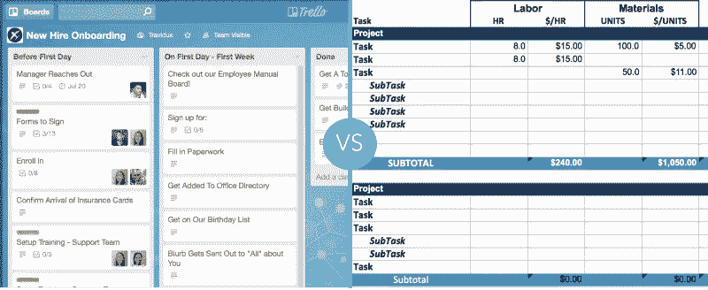
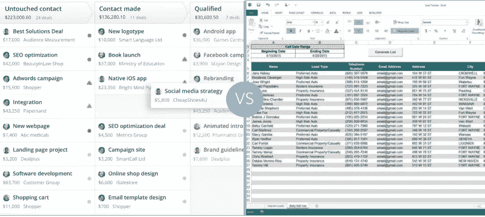
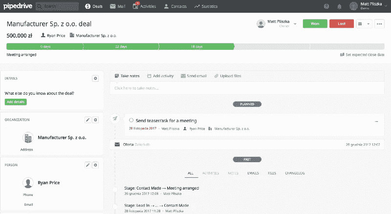
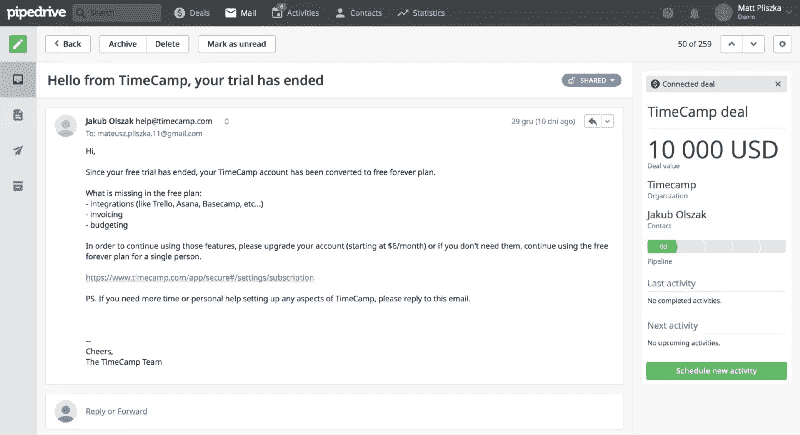
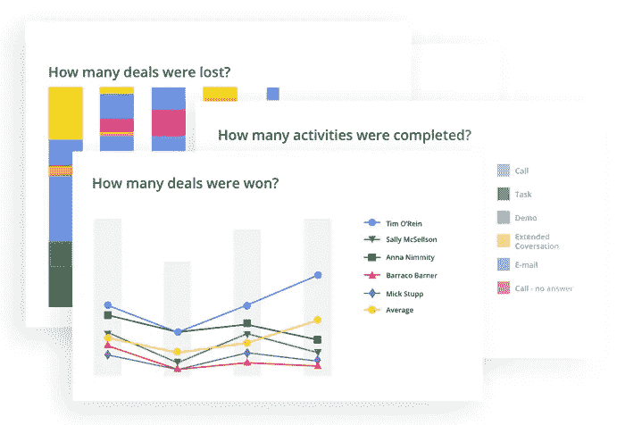
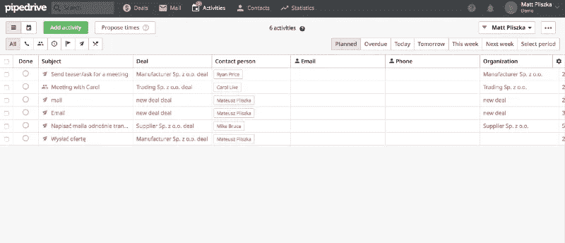
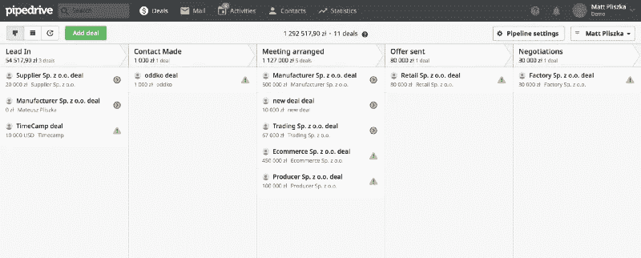

# 从 Excel 转换到 CRM 应用程序将如何帮助您成长

> 原文：<https://medium.com/swlh/how-switching-from-excel-to-crm-app-will-help-you-grow-9c315a111615>

Excel/Google 电子表格是最受欢迎的软件。哪个公司不喜欢在 Excel 电子表格中收集所有数据，如客户的联系信息、项目状态或营销计划？在 Excel 中工作也一直是我工作的主要部分。

# Excel 的光明和黑暗面

有些活动很可能永远不会被其他软件所取代。毕竟，谁能想象如果没有这个基于细胞的系统，做财务预测或报告财务结果呢？

然而，在某些领域，Excel 并不适合日常工作的性质。乍一看，在谷歌电子表格中安排任务和规划项目似乎没问题，但一旦你深入了解，它在帮助你划分任务、更新进度或简单地与团队协作方面将非常有限。

虽然在 Excel 电子表格中保留一些信息(如长期的、相当固定的计划)是可以坚持的，但保留联系信息、姓名、姓氏或电子邮件地址并不是最好的解决方案。最后，你会陷入你创建的结构的复杂性，无法有效地搜索和管理你的联系人的基础。

> *“客户关系管理(CRM)是一种管理公司与客户和潜在客户之间所有关系和互动的技术。”*
> 
> [*CRM 系统显示 Salesforce*](https://www.salesforce.com/crm/what-is-crm/)

# 如果它很好，为什么要从 Excel 切换？

如果电子表格没有那么糟糕，你为什么还要考虑把它换成其他应用程序呢？

假设您将下周的所有任务都放在 Excel 电子表格中，并分配给团队成员。然后，您如何保持进度更新、添加相关文件附件或评论特定活动？在谷歌电子表格中做所有这些将是一个挑战，但使用项目管理应用程序**更容易，如** [**Trello**](https://picksaas.com/project-management/trello) 。

Trello vs. Excel in project management

你怎么知道有人修改了电子表格中的内容？你需要深入挖掘历史，看看谁对项目进行了特定的更新，而使用项目管理应用程序，你可以在某人完成特定任务后立即获得更新。

**使用 Excel 或 Google 电子表格会将你限制在其框架内的环境**，如果你想创建一个更复杂的工作环境，连接其他外部应用程序就没那么容易了。其他商业应用则不同，你可以连接应用程序，例如，只要你在 CRM 中将交易标记为已完成，就可以在项目管理应用程序中自动创建项目。

Pipedrive vs. Excel in sales

# CRM app 将如何帮助你成长？

使用商业应用的良好开端是 CRM 系统，它可以帮助你在许多领域提高效率，并帮助你获得新客户:

## 将所有联系人存储在一个地方

有了像 [Pipedrive](https://picksaas.com/crm/pipedrive) 或 [Salesflare](https://picksaas.com/crm/salesflare) 这样的 CRM，你就创造了一个所有员工都能够共享和管理客户联系信息的环境。您团队中透明度和可访问性的提高将对您团队的效率产生重大影响，在一个地方看到特定客户的所有信件和信息非常舒服。

Client’s view in Pipedrive

## 连接您的电子邮件，在一个地方处理所有事情

使用 CRM 应用程序，您可以集成您的电子邮件帐户，从一个位置处理所有事情，而不必在电子邮件和应用程序之间切换。当你查看客户的电子邮件时，他们可以让你立即更新你的销售状态，这将为你和你的团队节省大量时间。

Mailing view in Pipedrive

## 为您的销售生成和分析报告

有了 CRM 系统，您就有机会生成有关销售的详细报告，让您直接了解活动的结果、失去交易的原因或成功向特定客户提供服务的可能性。如果你经营一家企业，你肯定知道这些数据对你日常工作中的决策有多重要。

Analysis of sales in Pipedrive

## 规划与您的销售线索相关的活动，变得更加有效

把所有东西都放在一个地方是管理日常事务的一种超级方便的方式。对于每一笔交易或每一个客户，你都可以安排特定的活动，无论是会议、电话、跟进邮件还是简单的聊天。这会让你的一天变得更有条理，节省你很多时间。

Activities’ plan in Pipedrive

## 监控您的交易渠道

使用 [Pipedrive](https://picksaas.com/crm/pipedrive) 可以非常轻松地监控您的销售现状，这对您的团队来说是一种激励，因为他们知道哪些客户可能会在一段时间内成交。它允许您随时随地通过移动应用程序查看您和您的团队正在进行和计划进行的交易。

Deals’ pipeline in Pipedrive

## 如果你准备成长，这可能是一个改变的好时机

从 Excel 转换到 CRM 应用程序或其他业务应用程序不是一个超级快速、一天就能完成的过程。需要一些时间来让员工对他们手中的新工具感到舒适。然而，从长远来看，这是值得追求的。无论您是在办公室还是外出参加商务会议，您都将拥有足够的资源来管理您的公司，而您的团队将拥有他们需要的一切资源来更有效地工作、快速沟通并提前计划他们的任务。

你可以利用节省下来的时间为你的企业争取更多客户，在 picksaas，我们总是很高兴看到公司蓬勃发展，这要归功于使用商业应用程序🚀

在 picksaas.com 的***中，我们发现了帮助您发展电子商务、服务、网站、博客或其他业务的应用程序。我们找到并实施合适的销售、营销、分析甚至设计应用程序，以节省您的时间并增加销售额。***

**我们始终乐意帮助实施最佳应用来发展业务，您可以* [*与我们预约*](https://app.acuityscheduling.com/schedule.php?owner=14759847) *，我们将向您展示如何选择、配置、实施和使用最佳应用来满足您的特定业务需求。**

**要接收我们关于最佳应用程序的更新，以发展您的业务，您可以* [*订阅*](https://picksaas.us16.list-manage.com/subscribe/post?u=0a811ad254e7cd14718599e3a&id=bdf0cfd955) *我们的每周增长提示或关注我们的*[*Twitter*](https://twitter.com/picksaas)*。**

*如果你觉得这份材料有用，我们会很高兴看到你的掌声，并希望你会喜欢其他的故事*

*[*我们用来提高营销效率的 5 款应用*](https://picksaas.com/blog/best-marketing-apps)*

*[*我们用来更好地管理公司的 5 款应用*](https://picksaas.com/blog/5-best-business-apps)*

*[*发展咨询业务的 5 个应用*](https://picksaas.com/blog/5-best-business-apps-for-consulting)*

*[*云应用如何帮助这家公司在两年内拥有 1，000 名付费客户*](https://picksaas.com/blog/how-cloud-apps-help)*

**最初发表于*[*【picksaas.com】*](https://picksaas.com/blog/switching-excel-to-crm)*。**

**

## *这篇文章发表在 [The Startup](https://medium.com/swlh) 上，这是 Medium 最大的创业刊物，拥有 285，454+读者。*

## *在这里订阅接收[我们的头条新闻](http://growthsupply.com/the-startup-newsletter/)。*

**