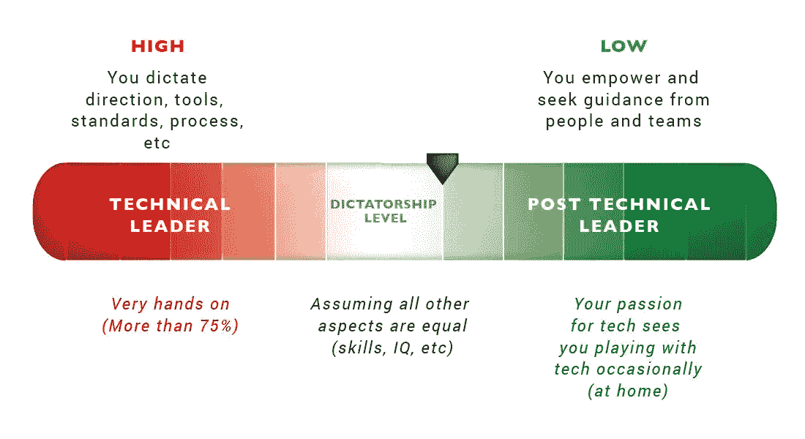
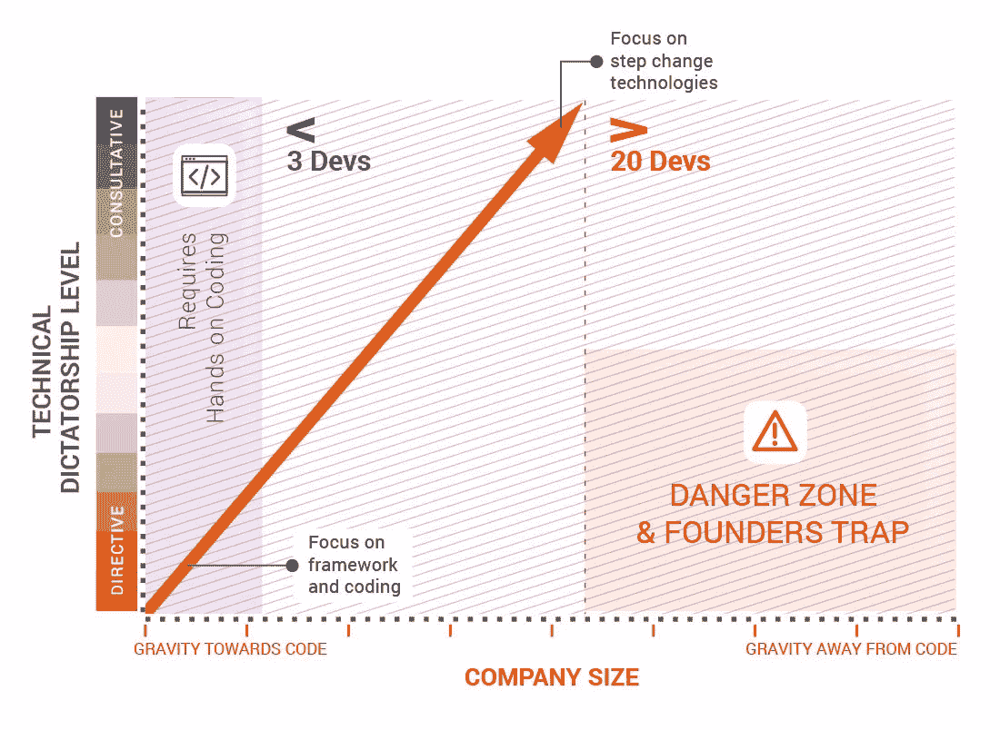
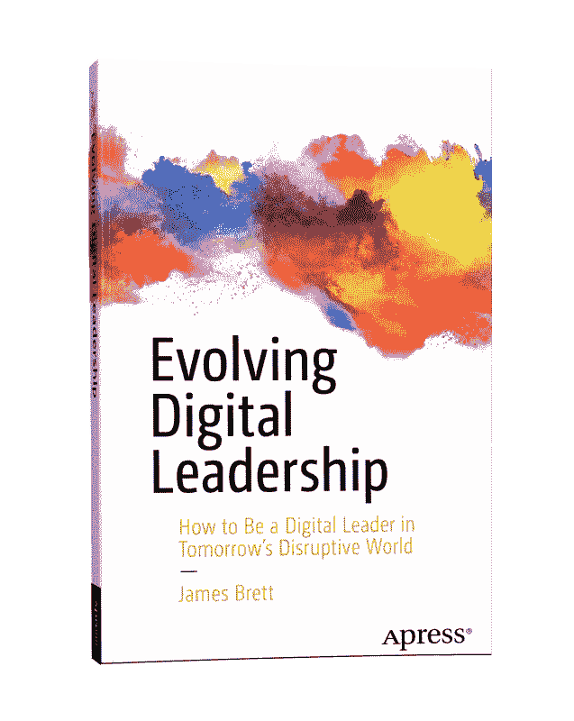

# 一个 CTO 应该有多专业？

> 原文：<https://medium.com/swlh/how-technical-should-a-cto-be-b9c705e3c4b3>

当我们从技术专家晋升到首席技术官时(或者当我们雇佣一个新的首席技术官时)，我们面临的最大挑战之一是我们需要有多专业。领导职位越高，离技术越远。那么，作为 CTO(或任何其他高级技术领导角色),我们如何保持技术能力，以便有效地推动技术发展呢？我相信这个问题的答案依赖于以下三个组成部分。

1.  领导风格
2.  组织的规模和类型
3.  对技术的热情

# **1。** **领导风格**

我们如何领导，或者更明确地说，我们在领导时有多直接，与我们需要的技术水平成正比。图 1 显示了独裁光谱。在左边，我们以独裁的方式运作，因此需要很高的技术能力。另一方面，我们以授权和咨询的方式运营，因此我们的技术能力和货币可以减少，同时保持高性能的技术领导者。

Figure 1: The Dictatorship Spectrum

也就是说，如果我们要为我们的团队制定解决方案和策略，我们最好擅长技术！但这并不是停留在技术和指导上的借口；这不能扩展到任何规模。在我们领导下的人和团队越多，我们的领导层就越需要咨询和授权。

在初创公司的世界里，小团队规模(通常不到 10 人)通常意味着 CTO 要花很多时间亲自动手。除此之外别无他法。初创公司的 CTO 一般需要亲自动手。相反，作为一个大型组织的首席技术官，我们的成功并不取决于我们的实际贡献。我们的角色是指导和塑造业务的长期战略实施，并将我们周围的技术能力发展到适当的规模。图 2 展示了领导风格和公司规模的结合，因为它与技术能力有关。

Figure 2: Technical direction versus company size

# **2。** **组织的规模和类型**

在一个小组织中，由于缺乏其他的技术专家来制造产品，重力将我们拉向直接贡献。随着组织规模的扩大，角色的领导方面迫使我们转变，将我们从技术中抽离出来。在小型创业公司中，需要有指导精神——这是做事的方式。然而，随着组织规模的扩大，我们远离了技术，我们无法保持技术上的敏锐，也无法成为一个称职的领导者，更不用说一个伟大的领导者了。如果我们的风格仍然是指令性的，我们将进入危险地带。我们会精疲力尽，表现得像头蠢驴，或者将交付性能降低到蜗牛般的速度，如果不是以上所有情况的话！

当我们发展领导风格远离指令时，我们会咨询团队中的技术专家以获得具体的意见和指导。ThoughtWorks 的首席技术官丽贝卡·帕森斯(Rebecca Parsons)利用了他们所谓的技术顾问委员会(TAB)。该委员会利用其全球人才的伟大头脑和思想领导力，为一些世界领先的组织提供指导和帮助。

通过使用高技术顾问团队，我们可以以适当的方式平衡人员领导和技术输入，利用他们在技术和范例方面的多年经验来挑战和提问，揭示最适合当前环境的解决方案。

组织的类型(不仅仅是规模)也会影响技术领导者的效率。我按照所需技术能力和货币的降序定义了三种组织类型:

1.  技术启动
2.  技术产品或咨询
3.  非技术组织

很简单，如果我们为一个技术组织工作，我们需要比我们为一个非技术组织工作时更了解技术。

# **3。** **对技术的热情**

如果我们对技术和创造没有热情和热爱，我们就不会成为最好的数字领导者。数字领导精英中没有 a)没有技术背景和 b)对技术不再有热情的人的位置。为什么？因为我们是领先的技术专家。领导技术专家的最佳人选是曾经是技术专家的领导者。他们知道技术人员是如何工作的。他们知道什么时候羊毛被蒙住了眼睛，他们知道在战壕里是什么感觉。

如果我们对技术没有热情，我们可能无法跟上最新的技术趋势，因此无法理解我们团队周围发生的工具和范式转变。数字领导者很容易变得忙碌，然后有一天转过身来，看到技术世界已经超越了我们所理解的。人们通常可以通过数字领导者处理解决方案的方式和使用的范例来确定他们最后一次参与的时间。

热情的数字领导者会在火车上、周末或任何时候抽出时间来“玩”技术。他们试图理解一个新范例的优点和缺点，以及对于使用它作为工具集的团队来说是什么样的。伟大的领导者会在一周中抽出一部分时间与技术专家进行交流。不是引导他们，恰恰相反。他们试图向开发者学习。优秀的首席技术官每周都要和高级开发人员一起做这件事，以跟上时代的步伐，体验创造价值的地方。

随着时间的推移，保持这种平衡很有挑战性。许多领导者对他们不断减少的技术技能感到焦虑，一些人被吸引回到技术中，大多数人作为一个敏捷和反应灵敏的领导者的自然循环而潮起潮落。找到你的平衡，了解什么是需要的，并意识到你的技术独裁水平。

> **注**:本文简要介绍的模型直接摘自我的著作《进化数字领导力》(Evolving Digital Leadership)，2018 年出版。更多信息可以在这里找到:【https://evolvingdigitalleadership.com/】T2

【https://evolvingdigitalleadership.com/】[*更多车型和书籍信息请查看*](https://evolvingdigitalleadership.com/)

在推特上找到我[https://twitter.com/JamesCuriously](https://twitter.com/JamesCuriously)

挂钩:[https://www.linkedin.com/in/james-brett/](https://www.linkedin.com/in/james-brett/)

Evolving Digital Leadership available on Amazon now

## 这篇文章发表在 [The Startup](https://medium.com/swlh) 上，这是 Medium 最大的创业刊物，拥有+368，366 名读者。

## 在这里订阅接收[我们的头条新闻](http://growthsupply.com/the-startup-newsletter/)。

