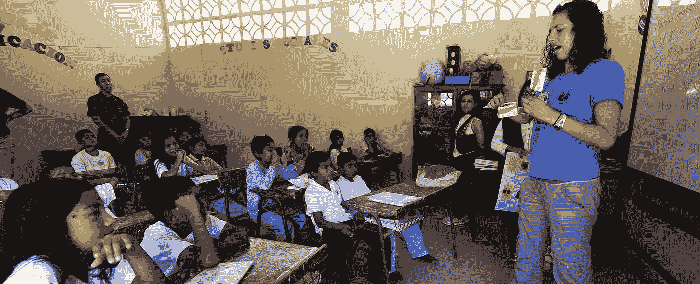

# 技术如何促进教师同行评议

> 原文：<https://medium.com/swlh/how-technology-can-facilitate-teacher-peer-reviews-59d34c305925>

除了学生教学之外，作为一名教师，你多久能够在课堂环境中观察和向其他教师学习一次？

马萨诸塞州切姆斯福德公立学校助理督学琳达·j·赫希(Linda J. Hirsch)在她的博士论文中声称，学校努力为教师创造情境化的协作学习环境。这限制了教师相互学习和专业发展的能力。

[AVID Center 是一家帮助学校采取以学生为中心的学习方法的组织，该组织的 Christie McMullen](https://gtlcenter.org/blog/teachers-observing-teachers-how-excellence-becomes-contagious) 解释说，教师通过在现场课堂环境中观察他们的同事学习得最好。McMullen 说，这激励和授权教师。

已经认识到同行评议重要性的学校系统正在利用它们为教育者创造一个更具协作性的环境。佛罗里达州塔拉哈西基石学习社区的主任[杰森·弗洛姆](http://inservice.ascd.org/peer-to-peer-observation-five-questions-for-making-it-work/)解释说，同行评议是老师们提高技能的一种强有力的方式。这些评估通常比专业评估更有成效，因为它们消除了表现的压力，反而鼓励了学习和合作。

然而，在教师中创造一种分享的文化可能是困难的，因为它让教师们接受同行的评判。这就是为什么同行评议需要小心翼翼地融入学校文化的原因。

# 分享在线课程计划

数字教案易于分享，允许老师们互相交流想法。教育软件开发商[Planbook](https://blog.planbook.com/teacher-collaboration/)的团队指出，这种合作为教师提供了一个不断测试想法、寻求反馈和改进教学方法的机会。

这在部门级别尤其有用。例如，数学系的教师不仅可以检查彼此的课程计划是否符合课程要求，还可以了解如何授课。一个教师可能以一种独特的方式来实现教育目标，其他教师也可以采用这种方式作为他们的教学策略。

这种合作水平可以直接影响学生的教育。教师协作有助于为更多学生提供高质量的教育内容，[teach think](https://www.teachthought.com/pedagogy/10-benefits-of-digital-planning-tools-for-teachers/)的工作人员表示，这是一家专注于教师职业发展的组织。

# 为同行评审创建数字表格

最有效的同行评议是在观察老师的课堂时进行的。教育顾问 [Michele Israel](https://www.educationworld.com/a_admin/admin/admin297.shtml) 指出，这让观察者可以直接看到其他老师是如何对待课程和教学的。

课堂观察也创造了教师之间的对话。观察者可以立即提供反馈，被观察的老师可以展示对观察者来说可能是新奇的教学策略。

然而，这些观察确实带有内在的风险。教育家 [Susan Moore Johnson 和 Sarah E. Fiarman](http://www.ascd.org/publications/educational-leadership/nov12/vol70/num03/The-Potential-of-Peer-Review.aspx) 警告说，如果同行评价被视为对表现的评价，而不是职业发展的工具，就有使教师相互对立的风险。

为了建立信任的基线水平，教育工作者和管理人员应该合作创建一个在线观察表，为所有同行评审提供结构。这样做将确保审查保持客观，并基于与改进相关的数据，而不是基于绩效。

创建数字同行评审表格时，请记住以下建议:

*   让教师起草问题。弗洛姆认为，当老师们参与创造观察问题时，他们更有可能接受同行评议。
*   **匿名评论。显然，观察结果本身不会是匿名的。但是观察者应该能够通过表单匿名提交他们的反馈。这将有助于消除任何可能出现的不好的感觉，如果老师在被评判时有所防备。如果观察者不担心冒犯他们观察的老师，匿名也可以促进更诚实的评价。**
*   **使所有评审的表格保持一致。**表格可能会因优先级别的不同而有所不同，但请确保部门或学校内的每个人在评估时都遵循相同的问题和标准。同样，这有助于在同行评审过程中建立信任。

标准化的评审表格保持了过程的客观性。同时，数字表格帮助学校收集和存储数据，以便教师可以随时访问。评估这些数据是提高性能的关键。

# 允许轻松访问检查数据

在一份关于教师观察有效性的报告中，弗吉尼亚大学的研究人员 [Megan Stuhlman、Bridget Hamre、Jason Downer 和 Robert Pianta](https://curry.virginia.edu/uploads/resourceLibrary/CASTL_practioner_Part5_single.pdf) 指出，“只有在与教师有效共享的情况下，观察数据才有助于职业发展。”将这些信息存储在可访问的数据库中有助于这种共享。

一个数字数据库使教育工作者和管理人员可以即时访问评论中提供的信息。没有这些数据，老师们就不知道他们的复习结果，也没有机会学习。

收集数据是重要的，但是实际操作这些数据是进行同行评审的主要原因。教师可以一起工作，根据观察到的教室情况以及部门目标和改进情况来审查数据。

同行评议是专业发展的一个很好的工具，特别是对于那些很少有机会在课堂上观察其他老师的老师来说。这些评论提供了管理者对教师评估可能会错过的洞察力，因为重点是学习，而不是表现。

如果有互相学习的机会，教师们会发展得更好。

照片由[pix abay](https://pixabay.com/en/school-classroom-boys-girls-79612/)&[Pexels](https://www.pexels.com/photo/three-toddler-eating-on-white-table-1001914/)拍摄

*原载于*[*www.jotform.com*](https://www.jotform.com/blog/technology-facilitate-teacher-peer-reviews/)*。*