# 特斯拉如何证明成为一个挑战者品牌是一场猪圈里的游戏

> 原文：<https://medium.com/swlh/how-tesla-shows-that-being-a-challenger-brand-is-a-game-of-pigs-in-a-pen-ec1fa175406>

a)你玩过“猪圈里的猪”这个游戏吗？

我知道你是个大忙人，你有事情要做，有很多人要见，有很多推文要笑。所以，我知道我在这里对你要求很多，但是，这是一个“选择你的冒险”的时刻…

如果你知道如何在围栏/圆点&盒子里玩猪，跳到下面的 B 点。

如果你完全不知道如何在围栏/圆点和盒子里玩猪，你有两个选择:

1.  关闭选项卡。现在就做，说实话，我不会往心里去。这是你的生活。
2.  观看这段简短、清晰、简明的讲解者视频:

[www.youtube.com](http://www.youtube.com)

b)太好了，所以我们都知道基本知识了。

你们现在大概都知道,《猪圈里的猪》是一款多人纸笔游戏。这一页开始时只有一个点网格。

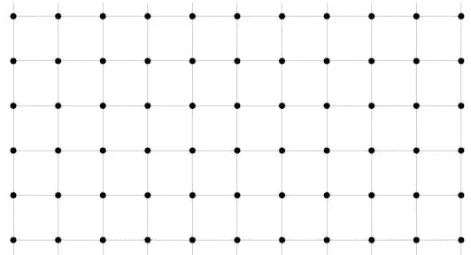

这里的网格是市场。

像所有市场一样，当它第一次出现时:它只是一块画布。没有职位，没有品牌故事，没有利基或独特的产品，只有机会。

原始的、未开发的机会。

接下来发生的事情是有人(通常是第一个看到市场机会的远见者，或者从远见者那里窃取了机会)采取行动。看起来像这样:

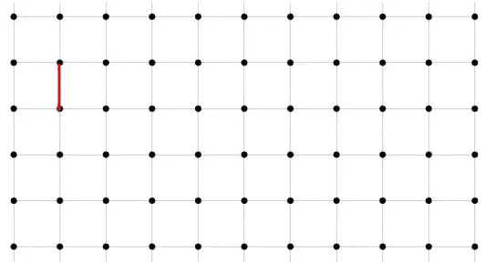

那条红线是参与人 1。也称为现任或已建立的品牌。最先到达这里并迅速占据了他们认为的董事会领先位置的公司，他们向世界发出了一个信号:这就是我们打算如何向客户展示我们的产品在这个市场中对他们有价值。

想象一下，这个先行者就是沃尔沃。如果你不确定沃尔沃在市场中的定位，谷歌“沃尔沃 usp(独特销售主张)”，点击图片，看看会出现什么——前 6 张图片中有 4 张涉及安全测试假人。

沃尔沃=安全。

参与人 2 出场。

特斯拉。

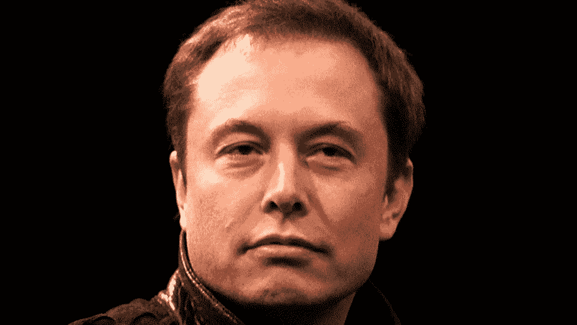

giphy.com

假设你是埃隆。

感觉不错吧，嗯？

当你进入成熟的汽车市场时，你有多种选择。你有这么多的方式进入市场，网格上有这么多的点供你选择，有多个 usp 和定位选项供你磨练，还有大量潜在的品牌故事供你探索。

然而，现实生活中的不同之处在于，并非所有玩家都在同一时间开始游戏。沃尔沃成立于 1927 年 4 月**，特斯拉成立于 2003 年 7 月**。这意味着在特斯拉出现之前，沃尔沃已经占据了整整 76 年的方格。****

****所以在现实中，当特斯拉决定加入这个猪圈游戏时，网格看起来有点像这样…****

****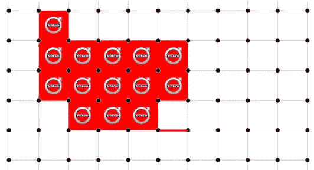****

****所以，埃隆(你)有一个选择。如果你关闭那个方格，你就可以偷到沃尔沃格子上 15 个方格中的一个。你可以通过简单地宣称提供沃尔沃提供的所有相同的好处来获得 2%的市场份额。简单地跳上安全定位的潮流。考虑到你已经迟到了 76 年，这听起来很不错。****

****所以，你继续把特斯拉推出为道路上最安全的汽车。****

****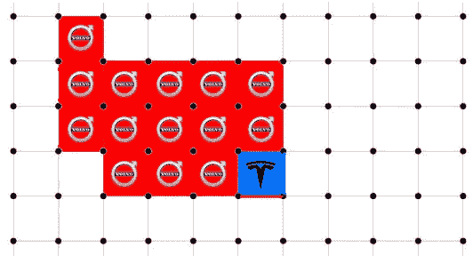****

****嘿！我们做到了！2%的市场份额！让墨西哥流浪乐队排队。****

****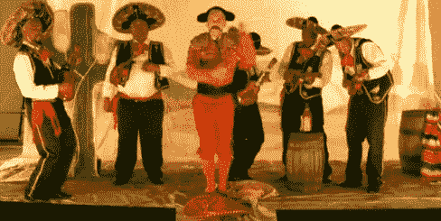****

****Elon Musk loves mariachi bands. (giphy.com)****

****如果你是特斯拉，没有人知道你的汽车能力，而你已经迟到了 76 年，那么真的，试图把自己打造成道路上最安全的汽车可能会让你获得 2%的市场份额，但这永远不会让你赢得比赛。****

****换句话说，你无法在现任者的游戏中击败他们。问题是我们都认为自己很特别。像我这样的年轻营销人员认为，他们可以用漂亮的新 SEO 技巧和充沛的精力在自己的游戏中击败老人们。然而，事实上，那些老家伙足够聪明，可以雇佣最好的品牌和搜索引擎优化机构，他们比你更有才华和智慧。****

****此外，关于品牌定位的事情是，为了让你的 USP 在市场上真正变得可信，它需要多年来成功强化所说的 USP。这意味着你实际上只是在玩追赶游戏。问题是，到特斯拉成为有 76 年历史的“道路上最安全的汽车”公司时，沃尔沃已经是有 152 年历史的“道路上最安全的汽车”公司了。时间对你不利。****

****那么，埃隆做了什么？****

****作为一个彻底的、科学驱动的作家，我对特斯拉做了和对沃尔沃一样深入的市场调查。我谷歌了一下“特斯拉 usp ”,找到了一些图片。同样的数字，特斯拉上的 6 个第一图像中有 4 个与电动汽车或低碳排放有关。****

****在一场猪圈游戏中，这是伊隆在棋盘上的第一步棋…****

********

****如果你是一名创业者或为一家初创公司工作，你可能已经知道，在决定创业后，这是所有创业者做出的最勇敢的决定。在一个市场中，滑入既定的进场点要容易得多。****

****为什么？****

****你有很长的使用案例历史可以依赖，你知道沃尔沃几十年来在做他们正在做的事情方面取得了重大成功，你知道他们是如何做到的。****

****这就是伊隆如此勇敢的原因。他决定追逐一个无人真正涉足的市场角落，利用许多人认为尚未准备好的技术，在一个没有人完全知道已经到来的趋势上获利。****

****所以现在，在特斯拉成立 14 年后，市场看起来是这样的:****

****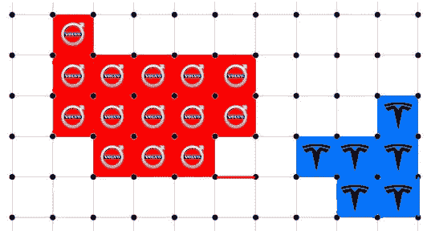****

****现在，精彩的部分来了。****

****特斯拉迫使沃尔沃改变了思维模式。****

****到目前为止，沃尔沃是我们这个小市场的意识形态领导者，但现在，沃尔沃开始担心特斯拉在做什么。突然之间，沃尔沃受到了威胁，因为特斯拉的市场垄断可能就是市场的正确垄断。****

****然后这种情况发生了:****

****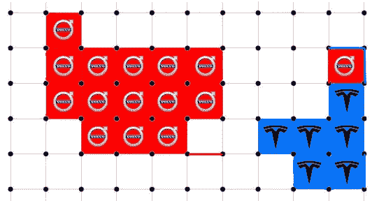****

****沃尔沃刚刚开始追赶特斯拉。****

****排列一系列成功的文章，展示沃尔沃(**比特斯拉**年长 76 岁)试图*追赶*特斯拉。****

****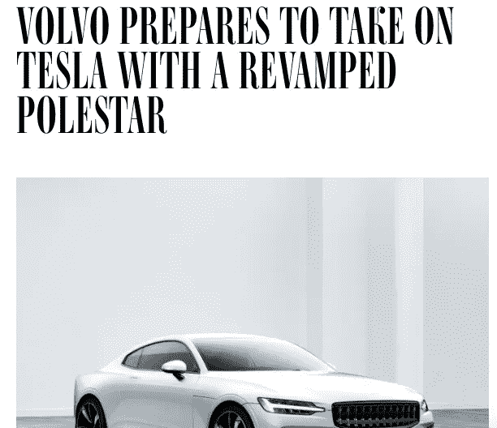****

> ****沃尔沃正处于轮回之中。这家瑞典汽车制造商正在告别它以前作为超级安全、超级四四方方的货车制造商的生活，拥抱一种致力于技术实力、电力推进和苗条设计的生活。—连线—【https://www.wired.com/story/volvo-polestar-1-electric/ ****

****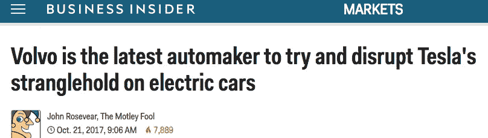****

****www.businessinsider.com****

****等等。什么？现任的公关发布谈论的是破坏破坏者。这一切都是因为埃隆选择了他自己的一小块市场来主宰。****

****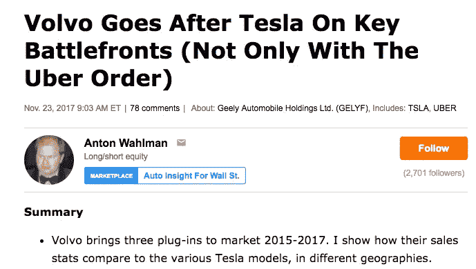****

****[www.seekingalpha.com](http://www.seekingalpha.com)****

****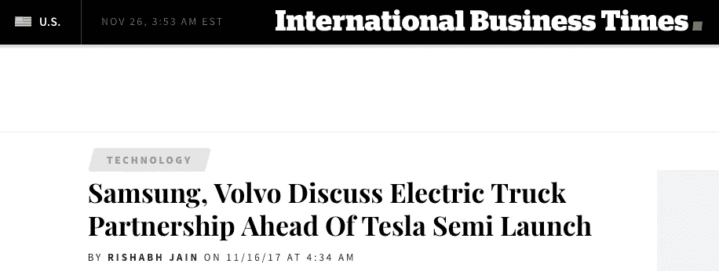****

****尽管在这篇文章中反复引用谷歌新闻中关于“沃尔沃特斯拉”的结果来强调我的观点很有趣，但我会就此打住。****

****总之，如果你想进入一个市场，不要太快。首先评估谁是现任者，他们已经存在多久，以及他们在该领域的 USP 是什么。然后，看一看全球经济和技术趋势——现有企业可能太大、太笨重，无法有效应对新技术或消费者行为的社会转变。接下来，选择一个市场的自由角落，利用消费者/技术/社会的变化，并瞄准它。****

****接下来，你知道 76 岁的老公司将谈论扰乱你。****

****如果你喜欢这本书，请给我们鼓掌。****

********

## ****这个故事发表在[的《创业](https://medium.com/swlh)上，这里有 263，100 多人聚集在一起阅读 Medium 关于创业的主要故事。****

## ****在这里订阅接收[我们的头条新闻](http://growthsupply.com/the-startup-newsletter/)。****

********