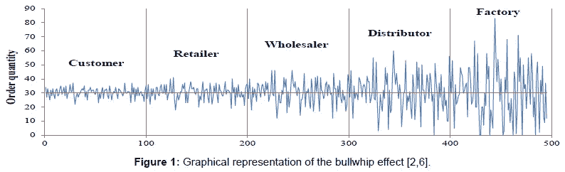

# 牛鞭效应如何影响你的业务

> 原文：<https://medium.com/swlh/how-the-bullwhip-effect-impacts-your-business-5717e2ab2356>

[*以规模进军理解供求的基本问题。*](/swlh/management-models-the-johari-window-34618f9f3901)

Image Credit: [**OMICS Online**](https://www.omicsonline.org/open-access/managing-the-bullwhip-effect-in-multiechelon-supply-chains-2169-0316-1000e128.php?aid=53291)

这幅画很能说明问题。

这就像那些测谎仪测试中的一个，它只是显示一个人越来越确定地撒谎，就像它说明了随着我们在供应管理中的上升，市场信号是如何丢失或被歪曲并变得更加混乱一样…