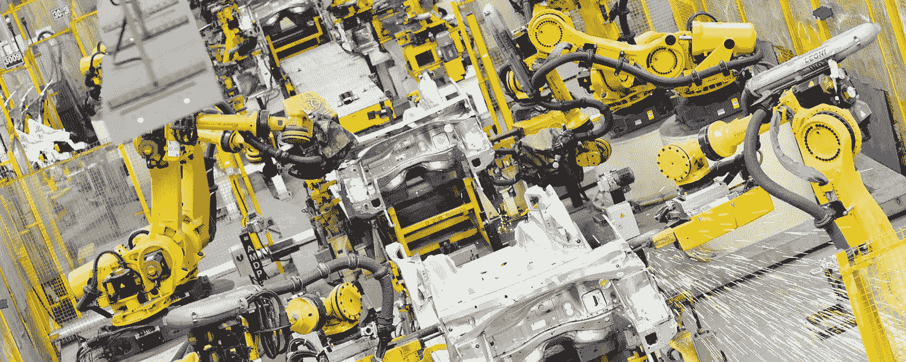
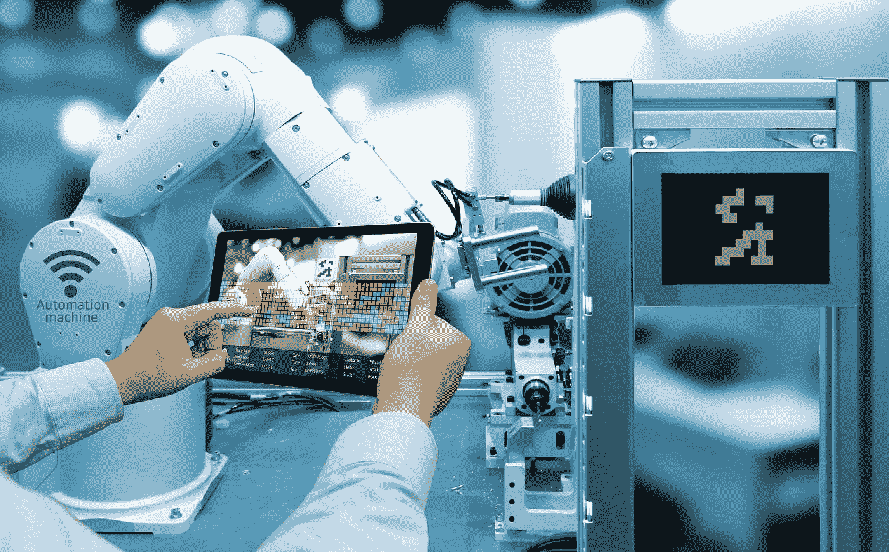

# 物联网的未来如何与工业自动化相关

> 原文：<https://medium.com/swlh/how-the-future-of-the-internet-of-things-is-about-industrial-automation-75c803e8eb16>

How the future of the Internet of Things is about industrial automation

在过去十年左右的时间里，一个新的流行词语冲击了商业世界，现在你可能已经听说过了:物联网(T2)本质上，物联网(或物联网，有时缩写)指的是这样一个事实，即互联网不再是一个看似中心的“地方”，只能通过计算机终端访问。如今，几乎所有东西都与互联网相连:智能手机、手表、平板电脑、电视、汽车、时钟，甚至牛(是的，真的——目前荷兰农场使用牛身上的传感器来指示疾病或怀孕等状况)。

但这不仅仅是一个让许多设备一直连接到 WiFi 的问题；物联网还意味着业务扩张和效率的重大机遇。公司发现，一个主要的物联网机会在于工业自动化。

# 从聊天到图表:使用物联网识别趋势和机遇

正如科技咨询公司 SAP 所言，物联网可以被描述为“数十亿件事物……相互交流”对于长期以来担心机器起义(或一些人生动地称之为“机器人启示录”)的人来说，这听起来可能很可怕，但实际上这意味着数十亿设备正在以高数据速度交换有用的信息。这些设备不是像人类员工那样简单地通过聊天来分享信息和解决问题，而是几乎不间断地、即时地在数据流中互动，如果没有适当的算法，这些数据流是不可能整理出来的。幸运的是，这些系统背后的聪明头脑能够使用这样的算法将自由流动的数据转化为可观察的趋势。

以前，公司可能仅仅依靠人力、基础 IT 和其他手动要素来保持日常运营顺利进行。然而，随着物联网逐渐进入工业领域，现在已经有可能将一些工作转移到一个支持网络的互联在线设备系统上。例如:全球各地的企业已经转向网络传感器，以帮助捕捉过程和产品信息，这些信息可以进行分析，以提高效率和透明度。工业自动化也可以远远超越简单的传感器；例如，一个制造工厂可能会使用一系列设备，使工程师可以坐在网络终端前，运行诊断程序，并可能在舒适的办公室内对机械问题进行故障排除。也许在不太遥远的将来，这位工程师可能只需拿出一个移动应用程序来完成同样的任务。

# 物联网对于商业和工业自动化的未来到底意味着什么？

首先，互联网传感器的使用不会停止。事实上，它看起来就要恢复了。像 IBM 这样的公司已经在广泛的应用中使用这些传感器。有些就像检测冰箱里食物的质量一样简单，而另一些则可能挽救生命，检测生化威胁或癌症之类的事情。根据 LLP 普华永道的数据，24%接受调查的亚洲公司已经在投资使用类似的传感器。拉丁美洲紧随其后，占 23%，其次是非洲(22%)、欧洲(19%)和北美(18%)。

通过他们的调查，LLP 普华永道会计师事务所还能够选出十大传感器投资行业。截至 2014 年，排名第一的投资行业是能源和采矿业，占 33%，这是因为它们使用传感器来帮助检测一氧化碳的危险水平，以保护工人。排在第二位的是电力和公用事业，占 32%，它利用联网的智能电表每隔 15 分钟测量一次用电量，并将用电量信息传回给公用事业提供商。第三是汽车，占 31%，利用车辆和道路上的传感器和信标为交通模式优化、事故避免和免提驾驶设备提供数据。然后，排在第四位的是我们感兴趣的行业:工业/制造业(25%)。目前，这些制造工厂采用了一系列互连的控制点，使公司能够将各种监督、监控和优化任务分散到各个设备上，而不是分散到专业员工身上。通过这样做，工厂解放了这些专家，让他们在其他地方发挥才能，提高了效率，创造了规模经济。榜单上的其他十大行业包括酒店(22%)、医疗保健(20%)、零售(20%)、娱乐(18%)、科技(17%)和金融服务(13%)。

世界上支持互联网或“智能”设备的数量也不会停止增长。国际研究公司 Gartner 估计，到 2020 年，世界上将有大约 250 亿台智能设备，用于在用户、设备和云存储之间传递信息。这是目前生活在地球上的人口数量的三倍多。

对于工业自动化领域来说，物联网的增长似乎没有其他领域那么引人注目，但这只是因为它已经处于这场运动的前沿一段时间了。施耐德电气集团高级专家 Todd Snide 表示，截至 2015 年夏季，工业自动化已经使用了至少 10 亿台智能设备。Snide 认为，在不久的将来，我们可以期待看到设备部署的持续增长，以及工业自动化整体令人印象深刻的增长率。

总体而言，智能设备在数据密集型任务中的持续部署和使用，似乎将成为工业未来日益自动化的关键。这种程度的自动化不仅提供了一种更简单的方法来优化日常任务和分析工厂流程，而且从本质上来说，它还提供了将专家和其他以前被束缚的员工的注意力转移到新地方的自由，允许公司转移资源并在新领域发展，而无需引进和培训整个新员工团队。

# 物联网、工业自动化和网络安全

当然，与任何植根于互联网的系统一样，总会有技术和安全问题。随着各行各业潜在的数十亿台设备的出现，必然会有许多挑战，既有预期的，也有令人惊讶的。除了其中一个设备可能出现故障或导致自动化系统通信错误的可能性之外，还存在网络攻击的风险。近年来，尽管相对罕见，但有报道称，各种自动化的在线系统遭到黑客攻击和滥用。就在去年，安全公司 Synack 的一项研究显示，许多常见的“智能家居”设备很容易被黑客攻击，仅仅因为它们连接到互联网。由于密码保护不力、数据未加密和其他安全缺陷，智能恒温器、联网摄像头和家庭自动化中心等设备尤其容易受到攻击。

幸运的是，在安全问题上，在工业自动化水平上使用智能设备的工程师比普通房主更加精明。为了保护公司的设备和自动化系统，工程师可以使用许多方法，包括大量数据加密和其他网络安全检查。最终，随着这些支持物联网的自动化系统在规模、数量和复杂性方面的增长，将由开发它们的软件工程师来决定最强有力的方法来保护它们以及它们所保存的信息免受未经授权的人的侵害。

# 其他挑战

工业自动化领域面临的一个较小的非安全性挑战是，终端设备数据并不总是被收集和利用。如果没有在传统工业自动化的现场和过程级别收集潜在有用的信息，这些信息只会流过系统并被遗忘。不仅这些数据被忽视了，而且仅仅是传输和存储这些数据就耗费了大量资源。对于未来，采用重要工业自动化系统的公司将不得不决定如何解决这个问题，并考虑目前未使用的数据是否可以提供有价值的见解。

尽管仍然存在挑战和安全问题，但物联网已经出现，并且已经成为实现现代工业自动化的重要组成部分。它是否会取代所有行业的传统方法还有待观察，但有一点是肯定的:利用互联网连接设备进行数据传输、云存储/处理、智能产品、自动驾驶汽车、智能维护等的好处已经开始永远改变全球工业的面貌。剩下的就是看看这项强大的技术能把我们带到哪里，以及它在未来几十年将面临哪些意想不到的挑战。

*原载于* [***产品洞察博客***](https://www.cognitiveclouds.com/insights/) *来自 cognitive clouds:Top*[***物联网应用开发公司***](https://www.cognitiveclouds.com/custom-software-development-services/internet-of-things-iot-application-development-company)

## 这个故事发表在 [The Startup](https://medium.com/swlh) 上，这是 Medium 最大的企业家出版物，拥有 301，336+人。

## 在这里订阅接收[我们的头条新闻](http://growthsupply.com/the-startup-newsletter/)。

