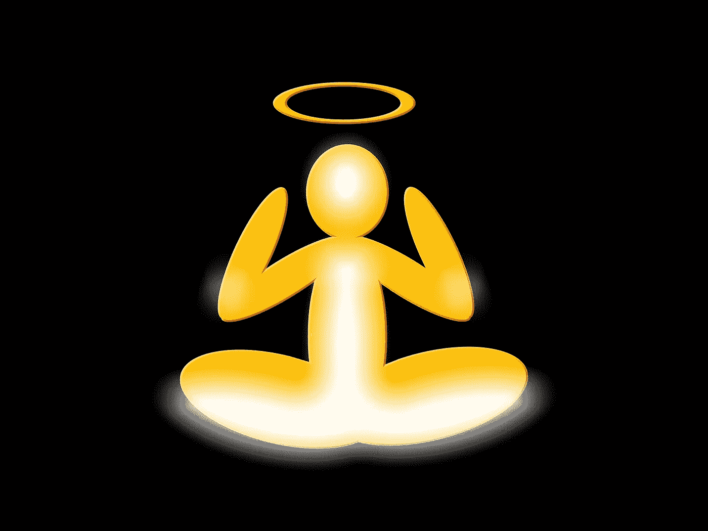

# 光环效应是如何影响我们所有人的

> 原文：<https://medium.com/swlh/how-the-halo-effect-concerns-all-of-us-a0df5239d8c1>

如果有一次你觉得被别人虐待或误解了，不管是雇主、共同的朋友还是陌生人，你可能是晕轮效应的受害者。

这被称为*光环效应*，因为我们倾向于形成更好的第一印象的人更有可能符合我们对讨人喜欢的要求，只是因为我们过早地判断了他们。