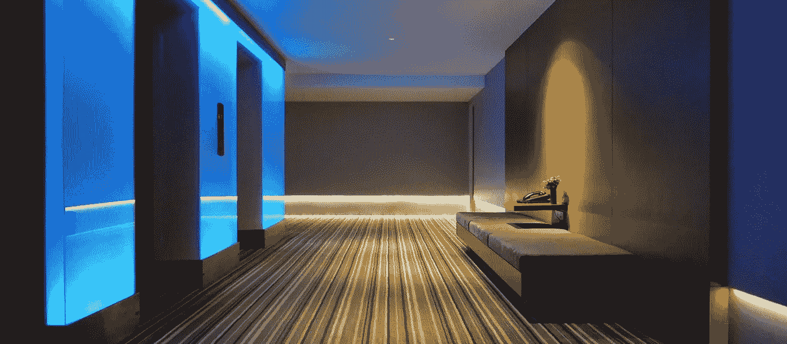
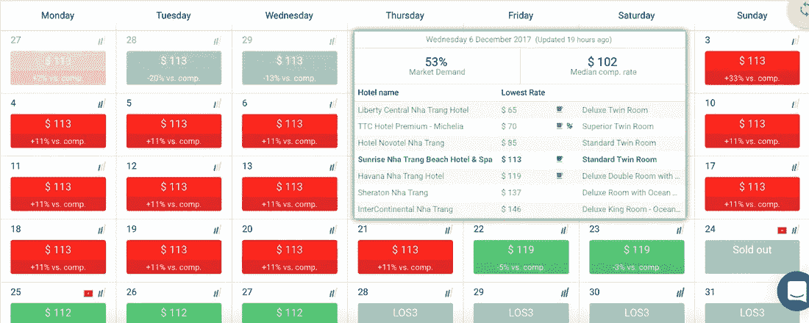
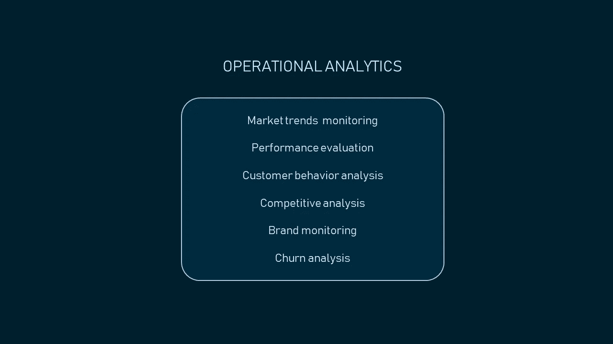
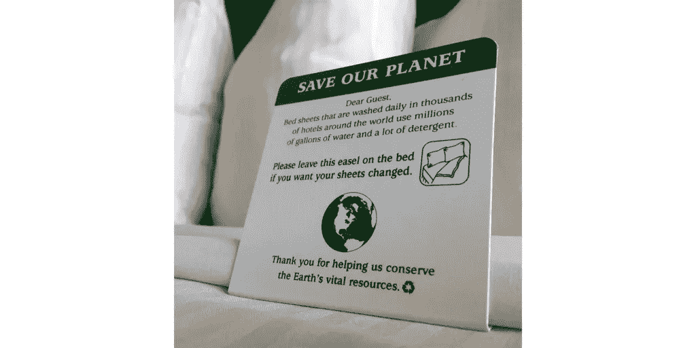
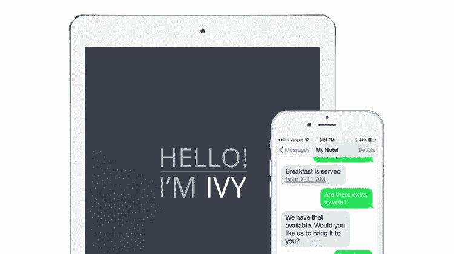
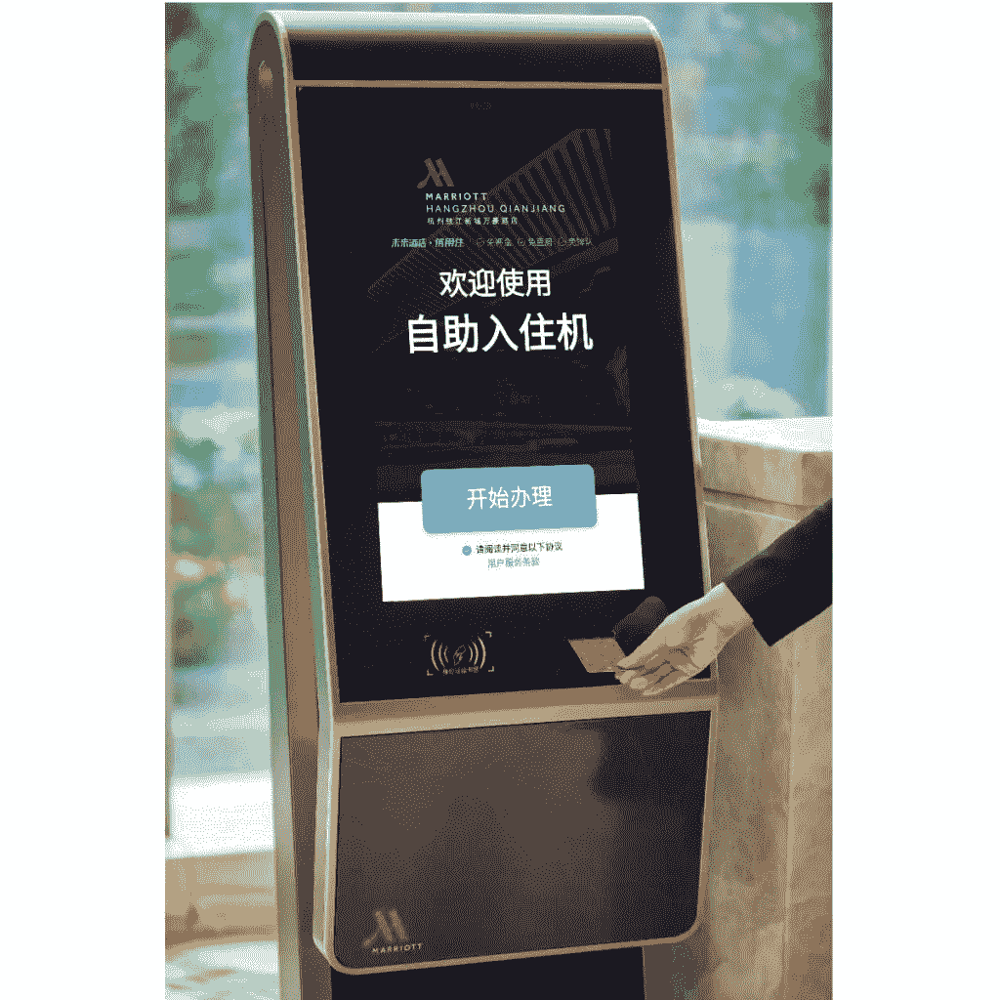

# 酒店业如何使用提高绩效的人工智能和数据科学

> 原文：<https://medium.com/swlh/how-the-hospitality-industry-uses-performance-enhancing-artificial-intelligence-and-data-science-545661053f84>

一个是拥有一台个人电脑或一部连接互联网的智能手机的时代。数字技术变得越来越普及，影响着人们的工作、休闲和度假计划。人们对酒店体验的期望越来越高，酒店经营者最好跟上创新的步伐。让我们想象一下，你必须在两家价格相同的酒店中做出选择。前者提供面部识别登记和聊天机器人，可以在几秒钟内回答你的问题，而后者只能提供舒适的房间。你想订哪家酒店？答案显而易见。

前面提到的功能都是基于人工智能和数据科学。我们与数据科学家、初创企业和酒店代表进行了交谈，以了解酒店如何使用人工智能和数据科学来评估他们的表现，并提供创新的客户体验。

# 1.收入管理

[收入管理](https://www.altexsoft.com/blog/datascience/machine-learning-redefines-revenue-management-and-dynamic-pricing-in-hotel-industry/?utm_source=MediumCom&utm_medium=referral) (RM)是应用数据和分析来优化产品价格和可用性，以获得最大收入。换句话说，收入管理专家正在寻找通过正确的分销渠道，以合理的价格向准备购买的客户销售正确产品(即房间)的方法。

 [## 机器学习重新定义了酒店行业的收入管理和动态定价

### 收入管理(RM)是旅游业为销售客房、门票和服务而实施的一套程序

www.altexsoft.com](https://www.altexsoft.com/blog/datascience/machine-learning-redefines-revenue-management-and-dynamic-pricing-in-hotel-industry/?utm_source=MediumCom&utm_medium=referral) 

专家监测各种指标，以了解在给定区域内，一个物业与相同价格范围和类型的其他物业相比有多成功。关键绩效指标的数量非常广泛，包括平均每日房价(ADR)、每间可用客房收入(RevPAR)、平均入住率、总营业利润(GOP)和每间可用客房总营业利润(GOPPAR)等指标。

通过计算和分析这些业绩指标数据，收益经理可以预测客房需求和客户行为，以调整客房价格。这种方法被称为*动态定价*。

## 动态定价自动化

数据科学让酒店能够更准确地预测需求和客户行为模式。这就是为什么万豪国际(Marriott International)和雅高酒店(accor hotels)[等全球连锁酒店都有数据科学家和分析师加入](https://revenueanalytics.com/news/future-revenue-management-data-analytics-big-investments/)。这些专家利用酒店及其竞争对手的数据开发和部署定价模型。

一些酒店依靠 RM 解决方案来控制其收入。这种软件使用机器学习实时定义最佳房间价格。这些 RM 系统自动整合和分析来自多个来源的大量内部和外部数据，以检测模式和异常。

例如，Carlson Rezidor、AccorHotels、Fusion Hotels and Resorts、Sydell Group、Hilton、Crowne Plaza 以及其他全球和地区酒店品牌都使用了这种解决方案，即 [OTA Insight](https://www.otainsight.com/) 平台。

该平台包括三个模块，每个模块旨在解决特定的收入管理任务。

**Rate Insight** 允许经理使用有关过去、当前和未来竞争对手房价的实时数据来预测该地区的客房需求，从而设定合理的客房价格。该平台为专家提供有关资产排名和评级表现的数据。事件分析也是可用的。

*OTA Insight provides a demand calendar based on rates from all connected OTAs. Source:* [*DC*](https://www.dcommerce.org/blog/2018/2/9/ota-insight-review-easy-hotel-and-property-revenue-management-tool)

**平价洞察**将主要在线旅行社和元搜索引擎上的价格与酒店品牌网站上的价格进行比较，以确定平价问题。例如，在线旅行社和他们自己的网站上的价格一致的酒店可以减少他们对它的依赖，避免客人混淆。

**收入洞察**结合过去和未来的业绩，为用户提供“更智能的酒店分析”该平台整合了关于酒店关键绩效指标的报告，可以快速、轻松地进行年度绩效对比。

## 使用案例:喜达屋酒店

喜达屋酒店，现在与万豪国际合并，利用数据分析来相应地给房间定价。2014 年，酒店公司[引入了](https://www.cio.com/article/3070384/analytics/starwood-taps-machine-learning-to-dynamically-price-hotel-rooms.html)其收入优化系统(ROS ),投资超过 5000 万美元。

该系统用 R 编程语言编写，使用 IBM CPLEX 优化软件和专有的机器学习算法。

该解决方案允许收入经理跳过每个房间的手动电子表格条目和价格建议。ROS 整合内部和外部数据，并对其进行实时分析，以预测需求和建议最佳费率。

软件交叉检查的内部信息包括关于历史和当前预订、取消和入住、预订行为、房间类型和每日价格的数据。预订行为和客户类型(短暂的旅行者或参加特定活动的大型团队中的一员)等因素也会影响定价。

收入管理软件还分析气候和天气数据、竞争对手定价、其他来源的预订模式，以及酒店所在区域的音乐或体育赛事。

根据不断变化的条件进行调整的价格使连锁酒店最终从库存中获得最大利润，并确保适当的人员配备。

# 2.运营分析

酒店业不知道什么是休息日或假日，这意味着酒店软件系统在没有第二次长时间中断的情况下工作，生成各种类型的客人和运营数据。无论是有人在餐厅预订房间或点凯撒沙拉，管家发出清洁用品短缺的警报，还是活动经理预订会议室，物业管理系统都会捕获这些数据。

通过运营分析对内部流程进行实时观察，酒店经营者可以发现失误并寻找改进方法。企业可能会进行竞争分析，预测每个季度的客户行为，通过分析反馈来监控社交媒体上的品牌提及和声誉，或者确定网站用户开始预订但不完成预订的原因(流失分析)。数据科学应用的数量取决于 IT 基础设施和员工技能。

*Operational analytics techniques*

[iDashboards](https://idashboards.com/)[Andrew Gissal](https://www.linkedin.com/in/andrewgissal/)的高级销售经理指出，[数据管理策略](https://www.techopedia.com/definition/30194/data-management-strategy)的重要性随着长期和短期规划对数据的依赖而增长。

> “随着托管数据解决方案的使用越来越多，组织看到了信息孤岛，这可能会导致系统之间的信息差异。当试图解释或协调相互冲突的数据集以进行报告或更糟的是做出决策时，这就成了一个大问题。对报告数据缺乏绝对信心会导致头痛和事后批评。”

Andrew 总结道，努力更快地做出与数据相关的决策和选择并确保这些决策将帮助他们更有效地运营业务的组织必须以一种清晰的方式管理他们的数据。

iDashboards 引入了一个数据可视化平台，用户可以使用该平台检索、组合和传输来自不同来源的数据到一个仪表板中，以制作图形报告。该平台支持数百种图表类型，并提供完全可定制的布局和专利视觉效果。iDashboards 数据中心使用拖放式 ETL(提取、转换、加载)工具自动准备数据。因此，该平台“覆盖了从数据准备到数据验证的所有用户。”

## 性能赋值

借助数据可视化工具，酒店能够收集跨部门的相关运营数据，以监控、评估和改善其绩效。德克萨斯州的一家酒店集团利用 iDashboards 获得组织透明度，公司代表分享。

> “员工们在操作旧数据，这些旧报告导致日常工作表现和底线之间的脱节。他们在销售部门使用该软件——跟踪房间、事件和推荐。酒店现在可以将收入金额与推荐计划相关联。此外，员工可以通过展示他们的具体工作如何影响组织来获得仪表板的‘所有权’。”

## 品牌监控

有人可能会花几分钟时间写下并发布一篇关于他们酒店住宿的评论，让潜在的游客阅读。由于负面评论通常更容易被人们记住，品牌必须快速评估并做出反应。用于客户体验数据分析的人工智能和自然语言处理(NLP)解决方案可以帮助企业跟上人们就其服务交换信息的速度。

[Opinosis Analytics](https://www.opinosis.com/) 是开发利用人工智能和自然语言处理的定制软件的公司之一。公司创始人兼 GitHub 数据科学家 [Kavita Ganesan](http://www.kavita-ganesan.com/) 和她的团队一起开发用户评论和客户反馈数据的分析和总结模型。专家使用基于数据图的自然语言分析和深度学习来帮助酒店定义他们的运营问题。部署后，这些模型从关于客户痛点的反馈数据中提取见解。

> “由于我们根据非结构化反馈数据为企业提供定制化服务来展现洞察力，因此我们能够直接与其中一些酒店合作，找出需要关注的领域。例如，在一个案例中，酒店发现其员工对顾客非常傲慢。他们立即解决了这个问题，当我们在改变几个月后重新分析他们的反馈数据时，我们注意到“傲慢”的提及率有所下降，*分享数据科学家。*

## 竞争分析

对社交媒体上的客户反馈进行竞争分析，可以让酒店了解他们的客户是谁，他们认为什么是完美的客户体验，以及客户对入住酒店的感受。更重要的是，酒店经营者可以了解*为什么*人们会以某种方式评价一个品牌。在这方面，人工智能在这里以人类无法实现的速度和准确性捕捉和处理反馈。

> “我们已经实施了竞争分析模型，利用大量反馈数据，在非常具体的维度上展示这些酒店与竞争对手相比的表现。对于其中一些分析，酒店已经有了自己的数据，我们主要是在数据科学方面提供帮助，”*Kavita gan esan 说。*

## 用例:洲际酒店集团

洲际酒店集团(IHG)是一家酒店管理公司，在 15 个品牌的 5，367 家酒店中提供 799，923 间客房。该酒店集团计划增加其全球业务，即将开设近 2000 家酒店。IHG 发展其技术能力，以便能够处理不断增长的作战数据。

*The building of the InterContinental Ljubljana hotel. Source:* [*InterContinental Hotels & Resorts*](https://www.ihg.com/intercontinental/hotels/us/en/ljubljana/ljuha/hoteldetail)

全球超过 1000 家酒店目前正在使用基于云的客户预订系统 IHG 协奏曲。

该公司与 Amadeus 合作开发了该系统，以增加收入并为决策收集更多数据。Concerto 允许酒店经营者通过基于过去的预订提供[个性化报价](https://www.altexsoft.com/blog/datascience/customer-experience-personalization-in-travel-and-hospitality-using-behavioral-analytics-and-machine-learning/?utm_source=MediumCom&utm_medium=referral)和建议更广泛的预订选项(即按房间类型、开放日期或预算搜索)来推动直接预订。)目前，这家连锁酒店正在[试用](https://skift.com/2018/08/07/ihg-ceo-amazon-is-a-threat-to-online-travel-agencies-not-hotels/)一种以床的类型为中心的基于属性的预订。该平台支持多种语言，并提供对 IHG 奖励俱乐部忠诚度计划数据的实时访问。

 [## 使用行为分析和…实现旅游和酒店的客户体验个性化

### 当我们访问网飞、YouTube 或亚马逊时，我们认为个性化推荐是理所当然的。这些服务已经…

www.altexsoft.com](https://www.altexsoft.com/blog/datascience/customer-experience-personalization-in-travel-and-hospitality-using-behavioral-analytics-and-machine-learning/?utm_source=MediumCom&utm_medium=referral) 

Concerto 稍后将与多个酒店软件集成，如收入和财产管理系统、销售、餐饮和销售点。IHG 计划在 2018 年底或 2019 年初全面部署平台。

IHG [调查](https://datafloq.com/read/big-data-enables-intercontinental-hotel-group-to-b/507)客人的入住体验，然后将这些见解与经济和行业表现数据相结合，以更好地了解他们如何经营业务。这种绩效评估方法有助于洲际酒店了解影响其服务质量的内部和外部因素。该公司收集了大量关于其物业和人员的元数据，例如，酒店位置、楼龄、设施和每个物业的房间数量，以及员工经验和任期。此外，还会收集和探索需求驱动因素和该领域的一些竞争对手等信息，以发现模式。

## 使用案例:丽笙酒店集团

丽笙酒店集团还采用数据驱动的方法来维持其营销、沟通和品牌战略。酒店集团跟踪市场趋势，分析客户行为，以满足他们的期望。

> “我们相信数据是关键，”*国雷迪森酒店集团数字副总裁* [*雷米默克*](https://www.linkedin.com/in/remy-merckx-4b8a601/) *。*“我们最近与埃森哲互动合作，支持我们建立一个先进的智能模型，开始预测购买行为和模式，更好地了解我们客户的在线旅程以及他们选择、预订和入住我们酒店的方式；并将其与我们全球酒店的需求和业务联系起来。这些预测模型有助于我们获得大部分投资和计划，也有助于我们在更私人的层面上与客人互动。”

# 3.利用物联网解决方案进行酒店能耗管理和预测性维护

酒店全年营业，是第三产业建筑部门能源消耗排名前五的设施之一。平均而言，美国的酒店要花费近 6%的运营成本来支付水电费。积极的一面是，能源费用可以通过能源管理来控制。现代能源消耗方法已经远远超出了安装节能照明系统、改变建筑标准或在浴室使用信息卡。

*An information card encourages visitors to be more environment-friendly. Source:* [*Aston Waikiki Circle Hotel*](https://www.aquaaston.com/hotels/aston-waikiki-circle-hotel)

## 消费管理

酒店通过基于云的软件提高能效。由物联网设备支持的智能能源管理平台收集关于能源使用的实时信息，并监控建筑物内的温度、湿度、气压和空气质量。该软件还可以跟踪天气数据和公用事业费率，同时监控占用情况，以调整 HVAC(供暖、通风和空调)和照明系统的工作。因此，这些系统为业主提供了能源使用模式——能源概况。收到的信息有助于酒店经营者了解他们可以在哪些地方使用更少的资源来实现能效目标。通常可以通过桌面和移动设备访问数据。

## 使用传感器数据进行预测性维护

能耗控制软件支持预测性(基于条件的)维护。这种类型的技术支持需要在正常运行期间监控机器，以预测其故障。如果检测到异常情况，系统会自动发送通知，使技术人员能够在设备(例如房间空调系统)完全损坏、客人注意到故障之前修复设备。有了这些系统，员工还可以更有效地安排维护，因为他们了解每台设备的技术状态。因此，能源管理解决方案有助于延长设备寿命并降低维护成本。

## 用例:丹佛大使馆套房

丹佛大使馆套房酒店使用 Telkonet 的设备成为一家环保酒店，并获得了 T2 LEED 的认证。酒店安装了自动调温器和入住传感器，以减少空置房间的加热和冷却能耗。由于这一改进，该酒店于 2011 年成为丹佛大都市区和 Embassy Suites 品牌组合中第一家获得 LEED 银牌认证的酒店。

# 4.客户体验改善

当人们去度假，从快节奏的生活中休息一下时，他们要求任何问题都要尽快解决。旅行者希望享受舒适的住宿，同时无缝享受酒店提供的所有乐趣。

## 消息传递自动化

哈里斯互动市场研究机构代表 OneReach 进行了一项[研究](https://onereach.com/resources/high-demand-for-text-message-2014-report)，发现 64%的消费者在短信和语音作为客服渠道之间做出选择，他们更喜欢前者。此外，44%具有短信功能的受访者宁愿按下按钮立即开始发送短信，也不愿等待客服人员的回复。

采用具有人工智能支持的虚拟助理的消息支持的酒店可以通过让客人感觉受到欢迎和照顾来提高他们的满意度。

> “客人很忙，没有时间下载应用程序或学习如何使用新设备。Go Moment[*Raj Singh*](https://www.linkedin.com/in/rajla/)*的创始人兼首席执行官*指出:“客人喜欢按照他们的方式交流，这使得虚拟助理成为最有效的交流方式。**

[该公司](http://www.gomoment.com/)推出了由 [IBM Watson AI 引擎](https://www.altexsoft.com/blog/datascience/comparing-machine-learning-as-a-service-amazon-microsoft-azure-google-cloud-ai-ibm-watson/?utm_source=MediumCom&utm_medium=referral)驱动的常青藤酒店自动化访客通信平台。

*Ivy responds to guest questions in about 2 seconds. Source:* [*Go Moment*](http://www.gomoment.com/)

旅行者只要提供手机号码，就可以使用常春藤。拉吉解释说，员工们把常春藤仪表盘当作一个单一的指挥中心。员工可以实时获得反馈，并可以使用这些数据通过分析来研究客人的行为。*“因为艾薇是第一道防线，酒店员工只需要回答更复杂的问题，而不需要回答诸如‘Wi-Fi 密码是多少？或者“健身房在哪里？“一天几十次。”*人和机器协同工作的方式，立即回答问题并提供及时的支持。

艾薇还集成了 Alexa 和 Google Assistant 语音设备，能够处理我们将在下面描述的机器人机器人这样的系统。

## 使用面部识别办理登机手续

不仅航空公司以自助服务能力取悦客户，以证明他们珍惜时间。面部识别登记让酒店客人不必在前台排队等候，也不用练习遗忘的手写技能来填写登记表。

万豪国际正在两家酒店测试面部识别签到机器，分别是杭州钱江万豪酒店和三亚大东海湾万豪酒店。今年 7 月推出的这一增强功能是与阿里巴巴 Fliggy 旅游服务平台合作的结果。

*The facial recognition check-in terminal installed in a lobby of one of the hotels. Source:* [*Marriott International*](http://news.marriott.com/2018/07/joint-venture-of-alibaba-group-and-marriott-international-trials-facial-recognition-check-in-technology/)

酒店公司指出，通常需要三分钟或更长时间的登记可以在不到一分钟的时间内通过这些终端完成。面部识别亭很容易使用。旅行者扫描他们的身份证，拍一张照片，并提供他们的联系方式。然后，机器验证他们的身份和预订信息，并发出房间钥匙。万豪计划未来在全球范围内推出自助服务机。

## 配有语音控制系统的智能客房

每个人都有自己的习惯和日常礼仪。一个人喜欢在海洋的声音中醒来，而另一个人则喜欢把窗帘拉上，直到中午。顺应自动化和高度个性化的趋势，酒店让客人能够根据自己的喜好调整房间设施。连锁酒店通过升级带有语音控制系统的客房，让客人的声音能够被听到。

圣何塞的雅乐轩圣克拉拉酒店鼓励客人预订声控房间“配备 iPad，运行定制的雅乐轩应用程序，为客人提供全新的方式与房间互动。”使用 Siri，客人可以告诉设备打开紫色和蓝色灯光，在 YouTube 上播放音乐视频或通过网飞播放一系列音乐，或者设置所需的温度——只要能让客人开心就行。

声控房间是雅乐轩酒店在[项目杰特森实验](https://hospitalitytech.com/aloft-hotels-debuts-voice-activated-hotel-rooms)中展示的创新之一。

洲际酒店集团[最近在其中国的酒店推出了人工智能智能客房](https://hoteltechnologynews.com/2018/07/1392/)。这家酒店公司已经与当地技术解决方案提供商百度达成协议，提供创新的客户体验。由百度 DuerOS AI 平台提供支持的控制系统可以控制房间设施，如恒温器、照明系统或电视。

目前有两家酒店提供智能客房——北京三里屯洲际酒店和广州会展中心洲际酒店。IHG 管理层计划到 2018 年底在全国主要目的地配备 100 套人工智能套房。

## 机器人帮助下的顾客服务

有些人害怕机器人会完全取代人类，让他们没有工作。就今天而言，这些智能机器将人类员工从日常工作中解放出来，如家务管理、客房服务和礼宾服务。

例如，圣何塞的皇冠假日酒店用机器人 Dash 取悦客人。Dash 提供食物、化妆品，并提供酒店设施和景点的信息。这个机器人可以独立地在房子里走动，甚至可以通过 Wi-Fi 连接呼叫电梯。Dash 在进门之前给客人打电话，送上想要的东西，然后回到大厅。该机器人还可以跟踪其电力使用情况，并在需要时将自己连接到充电站。

Botlr 是另一个帮助雅乐轩酒店员工的机器人仆人。客人可以通过智能手机上的 SPG 应用程序发送关于小吃、毛巾或任何他们需要的简单物品的请求，Botlr 将快速交付它们。

*Botlr assists a hotel staff and delights guests.*

这两个机器人都是由 Savioke 的工程师制造的。

## 数据科学在酒店行业的机遇

借助人工智能和数据科学，酒店拥有先进的工具来评估和改善绩效。酒店使用运营分析来寻找更有效的资源使用方式，降低能耗，引入和开发收入管理战略，以及通过智能虚拟助理实现员工工作流程自动化。

> iDashboards 的 Andrew Gissal 指出:“存在特定部门的机会，但从广泛的角度来看，数据科学可用于发现相关性并提高运营效率。”。

Go Moment 首席执行官 Raj Singh 认为，为客户服务运营提供工具的数据科学可以进一步扩展，使客户和管理层能够更好地控制整个酒店体验。

Opinosis Analytics 的创始人 Kavita Ganesan 指出，数据科学使酒店能够了解客户需求并解决这些需求，并看到了它带来的许多运营增强机会。"*我们仅仅触及了表面。随着我们通过电话、电子邮件、评论、博客等方式获得越来越多的反馈数据。，从这些分散的资源中提取见解对于改善用户体验和推出顾客绝对喜欢的新酒店功能至关重要。有了这些数据，我们甚至可以预测忠诚度。这些知识可以帮助我们进行收入预测，检查我们是否雇佣了合适的人或引入了合适的功能，”*Kavita 总结道。

*最初发表于 AltexSoft Tech 博客**[***酒店业如何使用提高绩效的人工智能和数据科学***](https://www.altexsoft.com/blog/datascience/how-the-hospitality-industry-uses-performance-enhancing-artificial-intelligence-and-data-science/?utm_source=MediumCom&utm_medium=referral)*

****

## **这篇文章发表在 [The Startup](https://medium.com/swlh) 上，这是 Medium 最大的创业刊物，拥有+ 372，020 读者。**

## **在这里订阅接收[我们的头条新闻](http://growthsupply.com/the-startup-newsletter/)。**

****