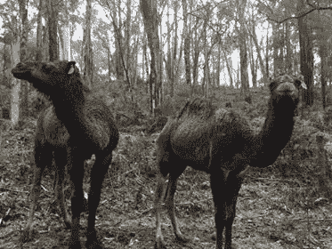

# 偏僻的地方如何帮助推出我们的产品

> 原文：<https://medium.com/swlh/how-the-middle-of-nowhere-helped-launch-our-product-d1b9885ff75b>

*发布 6 周后* [*Hassl*](http://hassl.co) *我们终于能够抽出一些时间来分享我们冲刺 beta 发布的故事。这是我们在偏远地区的预测试冲刺的概述，我们希望它能激励其他初创企业走向荒野。*

距离 beta 发布还有 10 周，我们没有内容，没有营销，只有半个手机设计。这需要打很多个电话，甜言蜜语地谈论我们认识的 10 个最聪明的人，并绑架他们到澳大利亚的一个偏僻的地方度周末。不完全是撤退，更像是预热。

> 正如所有的应用程序开发者在有压力和需要的时候所做的那样，我们转向另一个应用程序——强大的 Airbnb。该是换换风景的时候了。

Our neighbours, uninterested in collaboration.

对于那些非澳大利亚读者来说，如果你开车离开一个大城市半个小时，你就会看到袋鼠。如果你开车离开一个大城市一小时，你就会看到袋熊。如果你离开墨尔本两个小时，显然你会看到骆驼。

第一个晚上，点燃火种，建立四个工作站——市场营销、移动 UX、bug 测试/培训和开发。我们的开发人员会通宵写代码，但我们其余的人会花一晚上的时间来交换角色，探讨彼此的想法，并最终完成我们的创意。

以下是每个工作站的概述:

# 移动 UX

他们从台球室拿了一堆白板来框出未完成的部分，一份来自我们 alphas 的反馈列表和两部手机(iPhone 和 Android ),供任何从营销室休息一下的人在 [InVision](https://medium.com/u/206c13695d27?source=post_page-----d1b9885ff75b--------------------------------) 上试用现场原型。

# 营销

他们这个周末有两个主要目标:第一个是强迫设计师为发布会做好创意(我们已经成功说服 TEDx 墨尔本让我们在他们的会议上发布，所以它必须是重点)。第二，给我们 USPs 的创始人添麻烦，让新闻稿闪闪发光。营销人员喝的酒最多，排在 bug 测试人员之后。

# Bug 测试人员

在尽可能多的设备上创建一个模拟的大型团队环境。创建 20 个新账户，其中涉及如此多的假冒 Gmail 账户。他们还为我们即将到来的培训视频制作流程图和脚本，简要地将 Hassl 的所有功能浓缩到 12 个视频脚本中，每个不到 40 秒。这些视频有一个严格和残酷的测试过程——把它们交给我们的妈妈。如果他们想不出来，那么他们不够直截了当。他们最终得到了一个唐纳德·特朗普(Donald Trump)、一个普京和贾里德·库什纳的账户。我们想知道他们是否已经失去了情节，但让它滑动，因为这是周末超过 50 小时的 bug 测试。

# 发展

他们得到了靠近火的位置，上好的威士忌，我每隔 2-3 个小时给他们带些自制的小吃。我们的阿尔法用户有一个很好的清单，只要外面的骆驼，所以他们需要专注。我们的首席开发人员致力于修复 bug，我们的下一个系列构建在 light UI 主题中。

# 视频制作

有一个秘密的深夜孤独工作站，这是我们的 CD 詹姆斯，他的任务是不可能的——把我们疯狂的晚餐想法变成一个营销视频。他白天领导创意，晚上做后期特效。星期六早上的某个时候，我发现他在这里。

# 周六晚餐和辩论。

旅行的高潮出现在周六晚上，我们都坐下来吃墨西哥菜，喝葡萄酒，并就如何将商业见解融入 Hassl 进行了 4 个小时的辩论。我们邀请了用户、分析师、项目经理和工程师。各种观点的混合令人振奋，也是必要的，但是疲惫和大量的红酒意味着我们今晚就到此为止了。我们需要把商业洞察力留给我们下一次野外探险的计划。

周日，我们将在户外阳光下回顾我们的移动原型，随后是非常令人畏缩的照片拍摄、遛狗以及最后的白板汇报——我们全都完成了。是时候回墨尔本打扫办公室了，准备好建造移动设备了。

Some of the team refused to partake in the cringe-fest, the dog was forced to.

非常感谢并向那些放弃了 72 小时时间来帮助 Hassl 过关的预热英雄们大声欢呼。你知道你是谁。总有一天我们会报恩的。

加入我们在 hassl.co[的测试阶段](http://hassl.co)

## 这篇文章发表在[《创业](https://medium.com/swlh)》上，这是 Medium 最大的创业刊物，拥有+ 377，008 读者。

## 在这里订阅接收[我们的头条新闻](http://growthsupply.com/the-startup-newsletter/)。

